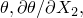
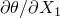
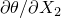

# 29.3.6 使用分析过程中积分的梁截面定义截面行为


**产品：** Abaqus/Standard  Abaqus/Explicit  Abaqus/CAE  

##### **参考资料**

- ["梁建模：概述，" 第29.3.1节](pt06ch29s03abo26.md)
- ["梁截面行为，" 第29.3.5节](pt06ch29s03alm10.md)
- [*BEAM SECTION](../key/key-link.md#usb-kws-mbeamsection)
- ["在Abaqus/CAE用户指南中为分析过程中积分的梁截面指定特性"第12.13.11节](../usi/usi-link.md#usi-prp-section-beam-integrateduring)

### 概述

分析过程中积分的梁截面：
- 用于在分析过程中梁变形时必须重新计算截面特性的情况；和
- 可以与线性或非线性材料行为相关联。

### 定义分析过程中积分的梁截面的行为

当需要对截面进行数值积分以适应梁的变形时，使用分析过程中积分的梁截面来定义截面行为。您可以从提供的梁截面形状库中选择截面形状（见["梁截面库，" 第29.3.9节](pt06ch29s03abm01.md)）并定义截面的尺寸。此外，您可以指定用于积分的截面点数。默认截面点数对于单调加载引起塑性变形的情况已经足够。如果发生反向塑性，则需要更多截面点。

使用材料定义（["材料数据定义，" 第21.1.2节](pt05ch21s01aus109.md)）来定义截面的材料特性，并将这些特性与截面定义相关联。线性或非线性材料行为可以与截面定义相关联。但是，如果材料响应是线性的，更经济的方法是使用通用梁截面（见["使用通用梁截面定义截面行为，" 第29.3.7节](pt06ch29s03alm12.md)）。

您必须将截面特性与模型的某个区域相关联。

| **输入文件用法：** | ``` [*BEAM SECTION](../key/key-link.md#usb-kws-mbeamsection), ELSET=*name*, SECTION=*library_section*, MATERIAL=*name* ``` |
| --- | --- |
|  | ELSET参数用于将截面特性与一组梁单元相关联。 |

| **Abaqus/CAE用法：** | 属性模块：**Create Profile**：**Name：** *library_section***Create Section**：选择**Beam**作为截面**Category**和**Beam**作为截面**Type**：**Section integration: During analysis**，**Profile name：** *library_section*，**Material name：** *name*****Assign****Section****：选择区域 |
| --- | --- |

### 定义因应变引起的横截面积变化

在剪切柔性单元中，Abaqus通过允许您为截面指定有效的泊松比来考虑可能的均匀横截面积变化。此效应仅在几何非线性分析中考虑（见["定义分析，" 第6.1.2节](pt03ch06s01abo05.md)），并用于模拟承受大轴向拉伸的梁的横截面积减小或增加。

有效泊松比的值必须在1.0和0.5之间。默认情况下，此截面的有效泊松比设置为0.0，因此忽略此效应。将有效泊松比设置为0.5意味着截面的整体响应是不可压缩的。如果梁由典型金属制成，其整体响应在大变形下基本上是不可压缩的（因为它由塑性支配），则此行为是适当的。0.0和0.5之间的值意味着横截面积在无变化和不可压缩性之间成比例变化。有效泊松比的负值将导致横截面积响应轴向拉应变而增加。

此有效泊松比不适用于Euler-Bernoulli梁单元。

| **输入文件用法：** | ``` [*BEAM SECTION](../key/key-link.md#usb-kws-mbeamsection), POISSON= ``` |
| --- | --- |

| **Abaqus/CAE用法：** | 属性模块：**Create Section**：选择**Beam**作为截面**Category**和**Beam**作为截面**Type**：**Section integration: During analysis**，**Section Poisson's ratio：**  |
| --- | --- |

### 定义材料阻尼

当使用分析过程中积分的梁截面时，阻尼可以通过材料行为定义引入。关于Abaqus中可用的材料阻尼类型的更多信息，请参阅["材料阻尼，" 第26.1.1节](pt05ch26s01abm51.md)。

### 指定温度和场变量

温度和场变量可以在截面的特定点指定，或者通过定义横截面原点处的值并指定局部1和2方向的梯度来定义。温度和场变量的实际值指定为预定义场或初始条件（见["预定义场，" 第34.6.1节](pt07ch34s06aus128.md)，或["Abaqus/Standard和Abaqus/Explicit中的初始条件，" 第34.2.1节](pt07ch34s02aus116.md)）。

在任何单元中，假定所有节点上的温度定义与为该单元选择的温度定义方法兼容。对于温度定义方法从一个单元更改到下一个单元的情况，必须在具有不同温度定义方法的单元之间的界面上使用单独的节点，并且必须应用MPC以使节点处的位移和旋转相同。

#### 通过定义原点和1和2方向的梯度来定义

温度和场变量可以通过给出横截面原点处的值以及截面的2-和1-方向（也就是说，在预定义场或初始条件定义中给出和）的梯度来定义。对于平面中的梁，只需给出和；在这种情况下，1方向的梯度被忽略。

| **输入文件用法：** | ``` [*BEAM SECTION](../key/key-link.md#usb-kws-mbeamsection), TEMPERATURE=GRADIENTS ``` |
| --- | --- |

| **Abaqus/CAE用法：** | 属性模块：**Create Section**：选择**Beam**作为截面**Category**和**Beam**作为截面**Type**：**Section integration: During analysis**，**Linear by gradients** |
| --- | --- |

#### 通过定义截面各点的值来定义

温度和场变量可以在截面的一组点上定义，如每个横截面在["梁截面库，" 第29.3.9节](pt06ch29s03abm01.md)中所示。

此技术不能用于与通用梁截面单元相邻的任何梁单元，因为它可能导致共享横截面上的温度分布不正确。如果您无法避免此建模场景，则必须使用单独的节点定义相邻单元，并通过MPC连接，如上所述。

| **输入文件用法：** | ``` [*BEAM SECTION](../key/key-link.md#usb-kws-mbeamsection), TEMPERATURE=VALUES ``` |
| --- | --- |

| **Abaqus/CAE用法：** | 属性模块：**Create Section**：选择**Beam**作为截面**Category**和**Beam**作为截面**Type**：**Section integration: During analysis**，**Interpolated from temperature points** |
| --- | --- |

### 输出

横截面积、惯性矩等梁截面特性打印在模型数据输出中。当使用分析过程中积分的梁截面时，可以输出截面力、弯矩和横向剪切力以及截面应变、曲率和横向剪切应变（见["输出到数据和结果文件"中的"单元输出，" 第4.1.2节](pt02ch04s01aus39.md#usb-out-oprintfile-elementoutput)，和["输出到输出数据库"中的"单元输出，" 第4.1.3节](pt02ch04s01aus40.md#usb-out-odboutput-elementoutput)）。此外，可以在每个截面点输出应力和应变。["梁单元库，" 第29.3.8节](pt06ch29s03ael14.md)列出了一些可用于梁单元的单元输出量。

如果使用分析过程中积分的梁截面，来自Abaqus/Standard的翘曲轴向应变包含在应力/应变输出中。

可以使用单元变量TEMP获取截面点处的温度输出。如果温度在截面厚度上的特定点给出，则可以使用节点变量NT*xx*在温度点获取输出。如果温度通过定义横截面原点处的值并指定局部1和2方向的梯度来定义，则不应将节点变量NT*xx*用于温度点的输出。在这种情况下，应请求输出变量NT；NT11（参考温度值）和NT12及NT13（局部1和2方向的温度梯度）将自动输出。

梁法线会自动写入输出数据库，用于所有包含节点位移场输出的帧。法线方向可以在Abaqus/CAE的可视化模块中可视化。


