# 29.3.7 使用通用梁截面定义截面行为


**产品：** Abaqus/Standard  Abaqus/Explicit  Abaqus/CAE  

##### **参考资料**

- ["梁建模：概述，" 第29.3.1节](pt06ch29s03abo26.md)
- ["梁截面行为，" 第29.3.5节](pt06ch29s03alm10.md)
- [*BEAM GENERAL SECTION](../key/key-link.md#usb-kws-mbeamgensect)
- [*BEAM SECTION OFFSET](../key/key-link.md#usb-kws-mbeamsectionoffset)
- ["在Abaqus/CAE用户指南中为通用梁截面指定特性"第12.13.11节](../usi/usi-link.md#usi-prp-section-beam-integratebefore)

### 概述

通用梁截面：
- 用于定义在整个分析中计算一次并保持恒定的梁截面特性；
- 可用于定义线性或非线性截面行为；
- 对于线性截面行为，只能与线性材料行为相关联
- 支持使用网格化横截面（["网格化梁横截面，" 第10.6.1节](pt04ch10s06at35.md)）；和
- 支持使用锥形横截面（仅Abaqus/Standard）。

### 线性截面行为

线性截面响应计算如下。在横截面的每个点，轴向应力，，和剪切应力，，由下式给出

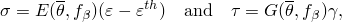

其中

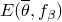

是杨氏模量（可能取决于温度，，和梁轴线处的场变量，

是轴向应变；


是由扭转引起的剪切；和


是热膨胀应变。

热膨胀应变由下式给出

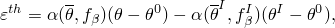

其中

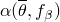

是热膨胀系数，


是横截面上一点的当前温度，


是场变量，


是的参考温度，


是此点的初始温度（见["定义初始温度"中的"Abaqus/Standard和Abaqus/Explicit中的初始条件，" 第34.2.1节](pt07ch34s02aus116.md#usb-prc-pinitialcond-temp)），和


是此点的场变量的初始值（见["定义预定义场变量的初始值"中的"Abaqus/Standard和Abaqus/Explicit中的初始条件，" 第34.2.1节](pt07ch34s02aus116.md#usb-prc-pinitialcond-field)）。

如果热膨胀系数取决于温度或场变量，则在梁轴线处的温度和场变量处评估。因此，由于我们假定在截面上线性变化，也在截面上线性变化。

温度由梁轴线的温度和关于局部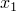-和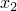-轴的温度梯度来定义：

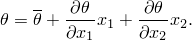

轴向力*N*；弯矩，和（关于1和2梁截面局部轴）；扭矩*T*；和双力矩*W*，用轴向应力和剪切应力）。这些项是

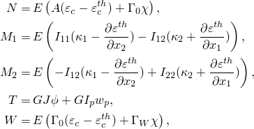

其中

*A*

是截面积，


是关于截面1轴弯曲的惯性矩，


是交叉弯曲的惯性矩，

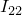

是关于截面2轴弯曲的惯性矩，

*J*

是扭转常数，


是截面的扇性矩，

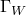

是截面的翘曲常数，

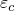

是在截面质心处测量的轴向应变，

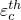

是热轴向应变，

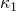

是关于第一梁截面局部轴的曲率变化，

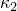

是关于第二梁截面局部轴的曲率变化，


是扭转，

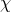

是定义截面中由于梁扭转引起的轴向应变的双曲率，和

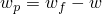

是 unconstrained 翘曲幅度，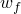，与实际翘曲幅度*w*之间的差值。

、、和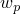仅对开口截面梁单元非零。

#### 为库横截面或线性广义横截面定义线性截面行为

线性梁截面响应由*A*、、、、*J*和（如果需要）和）；给出杨氏模量、扭转剪切模量和热膨胀系数，作为温度的函数；并将截面特性与模型的某个区域相关联。

如果热膨胀系数依赖于温度，则还必须定义热膨胀的参考温度，如本节后面所述。

##### 直接指定几何量

您可以通过直接指定*A*、、、、*J*和（如果需要）和来定义"广义"线性截面行为。在这种情况下，您可以指定质心的位置，从而允许梁的弯曲轴线从其节点线偏移。此外，您可以指定剪切中心的位置。

| **输入文件用法：** | 使用以下选项定义广义线性梁截面特性： |
| --- | --- |
|  | ``` [*BEAM GENERAL SECTION](../key/key-link.md#usb-kws-mbeamgensect), SECTION=GENERAL, ELSET=*name* *A*, , , , *J*, ,  ``` 如需使用以下选项指定质心的位置： ``` [*CENTROID](../key/key-link.md#usb-kws-mcentroid) ``` 如需使用以下选项指定剪切中心的位置： ``` [*SHEAR CENTER](../key/key-link.md#usb-kws-mshearcenter) ``` |

| **Abaqus/CAE用法：** | 属性模块：**Create Profile**：**Name：** *generalized_section*，**Generalized****Create Section**：选择**Beam**作为截面**Category**和**Beam**作为截面**Type**：**Section integration: Before analysis**，**Profile name：** *generalized_section*：**Centroid**和**Shear Center******Assign****Section****：选择区域 |
| --- | --- |

##### 指定标准库截面并允许Abaqus计算几何量

您可以从标准库截面中选择一个（见["梁截面库，" 第29.3.9节](pt06ch29s03abm01.md)），并指定定义横截面形状所需的几何输入数据。然后Abaqus将自动计算定义截面行为所需的几何量。此外，您可以指定截面原点的偏移。

| **输入文件用法：** | ``` [*BEAM GENERAL SECTION](../key/key-link.md#usb-kws-mbeamgensect), SECTION=*library_section*, ELSET=*name* ``` |
| --- | --- |
|  | 如需指定截面原点的偏移，使用以下选项： ``` [*BEAM SECTION OFFSET](../key/key-link.md#usb-kws-mbeamsectionoffset) ``` |

| **Abaqus/CAE用法：** | 属性模块：**Create Profile**：**Name：** *library_section***Create Section**：选择**Beam**作为截面**Category**和**Beam**作为截面**Type**：**Section integration: Before analysis**，**Profile name：** *library_section*****Assign****Section****：选择区域 |
| --- | --- |
|  | 不支持在Abaqus/CAE中指定截面原点的偏移。 |

#### 为网格化横截面定义线性截面行为

网格化截面轮廓的线性梁截面响应通过二维模型的数值积分获得。数值积分执行一次，确定梁刚度和惯性量，以及整个分析期间质心和剪切中心的位置。这些梁截面特性在梁截面生成期间计算，并写入文本文件`*jobname*.bsp`。此文本文件可以包含在梁模型中。详见["网格化梁横截面，" 第10.6.1节](pt04ch10s06at35.md)，其中有关于网格化截面线性梁截面响应定义的属性的详细描述，以及典型网格化截面的分析方式。

| **输入文件用法：** | 使用以下选项： |
| --- | --- |
|  | ``` [*BEAM GENERAL SECTION](../key/key-link.md#usb-kws-mbeamgensect), SECTION=MESHED, ELSET=*name* [*INCLUDE](../key/key-link.md#usb-kws-minclude), INPUT=`*jobname*.bsp` ``` |

| **Abaqus/CAE用法：** | Abaqus/CAE不支持网格化横截面。 |
| --- | --- |

#### 在Abaqus/Standard中为锥形横截面定义线性截面行为

在Abaqus/Standard中，您可以定义具有线性锥形横截面的Timoshenko梁。支持具有线性响应和标准库截面的通用梁截面，任意截面除外。截面参数在每个梁单元的两个端节点处定义。用于计算梁刚度矩阵、截面力和应力的截面有效面积和关于1和2轴的弯曲惯性矩为

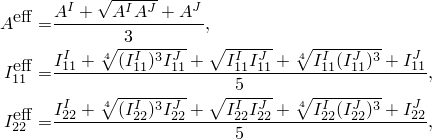

其中上标和指梁的两个端节点。其余有效几何量计算为两个端节点处值的平均值。此近似对于沿每个单元的轻微锥形是足够的，但如果锥形不逐渐变化，可能导致大误差。Abaqus/Standard在面积或惯性比大于2.0时在输入文件预处理期间发出警告消息，如果比大于10.0则发出错误消息。

有效面积和惯性不用于质量矩阵的计算。相反，对角象限使用相应节点的属性，而非对角象限使用平均量。例如，线性单元的轴向惯性在对角项上来自节点的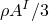，而节点贡献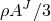，两个非对角项相等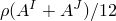。在此公式中假定轻微锥形，因为单元的总质量总计为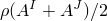。

**注意：**当您在Abaqus/CAE中将锥形梁截面应用于几何时，全锥形应用于沿梁长度的每个单元。对于包括多个单元的梁，此建模样式可能在梁长度上产生"锯齿"模式。如果要在Abaqus/CAE中沿梁的整个长度建模逐渐锥形，您必须计算中间节点处梁轮廓的尺寸和形状，然后沿长度将不同的锥形梁截面应用于每个梁单元。

| **输入文件用法：** | 使用以下选项定义锥形截面线性截面行为： |
| --- | --- |
|  | ``` [*BEAM GENERAL SECTION](../key/key-link.md#usb-kws-mbeamgensect), TAPER, ELSET=*name* ``` |

| **Abaqus/CAE用法：** | 属性模块：**Create Profile**：**Name：** *library_section***Create Section**：选择**Beam**作为截面**Category**和**Beam**作为截面**Type**：**Section integration: Before analysis**，**Beam shape along length**：**Tapered**：**Beam start**和**Beam end**选项：**Profile name：** *library_section*****Assign****Section****：选择区域 |
| --- | --- |

### 非线性截面行为

通常，非线性截面行为用于包括梁状构件的实验测量的非线性响应，其截面在平面内扭曲。当截面根据梁理论行为（即截面在平面内不扭曲）但材料具有非线性响应时，通常最好使用分析过程中积分的梁截面几何定义截面行为（见["使用分析过程中积分的梁截面定义截面行为，" 第29.3.6节](pt06ch29s03alm11.md)），并结合材料定义。

非线性截面行为也可用于近似建模梁截面坍塌：["具有局部非弹性坍塌结构的非线性动态分析，" Abaqus例题指南第2.1.1节](../exa/exa-link.md#exa-dyn-nonlindyncollapse)，举例说明可能因施加大弯矩而遭受非弹性坍塌的管道截面。按照此方法，您应该认识到，这种不稳定的截面坍塌（如任何不稳定行为）通常涉及变形的局部化：因此，结果将强烈依赖于网格。

#### 非线性截面响应计算

非线性截面响应假定由下式定义

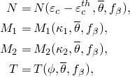

其中表示对共轭变量的函数依赖：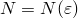、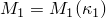等。例如，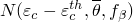表示*N*是以下函数的函数：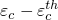；，梁轴线的温度；和，梁轴线处的任何预定义场变量。当以这种方式定义截面行为时，仅使用梁轴线的温度和场变量：横截面上给出的任何温度或场变量梯度都被忽略。

这些非线性响应可能是纯弹性的（即完全可逆的——加载和卸载响应相同，即使行为是非线性的），也可能是弹塑性的，因此是不可逆的。

这些非线性响应是不耦合的假设是限制性的；一般来说，这四种行为之间存在一些相互作用，响应是耦合的。您必须确定此近似对于特定情况是否合理。如果响应由一种行为主导，例如关于一个轴的弯曲，该方法效果很好。但是，如果响应涉及组合加载，则可能引入额外误差。

#### 定义非线性截面行为

您可以通过指定面积*A*；惯性矩，（关于截面1轴的弯曲），（关于截面2轴的弯曲），和（交叉弯曲）；和扭转常数*J*来定义"广义"非线性截面行为。这些值仅用于计算横向剪切刚度；并且，如果需要，*A*用于计算单元的质量密度。此外，您可以定义梁截面的方向和轴向、弯曲和扭转行为（*N*、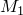、、*T*），以及热膨胀系数。如果热膨胀系数依赖于温度，还必须定义热膨胀的参考温度，如下所述。

非线性广义梁截面行为不能与具有翘曲自由度的梁单元一起使用。

梁截面的轴向、弯曲和扭转行为以及热膨胀系数由表格定义。请参阅["材料数据定义，" 第21.1.2节](pt05ch21s01aus109.md)，了解表格输入约定的详细讨论。特别是，您必须确保为变量给出的值范围足以用于应用程序，因为Abaqus假定在些范围之外依赖变量为常数值。

| **输入文件用法：** | 使用以下选项定义广义非线性梁截面特性： |
| --- | --- |
|  | ``` [*BEAM GENERAL SECTION](../key/key-link.md#usb-kws-mbeamgensect), SECTION=NONLINEAR GENERAL, ELSET=*name* *A*, , , , *J* [*AXIAL](../key/key-link.md#usb-kws-maxial) 用于*N* [*M1](../key/key-link.md#usb-kws-mm1) 用于 [*M2](../key/key-link.md#usb-kws-mm2) 用于 [*TORQUE](../key/key-link.md#usb-kws-mtorque) 用于*T* [*THERMAL EXPANSION](../key/key-link.md#usb-kws-mthermalexpansion) 用于热膨胀系数 ``` |

| **Abaqus/CAE用法：** | Abaqus/CAE不支持非线性广义横截面。 |
| --- | --- |

##### 为*N*、*M1*、*M2*和*T*定义线性响应

如果特定行为是线性的，*N*、、和*T*应指定为温度和预定义场变量的函数（如果适当）。

作为轴向行为的示例，如果

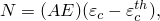

其中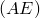在给定温度下为常数，则输入的值。仍然可以作为温度和场变量的函数变化。

| **输入文件用法：** | 使用以下选项定义线性轴向、弯曲和扭转行为： |
| --- | --- |
|  | ``` [*AXIAL](../key/key-link.md#usb-kws-maxial), LINEAR [*M1](../key/key-link.md#usb-kws-mm1), LINEAR [*M2](../key/key-link.md#usb-kws-mm2), LINEAR [*TORQUE](../key/key-link.md#usb-kws-mtorque), LINEAR ``` |

| **Abaqus/CAE用法：** | Abaqus/CAE不支持非线性广义横截面。 |
| --- | --- |

##### 为*N*、*M1*、M2和*T*定义非线性弹性响应

如果特定行为是非线性但弹性的，数据应从运动变量的最负值到最正值给出，始终在原点给出一个点。见[图29.3.7-1](pt06ch29s03alm12.md#ebeamgen-elast-nonlinear)作为示例。

| **输入文件用法：** | 使用以下选项定义非线性弹性轴向、弯曲和扭转行为： |
| --- | --- |
|  | ``` [*AXIAL](../key/key-link.md#usb-kws-maxial), ELASTIC [*M1](../key/key-link.md#usb-kws-mm1), ELASTIC [*M2](../key/key-link.md#usb-kws-mm2), ELASTIC [*TORQUE](../key/key-link.md#usb-kws-mtorque), ELASTIC ``` |

| **Abaqus/CAE用法：** | Abaqus/CAE不支持非线性广义横截面。 |
| --- | --- |

**图29.3.7-1** 弹性非线性梁截面行为定义示例。

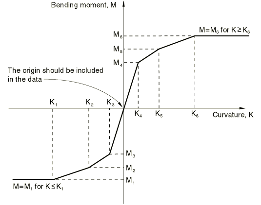

##### 为*N*、*M1*、*M2*和*T*定义弹塑性响应

默认情况下，假定*N*、、和*T*为弹塑性响应。

非弹性模型基于假设线性弹性和各向同性硬化（或软化）塑性。此情况下的数据必须从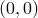点开始，并继续给出共轭力或弯矩增加的正运动变量值。允许应变软化。弹性模量由初始线段的斜率定义，因此，超过终止初始线段的应变将是部分非弹性的。如果在该部分响应中发生应变反转，最初是弹性的。见[图29.3.7-2](pt06ch29s03alm12.md#ebeamgen-inelast-nonlinear)作为示例。

| **输入文件用法：** | 使用以下选项定义弹塑性轴向、弯曲和扭转行为： |
| --- | --- |
|  | ``` [*AXIAL](../key/key-link.md#usb-kws-maxial) [*M1](../key/key-link.md#usb-kws-mm1) [*M2](../key/key-link.md#usb-kws-mm2) [*TORQUE](../key/key-link.md#usb-kws-mtorque) ``` |

| **Abaqus/CAE用法：** | Abaqus/CAE不支持非线性广义横截面。 |
| --- | --- |

**图29.3.7-2** 非弹性非线性梁截面行为定义示例。

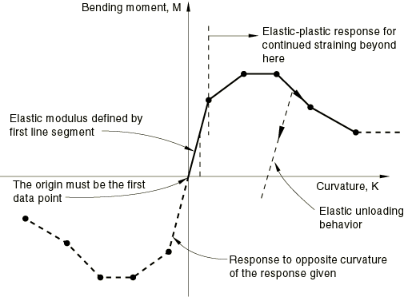

### 定义热膨胀的参考温度

热膨胀系数可能依赖于温度。在这种情况下，必须定义热膨胀的参考温度，。

| **输入文件用法：** | ``` [*BEAM GENERAL SECTION](../key/key-link.md#usb-kws-mbeamgensect), ZERO= ``` |
| --- | --- |

| **Abaqus/CAE用法：** | 属性模块：**Create Section**：选择**Beam**作为截面**Category**和**Beam**作为截面**Type**：**Section integration: Before analysis**：**Basic**：**Specify reference temperature：**  |
| --- | --- |

### 定义初始截面力和弯矩

您可以为通用梁截面定义初始应力（见["定义初始应力"中的"Abaqus/Standard和Abaqus/Explicit中的初始条件，" 第34.2.1节](pt07ch34s02aus116.md#usb-prc-pinitialcond-stress)），这些将作为初始截面力和弯矩应用。初始条件只能为轴向力、弯矩和扭矩指定。不能为横向剪切力规定初始条件。

### 定义因应变引起的横截面积变化

在剪切柔性单元中，Abaqus通过允许您为截面指定有效的泊松比来考虑可能的均匀横截面积变化。此效应仅在几何非线性分析中考虑（见["定义分析，" 第6.1.2节](pt03ch06s01abo05.md)），并用于模拟承受大轴向拉伸的梁的横截面积减小或增加。

有效泊松比的值必须在1.0和0.5之间。默认情况下，此截面的有效泊松比设置为0.0，因此忽略此效应。将有效泊松比设置为0.5意味着截面的整体响应是不可压缩的。如果梁由橡胶制成，或者由典型金属制成，其整体响应在大变形下基本上是不可压缩的（因为它由塑性支配），则此行为是适当的。0.0和0.5之间的值意味着横截面积在无变化和不可压缩性之间成比例变化。有效泊松比的负值将导致横截面积响应轴向拉应变而增加。

此有效泊松比不适用于Euler-Bernoulli梁单元。

| **输入文件用法：** | ``` [*BEAM GENERAL SECTION](../key/key-link.md#usb-kws-mbeamgensect), POISSON= ``` |
| --- | --- |

| **Abaqus/CAE用法：** | 属性模块：**Create Section**：选择**Beam**作为截面**Category**和**Beam**作为截面**Type**：**Section integration: Before analysis**：**Basic**：**Section Poisson's ratio：**  |
| --- | --- |

### 定义阻尼

当梁截面和材料行为由通用梁截面定义时，您可以在动态响应中包括质量和粘性刚度比例阻尼（在Abaqus/Standard中通过直接时间积分程序计算，["使用直接积分的隐式动态分析，" 第6.3.2节](pt03ch06s03at07.md)）。

请参阅["材料阻尼，" 第26.1.1节](pt05ch26s01abm51.md)，了解有关Abaqus中可用的材料阻尼类型的更多信息。

| **输入文件用法：** | 使用以下两个选项： |
| --- | --- |
|  | ``` [*BEAM GENERAL SECTION](../key/key-link.md#usb-kws-mbeamgensect) [*DAMPING](../key/key-link.md#usb-kws-mdamping) ``` |

| **Abaqus/CAE用法：** | 属性模块：**Create Section**：选择**Beam**作为截面**Category**和**Beam**作为截面**Type**：**Section integration: Before analysis**：**Damping**：**Alpha**、**Beta**、**Structural**和**Composite** |
| --- | --- |

### 指定温度和场变量

通过在横截面原点处给出值（作为预定义场或初始条件）来定义温度和场变量（见["预定义场，" 第34.6.1节](pt07ch34s06aus128.md)，或["Abaqus/Standard和Abaqus/Explicit中的初始条件，" 第34.2.1节](pt07ch34s02aus116.md)）。可以在局部1和2方向指定温度梯度；通过横截面定义的其他场变量梯度将在使用通用梁截面定义的梁单元的响应中被忽略。

### 输出

只能输出截面力、弯矩和横向剪切力以及截面应变、曲率和横向剪切应变（见["输出到数据和结果文件"中的"单元输出，" 第4.1.2节](pt02ch04s01aus39.md#usb-out-oprintfile-elementoutput)，和["输出到输出数据库"中的"单元输出，" 第4.1.3节](pt02ch04s01aus40.md#usb-out-odboutput-elementoutput)）。

您可以在截面的特定点输出应力和应变。对于使用标准库截面或广义截面定义的线性截面行为，只能获得轴向应力和轴向应变值。对于使用网格化截面定义的线性截面行为，可以获得轴向和剪切应力及应变。对于非线性广义截面行为，仅提供轴向应变输出。

#### 为标准库截面和广义截面指定输出截面点

要定位需要输出轴向应变（对于线性截面行为，还有轴向应力）的截面上的点，请指定截面中点的局部坐标：Abaqus按给出顺序将点编号为1、2、...

在截面中的变化由下式给出

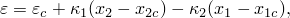

其中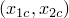是梁截面质心的局部坐标，和是截面的曲率变化。

对于开口截面梁单元类型，在截面中的变化有一个附加项，形式为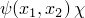，其中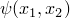是翘曲函数。翘曲函数本身在通用梁截面定义中未定义。因此，Abaqus在计算截面点输出时不会考虑翘曲引起的轴向应变。如果使用分析过程中积分的梁截面，翘曲轴向应变包含在应力/应变输出中。

Abaqus使用圣维南扭转理论用于非圆形实体截面。扭转函数及其导数对于计算横截面平面内的剪切应力是必要的。该函数及其导数不为通用梁截面存储。因此，您可以仅请求轴向应力/应变分量的输出。必须使用分析过程中积分的梁截面来获取剪切应力的输出。

| **输入文件用法：** | 使用以下两个选项为通用梁截面指定输出截面点： |
| --- | --- |
|  | ``` [*BEAM GENERAL SECTION](../key/key-link.md#usb-kws-mbeamgensect) [*SECTION POINTS](../key/key-link.md#usb-kws-msectionpoints) , , ... ``` |

| **Abaqus/CAE用法：** | 属性模块：**Create Section**：选择**Beam**作为截面**Category**和**Beam**作为截面**Type**：**Section integration: Before analysis**：**Output Points**：**x1**，**x2**，... |
| --- | --- |

##### 在Abaqus/Standard中请求最大轴向应力/应变输出

如果指定输出截面点以获得线性广义截面的最大轴向应力/应变（MAXSS），输出值将是用户指定截面点处值的最大值。您必须选择足够的截面点以确保这是真正的最大值。MAXSS输出不适用于非线性广义截面或Abaqus/Explicit分析。

#### 为网格化横截面指定输出截面点

对于网格化横截面，您可以在二维横截面分析中指示将在后续梁分析期间计算应力和应变的单元和积分点。然后Abaqus会将截面点规范添加到生成的`*jobname*.bsp`文本文件中。然后将此文本文件作为后续梁分析中通用梁截面定义的数据包括。详见["网格化梁横截面，" 第10.6.1节](pt04ch10s06at35.md)。

轴向应变在网格化截面中的变化由下式给出


其中是梁截面质心的局部坐标，和是截面的曲率变化。

剪切分量和在网格化截面中的变化由下式给出

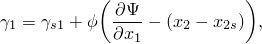

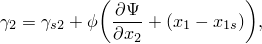

其中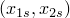是梁截面剪切中心的局部坐标，是梁轴线的扭转，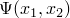是翘曲函数，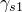和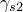是由横向剪切力引起的剪切应变。

对于正交复合梁材料的情况，轴向应力和两个剪切分量和在梁截面（1、2）轴中计算如下：


其中决定材料方向。

| **输入文件用法：** | 在二维网格化横截面分析中使用以下两个选项为后续梁分析指定输出截面点： |
| --- | --- |
|  | ``` [*BEAM SECTION GENERATE](../key/key-link.md#usb-kws-hbeamsectiongen) [*SECTION POINTS](../key/key-link.md#usb-kws-msectionpoints) *section_point_label*, *element_number*, *integration_point_number* ``` |

| **Abaqus/CAE用法：** | Abaqus/CAE不支持网格化横截面。 |
| --- | --- |


