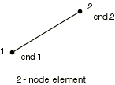

# 29.4.3 框架单元库

**产品：** Abaqus/Standard

##### **参考资料**

- ["框架单元，" 第29.4.1节](pt06ch29s04alm13.md)
- [*FRAME SECTION](../key/key-link.md#usb-kws-mframesection)

### 概述

本节提供 Abaqus/Standard 中可用框架单元的参考。

### 单元类型

#### 平面内的框架

| FRAME2D | 2节点直线框架单元 |
| --- | --- |

##### 激活的自由度

1, 2, 6

##### 附加解变量

两个与轴向和横向位移相关的附加变量。

#### 空间框架

| FRAME3D | 2节点直线框架单元 |
| --- | --- |

##### 激活的自由度

1, 2, 3, 4, 5, 6

##### 附加解变量

三个与轴向和横向位移相关的附加变量。

### 所需的节点坐标

平面内的框架：*X*, *Y*（不使用的法线方向余弦；给出的任何值都会被忽略。）

空间框架：*X*, *Y*, *Z*（不使用的法线方向余弦；给出的任何值都会被忽略。）

### 单元属性定义

不能使用["方向，" 第2.2.5节](pt01ch02s02aus15.md)中所述的局部方向来定义框架单元的局部材料方向。空间中的局部截面轴方向在["框架单元，" 第29.4.1节](pt06ch29s04alm13.md)中讨论。

| **输入文件用法：** | ``` [*FRAME SECTION](../key/key-link.md#usb-kws-mframesection) ``` |
| --- | --- |

### 基于单元的载荷

### 分布载荷

分布载荷如["分布载荷，" 第34.4.3节](pt07ch34s04aus122.md)中所述进行指定。

**载荷 ID (*DLOAD*)：** GRAV
**单位：** [LT2](../popups/usb-int-iconventions-unitsym.md)
**描述：** 指定方向的重力载荷（输入的量值为加速度）。

**载荷 ID (*DLOAD*)：** PX
**单位：** [FL1](../popups/usb-int-iconventions-unitsym.md)
**描述：** 全局*X*方向单位长度上的力。

**载荷 ID (*DLOAD*)：** PY
**单位：** [FL1](../popups/usb-int-iconventions-unitsym.md)
**描述：** 全局*Y*方向单位长度上的力。

**载荷 ID (*DLOAD*)：** PZ
**单位：** [FL1](../popups/usb-int-iconventions-unitsym.md)
**描述：** 全局*Z*方向单位长度上的力（仅适用于空间框架）。

**载荷 ID (*DLOAD*)：** P1
**单位：** [FL1](../popups/usb-int-iconventions-unitsym.md)
**描述：** 框架局部*1*方向单位长度上的力（仅适用于空间框架）。

**载荷 ID (*DLOAD*)：** P2
**单位：** [FL1](../popups/usb-int-iconventions-unitsym.md)
**描述：** 框架局部*2*方向单位长度上的力。

### Abaqus/Aqua 载荷

Abaqus/Aqua 载荷如["Abaqus/Aqua 分析，" 第6.11.1节](pt03ch06s11at30.md)中所述进行指定。

**载荷 ID (*CLOAD/ *DLOAD*)：** FDD
**单位：** [FL1](../popups/usb-int-iconventions-unitsym.md)
**描述：** 横向流体阻力载荷。

**载荷 ID (*CLOAD/ *DLOAD*)：** FD1
**单位：** [F](../popups/usb-int-iconventions-unitsym.md)
**描述：** 框架第一端（节点1）上的流体阻力。

**载荷 ID (*CLOAD/ *DLOAD*)：** FD2
**单位：** [F](../popups/usb-int-iconventions-unitsym.md)
**描述：** 框架第二端（节点2）上的流体阻力。

**载荷 ID (*CLOAD/ *DLOAD*)：** FDT
**单位：** [FL1](../popups/usb-int-iconventions-unitsym.md)
**描述：** 切向流体阻力载荷。

**载荷 ID (*CLOAD/ *DLOAD*)：** FI
**单位：** [FL1](../popups/usb-int-iconventions-unitsym.md)
**描述：** 横向流体惯性载荷。

**载荷 ID (*CLOAD/ *DLOAD*)：** FI1
**单位：** [F](../popups/usb-int-iconventions-unitsym.md)
**描述：** 框架第一端（节点1）上的流体惯性力。

**载荷 ID (*CLOAD/ *DLOAD*)：** FI2
**单位：** [F](../popups/usb-int-iconventions-unitsym.md)
**描述：** 框架第二端（节点2）上的流体惯性力。

**载荷 ID (*CLOAD/ *DLOAD*)：** PB
**单位：** [FL1](../popups/usb-int-iconventions-unitsym.md)
**描述：** 浮力载荷（闭合端条件）。

**载荷 ID (*CLOAD/ *DLOAD*)：** WDD
**单位：** [FL1](../popups/usb-int-iconventions-unitsym.md)
**描述：** 横向风阻力载荷。

**载荷 ID (*CLOAD/ *DLOAD*)：** WD1
**单位：** [F](../popups/usb-int-iconventions-unitsym.md)
**描述：** 框架第一端（节点1）上的风阻力。

**载荷 ID (*CLOAD/ *DLOAD*)：** WD2
**单位：** [F](../popups/usb-int-iconventions-unitsym.md)
**描述：** 框架第二端（节点2）上的风阻力。

### 基础

基础如["单元基础，" 第2.2.2节](pt01ch02s02aus12.md)中所述进行指定。

**载荷 ID (*FOUNDATION*)：** FX
**单位：** [FL2](../popups/usb-int-iconventions-unitsym.md)
**描述：** 全局*X*方向单位长度上的刚度。

**载荷 ID (*FOUNDATION*)：** FY
**单位：** [FL2](../popups/usb-int-iconventions-unitsym.md)
**描述：** 全局*Y*方向单位长度上的刚度。

**载荷 ID (*FOUNDATION*)：** FZ
**单位：** [FL2](../popups/usb-int-iconventions-unitsym.md)
**描述：** 全局*Z*方向单位长度上的刚度（仅适用于空间框架）。

**载荷 ID (*FOUNDATION*)：** F1
**单位：** [FL2](../popups/usb-int-iconventions-unitsym.md)
**描述：** 框架局部*1*方向单位长度上的刚度（仅适用于空间框架）。

**载荷 ID (*FOUNDATION*)：** F2
**单位：** [FL2](../popups/usb-int-iconventions-unitsym.md)
**描述：** 框架局部*2*方向单位长度上的刚度。

### 单元输出

所有单元输出变量均在单元端部（节点1和2）和中点（节点3）给出。

#### 截面力和弯矩

| SF1 | 轴向力。 |
| --- | --- |

| SF2 | 局部2方向的横向剪力。 |
| --- | --- |

| SF3 | 局部1方向的横向剪力（仅适用于空间框架）。 |
| --- | --- |

| SM1 | 关于局部1轴的弯矩。 |
| --- | --- |

| SM2 | 关于局部2轴的弯矩（仅适用于空间框架）。 |
| --- | --- |

| SM3 | 关于框架轴的扭矩（仅适用于空间框架）。 |
| --- | --- |

有关截面力和弯矩的讨论，请参阅["具有集中塑性的框架单元，" Abaqus理论指南第3.9.2节](../stm/stm-link.md#stm-elm-frame)。

#### 截面弹性应变和曲率

| SEE1 | 弹性轴向应变。 |
| --- | --- |

| SKE1 | 关于局部1轴的弹性曲率变化。 |
| --- | --- |

| SKE2 | 关于局部2轴的弹性曲率变化（仅适用于空间框架）。 |
| --- | --- |

| SKE3 | 梁的弹性扭转（仅适用于空间框架）。 |
| --- | --- |

#### 单元坐标系中的塑性位移和旋转

| SEP1 | 塑性轴向位移。 |
| --- | --- |

| SKP1 | 关于局部1轴的塑性旋转。 |
| --- | --- |

| SKP2 | 关于局部2轴的塑性旋转（仅适用于空间框架）。 |
| --- | --- |

| SKP3 | 关于梁轴线的塑性旋转（仅适用于空间框架）。 |
| --- | --- |

#### 截面力和弯矩背应力

| SALPHA1 | 轴向力背应力。 |
| --- | --- |

| SALPHA2 | 关于局部1轴的弯矩背应力。 |
| --- | --- |

| SALPHA3 | 关于局部2轴的弯矩背应力（仅适用于空间框架）。 |
| --- | --- |

| SALPHA4 | 关于梁轴线的扭矩背应力（仅适用于空间框架）。 |
| --- | --- |

### 单元上的节点排序



对于空间框架，可以在单元定义的单元连接（见["单元定义，" 第2.2.1节](pt01ch02s02aus11.md)）之后给出一个附加节点，用于定义第一截面轴的大致方向。详见["框架单元，" 第29.4.1节](pt06ch29s04alm13.md)。
