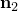
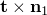
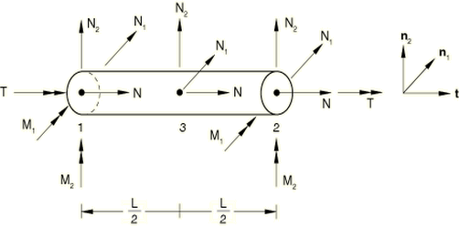

# 29.4.1 框架单元

**产品：** Abaqus/Standard

##### **参考资料**

- ["梁建模：概述，" 第29.3.1节](pt06ch29s03abo26.md)
- ["框架截面行为，" 第29.4.2节](pt06ch29s04alm14.md)
- ["框架单元库，" 第29.4.3节](pt06ch29s04ael15.md)
- [*FRAME SECTION](../key/key-link.md#usb-kws-mframesection)

### 概述

框架单元：
- 是双节点、初始直线的细长梁单元，用于框架状结构的弹性或弹塑性分析；
- 可用于二维或三维；
- 弹性响应遵循欧拉-伯努利梁理论，横向位移采用四次插值；
- 弹塑性响应集中在单元端部（塑性铰），并使用包含非线性运动硬化的集中塑性模型进行建模；
- 适用于小或大位移（大旋转小应变）；
- 输出单元端部和中点的力和弯矩；
- 输出单元端部和中点的弹性轴向应变和曲率，仅在单元端部输出塑性位移和旋转；
- 可选地允许单轴"屈曲支柱"响应，其中单元的轴向响应在压缩时由损伤弹性模型控制，在拉伸时由各向同性硬化塑性模型控制，所有横向力和弯矩为零；
- 可以在分析过程中切换到屈曲支柱响应（仅适用于管道截面）；
- 仅可用于静力、隐式动态和特征频率提取分析。

### 典型应用

框架单元专为由细长、初始直线梁组成的框架状结构的小应变弹性或弹塑性分析而设计。通常，一个框架单元将代表连接两个节点之间的整个结构构件。框架单元的弹性响应由欧拉-伯努利梁理论控制，横向位移场采用四次多项式插值；因此，单元的运动学包括集中端力和弯矩以及沿轴线恒定分布载荷的精确（欧拉-伯努利）解。这些单元可用于解决各种土木工程设计应用，如桁架结构、桥梁、建筑内部框架结构、近海平台和导管架等。框架单元的弹塑性响应使用单元端部的集中塑性模型进行建模，模拟塑性铰的形成。集中塑性模型包含非线性运动硬化。因此，这些单元可用于基于塑性铰形成的坍塌载荷预测。

承受压缩载荷的细长框架状构件通常以仅由构件承受轴向力的方式屈曲；所有其他力和弯矩都可以忽略不计。框架单元提供可选的屈曲支柱响应，其中单元仅承受轴向力，该轴向力基于压缩时的损伤弹性模型和拉伸时的各向同性硬化塑性模型计算。该模型为承受压缩的细长构件在屈曲和后屈曲变形期间发生的强烈非线性几何和材料响应提供了简单的现象学近似。

仅适用于管道截面，框架单元允许在分析过程中切换到可选的单轴屈曲支柱响应。切换标准是"ISO"方程和"强度"方程（见["框架单元的屈曲支柱响应，" Abaqus理论指南第3.9.3节](../stm/stm-link.md#stm-elm-strut)）。当满足ISO和强度方程时，弹性或弹塑性框架单元会一次性切换到屈曲支柱响应。

### 单元横截面坐标系

框架单元的横截面方向在Abaqus/Standard中用局部右手坐标系（、、）来定义，其中是单元轴线的切线方向，从单元的第一节点指向第二节点的方向为正，和是定义截面局部1和2方向的基础向量。被称为第一轴方向，被称为单元的法线。由于这些单元初始为直线且假定为小应变，横截面方向沿每个单元为常数，可能在单元之间不连续。

#### 在节点处定义n1方向

对于平面内的框架单元，方向始终为(0.0, 0.0, 1.0)；即垂直于运动所在的平面。因此，平面框架单元只能绕第一轴方向弯曲。

对于空间框架单元，必须将的大致方向直接作为单元截面定义的一部分来定义，或者通过指定单元轴线外的附加节点来定义。此附加节点包含在单元的连接列表中（见["单元定义，" 第2.2.1节](pt01ch02s02aus11.md)）。
- 如果指定了附加节点，的大致方向由从单元第一节点指向附加节点的向量定义。
- 如果同时使用两种输入方法，则使用附加节点计算的方向优先。
- 如果未通过上述方法定义大致方向，则默认值为(0.0, 0.0, 1.0)。

然后，方向是单元轴线与该近似方向所定义平面内垂直于单元轴线的法线。方向定义为。

### 大位移假设

当选择几何非线性分析时（见["一般和线性扰动过程，" 第6.1.3节](pt03ch06s01aus44.md)），框架单元的公式包含了大的刚体运动（位移和旋转）的影响。这些单元中的应变假定保持为小应变。

### 框架单元的材料响应（截面特性）

对于框架单元，几何和材料特性作为框架截面定义的一部分一起指定。不需要单独的 材料定义。您可以从梁横截面库中选择一个对框架单元有效的截面形状（见["梁横截面库，" 第29.3.9节](pt06ch29s03abm01.md)）。有效的截面形状取决于是否指定了弹性或弹塑性材料响应，或者是否包含屈曲支柱响应。有关指定几何和材料截面特性的完整讨论，请参阅["框架截面行为，" 第29.4.2节](pt06ch29s04alm14.md)。

| **输入文件用法：** | ``` [*FRAME SECTION](../key/key-link.md#usb-kws-mframesection), SECTION=*section_type* ``` |
| --- | --- |

### 机械响应和质量公式

框架单元的机械响应包括弹性和塑性行为。可选地，提供单轴屈曲支柱响应。

#### 弹性响应

框架单元的弹性响应由欧拉-伯努利梁理论控制。垂直于框架单元轴线（，三维中的局部1和2方向；二维中的局部2方向）的横向位移采用四次多项式插值，允许曲率沿单元轴线呈二次变化。因此，每个单独的框架单元都能精确建模其端部力和弯矩载荷以及沿轴线恒定分布载荷（如重力载荷）的静态弹性解。沿单元轴线的位移插值是二次多项式，允许轴向应变线性变化。在三维中，沿单元轴线的扭转旋转插值是线性的，允许常扭转应变。弹性刚度矩阵进行数值积分，用于计算三维中的15个节点力和弯矩：每个端节点一个轴向力、两个剪力、两个弯矩和一个扭矩，以及中点节点一个轴向力和两个剪力。在二维中存在8个节点力和弯矩：每个端部一个轴向力、一个剪力和一个弯矩，以及中点一个轴向力和一个剪力。力和弯矩如图29.4.1-1所示。

**图29.4.1-1** 空间框架单元上的力和弯矩。



#### 弹塑性响应

单元的塑性响应采用"集中"塑性模型处理，因此塑性变形只能在单元端部通过塑性旋转（铰）和塑性轴向位移发展。通过非线性运动硬化模拟从初始屈服到完全屈服塑性铰的塑性区在横截面中的发展。假定端节点的塑性变形仅受该节点的弯矩和轴向力的影响。因此，每个节点的屈服函数（也称为塑性相互作用面）假定仅为该节点轴向力和三个弯矩分量的函数。塑性铰没有关联长度。实际上，塑性铰将具有由单元长度和导致屈服的特定载荷决定的有效尺寸；铰尺寸将影响硬化速率，但不影响极限载荷。因此，如果特定载荷下的硬化速率和由此产生的塑性变形很重要，则应根据单元长度和载荷情况对集中塑性模型进行校准。有关弹塑性单元公式的详细信息，请参阅["具有集中塑性的框架单元，" Abaqus理论指南第3.9.2节](../stm/stm-link.md#stm-elm-frame)。

#### 具有拉伸屈服的單軸線彈性和屈曲支柱響應

您可以获得仅基于单轴力的框架单元响应，包括线弹性、屈曲支柱响应和拉伸屈服。在这种情况下，单元中的所有横向力和弯矩为零。对于线弹性响应，单元的行为类似于具有恒定刚度的轴向弹簧。对于屈曲支柱响应，如果单元中的拉伸轴向力不超过屈服力，则轴向力被限制在屈曲包络线内。请参阅["框架截面行为，" 第29.4.2节](pt06ch29s04alm14.md)了解此包络线的描述。在包络线内部，力与应变的关系由损伤弹性模量表示。该模型的循环滞回响应是现象学的，近似于薄壁、管状构件的响应。当单元在拉伸中加载超过屈服力时，力响应由各向同性硬化塑性控制。在反向加载中，响应由沿应变轴平移的屈曲包络线控制，平移量等于轴向塑性应变。有关屈曲支柱公式的详细信息，请参阅["框架单元的屈曲支柱响应，" Abaqus理论指南第3.9.3节](../stm/stm-link.md#stm-elm-strut)。

#### 质量公式

框架单元对动态分析和重力载荷使用集中质量公式。平动自由度的质量矩阵由轴向和横向位移分量的二次插值推导。单元的旋转惯量是各向同性的，集中分布在两个端部。

对于屈曲支柱响应，使用集中质量方案，其中单元质量集中分布在两个端部；不包括旋转惯量。

### 在接触问题中使用框架单元

当接触条件在结构行为中起作用时，必须谨慎使用框架单元。框架单元有一个额外的内部节点，位于单元的中部。不会在此节点上施加接触约束，因此此内部节点可能会穿透接触表面，导致下垂效应。

### 输出

框架单元中的力和弯矩、弹性应变以及塑性位移和旋转相对于共旋坐标系进行报告。局部坐标方向是轴向方向和两个横截面方向。可以输出单元端部和中点的截面力和弯矩以及弹性应变和曲率。只能输出单元端部的塑性位移和旋转。您可以请求将输出写入输出数据库（仅在积分点）、数据文件或结果文件（见["输出到数据和结果文件，" 第4.1.2节](pt02ch04s01aus39.md)和["输出到输出数据库，" 第4.1.3节](pt02ch04s01aus40.md)）。由于框架单元是用截面特性来表示的，因此无法提供应力输出。
