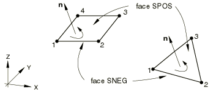
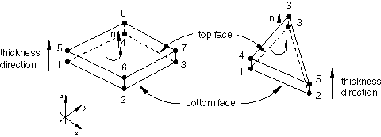

# 29.6.1 壳单元：概述

Abaqus 提供了多种壳体建模选项。

### 概述

壳体建模包括：
- 选择适当的壳单元类型（["选择壳单元，" 第29.6.2节](pt06ch29s06alm16.md)）；
- 定义表面的初始几何形状（["定义常规壳单元的初始几何形状，" 第29.6.3节](pt06ch29s06alm17.md)）；
- 确定是否需要数值积分来定义壳截面行为（["壳截面行为，" 第29.6.4节](pt06ch29s06alm18.md)）；和
- 定义壳截面行为（["使用分析过程中积分的壳截面定义截面行为，" 第29.6.5节](pt06ch29s06alm19.md)或["使用通用壳截面定义截面行为，" 第29.6.6节](pt06ch29s06alm20.md)）。

### 常规壳与连续体壳

壳单元用于建模一个维度（厚度）显著小于其他维度的结构。常规壳单元利用这一条件，通过在参考表面上定义几何形状对物体进行离散化。在这种情况下，厚度通过截面特性定义。常规壳单元具有位移和旋转自由度。

相比之下，连续体壳单元对整个三维物体进行离散化。厚度由单元节点几何形状确定。连续体壳单元只有位移自由度。从建模的角度来看，连续体壳单元看起来像三维连续体实体，但其运动学和本构行为与常规壳单元相似。

图29.6.1-1说明了常规壳和连续体壳单元之间的差异。

**图29.6.1-1** 常规壳与连续体壳单元。


### 约定

壳单元使用的约定如下所述。

#### 空间中壳表面上局部方向的定义

壳表面上用于定义各向异性材料特性以及报告应力和应变分量的默认局部方向在["约定，" 第1.2.2节](pt01ch01s02aus02.md)中定义。您可以通过定义局部方向来定义其他方向（见["方向，" 第2.2.5节](pt01ch02s02aus15.md)），但SAX1、SAX2和SAX2T单元（["轴对称壳单元库，" 第29.6.9节](pt06ch29s06ael19.md)）不支持方向。可以为壳单元分配用分布定义的空间变化局部坐标系（["分布定义，" 第2.8.1节](pt01ch02s08aus26.md)）。对于SAXA单元（["具有非线性非对称变形的轴对称壳单元，" 第29.6.10节](pt06ch29s06ael20.md)），任何各向异性材料定义必须在和处关于*r*–*z*平面对称。

在大变形（几何非线性）分析中，这些局部方向随着该点表面的平均旋转而旋转。它们作为当前配置中的方向输出，但在Abaqus/Standard中仅提供大旋转小应变的壳单元（单元类型STRI3、STRI65、S4R5、S8R、S8RT、S8R5、S9R5——见["选择壳单元，" 第29.6.2节](pt06ch29s06alm16.md)）除外，这些单元作为参考配置中的方向输出。因此，在几何非线性分析中，在显示这些方向或显示Abaqus/CAE中的应力、应变或截面力或弯矩的主值时，应使用当前（变形）配置，但Abaqus/Standard中的小应变单元除外，对于这些单元应使用参考配置。

#### 常规壳单元的正法线定义

常规壳单元的"顶"表面是正法线方向的表面，在接触定义中称为正面（SPOS）。"底"表面沿法线负方向，在接触定义中称为负面（SNEG）。在指定参考表面从壳中面的偏移时，也使用正负来指定顶面和底面。

正法线方向定义了压力载荷应用以及沿壳厚度变化的量输出的约定。施加到壳单元的正压力载荷产生沿正法线方向作用的载荷。

##### 三维常规壳

对于空间中的壳，正法线由绕单元节点的右手定则给出，按元素定义中指定的顺序。如图29.6.1-2所示。

**图29.6.1-2** 三维常规壳的正法线。



##### 轴对称常规壳

对于轴对称常规壳（包括允许非对称变形的SAXA1*n*和SAXA2*n*单元），正法线方向定义为从节点1到节点2的方向逆时针旋转90度。如图29.6.1-3所示。

**图29.6.1-3** 常规轴对称壳的正法线。


#### 连续体壳单元的法线定义

图29.6.1-4说明了连续体壳的关键几何特征。

**图29.6.1-4** 连续体壳单元的默认法线和厚度方向。



正确地定向连续体壳是很重要的，因为厚度方向的行为与面内方向的行为不同。默认情况下，单元顶面和底面，以及单元法线、堆叠方向和厚度方向由节点连接定义。对于三角形面内连续体壳单元（SC6R），角节点1、2和3的面是底面；角节点4、5和6的面是顶面。对于四边形连续体壳单元（SC8R），角节点1、2、3和4的面是底面；角节点5、6、7和8的面是顶面。堆叠方向和厚度方向都定义为从底面到顶面的方向。以下描述了定义单元厚度方向的附加选项，包括独立于节点连接的选项。

连续体壳上的表面可以通过指定面标识符S1-S6来定义，识别["连续体壳单元库，" 第29.6.8节](pt06ch29s06ael18.md)中定义的单个面。也可以使用自由表面生成。

施加到面P1-P6的压力载荷的定义类似于连续体单元，正压力指向单元内部。

#### 定义堆叠和厚度方向

默认情况下，连续体壳堆叠方向和厚度方向由节点连接定义，如图29.6.1-4所示。或者，您可以通过选择单元的等参方向之一或使用方向定义来定义单元堆叠方向和厚度方向。

##### 基于单元等参方向定义堆叠和厚度方向

您可以将单元堆叠方向定义为沿单元的等参方向之一（关于单元堆叠方向见图29.6.1-5）。8节点六面体连续体壳有三种可能的堆叠方向；6节点面内三角形连续体壳只有一个堆叠方向，即单元3等参方向。默认堆叠方向是3，提供与上一节所述相同的厚度和堆叠方向。

要获得所需的厚度方向，等参方向的选择取决于单元连接。对于网格无关的规格，请使用如下所述的基于方向的方法。

**图29.6.1-5** SC6R和SC8R单元的堆叠方向。


| **输入文件用法：** | 使用以下选项之一基于单元的等参方向定义单元堆叠方向： |
| --- | --- |
|  | ``` [*SHELL SECTION](../key/key-link.md#usb-kws-mshellsection), STACK DIRECTION=*n* [*SHELL GENERAL SECTION](../key/key-link.md#usb-kws-mshellgensect), STACK DIRECTION=*n* ``` 其中*n* = 1、2或3。 |

| **Abaqus/CAE用法：** | 如果连续体壳使用复合铺层定义，请使用以下选项基于单元的等参方向定义堆叠方向： |
| --- | --- |
|  | 属性模块：**Create Composite Layup**：选择**Continuum Shell**作为**Element Type**：**Stacking Direction**：**Element direction 1**、**Element direction 2**或**Element direction 3** 如果连续体壳使用复合壳截面定义，请使用以下选项基于单元的等参方向定义堆叠方向：****Assign****Material Orientation****：选择区域：**Use Default Orientation or Other Method**：**Stacking Direction**：**Element isoparametric direction 1**、**Element isoparametric direction 2**或**Element isoparametric direction 3** |

##### 基于方向定义定义堆叠和厚度方向

或者，您可以根据局部方向定义定义单元堆叠方向。对于壳单元，方向定义定义了一个轴，局部1和2材料方向可以绕该轴旋转。此轴也定义了近似的法线方向。单元堆叠和厚度方向定义为最接近此近似法线的单元等参方向（见图29.6.1-6）。

**图29.6.1-6** 使用圆柱坐标系定义堆叠方向的示例。


["Pinch cylinder problem，" Abaqus Benchmarks Guide第2.3.2节](../bmk/bmk-link.md#bmk-elm-pinchcyl)和["LE3: Hemispherical shell with point loads，" Abaqus Benchmarks Guide第4.2.3节](../bmk/bmk-link.md#bmk-nfm-le3)分别举例说明了使用圆柱和球面方向系统来定义独立于节点连接的堆叠和厚度方向。

| **输入文件用法：** | 使用以下选项之一基于用户定义的方向定义单元堆叠方向： |
| --- | --- |
|  | ``` [*SHELL SECTION](../key/key-link.md#usb-kws-mshellsection), STACK DIRECTION=ORIENTATION, ORIENTATION=*name* [*SHELL GENERAL SECTION](../key/key-link.md#usb-kws-mshellgensect), STACK DIRECTION=ORIENTATION, ORIENTATION=*name* ``` |

| **Abaqus/CAE用法：** | 如果连续体壳使用复合铺层定义，请使用以下选项基于用户定义的方向定义堆叠方向： |
| --- | --- |
|  | 属性模块：**Create Composite Layup**：选择**Continuum Shell**作为**Element Type**：**Stacking Direction**：**Layup orientation** 如果连续体壳使用复合壳截面定义，请使用以下选项基于用户定义的方向定义堆叠方向：****Assign****Material Orientation****：选择区域：**Use Default Orientation or Other Method**：**Stacking Direction**：**Normal direction of material orientation** |

##### 验证单元堆叠和厚度方向

您可以通过对单元截面厚度进行等值线显示或绘制材料轴来在Abaqus/CAE中直观地验证单元堆叠和厚度方向。通常，面内尺寸显著大于单元厚度。通过对壳截面厚度（输出变量STH）进行等值线显示，您可以轻松验证所有单元方向正确且具有正确的厚度。如果单元方向不正确，其中一个面内尺寸将成为单元截面厚度，导致等值线图不连续。

或者，您可以绘制材料轴来验证3轴是否指向所需的法线方向。如果单元方向不正确，平面内轴之一（1轴或2轴）将指向法线方向。

#### 沿壳厚度的截面点编号

沿壳厚度的截面点按顺序编号，从点1开始。对于分析过程中积分的壳截面，如果使用Simpson规则，截面点1恰好在壳的底面上；如果使用高斯积分，它是最接近底面的点。对于通用壳截面，截面点1总是在壳的底面上。

对于均质截面，截面点的总数由沿厚度的积分点数量定义。对于分析过程中积分的壳截面，您可以定义沿厚度的积分点数量。Simpson规则的默认值是5，高斯积分的默认值是3。对于通用壳截面，可以在三个截面点获取输出。

对于复合截面，截面点的总数是通过将所有层的每层积分点数相加来定义的。对于分析过程中积分的壳截面，您可以定义每层的积分点数量。Simpson规则的默认值是3，高斯积分的默认值是2。对于通用壳截面，每层输出的截面点数为3。

#### 默认输出点

在Abaqus/Standard中，壳截面厚度方向的默认输出点是壳截面底面和顶面上的点（使用Simpson规则积分时），或最接近底面和顶面的点（使用高斯积分时）。例如，如果沿单层壳使用五个积分点，则将为截面点1（底面）和5（顶面）提供输出。

在Abaqus/Explicit中，壳截面厚度方向的所有截面点都被写入结果文件以进行单元输出请求。
