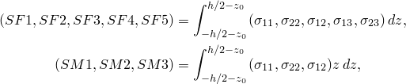
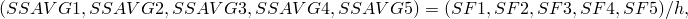
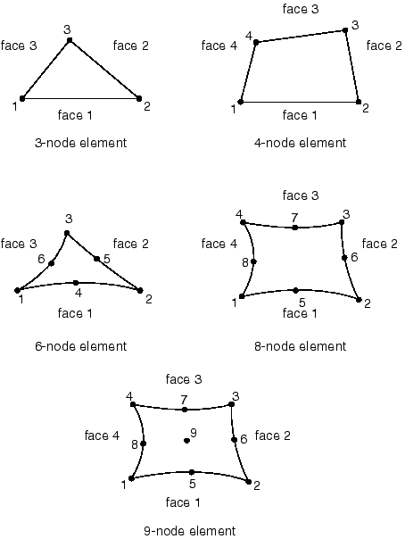

# 29.6.7 三维常规壳单元库

**产品：** Abaqus/Standard  Abaqus/Explicit  Abaqus/CAE

##### **参考资料**

- ["壳单元：概述，" 第29.6.1节](pt06ch29s06abo27.md)
- ["选择壳单元，" 第29.6.2节](pt06ch29s06alm16.md)
- [*NODAL THICKNESS](../key/key-link.md#usb-kws-mnodalthickness)
- [*SHELL GENERAL SECTION](../key/key-link.md#usb-kws-mshellgensect)
- [*SHELL SECTION](../key/key-link.md#usb-kws-mshellsection)

### 概述

本节提供 Abaqus/Standard 和 Abaqus/Explicit 中可用三维壳单元的参考。

### 单元类型

#### 应力/位移单元

| STRI3(S) | 3节点三角形薄壳 |
| --- | --- |

| S3 | 3节点三角形通用壳，有限膜应变（与单元S3R相同） |
| --- | --- |

| S3R | 3节点三角形通用壳，有限膜应变（与单元S3相同） |
| --- | --- |

| S3RS(E) | 3节点三角形壳，小膜应变 |
| --- | --- |

| STRI65(S) | 6节点三角形薄壳，每个节点使用五个自由度 |
| --- | --- |

| S4 | 4节点通用壳，有限膜应变 |
| --- | --- |

| S4R | 4节点通用壳，减少积分带沙漏控制，有限膜应变 |
| --- | --- |

| S4RS(E) | 4节点，减少积分，带沙漏控制，小膜应变 |
| --- | --- |

| S4RSW(E) | 4节点，减少积分，带沙漏控制，小膜应变，在小应变公式中考虑翘曲 |
| --- | --- |

| S4R5(S) | 4节点薄壳，减少积分带沙漏控制，每个节点使用五个自由度 |
| --- | --- |

| S8R(S) | 8节点双曲率厚壳，减少积分 |
| --- | --- |

| S8R5(S) | 8节点双曲率薄壳，减少积分，每个节点使用五个自由度 |
| --- | --- |

| S9R5(S) | 9节点双曲率薄壳，减少积分，每个节点使用五个自由度 |
| --- | --- |

##### 激活的自由度

STRI3、S3R、S3RS、S4、S4R、S4RS、S4RSW、S8R为1、2、3、4、5、6

STRI65、S4R5、S8R5、S9R5在大多数节点为1、2、3和两个面内旋转

STRI65、S4R5、S8R5、S9R5在任何具有以下情况的节点为1、2、3、4、5、6：
- 在旋转自由度上有边界条件；
- 参与使用旋转自由度的多点约束；
- 连接到使用所有节点六个自由度的梁或壳单元（如S4R、S8R、STRI3等）；
- 是不同单元具有不同表面法线的点（用户指定的法线定义或由于表面折叠而由Abaqus创建的法线定义）；或
- 承受弯矩载荷。

##### 附加解变量

S8R5类型的单元在内部生成的中体节点具有三个位移和两个旋转变量。

#### 热传递单元

| DS3(S) | 3节点三角形壳 |
| --- | --- |

| DS4(S) | 4节点四边形壳 |
| --- | --- |

| DS6(S) | 6节点三角形壳 |
| --- | --- |

| DS8(S) | 8节点四边形壳 |
| --- | --- |

##### 激活的自由度

11、12等（沿厚度的温度，如["选择壳单元，" 第29.6.2节](pt06ch29s06alm16.md)中所述）

##### 附加解变量

无。

#### 耦合温度-位移单元

| S3T(S) | 3节点三角形通用壳，有限膜应变，壳面内双线性温度（与单元S3RT相同） |
| --- | --- |

| S3RT | 3节点三角形通用壳，有限膜应变，壳面内双线性温度（对于Abaqus/Standard，它与单元S3T相同） |
| --- | --- |

| S4T(S) | 4节点通用壳，有限膜应变，壳面内双线性温度 |
| --- | --- |

| S4RT | 4节点通用壳，减少积分带沙漏控制，有限膜应变，壳面内双线性温度 |
| --- | --- |

| S8RT(S) | 8节点厚壳，双二次位移，壳面内双线性温度 |
| --- | --- |

##### 激活的自由度

S3T、S3RT、S4T和S4RT在所有节点为1、2、3、4、5、6

11、12等（沿厚度的温度，如["选择壳单元，" 第29.6.2节](pt06ch29s06alm16.md)中所述）在所有节点；S8RT仅在角节点

##### 附加解变量

无。

### 所需的节点坐标

，对于Abaqus/Standard中具有位移自由度的壳，可选地还有，即节点处壳法线的方向余弦。

### 单元属性定义

| **输入文件用法：** | 对应力/位移单元使用以下任一选项： |
| --- | --- |
|  | ``` [*SHELL SECTION](../key/key-link.md#usb-kws-mshellsection) [*SHELL GENERAL SECTION](../key/key-link.md#usb-kws-mshellgensect) ``` 对热传递或耦合温度-位移单元使用以下选项： ``` [*SHELL SECTION](../key/key-link.md#usb-kws-mshellsection) ``` 此外，对变厚度壳使用以下选项： ``` [*NODAL THICKNESS](../key/key-link.md#usb-kws-mnodalthickness) ``` |

| **Abaqus/CAE用法：** | 属性模块：**Create Section**：选择**Shell**作为截面**Category**和**Homogeneous**或**Composite**作为截面**Type** |
| --- | --- |

### 基于单元的载荷

### 分布载荷

分布载荷可用于所有具有位移自由度的单元。如["分布载荷，" 第34.4.3节](pt07ch34s04aus122.md)中所述进行指定。

如果等效截面特性作为通用壳截面定义的一部分直接指定，则体积力、离心载荷和科里奥利力必须以单位面积的力给出。

**载荷 ID (*DLOAD*)：** BX
**Abaqus/CAE 载荷/相互作用：** **Body force**
**单位：** [FL3](../popups/usb-int-iconventions-unitsym.md)
**描述：** 全局*X*方向的体积力（以单位体积的力给出）。

**载荷 ID (*DLOAD*)：** BY
**Abaqus/CAE 载荷/相互作用：** **Body force**
**单位：** [FL3](../popups/usb-int-iconventions-unitsym.md)
**描述：** 全局*Y*方向的体积力（以单位体积的力给出）。

**载荷 ID (*DLOAD*)：** BZ
**Abaqus/CAE 载荷/相互作用：** **Body force**
**单位：** [FL3](../popups/usb-int-iconventions-unitsym.md)
**描述：** 全局*Z*方向的体积力（以单位体积的力给出）。

**载荷 ID (*DLOAD*)：** BXNU
**Abaqus/CAE 载荷/相互作用：** **Body force**
**单位：** [FL3](../popups/usb-int-iconventions-unitsym.md)
**描述：** 全局*X*方向的非均匀体积力（以单位体积的力给出），在Abaqus/Standard中通过用户子程序[`DLOAD`](../sub/sub-link.md#sub-xsl-dload)提供幅度，在Abaqus/Explicit中通过[`VDLOAD`](../sub/sub-link.md#sub-xsl-vdload)提供。

**载荷 ID (*DLOAD*)：** BYNU
**Abaqus/CAE 载荷/相互作用：** **Body force**
**单位：** [FL3](../popups/usb-int-iconventions-unitsym.md)
**描述：** 全局*Y*方向的非均匀体积力（以单位体积的力给出），在Abaqus/Standard中通过用户子程序[`DLOAD`](../sub/sub-link.md#sub-xsl-dload)提供幅度，在Abaqus/Explicit中通过[`VDLOAD`](../sub/sub-link.md#sub-xsl-vdload)提供。

**载荷 ID (*DLOAD*)：** BZNU
**Abaqus/CAE 载荷/相互作用：** **Body force**
**单位：** [FL3](../popups/usb-int-iconventions-unitsym.md)
**描述：** 全局*Z*方向的非均匀体积力（以单位体积的力给出），在Abaqus/Standard中通过用户子程序[`DLOAD`](../sub/sub-link.md#sub-xsl-dload)提供幅度，在Abaqus/Explicit中通过[`VDLOAD`](../sub/sub-link.md#sub-xsl-vdload)提供。

**载荷 ID (*DLOAD*)：** CENT(S)
**Abaqus/CAE 载荷/相互作用：** 不支持
**单位：** [FL4 (ML3T2)](../popups/usb-int-iconventions-unitsym.md)
**描述：** 离心载荷（幅度定义为，其中是质量密度，是角速度）。

**载荷 ID (*DLOAD*)：** CENTRIF(S)
**Abaqus/CAE 载荷/相互作用：** **Rotational body force**
**单位：** [T2](../popups/usb-int-iconventions-unitsym.md)
**描述：** 离心载荷（幅度输入为，其中是角速度）。

**载荷 ID (*DLOAD*)：** CORIO(S)
**Abaqus/CAE 载荷/相互作用：** **Coriolis force**
**单位：** [FL4T (ML3T1)](../popups/usb-int-iconventions-unitsym.md)
**描述：** 科里奥利力（幅度输入，其中是质量密度，是角速度）。在直接稳态动力学分析中不考虑科里奥利载荷引起的载荷刚度。

**载荷 ID (*DLOAD*)：** EDLD*n*
**Abaqus/CAE 载荷/相互作用：** **Shell edge load**
**单位：** [FL1](../popups/usb-int-iconventions-unitsym.md)
**描述：** 边缘*n*上的一般牵引。

**载荷 ID (*DLOAD*)：** EDLD*n*NU(S)
**Abaqus/CAE 载荷/相互作用：** 不支持
**单位：** [FL1](../popups/usb-int-iconventions-unitsym.md)
**描述：** 边缘*n*上幅度和方向通过用户子程序[`UTRACLOAD`](../sub/sub-link.md#sub-xsl-utracload)提供的非均匀一般牵引。

**载荷 ID (*DLOAD*)：** EDMOM*n*
**Abaqus/CAE 载荷/相互作用：** **Shell edge load**
**单位：** [F](../popups/usb-int-iconventions-unitsym.md)
**描述：** 边缘*n*上的弯矩。

**载荷 ID (*DLOAD*)：** EDMOM*n*NU(S)
**Abaqus/CAE 载荷/相互作用：** 不支持
**单位：** [F](../popups/usb-int-iconventions-unitsym.md)
**描述：** 边缘*n*上幅度通过用户子程序[`UTRACLOAD`](../sub/sub-link.md#sub-xsl-utracload)提供的非均匀弯矩。

**载荷 ID (*DLOAD*)：** EDNOR*n*
**Abaqus/CAE 载荷/相互作用：** **Shell edge load**
**单位：** [FL1](../popups/usb-int-iconventions-unitsym.md)
**描述：** 边缘*n*上的法向牵引。

**载荷 ID (*DLOAD*)：** EDNOR*n*NU(S)
**Abaqus/CAE 载荷/相互作用：** 不支持
**单位：** [FL1](../popups/usb-int-iconventions-unitsym.md)
**描述：** 边缘*n*上幅度通过用户子程序[`UTRACLOAD`](../sub/sub-link.md#sub-xsl-utracload)提供的非均匀法向牵引。

**载荷 ID (*DLOAD*)：** EDSHR*n*
**Abaqus/CAE 载荷/相互作用：** **Shell edge load**
**单位：** [FL1](../popups/usb-int-iconventions-unitsym.md)
**描述：** 边缘*n*上的剪切牵引。

**载荷 ID (*DLOAD*)：** EDSHR*n*NU(S)
**Abaqus/CAE 载荷/相互作用：** 不支持
**单位：** [FL1](../popups/usb-int-iconventions-unitsym.md)
**描述：** 边缘*n*上幅度通过用户子程序[`UTRACLOAD`](../sub/sub-link.md#sub-xsl-utracload)提供的非均匀剪切牵引。

**载荷 ID (*DLOAD*)：** EDTRA*n*
**Abaqus/CAE 载荷/相互作用：** **Shell edge load**
**单位：** [FL1](../popups/usb-int-iconventions-unitsym.md)
**描述：** 边缘*n*上的横向牵引。

**载荷 ID (*DLOAD*)：** EDTRA*n*NU(S)
**Abaqus/CAE 载荷/相互作用：** 不支持
**单位：** [FL1](../popups/usb-int-iconventions-unitsym.md)
**描述：** 边缘*n*上幅度和方向通过用户子程序[`UTRACLOAD`](../sub/sub-link.md#sub-xsl-utracload)提供的非均匀横向牵引。

**载荷 ID (*DLOAD*)：** GRAV
**Abaqus/CAE 载荷/相互作用：** **Gravity**
**单位：** [LT2](../popups/usb-int-iconventions-unitsym.md)
**描述：** 指定方向的重力载荷（输入的量值为加速度）。

**载荷 ID (*DLOAD*)：** HP(S)
**Abaqus/CAE 载荷/相互作用：** 不支持
**单位：** [FL2](../popups/usb-int-iconventions-unitsym.md)
**描述：** 施加到单元参考表面并在全局*Z*中线性变化的重力压力。正压力沿正单元法线方向。

**载荷 ID (*DLOAD*)：** P
**Abaqus/CAE 载荷/相互作用：** **Pressure**
**单位：** [FL2](../popups/usb-int-iconventions-unitsym.md)
**描述：** 施加到单元参考表面的压力。正压力沿正单元法线方向。

**载荷 ID (*DLOAD*)：** PNU
**Abaqus/CAE 载荷/相互作用：** 不支持
**单位：** [FL2](../popups/usb-int-iconventions-unitsym.md)
**描述：** 非均匀压力施加到单元参考表面，在Abaqus/Standard中通过用户子程序[`DLOAD`](../sub/sub-link.md#sub-xsl-dload)提供幅度，在Abaqus/Explicit中通过[`VDLOAD`](../sub/sub-link.md#sub-xsl-vdload)提供。正压力沿正单元法线方向。

**载荷 ID (*DLOAD*)：** ROTA(S)
**Abaqus/CAE 载荷/相互作用：** **Rotational body force**
**单位：** [T2](../popups/usb-int-iconventions-unitsym.md)
**描述：** 旋转加速度载荷（幅度输入为，其中是旋转加速度）。

**载荷 ID (*DLOAD*)：** ROTDYNF(S)
**Abaqus/CAE 载荷/相互作用：** 不支持
**单位：** [T1](../popups/usb-int-iconventions-unitsym.md)
**描述：** 旋转动力载荷（幅度输入为，其中是角速度）。

**载荷 ID (*DLOAD*)：** SBF(E)
**Abaqus/CAE 载荷/相互作用：** 不支持
**单位：** [FL5T](../popups/usb-int-iconventions-unitsym.md)
**描述：** 全局*X*-、*Y*-和*Z*方向的滞止体积力。

**载荷 ID (*DLOAD*)：** SP(E)
**Abaqus/CAE 载荷/相互作用：** 不支持
**单位：** [FL4T2](../popups/usb-int-iconventions-unitsym.md)
**描述：** 施加到单元参考表面的滞止压力。

**载荷 ID (*DLOAD*)：** TRSHR
**Abaqus/CAE 载荷/相互作用：** **Surface traction**
**单位：** [FL2](../popups/usb-int-iconventions-unitsym.md)
**描述：** 单元参考表面上的剪切牵引。

**载荷 ID (*DLOAD*)：** TRSHRNU(S)
**Abaqus/CAE 载荷/相互作用：** 不支持
**单位：** [FL2](../popups/usb-int-iconventions-unitsym.md)
**描述：** 非均匀剪切牵引施加到单元参考表面，幅度和方向通过用户子程序[`UTRACLOAD`](../sub/sub-link.md#sub-xsl-utracload)提供。

**载荷 ID (*DLOAD*)：** TRVEC
**Abaqus/CAE 载荷/相互作用：** **Surface traction**
**单位：** [FL2](../popups/usb-int-iconventions-unitsym.md)
**描述：** 单元参考表面上的一般牵引。

**载荷 ID (*DLOAD*)：** TRVECNU(S)
**Abaqus/CAE 载荷/相互作用：** 不支持
**单位：** [FL2](../popups/usb-int-iconventions-unitsym.md)
**描述：** 非均匀一般牵引施加到单元参考表面，幅度和方向通过用户子程序[`UTRACLOAD`](../sub/sub-link.md#sub-xsl-utracload)提供。

**载荷 ID (*DLOAD*)：** VBF(E)
**Abaqus/CAE 载荷/相互作用：** 不支持
**单位：** [FL4T](../popups/usb-int-iconventions-unitsym.md)
**描述：** 全局*X*-、*Y*-和*Z*方向的粘性体积力。

**载荷 ID (*DLOAD*)：** VP(E)
**Abaqus/CAE 载荷/相互作用：** 不支持
**单位：** [FL3T](../popups/usb-int-iconventions-unitsym.md)
**描述：** 粘性表面压力。粘性压力与单元面法线方向的速度成正比，并与运动相反。

### 基础

基础可用于Abaqus/Standard中具有位移自由度的单元。如["单元基础，" 第2.2.2节](pt01ch02s02aus12.md)中所述进行指定。

**载荷 ID (*FOUNDATION*)：** F(S)
**Abaqus/CAE 载荷/相互作用：** **Elastic foundation**
**单位：** [FL3](../popups/usb-int-iconventions-unitsym.md)
**描述：** 沿壳法线方向的弹性基础。

### 分布热通量

分布热通量可用于具有温度自由度的单元。如["热载荷，" 第34.4.4节](pt07ch34s04aus123.md)中所述进行指定。

**载荷 ID (*DFLUX*)：** BF(S)
**Abaqus/CAE 载荷/相互作用：** **Body heat flux**
**单位：** [JL3 T1](../popups/usb-int-iconventions-unitsym.md)
**描述：** 单位体积的体积热通量。

**载荷 ID (*DFLUX*)：** BFNU(S)
**Abaqus/CAE 载荷/相互作用：** **Body heat flux**
**单位：** [JL3 T1](../popups/usb-int-iconventions-unitsym.md)
**描述：** 非均匀单位体积热通量，幅度通过用户子程序[`DFLUX`](../sub/sub-link.md#sub-xsl-dflux)提供。

**载荷 ID (*DFLUX*)：** SNEG(S)
**Abaqus/CAE 载荷/相互作用：** **Surface heat flux**
**单位：** [JL2 T1](../popups/usb-int-iconventions-unitsym.md)
**描述：** 单位面积热通量进入单元底面。

**载荷 ID (*DFLUX*)：** SPOS(S)
**Abaqus/CAE 载荷/相互作用：** **Surface heat flux**
**单位：** [JL2 T1](../popups/usb-int-iconventions-unitsym.md)
**描述：** 单位面积热通量进入单元顶面。

**载荷 ID (*DFLUX*)：** SNEGNU(S)
**Abaqus/CAE 载荷/相互作用：** 不支持
**单位：** [JL2 T1](../popups/usb-int-iconventions-unitsym.md)
**描述：** 非均匀单位面积热通量进入单元底面，幅度通过用户子程序[`DFLUX`](../sub/sub-link.md#sub-xsl-dflux)提供。

**载荷 ID (*DFLUX*)：** SPOSNU(S)
**Abaqus/CAE 载荷/相互作用：** 不支持
**单位：** [JL2 T1](../popups/usb-int-iconventions-unitsym.md)
**描述：** 非均匀单位面积热通量进入单元顶面，幅度通过用户子程序[`DFLUX`](../sub/sub-link.md#sub-xsl-dflux)提供。

### 薄膜条件

薄膜条件可用于具有温度自由度的单元。如["热载荷，" 第34.4.4节](pt07ch34s04aus123.md)中所述进行指定。

**载荷 ID (*FILM*)：** FNEG(S)
**Abaqus/CAE 载荷/相互作用：** **Surface film condition**
**单位：** [JL2 T11](../popups/usb-int-iconventions-unitsym.md)
**描述：** 在单元底面上提供的薄膜系数和吸声温度（的单位）。

**载荷 ID (*FILM*)：** FPOS(S)
**Abaqus/CAE 载荷/相互作用：** **Surface film condition**
**单位：** [JL2 T11](../popups/usb-int-iconventions-unitsym.md)
**描述：** 在单元顶面上提供的薄膜系数和吸声温度（的单位）。

**载荷 ID (*FILM*)：** FNEGNU(S)
**Abaqus/CAE 载荷/相互作用：** 不支持
**单位：** [JL2 T11](../popups/usb-int-iconventions-unitsym.md)
**描述：** 非均匀薄膜系数和吸声温度（的单位）在单元底面上，幅度通过用户子程序[`FILM`](../sub/sub-link.md#sub-xsl-film)提供。

**载荷 ID (*FILM*)：** FPOSNU(S)
**Abaqus/CAE 载荷/相互作用：** 不支持
**单位：** [JL2 T11](../popups/usb-int-iconventions-unitsym.md)
**描述：** 非均匀薄膜系数和吸声温度（的单位）在单元顶面上，幅度通过用户子程序[`FILM`](../sub/sub-link.md#sub-xsl-film)提供。

### 辐射类型

辐射条件可用于具有温度自由度的单元。如["热载荷，" 第34.4.4节](pt07ch34s04aus123.md)中所述进行指定。

**载荷 ID (*RADIATE*)：** RNEG(S)
**Abaqus/CAE 载荷/相互作用：** **Surface radiation**
**单位：** [Dimensionless](../popups/usb-int-iconventions-unitsym.md)
**描述：** 壳底面的发射率和吸声温度（的单位）。

**载荷 ID (*RADIATE*)：** RPOS(S)
**Abaqus/CAE 载荷/相互作用：** **Surface radiation**
**单位：** [Dimensionless](../popups/usb-int-iconventions-unitsym.md)
**描述：** 壳顶面的发射率和吸声温度（的单位）。

### 基于表面的载荷

### 分布载荷

基于表面的分布载荷可用于所有具有位移自由度的单元。如["分布载荷，" 第34.4.3节](pt07ch34s04aus122.md)中所述进行指定。

**载荷 ID (*DSLOAD*)：** EDLD
**Abaqus/CAE 载荷/相互作用：** **Shell edge load**
**单位：** [FL1](../popups/usb-int-iconventions-unitsym.md)
**描述：** 基于边缘的表面上的通用牵引。

**载荷 ID (*DSLOAD*)：** EDLDNU(S)
**Abaqus/CAE 载荷/相互作用：** **Shell edge load**
**单位：** [FL1](../popups/usb-int-iconventions-unitsym.md)
**描述：** 非均匀通用牵引施加在基于边缘的表面上，幅度和方向通过用户子程序[`UTRACLOAD`](../sub/sub-link.md#sub-xsl-utracload)提供。

**载荷 ID (*DSLOAD*)：** EDMOM
**Abaqus/CAE 载荷/相互作用：** **Shell edge load**
**单位：** [F](../popups/usb-int-iconventions-unitsym.md)
**描述：** 基于边缘的表面上的弯矩。

**载荷 ID (*DSLOAD*)：** EDMOMNU(S)
**Abaqus/CAE 载荷/相互作用：** **Shell edge load**
**单位：** [F](../popups/usb-int-iconventions-unitsym.md)
**描述：** 非均匀弯矩施加在基于边缘的表面上，幅度通过用户子程序[`UTRACLOAD`](../sub/sub-link.md#sub-xsl-utracload)提供。

**载荷 ID (*DSLOAD*)：** EDNOR
**Abaqus/CAE 载荷/相互作用：** **Shell edge load**
**单位：** [FL1](../popups/usb-int-iconventions-unitsym.md)
**描述：** 基于边缘的表面上的法向牵引。

**载荷 ID (*DSLOAD*)：** EDNORNU(S)
**Abaqus/CAE 载荷/相互作用：** **Shell edge load**
**单位：** [FL1](../popups/usb-int-iconventions-unitsym.md)
**描述：** 非均匀法向牵引施加在基于边缘的表面上，幅度通过用户子程序[`UTRACLOAD`](../sub/sub-link.md#sub-xsl-utracload)提供。

**载荷 ID (*DSLOAD*)：** EDSHR
**Abaqus/CAE 载荷/相互作用：** **Shell edge load**
**单位：** [FL1](../popups/usb-int-iconventions-unitsym.md)
**描述：** 基于边缘的表面上的剪切牵引。

**载荷 ID (*DSLOAD*)：** EDSHRNU(S)
**Abaqus/CAE 载荷/相互作用：** **Shell edge load**
**单位：** [FL1](../popups/usb-int-iconventions-unitsym.md)
**描述：** 非均匀剪切牵引施加在基于边缘的表面上，幅度通过用户子程序[`UTRACLOAD`](../sub/sub-link.md#sub-xsl-utracload)提供。

**载荷 ID (*DSLOAD*)：** EDTRA
**Abaqus/CAE 载荷/相互作用：** **Shell edge load**
**单位：** [FL1](../popups/usb-int-iconventions-unitsym.md)
**描述：** 基于边缘的表面上的横向牵引。

**载荷 ID (*DSLOAD*)：** EDTRANU(S)
**Abaqus/CAE 载荷/相互作用：** **Shell edge load**
**单位：** [FL1](../popups/usb-int-iconventions-unitsym.md)
**描述：** 非均匀横向牵引施加在基于边缘的表面上，幅度通过用户子程序[`UTRACLOAD`](../sub/sub-link.md#sub-xsl-utracload)提供。

**载荷 ID (*DSLOAD*)：** HP(S)
**Abaqus/CAE 载荷/相互作用：** **Pressure**
**单位：** [FL2](../popups/usb-int-iconventions-unitsym.md)
**描述：** 在单元参考表面上在全局*Z*中线性变化的重力压力。正压力沿与表面法线相反的方向。

**载荷 ID (*DSLOAD*)：** P
**Abaqus/CAE 载荷/相互作用：** **Pressure**
**单位：** [FL2](../popups/usb-int-iconventions-unitsym.md)
**描述：** 在单元参考表面上的压力。正压力沿与表面法线相反的方向。

**载荷 ID (*DSLOAD*)：** PNU
**Abaqus/CAE 载荷/相互作用：** **Pressure**
**单位：** [FL2](../popups/usb-int-iconventions-unitsym.md)
**描述：** 非均匀压力施加到单元参考表面，在Abaqus/Standard中通过用户子程序[`DLOAD`](../sub/sub-link.md#sub-xsl-dload)提供幅度，在Abaqus/Explicit中通过[`VDLOAD`](../sub/sub-link.md#sub-xsl-vdload)提供。正压力沿与表面法线相反的方向。

**载荷 ID (*DSLOAD*)：** SP(E)
**Abaqus/CAE 载荷/相互作用：** **Pressure**
**单位：** [FL4T2](../popups/usb-int-iconventions-unitsym.md)
**描述：** 施加到单元参考表面的滞止压力。

**载荷 ID (*DSLOAD*)：** TRSHR
**Abaqus/CAE 载荷/相互作用：** **Surface traction**
**单位：** [FL2](../popups/usb-int-iconventions-unitsym.md)
**描述：** 单元参考表面上的剪切牵引。

**载荷 ID (*DSLOAD*)：** TRSHRNU(S)
**Abaqus/CAE 载荷/相互作用：** **Surface traction**
**单位：** [FL2](../popups/usb-int-iconventions-unitsym.md)
**描述：** 非均匀剪切牵引施加到单元参考表面，幅度和方向通过用户子程序[`UTRACLOAD`](../sub/sub-link.md#sub-xsl-utracload)提供。

**载荷 ID (*DSLOAD*)：** TRVEC
**Abaqus/CAE 载荷/相互作用：** **Surface traction**
**单位：** [FL2](../popups/usb-int-iconventions-unitsym.md)
**描述：** 单元参考表面上的一般牵引。

**载荷 ID (*DSLOAD*)：** TRVECNU(S)
**Abaqus/CAE 载荷/相互作用：** **Surface traction**
**单位：** [FL2](../popups/usb-int-iconventions-unitsym.md)
**描述：** 非均匀一般牵引施加到单元参考表面，幅度和方向通过用户子程序[`UTRACLOAD`](../sub/sub-link.md#sub-xsl-utracload)提供。

**载荷 ID (*DSLOAD*)：** VP(E)
**Abaqus/CAE 载荷/相互作用：** **Pressure**
**单位：** [FL3T](../popups/usb-int-iconventions-unitsym.md)
**描述：** 粘性表面压力。粘性压力与单元面法线方向的速度成正比，并与运动相反。

### 分布热通量

基于表面的分布热通量可用于具有温度自由度的单元。如["热载荷，" 第34.4.4节](pt07ch34s04aus123.md)中所述进行指定。

**载荷 ID (*DSFLUX*)：** S(S)
**Abaqus/CAE 载荷/相互作用：** **Surface heat flux**
**单位：** [JL2 T1](../popups/usb-int-iconventions-unitsym.md)
**描述：** 单位面积热通量进入单元表面。

**载荷 ID (*DSFLUX*)：** SNU(S)
**Abaqus/CAE 载荷/相互作用：** **Surface heat flux**
**单位：** [JL2 T1](../popups/usb-int-iconventions-unitsym.md)
**描述：** 非均匀单位面积热通量进入单元表面，幅度通过用户子程序[`DFLUX`](../sub/sub-link.md#sub-xsl-dflux)提供。

### 薄膜条件

基于表面的薄膜条件可用于具有温度自由度的单元。如["热载荷，" 第34.4.4节](pt07ch34s04aus123.md)中所述进行指定。

**载荷 ID (*SFILM*)：** F(S)
**Abaqus/CAE 载荷/相互作用：** **Surface film condition**
**单位：** [JL2 T11](../popups/usb-int-iconventions-unitsym.md)
**描述：** 在单元表面上提供的薄膜系数和吸声温度（的单位）。

**载荷 ID (*SFILM*)：** FNU(S)
**Abaqus/CAE 载荷/相互作用：** **Surface film condition**
**单位：** [JL2 T11](../popups/usb-int-iconventions-unitsym.md)
**描述：** 非均匀薄膜系数和吸声温度（的单位）在单元表面上，幅度通过用户子程序[`FILM`](../sub/sub-link.md#sub-xsl-film)提供。

### 辐射类型

基于表面的辐射条件可用于具有温度自由度的单元。如["热载荷，" 第34.4.4节](pt07ch34s04aus123.md)中所述进行指定。

**载荷 ID (*SRADIATE*)：** R(S)
**Abaqus/CAE 载荷/相互作用：** **Surface radiation**
**单位：** [Dimensionless](../popups/usb-int-iconventions-unitsym.md)
**描述：** 单元表面的发射率和吸声温度（的单位）。

### 入射波载荷

基于表面的入射波载荷可用。如["声学、冲击和耦合声-结构分析，" 第6.10.1节](pt03ch06s10at29.md)中所述进行指定。如果入射波场包括从网格边界外平面的反射，则可以包括此效应。

### 单元输出

如果未向单元分配局部坐标系，则应力/应变分量以及截面力/应变在["约定，" 第1.2.2节](pt01ch01s02aus02.md)给出的约定所定义的表面默认方向上。如果通过截面定义（["方向，" 第2.2.5节](pt01ch02s02aus15.md)）向单元分配了局部坐标系，则应力/应变分量和截面力/应变在局部坐标系定义的表面方向上。

在Abaqus/Standard中允许有限膜应变的大位移问题以及Abaqus/Explicit中的所有问题中，参考配置中定义的局部方向通过平均材料旋转旋转到当前配置中。

#### 应力、应变和其他张量分量

对于具有位移自由度的单元，应力和其他张量（包括应变张量）可用。所有张量具有相同的分量。例如，应力分量如下：

| S11 | 局部直接应力。 |
| --- | --- |

| S22 | 局部直接应力。 |
| --- | --- |

| S12 | 局部剪切应力。 |
| --- | --- |

#### 截面力、弯矩和横向剪力

可用于具有位移自由度的单元。

| SF1 | 局部1方向单位宽度直接膜力。 |
| --- | --- |

| SF2 | 局部2方向单位宽度直接膜力。 |
| --- | --- |

| SF3 | 局部1-2平面单位宽度剪切膜力。 |
| --- | --- |

| SF4 | 局部1方向单位宽度横向剪力（仅适用于S3/S3R、S3RS、S4、S4R、S4RS、S4RSW、S8R和S8RT）。 |
| --- | --- |

| SF5 | 局部2方向单位宽度横向剪力（仅适用于S3/S3R、S3RS、S4、S4R、S4RS、S4RSW、S8R和S8RT）。 |
| --- | --- |

| SM1 | 关于局部2轴单位宽度弯矩。 |
| --- | --- |

| SM2 | 关于局部1轴单位宽度弯矩。 |
| --- | --- |

| SM3 | 局部1-2平面单位宽度扭矩。 |
| --- | --- |

给定厚度*h*的壳截面中，单位长度法向基方向的截面力和弯矩结果可以相对于该基定义为



其中是参考表面从中面的偏移。

截面力SF6是沿壳厚度积分的，仅对有限应变壳单元报告，由于平面应力本构假设其值为零。有限应变壳单元写入结果文件的属性总数为9；SF6是第六个属性。

#### 平均截面应力

可用于具有位移自由度的单元。

| SSAVG1 | 局部1方向平均膜应力。 |
| --- | --- |

| SSAVG2 | 局部2方向平均膜应力。 |
| --- | --- |

| SSAVG3 | 局部1-2平面平均膜应力。 |
| --- | --- |

| SSAVG4 | 局部1方向平均横向剪切应力。 |
| --- | --- |

| SSAVG5 | 局部2方向平均横向剪切应力。 |
| --- | --- |

平均截面应力定义为



其中*h*是当前截面厚度。

#### 截面应变、曲率和横向剪切应变

可用于具有位移自由度的单元。

| SE1 | 局部1方向直接膜应变。 |
| --- | --- |

| SE2 | 局部2方向直接膜应变。 |
| --- | --- |

| SE3 | 局部1-2平面剪切膜应变。 |
| --- | --- |

| SE4 | 局部1方向横向剪切应变（仅适用于S3/S3R、S3RS、S4、S4R、S4RS、S4RSW、S8R和S8RT）。 |
| --- | --- |

| SE5 | 局部2方向横向剪切应变（仅适用于S3/S3R、S3RS、S4、S4R、S4RS、S4RSW、S8R和S8RT）。 |
| --- | --- |

| SE6 | 厚度方向应变（仅适用于S3/S3R、S3RS、S4、S4R、S4RS和S4RSW）。 |
| --- | --- |

| SK1 | 关于局部2轴的曲率变化。 |
| --- | --- |

| SK2 | 关于局部1轴的曲率变化。 |
| --- | --- |

| SK3 | 局部1-2平面表面扭曲。 |
| --- | --- |

局部方向在["壳单元：概述，" 第29.6.1节](pt06ch29s06abo27.md)中定义。

#### 壳厚度

| STH | 壳厚度，对于S3/S3R、S3RS、S4、S4R、S4RS和S4RSW单元是当前截面厚度。 |
| --- | --- |

#### 横向剪切应力估计

适用于S3/S3R、S3RS、S4、S4R、S4RS、S4RSW、S8R和S8RT单元。

| TSHR13 | 横向剪切应力的13分量。 |
| --- | --- |

| TSHR23 | 横向剪切应力的23分量。 |
| --- | --- |

横向剪切应力的估计可在截面积分点作为输出变量TSHR13或TSHR23获取，适用于Simpson规则和高斯积分。对于Simpson规则，应在非默认截面点请求变量TSHR13或TSHR23的输出，因为默认输出在壳截面横向剪切应力为零的截面点1处。对于Abaqus/Explicit中的小应变单元，横向剪切应力分布对于非复合截面假定为常数，对于复合截面假定为分段常数；因此，应相应地解释积分点处的横向剪切应力。

对于S4单元，横向剪切计算在单元中心进行，假定在单元上恒定。因此，横向剪切应变、力和应力不会在单元面积上变化。

对于数值积分壳截面（除了Abaqus/Explicit中的小应变壳），复合截面中层间剪切应力的估计——即两个复合层界面处的横向剪切应力——只能通过Simpson规则获得。使用高斯积分时，在复合层界面处不存在截面积分点。

与面内应力分量S11、S22和S12不同，横向剪切应力分量TSHR13和TSHR23不是从沿壳截面上各点的本构行为计算的。它们是通过将壳截面剪切变形相关的弹性应变能与基于沿截面横向剪切应力分段二次变化的条件下的应变能相匹配来估计的（见["复合壳中的横向剪切刚度和从中面的偏移，" Abaqus理论指南第3.6.8节](../stm/stm-link.md#stm-elm-transshearshells)）。因此，层间剪切应力计算仅在使用弹性材料模型对壳截面的每一层时才支持。如果您指定了横向剪切刚度值，则层间剪切应力输出不可用。

#### 热通量分量

适用于具有温度自由度的单元。

| HFL1 | 局部1方向热通量。 |
| --- | --- |

| HFL2 | 局部2方向热通量。 |
| --- | --- |

| HFL3 | 局部3方向热通量。 |
| --- | --- |

### 单元上的节点排序



### 输出的积分点编号

##### 应力/位移分析


##### 热传递分析


