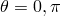
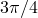
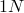
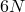
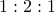
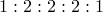
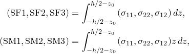
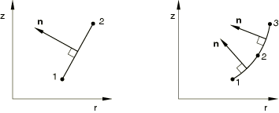

# 29.6.10 具有非线性非对称变形的轴对称壳单元

**产品：** Abaqus/Standard

##### **参考资料**

- ["壳单元：概述，" 第29.6.1节](pt06ch29s06abo27.md)
- ["选择壳单元，" 第29.6.2节](pt06ch29s06alm16.md)
- [*NODAL THICKNESS](../key/key-link.md#usb-kws-mnodalthickness)
- [*SHELL GENERAL SECTION](../key/key-link.md#usb-kws-mshellgensect)
- [*SHELL SECTION](../key/key-link.md#usb-kws-mshellsection)

### 概述

本节提供 Abaqus/Standard 中可用具有非线性非对称变形的轴对称壳单元的参考。对于预期轴对称变形的轴对称参考几何形状，请使用常规轴对称单元（见["轴对称壳单元库，" 第29.6.9节](pt06ch29s06ael19.md)）。对于预期非轴对称变形且厚度与特征半径比高或需要厚度方向细节的轴对称参考几何形状，请使用CAXA型单元（见["具有非线性非对称变形的轴对称实体单元，" 第28.1.7节](pt06ch28s01ael06.md)）。

### 约定

坐标1是*r*，坐标2是*z*。*r*方向对应于平面中的全局*X*方向和平面中的全局*Y*方向，*z*方向对应于全局*Z*方向。坐标1应大于或等于零。

自由度1是，自由度2是，自由度6是*r*–*z*平面内的旋转。

尽管在处的*r*–*z*平面对称允许对初始轴对称结构的一半进行建模，但载荷必须指定为完整轴对称体上的总载荷。例如，考虑承受单位均匀轴向力的圆柱壳。要在具有四个模式的SAXA单元上产生单位载荷，在、、、和处的节点力分别为1/8、1/4、1/4、1/4和1/8。

子午线方向是*r*–*z*平面内与单元相切的方向；即子午线方向是绕对称轴旋转以生成完整三维体的线方向。

周向或环向方向是垂直于*r*–*z*平面的方向。

### 单元类型

| SAXA1*N* | 线性插值，傅里叶壳单元，在子午线方向有2个节点和*N*个傅里叶模式 |
| --- | --- |

| SAXA2*N* | 二次插值，傅里叶壳单元，在子午线方向有3个节点和*N*个傅里叶模式 |
| --- | --- |

##### 激活的自由度

1, 2, 6

关于正节点位移和旋转方向见图29.6.10-1。节点旋转与SAX单元一致；但是，正节点旋转在负方向。

**图29.6.10-1** 单元坐标系和正位移/旋转方向。显示SAXA22单元。


##### 附加解变量

SAXA单元有个与(、、)相关的变量。

SAXA单元有个与(、、)相关的变量。

### 所需的节点坐标

*r*、*z*（在的*r*–*z*平面中给出）

可以节点数据中或通过用户指定的法线定义（见["节点处的法线定义，" 第2.1.4节](pt01ch02s01aus08.md)）指定节点法线场的两个方向余弦和。

### 单元属性定义

如果使用通用壳截面且直接给出截面刚度矩阵，则应指定完整的6×6截面刚度（即，与三维壳相同的21个常数）。

| **输入文件用法：** | 使用以下任一选项： |
| --- | --- |
|  | ``` [*SHELL SECTION](../key/key-link.md#usb-kws-mshellsection) [*SHELL GENERAL SECTION](../key/key-link.md#usb-kws-mshellgensect) ``` 此外，对变厚度壳使用以下选项： ``` [*NODAL THICKNESS](../key/key-link.md#usb-kws-mnodalthickness) ``` |

### 基于单元的载荷

### 分布载荷

分布载荷如["分布载荷，" 第34.4.3节](pt07ch34s04aus122.md)中所述进行指定。

分布载荷幅度为单位面积或单位体积。不需要乘以乘以半径。

**载荷 ID (*DLOAD*)：** BX
**单位：** [FL3](../popups/usb-int-iconventions-unitsym.md)
**描述：** 全局*X*方向单位体积体力。

**载荷 ID (*DLOAD*)：** BZ
**单位：** [FL3](../popups/usb-int-iconventions-unitsym.md)
**描述：** 全局*Z*方向单位体积体力。

**载荷 ID (*DLOAD*)：** BXNU
**单位：** [FL3](../popups/usb-int-iconventions-unitsym.md)
**描述：** 全局*X*方向非均匀体力，幅度通过用户子程序[`DLOAD`](../sub/sub-link.md#sub-xsl-dload)提供。

**载荷 ID (*DLOAD*)：** BZNU
**单位：** [FL3](../popups/usb-int-iconventions-unitsym.md)
**描述：** 全局*Z*方向非均匀体力，幅度通过用户子程序[`DLOAD`](../sub/sub-link.md#sub-xsl-dload)提供。

**载荷 ID (*DLOAD*)：** HP
**单位：** [FL2](../popups/usb-int-iconventions-unitsym.md)
**描述：** 壳表面上的静水压力，在全局*Z*方向线性变化。

**载荷 ID (*DLOAD*)：** P
**单位：** [FL2](../popups/usb-int-iconventions-unitsym.md)
**描述：** 壳表面上的压力。

**载荷 ID (*DLOAD*)：** PNU
**单位：** [FL2](../popups/usb-int-iconventions-unitsym.md)
**描述：** 壳表面上幅度通过用户子程序[`DLOAD`](../sub/sub-link.md#sub-xsl-dload)提供的非均匀压力。

### 单元输出

关于的数值积分使用梯形规则。在单元中有等间距的积分平面，包括和平面，其中*N*是傅里叶模式数。因此，在周向方向施加的压力载荷对应的径向节点力在该方向上分布，1傅里叶模式单元为，2傅里叶模式单元为，4傅里叶模式单元为。这些相容节点力的和等于施加压力在完整圆周上的积分()。

#### 应力、应变和其他张量分量

对于具有位移自由度的单元，应力和其他张量（包括应变张量）可用。所有张量具有相同的分量。例如，应力分量如下：

| S11 | 子午线应力。 |
| --- | --- |

| S22 | 环向（周向）应力。 |
| --- | --- |

| S12 | 局部12剪切应力（在和处为零）。 |
| --- | --- |

#### 截面力

| SF1 | 局部1方向单位宽度直接膜力。 |
| --- | --- |

| SF2 | 局部2方向单位宽度直接膜力。 |
| --- | --- |

| SF3 | 局部1-2平面单位宽度剪切膜力。 |
| --- | --- |

| SF4 | 厚度方向积分应力；始终为零。 |
| --- | --- |

| SM1 | 关于局部2轴单位宽度弯矩。 |
| --- | --- |

| SM2 | 关于局部1轴单位宽度弯矩。 |
| --- | --- |

| SM3 | 局部1-2平面单位宽度扭矩。 |
| --- | --- |

#### 截面应变

| SE1 | 局部1方向直接膜应变。 |
| --- | --- |

| SE2 | 局部2方向直接膜应变。 |
| --- | --- |

| SE3 | 局部1-2平面剪切膜应变。 |
| --- | --- |

| SE4 | 厚度方向应变。 |
| --- | --- |

| SK1 | 局部1方向弯曲应变。 |
| --- | --- |

| SK2 | 局部2方向弯曲应变。 |
| --- | --- |

| SK3 | 局部1-2平面扭曲应变。 |
| --- | --- |

给定层厚度*h*的法向基方向单位长度的截面力和弯矩结果可以相对于该基定义为：



其中是参考表面从中面的偏移。

局部方向在["定义常规壳单元的初始几何形状，" 第29.6.3节](pt06ch29s06alm17.md)中定义。

#### 当前壳厚度

| STH | 当前壳厚度。 |
| --- | --- |

### 单元上的节点排序

每个单元的第一个发生器平面（）中的节点排序如下所示。您可以像SAX1和SAX2单元一样在发生器平面中指定节点线或曲线。必须为每个单元定义*N*个更多的节点平面，其中*N*是所使用的傅里叶模式数。Abaqus/Standard将通过向第一平面中指定的节点添加恒定偏移值来生成这些附加周向节点并对其进行编号（见["单元定义，" 第2.2.1节](pt01ch02s02aus11.md)）。


