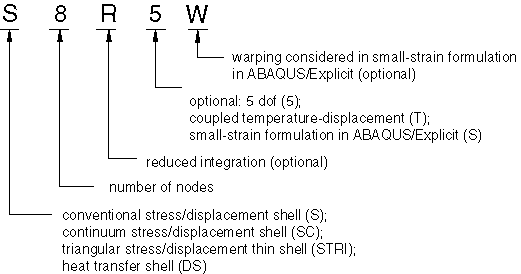
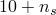
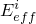
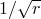

# 29.6.2 选择壳单元

**产品：** Abaqus/Standard  Abaqus/Explicit  Abaqus/CAE

##### **参考资料**

- ["壳单元：概述，" 第29.6.1节](pt06ch29s06abo27.md)
- ["三维常规壳单元库，" 第29.6.7节](pt06ch29s06ael17.md)
- ["连续体壳单元库，" 第29.6.8节](pt06ch29s06ael18.md)
- ["轴对称壳单元库，" 第29.6.9节](pt06ch29s06ael19.md)
- ["具有非线性非对称变形的轴对称壳单元，" 第29.6.10节](pt06ch29s06ael20.md)
- ["创建均质壳截面，" Abaqus/CAE用户指南第12.13.6节](../usi/usi-link.md#usi-prp-section-homogeneous-shell)
- ["创建复合壳截面，" Abaqus/CAE用户指南第12.13.7节](../usi/usi-link.md#usi-prp-section-composite-shell)

### 概述

Abaqus/Standard壳单元库包括：
- 三维壳几何形状的单元；
- 具有轴对称变形的轴对称几何形状的单元；
- 具有关于一个平面对称的一般变形的轴对称几何形状的单元；
- 用于应力/位移、热传递和完全耦合温度-位移分析的单元；
- 通用单元，以及专门适用于"厚"或"薄"壳分析的单元；
- 使用减少积分或完全积分的通用、三维、一阶单元；
- 考虑有限膜应变的单元；
- 在可能时使用每个节点五个自由度的单元，以及始终在每个节点使用六个自由度的单元；和
- 连续体壳单元。

Abaqus/Explicit壳单元库包括：
- 用于建模"厚"或"薄"壳的三维通用单元，考虑有限膜应变；
- 小应变单元；
- 完全耦合温度-位移分析单元；
- 用于具有轴对称变形的轴对称几何形状的单元；和
- 连续体壳单元。

### 命名约定

壳单元的命名约定取决于单元维度。

#### 三维壳单元

Abaqus中的三维壳单元命名如下：



例如，S4R是四节点、四边形、减少积分、大应变公式的应力/位移壳单元；SC8R是八节点、四边形、一阶插值、应力/位移连续体壳单元，减少积分。

#### 轴对称壳单元

Abaqus中的轴对称壳单元命名如下：


例如，DSAX1是一阶插值的轴对称热传递壳单元。

### 常规应力/位移壳单元

Abaqus中的常规应力/位移壳单元可用于三维或轴对称分析。在Abaqus/Standard中，它们使用线性或二次插值并允许机械和/或热（解耦）载荷；在Abaqus/Explicit中，它们使用线性插值并允许机械载荷。这些单元可用于静态或动态过程。一些单元包括横向剪切变形和厚度变化的影响，而其他单元则没有。一些单元允许大旋转和有限膜变形，而其他单元允许大旋转但小应变。

#### 应力/位移壳单元中温度和场变量的插值

用于计算热应力的壳表面积分位置处的温度值取决于使用一阶还是二阶单元。线性单元在积分位置使用平均温度，使得热应变在整个壳表面为常数。在高阶壳单元中使用线性变化的温度分布。应力/位移壳单元中的场变量与温度以相同方式插值。

### 应力/位移连续体壳单元

Abaqus中的应力/位移连续体壳单元可用于三维分析。连续体壳对整个三维物体进行离散化，不像常规壳那样对参考表面进行离散化（见["壳单元：概述，" 第29.6.1节](pt06ch29s06abo27.md)）。这些单元只有位移自由度，使用线性插值，允许静态和动态过程的机械和/或热（解耦）载荷。连续体壳单元是通用壳，允许有限膜变形和大旋转，因此适用于非线性几何分析。这些单元包括横向剪切变形和厚度变化的影响。

连续体壳单元采用一阶层合复合材料理论，并从初始弹性模量估计沿厚度的截面力。与常规壳不同，连续体壳单元可以堆叠以提供更精细的沿厚度响应。堆叠连续体壳单元允许更丰富的横向剪切应力和力预测。

虽然连续体壳单元对三维物体进行离散化，但应特别注意验证这些单元所承受的整体变形是否与其层合平面应力假设一致；即，响应由弯曲主导，没有观察到显著的厚度变化（即，大约小于10%的厚度变化）。否则，应使用常规三维实体单元（["三维实体单元库，" 第28.1.4节](pt06ch28s01ael03.md)）。此外，厚度应变模式可能会为Abaqus/Explicit中的薄连续体壳单元产生小的稳定时间增量（见["壳截面行为，" 第29.6.4节](pt06ch29s06alm18.md)）。

### 耦合温度-位移连续体壳单元

Abaqus中的耦合温度-位移连续体壳单元具有连续体壳几何形状，对几何形状和位移使用线性插值。温度也是线性插值的。热公式类似于使用减少积分的三维耦合温度-位移实体单元所使用的公式，其中温度变化是三线性的（见["实体（连续体）单元，" 第28.1.1节](pt06ch28s01alm01.md)）。沿厚度在截面点处的温度从节点处的温度线性插值。

### 热传递壳单元

这些单元仅在Abaqus/Standard中可用，且仅适用于常规壳单元几何形状，旨在对壳型结构中的热传递进行建模。它们在每个壳节点沿厚度在多个点提供温度值。此输出可直接输入等效应力分析壳单元进行顺序耦合热应力分析（["顺序耦合热应力分析，" 第16.1.2节](pt04ch16s01at39.md)）。

#### 沿壳厚度的温度变化

温度变化假定沿厚度为分段二次函数，而壳参考表面上的插值与相应应力单元相同。对于分析过程中积分的壳截面（["使用分析过程中积分的壳截面定义截面行为，" 第29.6.5节](pt06ch29s06alm19.md)），您可以指定用于截面积分和每个节点处厚度方向温度插值的截面点数。沿壳厚度只能使用Simpson规则进行积分。

壳底面（沿壳法线负方向的表面——见["定义常规壳单元的初始几何形状，" 第29.6.3节](pt06ch29s06alm17.md)）上的温度是自由度11。顶面上的温度是自由度。一个节点最多可以有20个温度自由度。对于单层壳，是沿壳截面使用的积分点总数。如果使用单个截面点进行截面积分，则沿壳厚度没有温度变化，整个壳截面的温度是自由度11。对于多层壳，每层顶部的温度与下一层底部的温度相同。因此，


其中（ > 1）是第*l*层中使用的积分点数。如果=1，等于复合层数。在这种情况下，沿壳厚度没有温度变化，整个复合材料的温度是自由度11。壳的内能存储和热传导项的积分方式与相应连续体单元相同（见["实体（连续体）单元，" 第28.1.1节](pt06ch28s01alm01.md)）。

#### 在热应力分析中使用壳

要将在Abaqus/Standard结果文件中保存的温度直接用作热应力分析的输入，热传递和应力分析模型中的网格以及壳截面中温度点的规格必须相同。此外，多层热传递壳单元必须在每一层中具有相同的积分点数。

### 耦合温度-位移壳单元

Abaqus中可用的耦合温度-位移壳单元具有常规壳单元几何形状，对几何形状和位移使用线性或二次插值。温度从角或端节点线性插值；二次壳中的较低阶温度插值被选择为给出与总应变相同的热应变插值阶数（与温度成比例）。控制方程中的所有项都在壳的参考表面上使用常规高斯方案进行积分；沿壳厚度使用Simpson规则进行积分。

#### 沿壳厚度的温度变化

沿壳厚度的温度变化假定为分段二次函数，并从沿厚度在每个节点的多个点处的温度插值。在每个节点使用的温度值数量由您在壳截面定义中指定的积分点数量决定（见["定义壳截面积分"中的"使用分析过程中积分的壳截面定义截面行为，" 第29.6.5节](pt06ch29s06alm19.md#usb-elm-eusingshellsection-intpt)）。最多20个温度值存储为自由度11、12、13等（高达自由度30），方式与热传递壳单元使用的相同（见上文["热传递壳单元"](pt06ch29s06alm16.md#usb-elm-eshellheattransfer)")。

### "厚"与"薄"常规壳单元

Abaqus包括通用常规壳单元以及适用于厚壳和薄壳问题的常规壳单元。有关什么是"厚"或"薄"壳问题的讨论见下文。此概念仅与具有位移自由度的单元相关。

通用常规壳单元为大多数应用提供稳健和准确的解决方案，将用于大多数应用。然而，在某些情况下，对于Abaqus/Standard中的特定应用，使用厚或薄常规壳单元可以获得更好的性能；例如，如果只发生小应变且需要每个节点五个自由度。

连续体壳单元可用于任何厚度；然而，薄连续体壳单元可能在Abaqus/Explicit中产生小的稳定时间增量。

#### 通用常规壳单元

这些单元允许横向剪切变形。当壳厚度增加时它们使用厚壳理论，当厚度减少时它们变成离散Kirchhoff薄壳单元；随着壳厚度减少，横向剪切变形变得非常小。

单元类型S3/S3R、S3RS、S4、S4R、S4RS、S4RSW、SAX1、SAX2、SAX2T、SC6R和SC8R是通用壳。

#### 厚常规壳单元

在Abaqus/Standard中，在横向剪切柔韧性重要且需要二次插值的情况下，需要厚壳。当壳厚度均匀时，当厚度大于表面特征长度（如静态情况下支撑之间的距离或动态分析中显著自然模态的波长）的约1/15时，就会发生这种情况。

Abaqus/Standard提供单元类型S8R和S8RT，仅用于厚壳问题。

#### 薄常规壳单元

在Abaqus/Standard中，在横向剪切柔韧性可忽略且必须准确满足Kirchhoff约束的情况下，需要薄壳（即使壳法线保持垂直于壳参考表面）。对于均质壳，当厚度小于表面特征长度（如支撑之间的距离或显著特征模态的波长）的约1/15时，就会发生这种情况。然而，厚度可能大于元素长度的1/15。

Abaqus/Standard有两种薄壳单元：一种求解薄壳理论（解析满足Kirchhoff约束），另一种随着厚度减小收敛到薄壳理论（数值满足Kirchhoff约束）。
- 求解薄壳理论的单元是STRI3。STRI3在节点处有六个自由度，是一个平坦的 facets 单元（忽略初始曲率）。如果STRI3用于建模厚壳问题，该单元将始终预测薄壳解决方案。
- 数值满足Kirchhoff约束的单元是S4R5、STRI65、S8R5、S9R5、SAXA1*n*和SAXA2*n*。这些单元不应在横向剪切变形重要的应用中使用。如果这些单元用于建模厚壳问题，单元可能会预测不准确的结果。

### 有限应变与小应变壳单元

Abaqus同时具有有限应变和小应变壳单元。此概念仅与具有位移自由度的单元相关。

#### 有限应变壳单元

单元类型S3/S3R、S4、S4R、SAX1、SAX2、SAX2T、SAXA1*n*和SAXA2*n*考虑有限膜应变和任意大旋转；因此，它们适用于大应变分析。底层公式在["轴对称壳单元，" Abaqus理论指南第3.6.2节](../stm/stm-link.md#stm-elm-axishells)；["有限应变壳单元公式，" Abaqus理论指南第3.6.5节](../stm/stm-link.md#stm-elm-finitestrainshells)；和["允许非对称载荷的轴对称壳单元，" Abaqus理论指南第3.6.7节](../stm/stm-link.md#stm-elm-axiasymmshells)中描述。

连续体壳单元SC6R和SC8R考虑有限膜应变、任意大旋转，并允许厚度变化，使其适用于大应变分析。厚度的变化基于单元节点位移计算，而这些位移又基于在分析开始时定义的有效弹性模量计算。

#### 小应变壳单元

在Abaqus/Standard中，三维"厚"和"薄"单元类型STRI3、S4R5、STRI65、S8R、S8RT、S8R5和S9R5提供任意大旋转，但只有小应变。在这些单元中忽略变形的厚度变化。

在Abaqus/Explicit中，单元类型S3RS、S4RS和S4RSW适用于具有小膜应变和任意大旋转的壳问题。许多冲击动力学分析属于这类问题，包括经历大规模屈曲行为但相对较小的膜拉伸和压缩的壳结构。虽然随着膜应变变大，解决方案精度可能会下降，但Abaqus/Explicit中的小应变壳单元为适当的应用提供了计算效率更高的替代方案。底层公式在["Abaqus/Explicit中的小应变壳单元，" Abaqus理论指南第3.6.6节](../stm/stm-link.md#stm-elm-smallstrainshells)中描述。

#### 壳厚度变化

厚度变化仅在几何非线性分析中考虑。对于常规壳，厚度方向的应力为零，应变仅来自泊松效应。对于连续体壳，厚度方向的应力可能不为零，可能导致超出泊松效应引起的额外应变。泊松效应引起的厚度应变被称为"泊松应变"，超出"泊松应变"的任何额外应变被称为"有效厚度应变"。

对于在分析过程中通过积分截面定义的Abaqus/Explicit中的壳单元，泊松应变通过在截面中的各个材料点强制执行平面应力条件来计算，然后从这些材料点积分泊松应变，或者使用"截面泊松比"在整个截面的积分站计算。对于Abaqus/Standard中的壳单元，仅截面泊松比方法可用。对于由通用壳截面定义的壳单元，仅截面泊松比方法适用。

有关详细信息，请参阅["使用分析过程中积分的壳截面定义截面行为"中的"定义壳单元厚度方向的泊松应变，" 第29.6.5节](pt06ch29s06alm19.md#usb-elm-eusingshellsection-poiss)，和["使用通用壳截面定义截面行为"中的"定义壳单元厚度方向的泊松应变，" 第29.6.6节](pt06ch29s06alm20.md#usb-elm-eusingshellgensect-poiss)。

#### 连续体壳单元的厚度方向应力

厚度方向应力通过用恒定"厚度模量"惩罚有效厚度应变来计算。对于具有弹性或弹塑性材料的单层壳单元，使用的厚度模量是面内弹性剪切模量的两倍。对于复合壳，如果每层是弹性或弹塑性材料，厚度模量计算为各层贡献的厚度加权调和平均：


其中是厚度模量，是层索引，是层数，是层的相对厚度，是初始配置中基于层材料定义的面内弹性剪切模量的两倍。

有关详细信息，请参阅["使用分析过程中积分的壳截面定义截面行为"中的"定义连续体壳单元的厚度模量，" 第29.6.5节](pt06ch29s06alm19.md#usb-elm-eusingshellsection-thick-cont)，和["使用通用壳截面定义截面行为"中的"定义连续体壳单元的厚度模量，" 第29.6.6节](pt06ch29s06alm20.md#usb-elm-eusingshellgensect-thick-cont)。

### 五自由度壳与六自由度壳

Abaqus/Standard中提供了两种三维常规壳单元：一种在可能时使用五个自由度（三个位移分量和两个面内旋转分量），另一种在所有节点使用六个自由度（三个位移分量和三个旋转分量）。

使用五个自由度（S4R5、STRI65、S8R5、S9R5）的单元可能更经济。然而，它们仅作为"薄"壳可用（不能用作"厚"壳），不能用于有限应变应用（尽管它们精确地建模大旋转小应变）。此外，五自由度壳单元的输出受到以下限制：
- 在使用两个面内旋转分量的节点处，这些面内旋转分量的值不可用于输出。
- 当请求输出变量NFORC时，与面内旋转对应的弯矩不可用于输出。

当使用五自由度壳单元时，Abaqus/Standard将在任何具有以下情况的节点自动切换为使用三个全局旋转分量：
- 有施加到旋转自由度的运动边界条件，
- 用于涉及旋转自由度的多点约束（["一般多点约束，" 第35.2.2节](pt08ch35s02aus130.md)），
- 与使用所有节点上三个全局旋转分量的梁单元或壳单元共享，
- 位于壳上的折叠线（即，具有不同表面法线的壳汇聚的线），或
- 承受弯矩载荷。

在所有在所有节点使用三个全局旋转分量的单元中（在如上所述激活或始终存在的情况下），在任何表面假定为连续弯曲的节点处存在奇异性：使用三个旋转分量，但只有两个与刚度主动相关。为了避免此困难，将小刚度与关于法线的旋转相关联。使用的默认刚度值足够小，使得人工能量内容可以忽略不计。在某些罕见情况下，可能需要更改此刚度。您可以定义此刚度的缩放因子，如["使用分析过程中积分的壳截面定义截面行为，" 第29.6.5节](pt06ch29s06alm19.md)和["使用通用壳截面定义截面行为，" 第29.6.6节](pt06ch29s06alm20.md)中所述。

### 减少积分

Abaqus中的许多壳单元类型使用减少（低阶）积分来形成单元刚度。质量矩阵和分布载荷仍然精确积分。减少积分通常提供更准确的结果（前提是单元没有变形或面内弯曲载荷），并显著减少运行时间，尤其是在三维中。

当将减少积分与一阶（线性）单元一起使用时，需要沙漏控制。因此，在使用一阶减少积分单元时，必须检查是否发生沙漏；如果发生，可能需要更细的网格或将集中载荷分布在多个节点上。Abaqus/Standard中可用的二阶减少积分单元通常没有相同的困难，推荐在解决方案预期平滑的情况下使用。建议在预期大应变或非常高应变梯度的情况下使用一阶单元。

### 为壳单元指定截面控制

在Abaqus/Standard中，您可以为壳单元指定非默认沙漏控制参数。在Abaqus/Explicit中，您可以指定单元公式中的二阶精度，为S4R、S4RS和S4RSW单元指定非默认沙漏控制参数，或停用S3RS和S4RS单元的钻孔约束。有关更多信息，请参阅["截面控制，" 第27.1.4节](pt06ch27s01aus113.md)。

| **输入文件用法：** | 在Abaqus/Standard中使用以下选项： |
| --- | --- |
|  | ``` [*SHELL SECTION](../key/key-link.md#usb-kws-mshellsection) or [*SHELL GENERAL SECTION](../key/key-link.md#usb-kws-mshellgensect) [*HOURGLASS STIFFNESS](../key/key-link.md#usb-kws-mhourglasstiff) ``` 在Abaqus/Explicit中使用以下选项之一： ``` [*SHELL SECTION](../key/key-link.md#usb-kws-mshellsection), CONTROLS=*name* [*SHELL GENERAL SECTION](../key/key-link.md#usb-kws-mshellgensect), CONTROLS=*name* ``` |

| **Abaqus/CAE用法：** | 网格模块：****Mesh****Element Type****：**Element Controls** |
| --- | --- |

### 建模问题

使用壳单元时必须考虑许多建模问题。

#### 使用S3/S3R和S3RS单元

S3和S3R都指相同的3节点三角形壳单元。这是与S4R完全兼容的S4R的退化版本，在Abaqus/Standard中与S4也完全兼容。

S3RS在Abaqus/Explicit中可用，是S4RS的退化版本，与S4RS完全兼容。

S3/S3R和S3RS在大多数载荷情况下提供准确的结果。然而，由于其恒定弯曲和膜应变近似，可能需要高网格细化来捕获纯弯曲变形或涉及高应变梯度的问题的解决方案。退化单元公式的结果是当单元连接被置换时解决方案会略有变化。

#### 退化单元

单元类型S4、S4R、S4R5、S4RS、S8R5和S9R5可以退化为三角形。然而，对于S4（退化为三角形的S4单元可能在膜变形中表现出过度刚硬响应）、S4R和S4RS，建议改用S3R和S3RS。

四分之一技术（将中间节点移动到四分之一点以产生弹性断裂力学应用的奇异性）可用于二次单元类型S8R5和S9R5（见["单元定义，" 第2.2.1节](pt01ch02s02aus11.md)）。当单元退化为三角形时，单元精度会显著降低；因此，除了 fracture 等特殊应用外，这*不*推荐。

单元类型S8R和S8RT不能退化为三角形。单元类型DS4和DS8可以退化为三角形，但建议改用DS3和DS6。

#### 使用连续体壳单元建模

从建模的角度来看，连续体壳单元类似于连续体实体。SC6R和SC8R单元的单元几何形状分别是三角形棱柱和六面体，只有位移自由度。

必须正确定向连续体壳单元，因为这些单元具有相关的厚度方向。有关单元连接和方向的更多详细信息，请参阅["壳单元：概述，" 第29.6.1节](pt06ch29s06abo27.md)。

当分析经典壳结构（仅提供中面几何形状和运动约束的结构）时，必须注意确保指定适当的弯矩和旋转。例如，弯矩可以作为力-力偶系统施加到顶面和底面上相应的节点。可以通过运动约束指定旋转边界条件，以在连续体壳边缘产生适当的位移边界条件。

连续体壳单元可以直接连接到一阶连续体实体，而不需要任何运动过渡。当常规壳单元连接到连续体壳单元时，需要适当的运动过渡以正确传递常规壳参考表面处的弯矩/旋转。这种过渡可以用壳到实体耦合约束或任何其他运动约束（如基于表面的耦合约束、多点约束或线性约束方程）来定义。

##### 使用SC6R单元

SC6R单元是SC8R单元的退化版本。SC6R单元在大多数载荷情况下提供准确的结果。然而，由于其恒定弯曲和膜应变近似，可能需要高网格细化来捕获纯弯曲变形或涉及高应变梯度的问题的解决方案。

##### 使用连续体壳单元建模接触

连续体壳单元SC6R和SC8R允许两侧接触和厚度变化，因此适用于建模接触。

##### Abaqus/Explicit中的稳定时间增量

在Abaqus/Explicit中，单元稳定时间增量可以由连续体壳单元厚度控制，特别对于薄壳应用。这可能会显著增加完成分析所需的增量数，与使用常规壳单元建模的相同问题相比。当适当时，通过指定厚度方向的较低刚度可以缓解小的稳定时间增量大小。

##### 连续体壳单元的限制

连续体壳单元不能与超泡沫材料定义一起使用，也不能与直接提供截面刚度的通用壳截面一起使用。

#### 建模"三明治"壳

对于"三明治"壳，其中部分横截面由较软材料制成（特别是当层是非各向同性的，使得某些层在特定方向上较弱），即使壳相当薄，横向剪切柔韧性也可能很重要。建议在这种情况下使用通用壳单元或堆叠连续体壳单元。有关壳单元中横向剪切刚度的讨论，请参阅["壳截面行为，" 第29.6.4节](pt06ch29s06alm18.md)。

#### 在Abaqus/Standard中建模薄曲壳的弯曲

在Abaqus/Standard中，曲单元（STRI65、S8R5、S9R5）更适合于建模薄曲壳的弯曲。

单元类型STRI3是一个平坦 facet 单元。如果使用此单元对曲壳进行弯曲建模，可能需要密集网格来获得准确的结果。

#### 在Abaqus/Standard中建模双曲壳的屈曲

由于内部定义的中心节点可能不在实际壳表面上，单元类型S8R5可能对双曲壳的屈曲问题给出不准确的结果。应改用单元类型S9R5。

#### 在接触分析中使用S8R5

如果接触对中的从表面附着到单元，则单元类型S8R5会自动转换为单元类型S9R5。

#### 对S9R5单元施加弯矩

不应将弯矩施加到S9R5单元的中心节点。

#### 使用S4单元

S4是一个完全积分的通用、有限膜应变壳单元。单元的膜响应使用假设应变公式处理，对面内弯曲问题给出准确解决方案，对单元变形不敏感，避免寄生锁定。

S4单元在膜或弯曲响应中都没有沙漏模式；因此，单元不需要沙漏控制。单元每个单元有四个积分位置，而S4R只有一个积分位置，这使得单元计算成本更高。S4与S4R和S3R兼容。S4可用于易受膜或弯曲模式沙漏影响的问题、需要更高解决方案精度的问题或预期面内弯曲的问题。在所有这些情况下，S4将优于S4R。S4不能与Abaqus/Standard中的超弹性或超泡沫材料定义一起使用。
