# 29.6.4 壳截面行为

**产品：** Abaqus/Standard  Abaqus/Explicit  Abaqus/CAE

##### **参考资料**

- ["壳单元：概述，" 第29.6.1节](pt06ch29s06abo27.md)
- ["使用分析过程中积分的壳截面定义截面行为，" 第29.6.5节](pt06ch29s06alm19.md)
- ["使用通用壳截面定义截面行为，" 第29.6.6节](pt06ch29s06alm20.md)
- [*SHELL GENERAL SECTION](../key/key-link.md#usb-kws-mshellgensect)
- [*SHELL SECTION](../key/key-link.md#usb-kws-mshellsection)
- ["创建均质壳截面，" Abaqus/CAE用户指南第12.13.6节](../usi/usi-link.md#usi-prp-section-homogeneous-shell)
- ["创建复合壳截面，" Abaqus/CAE用户指南第12.13.7节](../usi/usi-link.md#usi-prp-section-composite-shell)

### 概述

壳截面行为：
- 可能需要或不需要沿截面进行数值积分；
- 可以是线性的或非线性的；和
- 可以是均质的或由不同材料的层组成的。

### 定义壳截面行为的方法

提供了两种方法来定义壳的横截面行为。
- 可以通过使用通用壳截面来定义线性弯矩-弯曲和力-膜应变关系（见["使用通用壳截面定义截面行为，" 第29.6.6节](pt06ch29s06alm20.md)）。在这种情况下，所有计算都以截面力和弯矩进行。在Abaqus/Standard中，当直接给出截面特性时（即，截面不与一个或多个材料定义相关联），应变和应力不可用于输出。但是，当通过一个或多个弹性材料层指定截面特性时，可以在请求输出时获取应变和应力。在Abaqus/Explicit中，只要使用通用壳截面，就无法在截面点输出应力和应变；只有截面力、截面弯矩和截面应变可用于输出。在Abaqus/Standard中，可以通过在用户子程序[`UGENS`](../sub/sub-link.md#sub-xsl-ugens)中结合使用通用壳截面来定义以力和弯矩表示的非线性截面行为。
- 或者，在分析过程中积分的壳截面（见["使用分析过程中积分的壳截面定义截面行为，" 第29.6.5节](pt06ch29s06alm19.md)）允许通过沿壳厚度进行数值积分来计算横截面行为，从而在材料建模中提供完全的通用性。使用这种类型的截面，可以沿厚度定义任意数量的材料点，材料响应可以从点到点变化。

通用壳截面和分析过程中积分的壳截面都允许使用不同材料的层，这些层可以以不同的方向放置在这些横截面上。在这些情况下，截面定义为每一层提供壳厚度、材料和方向。

对于常规壳单元，当截面特性由一个或多个材料层指定时，可以指定参考表面从壳中面的偏移。当直接给出截面特性时，不能直接指定偏移；但是，偏移可以隐式地包含在截面特性中。不能为连续体壳单元指定非零偏移。如果为连续体壳单元指定了非零偏移，则在输入文件预处理期间会发出错误消息。

### 确定是使用分析过程中积分的壳截面还是通用壳截面

当使用分析过程中积分的壳截面时（见["使用分析过程中积分的壳截面定义截面行为，" 第29.6.5节](pt06ch29s06alm19.md)），Abaqus使用沿壳厚度进行数值积分来计算截面特性。这种类型的壳截面通常与截面中的非线性材料行为一起使用。必须与提供热传递的壳一起使用，因为通用壳截面不允许定义热传递特性。

如果壳的响应是线弹性的且其行为不依赖于温度或预定义场变量的变化，则使用通用壳截面（见["使用通用壳截面定义截面行为，" 第29.6.6节](pt06ch29s06alm20.md)），或者如果在Abaqus/Standard中要以力和弯矩表示的非线性行为要在用户子程序[`UGENS`](../sub/sub-link.md#sub-xsl-ugens)中定义。

### 横向剪切刚度

对于所有使用横向剪切刚度的Abaqus/Standard壳单元和Abaqus/Explicit中的有限应变壳单元，横向剪切刚度通过将壳的剪切响应与三维实体的剪切响应相匹配来计算，适用于关于一个轴弯曲的情况。对于Abaqus/Explicit中的小应变壳单元，横向剪切刚度基于有效剪切模量。

#### Abaqus/Standard中壳单元和Abaqus/Explicit中有限应变壳单元的横向剪切刚度

在所有适用于厚壳问题的Abaqus/Standard壳单元中，或数值强制执行Kirchhoff约束的壳单元中（即，除STRI3外的所有壳单元）和Abaqus/Explicit中的有限应变壳单元（S3R、S4、S4R、SAX1、SC6R和SC8R），Abaqus通过将壳弯曲情况下的剪切响应与使用每层横向剪切应力的抛物线变化的情况进行匹配来计算横向剪切刚度。该方法在["复合壳中的横向剪切刚度和中面偏移，" Abaqus理论指南第3.6.8节](../stm/stm-link.md#stm-elm-transshearshells)中描述，通常提供对壳剪切柔性的合理估计。它还提供复合壳中层间剪切应力的估计。在计算横向剪切刚度时，Abaqus假定壳截面方向是主弯曲方向（关于一个主方向的弯曲不需要关于另一个方向的约束弯矩）。对于关于壳中面不对称的正交各向异性层，壳截面方向可能不是主弯曲方向。在这种情况下，横向剪切刚度是较近似的近似值，如果使用不同的壳截面方向会发生变化。Abaqus仅在分析开始时基于模型数据中给出的初始弹性特性计算横向剪切刚度。在分析过程中由于材料刚度变化而发生的任何横向剪切刚度变化都会被忽略。

轴对称壳单元SAX1和SAX2；三维壳单元S3/S3R、S4、S4R、S8R和S8RT；以及连续体壳单元SC6R和SC8R基于一阶剪切变形理论。其他壳单元——如S4R5、S8R5、S9R5、STRI65和SAXA*n*——使用横向剪切刚度在薄壳极限中数值强制执行Kirchhoff约束。横向剪切刚度与没有位移自由度的壳无关，也与单元类型STRI3无关。虽然S4单元类型有四个积分点，但横向剪切计算假定在单元上恒定。可以通过堆叠连续体壳单元获得更高的横向剪切分辨率。

对于大多数壳截面，包括层合复合或三明治壳截面，Abaqus将计算单元公式中所需的横向剪切刚度值。您可以覆盖这些默认值。在某些情况下，如果在输入预处理阶段无法获得剪切模量估计值，则不会计算默认剪切刚度值；例如，当材料行为由用户子程序[`UMAT`](../sub/sub-link.md#sub-xsl-umat)、[`UHYPEL`](../sub/sub-link.md#sub-xsl-uhypel)、[`UHYPER`](../sub/sub-link.md#sub-xsl-uhyper)或[`VUMAT`](../sub/sub-link.md#sub-xsl-vumat)定义时，或者在Abaqus/Standard中当截面行为在[`UGENS`](../sub/sub-link.md#sub-xsl-ugens)中定义时。在这种情况下，您必须定义横向剪切刚度。

##### 横向剪切刚度定义

剪切柔性壳单元截面的横向剪切刚度在Abaqus中定义为

其中

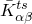

是截面剪切刚度分量（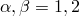指壳上默认表面方向，如["约定，" 第1.2.2节](pt01ch01s02aus02.md)所定义，或与壳截面定义相关的局部方向）；

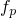

是一个无量纲因子，用于防止剪切刚度在薄壳中变得过大；和

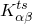

是截面的实际剪切刚度（由Abaqus计算或用户定义）。

您可以指定所有三个剪切刚度项（、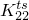和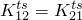）；否则，它们将采用下面定义的默认值。无论如何获得，无量纲因子始终包含在横向剪切刚度计算中。对于类型S4R5、S8R5、S9R5、STRI65或SAXA*n*的壳单元，使用和的平均值，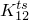被忽略。具有单位长度上的力。

无量纲因子定义为

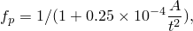

其中*A*是单元的面积，*t*是壳的厚度。当使用不与一个或多个材料定义相关联的通用壳截面定义来定义壳截面刚度时，壳的厚度*t*估计为

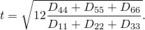

如果您不指定，则按以下方式计算。对于层合板和三明治结构，通过将壳截面的剪切变形相关的弹性应变能与基于沿截面的横向剪切应力分段二次变化的应变能相匹配来估计。对于非对称铺层，耦合项可以非零。

当使用通用壳截面且直接给出截面刚度时，定义为

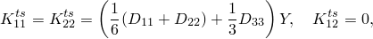

其中是截面刚度矩阵，*Y*是初始缩放模量。

当使用用户子程序（例如，[`UMAT`](../sub/sub-link.md#sub-xsl-umat)、[`UHYPEL`](../sub/sub-link.md#sub-xsl-uhypel)、[`UHYPER`](../sub/sub-link.md#sub-xsl-uhyper)或[`VUMAT`](../sub/sub-link.md#sub-xsl-vumat)）定义壳单元的材料响应时，您必须定义横向剪切刚度。适当刚度的定义取决于壳的材料组成和其铺层；即，材料如何沿横截面厚度分布。

横向剪切刚度应指定为壳对纯横向剪切应变的初始线性弹性刚度。对于由线性、正交各向同性弹性材料制成的均质壳，其中强材料方向与单元的局部1方向对齐，横向剪切刚度应为

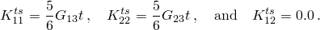

和是面外方向材料的剪切模量。数字5/6是剪切校正系数，源于将横向剪切能量与纯弯曲下三维结构的横向剪切能量相匹配。对于复合壳，剪切校正系数将与均质壳的值不同；有关Abaqus中如何获得弹性材料有效剪切刚度的讨论，请参阅["复合壳中的横向剪切刚度和中面偏移，" Abaqus理论指南第3.6.8节](../stm/stm-link.md#stm-elm-transshearshells)。

##### 检查使用壳理论的 validity

对于线弹性材料，细长比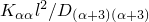（其中=1或2（不对求和），*l*是壳表面上的特征长度）可用作指导，以决定是否满足平面截面必须保持平面的假设，因此壳理论是足够的。一般来说，如果

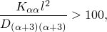

壳理论是足够的；对于较小的值，膜应变不会沿截面线性变化，壳理论可能不会给出足够准确的结果。特征长度*l*独立于单元长度，不应与单元的特征长度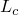混淆。

要获得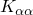和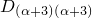，您必须使用复合通用壳截面定义运行数据检查分析。如果请求模型定义数据（见["输出"中的"控制写入数据文件的分析输入文件处理器信息量，" 第4.1.1节](pt02ch04s01aus38.md#usb-out-ooutput-data-control)），将打印在数据（`.dat`）文件中"TRANSVERSE SHEAR STIFFNESS FOR THE SECTION"标题下。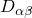将在"SECTION STIFFNESS MATRIX"标题下打印输出。

#### Abaqus/Explicit中小应变壳单元的横向剪切刚度

当使用分析过程中积分的壳截面时，Abaqus/Explicit中小应变壳的横向剪切应力假定在每一层中具有分段常数分布。横向剪切力将收敛到单层或多层各向同性截面以及单层正交各向同性截面的正确解决方案。对于多层正交各向同性截面，当壳变厚且主材料方向偏离主截面方向时，收敛到适当的横向剪切行为可能是近似的。如果需要复合壳分析中沿厚度横向剪切应力分布的准确结果，应将有限应变S4R单元与在分析过程中积分的壳截面一起使用。

当使用通用壳截面时，用于计算Abaqus/Explicit中小应变壳的横向剪切力的有限应变壳的相同横向剪切刚度。因此，对于这种情况，多层复合壳的横向剪切力将收敛到薄和厚截面的正确值。

### 弯曲应变度量

Abaqus中的大多数三维壳单元使用Koiter-Sanders壳理论弯曲应变度量的近似（见["壳单元概述，" Abaqus理论指南第3.6.1节](../stm/stm-link.md#stm-elm-shells)）。根据Koiter-Sanders理论，垂直于壳表面的位移场不产生任何弯矩。例如，圆柱的纯径向膨胀只会导致膜应力和应变——沿厚度没有变化，因此没有弯曲。这适用于线性弹性材料的增量应变度量和大变形问题。对于在Abaqus/Standard中用超弹性材料建模的轴对称壳单元是唯一的例外。在这种情况下，沿厚度可能发生膜应力和应变的变化。

### 复合截面的节点质量和旋转惯量

对于复合壳截面，Abaqus基于沿截面的平均密度（按层厚度加权）计算节点质量。使用此平均密度计算平均旋转惯量，就好像截面是均质的一样。因此，Abaqus不考虑质量的不对称分布：质心假定在壳的参考表面上。对于连续体壳，质量均等地分布到顶面和底面节点。
