# 29.6.6 使用通用壳截面定义截面行为

**产品：** Abaqus/Standard  Abaqus/Explicit  Abaqus/CAE

##### **参考资料**

- ["壳单元：概述，" 第29.6.1节](pt06ch29s06abo27.md)
- ["壳截面行为，" 第29.6.4节](pt06ch29s06alm18.md)
- ["UGENS，" Abaqus用户子程序参考指南第1.1.35节](../sub/sub-link.md#sub-rtn-uugens)
- [*DISTRIBUTION](../key/key-link.md#usb-kws-mdistribution)
- [*HOURGLASS STIFFNESS](../key/key-link.md#usb-kws-mhourglasstiff)
- [*SHELL GENERAL SECTION](../key/key-link.md#usb-kws-mshellgensect)
- [*TRANSVERSE SHEAR STIFFNESS](../key/key-link.md#usb-kws-mtransshearstiff)
- ["创建均质壳截面，" Abaqus/CAE用户指南第12.13.6节](../usi/usi-link.md#usi-prp-section-homogeneous-shell)
- ["创建复合壳截面，" Abaqus/CAE用户指南第12.13.7节](../usi/usi-link.md#usi-prp-section-composite-shell)
- ["创建通用壳刚度截面，" Abaqus/CAE用户指南第12.13.10节](../usi/usi-link.md#usi-prp-section-general-stiffness)
- [第23章，"复合铺层，" Abaqus/CAE用户指南](../usi/usi-link.md#usi-adv-layups)

### 概述

通用壳截面：
- 用于不需要沿壳厚度进行数值积分的情况；
- 可以与线性弹性材料行为相关联，或者在Abaqus/Standard中，可以调用用户子程序[`UGENS`](../sub/sub-link.md#sub-xsl-ugens)来以力和弯矩定义非线性截面属性；
- 可用于为一些更复杂几何形状建模等效壳截面（例如，用等效平滑板替换波纹壳进行整体分析）；和
- 不能与热传递和耦合温度-位移壳一起使用。

### 定义壳截面行为

通用壳截面可以按如下方式定义：
- 截面响应可以通过将截面与材料定义相关联来指定，或者对于复合壳，与几个不同的材料定义相关联。
- 可以直接指定截面属性。
- 在Abaqus/Standard中，截面响应可以在用户子程序[`UGENS`](../sub/sub-link.md#sub-xsl-ugens)中编程。

### 通过定义层（厚度、材料和方向）指定等效截面属性

您可以通过指定厚度、材料引用和截面方向来定义壳截面的机械响应，或者对于复合壳，定义其每一层的方向。Abaqus将确定等效截面属性。您必须将截面行为与模型的某个区域相关联。

线性弹性材料行为用材料定义（["材料数据定义，" 第21.1.2节](pt05ch21s01aus109.md)）定义，可能包含线性弹性行为（["线性弹性行为，" 第22.2.1节](pt05ch22s02abm02.md)）和热膨胀行为（["热膨胀，" 第26.1.2节](pt05ch26s01abm52.md)）。密度（["密度，" 第21.2.1节](pt05ch21s02abm01.md)）和阻尼（["材料阻尼，" 第26.1.1节](pt05ch26s01abm51.md)）行为也可以按如下所述指定；在Abaqus/Explicit中必须定义材料密度。但是，不能包含非线性材料属性（如塑性行为），因为Abaqus将预先计算截面响应，并且在分析过程中不会更新该响应。不允许线性弹性材料行为对温度或预定义场变量的依赖性。

壳截面响应由下式定义

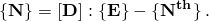

不包括模量的温度依赖性缩放。热应变引起的截面力和弯矩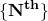随温度线性变化，由下式定义

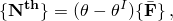

其中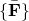是用户定义的热膨胀引起的完全约束单位温升产生的广义应力，是温度，是壳中该点的初始（无应力）温度（由作为初始条件给出的初始节点温度定义；见["Abaqus/Standard和Abaqus/Explicit中的初始条件"中的"定义初始温度，" 第34.2.1节](pt07ch34s02aus116.md#usb-prc-pinitialcond-temp)）。

#### 定义由单一线性弹性材料制成的壳

要定义由单一线性弹性材料制成的壳，您需要按上述方式引用材料定义（["材料数据定义，" 第21.1.2节](pt05ch21s01aus109.md)）的名称。可选地，您可以定义要与截面一起使用的方向定义（["方向定义，" 第2.2.5节](pt01ch02s02aus15.md)）。可以使用分布（["分布定义，" 第2.8.1节](pt01ch02s08aus26.md)）定义的空间变化局部坐标系分配给壳截面定义。此外，您需要在截面定义中指定壳厚度。对于连续体壳单元，指定的厚度用于估计某些截面属性（如沙漏刚度），这些属性稍后从单元几何形状计算。

您必须将此截面行为与模型的某个区域相关联。

您可以按单元逐个重新定义截面定义中指定的厚度、偏移、截面刚度和材料方向。见["分布定义，" 第2.8.1节](pt01ch02s08aus26.md)。

如果分配给壳截面定义的方向定义使用分布定义，则空间变化的局部坐标系将应用于与该壳截面关联的所有壳单元。任何未明确包含在关联分布中的壳单元都将应用默认局部坐标系（由分布定义）。

| **输入文件用法：** | ``` [*SHELL GENERAL SECTION](../key/key-link.md#usb-kws-mshellgensect), ELSET=*name*, MATERIAL=*name*, ORIENTATION=*name* ``` |
| --- | --- |
|  | 其中ELSET参数指的是一组壳单元。 |

| **Abaqus/CAE用法：** | 属性模块：**Create Section**：选择**Shell**作为截面**类别**和**Homogeneous**作为截面**类型**：**Section integration: Before analysis**；**Basic**：**Material:** *name*****Assign****Material Orientation****：选择区域****Assign****Section****：选择区域 |
| --- | --- |

#### 定义由不同线性弹性材料层组成的壳

您可以定义由不同线性弹性材料层组成的壳。可选地，您可以定义要与截面一起使用的方向定义（["方向定义，" 第2.2.5节](pt01ch02s02aus15.md)）。可以使用分布（["分布定义，" 第2.8.1节](pt01ch02s08aus26.md)）定义的空间变化局部坐标系分配给壳截面定义。

您指定层厚度、形成该层的材料名称（按如上所述）和方向角（以度为单位），相对于指定截面方向定义逆时针测量为正。可以使用分布（["分布定义，" 第2.8.1节](pt01ch02s08aus26.md)）在层上指定空间变化的方向角。如果指定截面方向的两个局部方向都不在壳表面上，则在截面方向投影到壳表面后应用。如果不指定截面方向，则相对于默认壳局部方向测量（见["约定，" 第1.2.2节](pt01ch01s02aus02.md)）。相对于壳法线正方向定义的层合壳层的顺序由指定层的顺序决定。

对于连续体壳单元，厚度由单元几何形状确定，对于给定截面定义可能在整个模型中变化。因此，指定的厚度仅是每一层的相对厚度。层的实际厚度是单元厚度乘以每层占总厚度的分数。层的厚度比不需要以物理单位给出，各层相对厚度的和也不需要等于一。指定的壳厚度用于估计某些截面属性（如沙漏刚度），这些属性稍后从单元几何形状计算。

可以使用分布（["分布定义，" 第2.8.1节](pt01ch02s08aus26.md)）在常规壳单元（而非连续体壳单元）的层上指定空间变化的厚度。用于定义层厚度的分布必须具有默认值。任何分配给壳截面但未在分布中明确分配值的壳单元都使用默认层厚度。

您必须将此截面行为与模型的某个区域相关联。

如果分配给壳截面定义的方向定义使用分布定义，则空间变化的局部坐标系将应用于与该壳截面关联的所有壳单元。任何未明确包含在关联分布中的壳单元都将应用默认局部坐标系（由分布定义）。

除非您的模型相对简单，否则随着层数的增加以及为不同区域分配不同截面，您会发现使用复合壳截面定义模型越来越困难。在添加新层或移除或重新定位现有层后重新定义截面也可能很麻烦。要管理典型复合模型中的大量层，您可能需要使用Abaqus/CAE中的复合铺层功能。有关更多信息，请参阅[Abaqus/CAE用户指南第23章，"复合铺层"](../usi/usi-link.md#usi-adv-layups)。

| **输入文件用法：** | ``` [*SHELL GENERAL SECTION](../key/key-link.md#usb-kws-mshellgensect), ELSET=*name*, COMPOSITE, ORIENTATION=*name* ``` |
| --- | --- |
|  | 其中ELSET参数指的是一组壳单元。 |

| **Abaqus/CAE用法：** | Abaqus/CAE使用复合铺层或复合壳截面来定义由不同线性弹性材料层组成的壳。 |
| --- | --- |
|  | 对于复合铺层使用以下选项：属性模块：**Create Composite Layup**：选择**Conventional Shell**或**Continuum Shell**作为**Element Type**：**Section integration: Before analysis**：指定方向、区域和材料 对于复合壳截面使用以下选项：属性模块：**Create Section**：选择**Shell**作为截面**类别**和**Composite**作为截面**类型**：**Section integration: Before analysis******Assign****Material Orientation****：选择区域****Assign****Section****：选择区域 |

### 直接为常规壳指定等效截面属性

您可以通过直接指定一般截面刚度和热膨胀响应（如下定义的、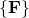、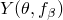和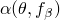）来定义截面的机械响应。由于此方法然后提供截面机械响应的完整规范，因此不需要材料引用。可选地，您可以定义，即热膨胀的参考温度。

您必须将此截面行为与模型的某个区域相关联。

在这种情况下，壳截面响应由下式定义

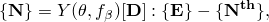

其中

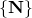

是壳截面上的力和弯矩（单位宽度膜力、单位宽度弯矩）；

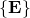

是壳中的广义截面应变（参考表面应变和曲率）；


是截面刚度矩阵；


是缩放模量，可用于引入截面刚度对温度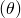和场变量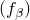的依赖性；和


是热应变引起的截面力和弯矩（单位宽度）。

壳中的这些热力和力矩根据公式

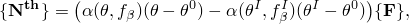

生成，其中


是缩放因子（"热膨胀系数"）；


是壳中该点的初始（无应力）温度，由作为初始条件给出的初始节点温度定义（["Abaqus/Standard和Abaqus/Explicit中的初始条件"中的"定义初始温度，" 第34.2.1节](pt07ch34s02aus116.md#usb-prc-pinitialcond-temp)）；和


是用户指定的完全约束单位温升引起的广义截面力和弯矩（单位宽度）。

如果热膨胀系数不是温度的函数，则不需要的值。请注意（用于定义的参考值）与无应力初始温度之间的区别。

在这些方程中，项的顺序是

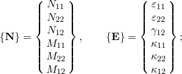

即，直接膜项首先出现，然后是剪切膜项，然后是直接和剪切弯曲项，总共六项。Abaqus使用剪切膜应变（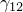）和扭曲（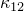）的工程测量。

这种定义壳截面属性的方法不能与变厚度壳或连续体壳单元一起使用。

有关更多信息，请参阅["层合复合壳：带圆孔圆柱面板的屈曲，" Abaqus例题指南第1.2.2节](../exa/exa-link.md#exa-sta-laminpanel)。

刚度矩阵可以定义为截面的恒定刚度，也可以通过引用分布（["分布定义，" 第2.8.1节](pt01ch02s08aus26.md)）定义为空间变化的刚度。如果使用空间变化的刚度，则分布必须具有定义的默认刚度。任何分配给壳截面但未在分布中明确分配值的壳单元都使用默认刚度。

| **输入文件用法：** | ``` [*SHELL GENERAL SECTION](../key/key-link.md#usb-kws-mshellgensect), ELSET=*name*, ZERO= ``` |
| --- | --- |
|  | 其中ELSET参数指的是一组壳单元。 |

| **Abaqus/CAE用法：** | 属性模块：**Create Section**：选择**Shell**作为截面**类别**和**General shell stiffness**作为截面**类型******Assign****Section****：选择区域 |
| --- | --- |

### 在用户子程序[`UGENS`](../sub/sub-link.md#sub-xsl-ugens)中指定截面属性

在Abaqus/Standard中，您可以在用户子程序[`UGENS`](../sub/sub-link.md#sub-xsl-ugens)中为截面响应可能非线性的更一般情况定义截面响应。如果截面非线性行为涉及几何和材料非线性（如可能由于截面坍塌而发生），则用户子程序[`UGENS`](../sub/sub-link.md#sub-xsl-ugens)特别有用。如果只存在非线性材料行为，则使用具有适当非线性材料模型的分析过程中积分的壳截面更简单。

您需要在截面定义中指定恒定截面厚度，或者按如下所述通过在节点处定义厚度来指定连续变化的厚度。即使截面的机械行为在用户子程序[`UGENS`](../sub/sub-link.md#sub-xsl-ugens)中定义，也需要壳截面厚度来计算沙漏控制刚度。您必须将此截面行为与模型的某个区域相关联。

Abaqus/Standard在每个增量每次迭代时为每个积分点调用用户子程序[`UGENS`](../sub/sub-link.md#sub-xsl-ugens)。子程序提供增量开始时的截面状态（截面力和弯矩；广义截面应变；解相关状态变量；温度；以及任何预定义场变量）；温度和预定义场变量的增量；广义截面应变增量；和时间增量。

子程序必须执行两个功能：它必须将力、弯矩和解相关状态变量更新到增量结束时的值；并且它必须提供截面刚度矩阵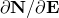。完整的截面响应，包括热膨胀效应，必须在用户子程序中编程。

您应确保在线性扰动分析中不使用或更改用户子程序[`UGENS`](../sub/sub-link.md#sub-xsl-ugens)中的应变增量。对于这种情况，该量是未定义的。

这种定义壳截面属性的方法不能与连续体壳单元一起使用。

| **输入文件用法：** | ``` [*SHELL GENERAL SECTION](../key/key-link.md#usb-kws-mshellgensect), ELSET=*name*, USER ``` |
| --- | --- |
|  | 其中ELSET参数指的是一组壳单元。 |

| **Abaqus/CAE用法：** | 用户子程序[`UGENS`](../sub/sub-link.md#sub-xsl-ugens)在Abaqus/CAE中不受支持。 |

#### 定义截面刚度矩阵是否对称

如果截面刚度矩阵不对称，您可以指定Abaqus/Standard应使用其非对称方程求解能力（见["定义分析，" 第6.1.2节](pt03ch06s01abo05.md)）。

| **输入文件用法：** | ``` [*SHELL GENERAL SECTION](../key/key-link.md#usb-kws-mshellgensect), ELSET=*name*, USER, UNSYMM ``` |

| **Abaqus/CAE用法：** | 用户子程序[`UGENS`](../sub/sub-link.md#sub-xsl-ugens)在Abaqus/CAE中不受支持。 |

#### 定义截面属性

可以定义任意数量的常数用于确定截面行为。您可以指定所需的整数属性值*m*的数量和所需的实（浮点）属性值*n*的数量；所需的总数值是这两个数字的和。所需的整数属性值的默认数量为0，所需的实属性值的默认数量为0。

整数属性值可以在用户子程序[`UGENS`](../sub/sub-link.md#sub-xsl-ugens)内部用作标志、索引、计数器等。实（浮点）属性值的示例包括材料属性、几何数据以及在[`UGENS`](../sub/sub-link.md#sub-xsl-ugens)中计算截面响应所需的任何其他信息。

属性值在每次调用子程序时传入用户子程序[`UGENS`](../sub/sub-link.md#sub-xsl-ugens)。

| **输入文件用法：** | ``` [*SHELL GENERAL SECTION](../key/key-link.md#usb-kws-mshellgensect), ELSET=*name*, USER, I PROPERTIES=*m*, PROPERTIES=*n* ``` |
| --- | --- |
|  | 要定义属性值，首先在数据行上输入所有浮点值，然后立即输入整数值。每行可输入八个值。 |

| **Abaqus/CAE用法：** | 用户子程序[`UGENS`](../sub/sub-link.md#sub-xsl-ugens)在Abaqus/CAE中不受支持。 |

#### 定义必须为截面存储的解相关变量数量

您可以定义必须为截面内每个积分点存储的解相关状态变量的数量。与用户定义截面关联的变量数量没有限制。默认变量数为1。此类变量的示例包括塑性应变、损伤变量、失效指标、用户定义的输出量等。

这些解相关状态变量可以在用户子程序[`UGENS`](../sub/sub-link.md#sub-xsl-ugens)中计算和更新。

| **输入文件用法：** | ``` [*SHELL GENERAL SECTION](../key/key-link.md#usb-kws-mshellgensect), ELSET=*name*, USER, VARIABLES=*n* ``` |

| **Abaqus/CAE用法：** | 用户子程序[`UGENS`](../sub/sub-link.md#sub-xsl-ugens)在Abaqus/CAE中不受支持。 |

### 理想化截面响应

理想化允许您根据关于壳组成或预期行为的假设修改壳截面中的刚度系数。通用壳截面可使用以下理想化：
- 对于主要响应为面内拉伸的壳，仅保留膜刚度。
- 对于主要响应为纯弯曲的壳，仅保留弯曲刚度。
- 忽略复合壳的材料层铺层顺序的影响。

膜刚度和弯曲刚度理想化可应用于均质壳截面、复合壳截面或刚度系数直接指定的壳截面。忽略铺层效应的理想化仅适用于复合壳截面。

理想化在正常计算截面刚度系数之后修改壳通用刚度系数，包括偏移的影响。
- 如果使用任何理想化，所有膜-弯曲耦合项都设置为零。
- 如果仅保留膜刚度，则弯曲子矩阵的非对角项设置为零，弯曲对角项设置为最大对角膜系数的10^6倍。
- 如果仅保留弯曲刚度，则膜子矩阵的非对角项设置为零，膜对角项设置为最大对角弯曲系数的10^6倍。
- 如果忽略复合壳中的材料层铺层顺序，则弯曲子矩阵的每个项设置为相应膜子矩阵项的T^2/12倍，其中T是壳的总厚度。

| **输入文件用法：** | 使用以下选项仅保留膜刚度： |
| --- | --- |
|  | ``` [*SHELL GENERAL SECTION](../key/key-link.md#usb-kws-mshellgensect), MEMBRANE ONLY ``` 使用以下选项仅保留弯曲刚度： ``` [*SHELL GENERAL SECTION](../key/key-link.md#usb-kws-mshellgensect), BENDING ONLY ``` 使用以下选项忽略层铺层顺序的影响： ``` [*SHELL GENERAL SECTION](../key/key-link.md#usb-kws-mshellgensect), COMPOSITE, SMEAR ALL LAYERS ``` 多个理想化选项可以在同一通用壳截面上使用。 |

| **Abaqus/CAE用法：** | 使用以下任何选项将理想化应用于壳截面： |
| --- | --- |
|  | 属性模块：均质壳截面编辑器：**Section integration: Before analysis**；**Basic**：**Idealization:** **Membrane only**或**Bending only** 属性模块：复合壳截面编辑器：**Section integration:** **Before analysis**；**Basic**：**Idealization:** **Membrane only**、**Bending only**或**Smear all layers** 属性模块：壳（常规或连续体）复合铺层编辑器：**Section integration: Before analysis**；**Basic**：**Idealization:** **Membrane only**、**Bending only**或**Smear all layers** 您不能在Abaqus/CAE中将多个理想化应用于同一壳截面，也不能将理想化应用于通用壳刚度截面。 |

### 为常规壳定义壳偏移值

您可以定义从壳中面到包含单元节点的参考表面（见["定义常规壳单元的初始几何形状，" 第29.6.3节](pt06ch29s06alm17.md)）的距离（以壳厚度的分数形式测量）。偏移的正值沿法线正方向（见["壳单元：概述，" 第29.6.1节](pt06ch29s06abo27.md)）。当偏移设置为0.5时，壳的顶面是参考表面。当偏移设置为0.5时，底面是参考表面。默认偏移为0，表示壳的中面是参考表面。

您可以指定绝对值大于0.5的偏移值。但是，在曲率较高的区域应谨慎使用此技术。单元的面积和所有运动量都相对于参考表面计算，这可能导致表面积分误差，影响壳的刚度和质量。

在Abaqus/Standard分析中，可以使用分布（["分布定义，" 第2.8.1节](pt01ch02s08aus26.md)）为常规壳定义空间变化的偏移。用于定义壳偏移的分布必须具有默认值。任何分配给壳截面但未在分布中明确分配值的壳单元都使用默认偏移。

[图29.6.6-1](pt06ch29s06alm20.md#shellgensect-offset)展示了偏移到壳顶面的示意图。

**图29.6.6-1** 偏移值为0.5时壳偏移的示意图。


仅在引用材料定义或定义复合壳截面时才能指定壳偏移值。当截面定义应用于连续体壳单元时，壳偏移值会被忽略。

| **输入文件用法：** | 使用以下选项指定壳偏移的值： |
| --- | --- |
|  | ``` [*SHELL GENERAL SECTION](../key/key-link.md#usb-kws-mshellgensect), OFFSET=*offset* ``` OFFSET参数接受一个值、一个标签（SPOS或SNEG），或者在Abaqus/Standard分析中接受一个用于定义空间变化偏移的分布名称。指定SPOS等同于指定0.5的值；指定SNEG等同于指定0.5的值。 |

| **Abaqus/CAE用法：** | 对于复合铺层使用以下选项： |
| --- | --- |
|  | 属性模块：复合铺层编辑器：**Section integration: Before analysis**；**Offset**：选择参考表面、指定偏移或选择标量离散场 对于壳截面分配使用以下选项：属性模块：****Assign****Section****：选择区域：**Section**：选择均质或复合壳截面：**Definition**：选择参考表面、指定偏移或选择标量离散场 |

### 使用分布为常规壳定义可变厚度

可以使用分布（["分布定义，" 第2.8.1节](pt01ch02s08aus26.md)）为常规壳定义空间变化的厚度。连续体壳单元的厚度由单元几何形状定义。

对于复合壳，总厚度由分布定义，您指定的层厚度按比例缩放，使层厚度之和等于总厚度（包括使用分布定义的空间变化层厚度）。

用于定义壳厚度的分布必须具有默认值。任何分配给壳截面但未在分布中明确分配值的壳单元都使用默认厚度。

如果为具有分布的壳截面定义了壳厚度，则该截面定义不能使用节点厚度。

| **输入文件用法：** | 使用以下选项定义空间变化的厚度： |
| --- | --- |
|  | ``` [*SHELL SECTION](../key/key-link.md#usb-kws-mshellsection), SHELL THICKNESS=*distribution name* ``` |

| **Abaqus/CAE用法：** | 对于常规壳复合铺层使用以下选项： |
| --- | --- |
|  | 属性模块：复合铺层编辑器：**Section integration: Before analysis**；**Shell Parameters**：**Shell thickness: Element distribution**：选择解析场或基于单元的离散场 对于均质壳截面使用以下选项：属性模块：壳截面编辑器：**Section integration: Before analysis**；**Basic**：**Shell thickness: Element distribution**：选择解析场或基于单元的离散场 对于复合壳截面使用以下选项：属性模块：壳截面编辑器：**Section integration: Before analysis**；**Advanced**：**Shell thickness: Element distribution**：选择解析场或基于单元的离散场 |

### 为常规壳定义可变节点厚度

可以通过在节点处指定壳的厚度来定义厚度连续变化的常规壳。此方法仅在截面根据材料属性定义时使用；如果截面行为是通过直接指定等效截面属性定义的，则不能使用此方法。对于连续体壳单元，可以通过单元节点几何形状定义连续变化的厚度；因此，节点厚度没有意义。

如果您指定将提供节点厚度，对于均质壳，任何指定的常壳厚度都将被忽略，壳厚度将从节点插值。厚度必须在连接到单元的所有节点上定义。

对于复合壳，总厚度从节点插值，您指定的层厚度按比例缩放，使层厚度之和等于总厚度（包括使用分布定义的空间变化层厚度）。

如果为具有分布的壳截面定义了壳厚度，则该截面定义不能使用节点厚度。但是，如果使用节点厚度，您仍然可以使用分布来定义常规壳单元层上的空间变化厚度。

| **输入文件用法：** | 同时使用以下两个选项： |
| --- | --- |
|  | ``` [*NODAL THICKNESS](../key/key-link.md#usb-kws-mnodalthickness) [*SHELL GENERAL SECTION](../key/key-link.md#usb-kws-mshellgensect), NODAL THICKNESS ``` |

| **Abaqus/CAE用法：** | 对于常规壳复合铺层使用以下选项： |
| --- | --- |
|  | 属性模块：复合铺层编辑器：**Section integration: Before analysis**；**Shell Parameters**：**Nodal distribution**：选择解析场或基于节点的离散场 对于均质壳截面使用以下选项：属性模块：壳截面编辑器：**Section integration: Before analysis**；**Basic**：**Nodal distribution**：选择解析场或基于节点的离散场 对于复合壳截面使用以下选项：属性模块：壳截面编辑器：**Section integration: Before analysis**；**Advanced**：**Nodal distribution**：选择解析场或基于节点的离散场 |

### 定义壳单元厚度方向的泊松应变

Abaqus允许在几何非线性分析中壳厚度可能发生均匀变化（见["选择壳单元"中的"壳厚度变化，" 第29.6.2节](pt06ch29s06alm16.md#usb-elm-eshellelem-shellthick)）。泊松应变基于固定截面泊松比（用户指定或由Abaqus根据材料定义的弹性部分计算）。

默认情况下，Abaqus使用0.5的固定截面泊松比计算泊松应变。

| **输入文件用法：** | 使用以下选项指定有效泊松比的值： |
| --- | --- |
|  | ``` [*SHELL GENERAL SECTION](../key/key-link.md#usb-kws-mshellgensect), POISSON= ``` 使用以下选项使壳厚度基于材料的初始弹性特性发生变化： ``` [*SHELL GENERAL SECTION](../key/key-link.md#usb-kws-mshellgensect), POISSON=ELASTIC ``` |

| **Abaqus/CAE用法：** | 对于复合铺层使用以下选项： |
| --- | --- |
|  | 属性模块：复合铺层编辑器：**Section integration: Before analysis**；**Shell Parameters**：**Section Poisson's ratio: Use analysis default**或**Specify value:**  对于均质或复合壳截面使用以下选项：属性模块：壳截面编辑器：**Section integration: Before analysis**；**Advanced**：**Section Poisson's ratio: Use analysis default**或**Specify value:**  您不能在Abaqus/CAE中指定基于初始弹性材料定义的壳厚度方向行为。 |

### 在连续体壳单元中定义厚度模量

厚度模量用于计算厚度方向的应力（见["选择壳单元"中的"连续体壳单元的厚度方向应力，" 第29.6.2节](pt06ch29s06alm16.md#usb-elm-eshellelem-contshellthick)）。Abaqus默认根据初始配置中材料定义的弹性部分计算厚度模量值。或者，您可以提供一个值。

如果在输入的预处理阶段材料属性不可用；例如，当材料行为由织物材料模型或用户子程序[`UMAT`](../sub/sub-link.md#sub-xsl-umat)或[`VUMAT`](../sub/sub-link.md#sub-xsl-vumat)定义时，您必须直接指定有效厚度模量。

| **输入文件用法：** | 使用以下选项直接定义有效厚度模量： |
| --- | --- |
|  | ``` [*SHELL GENERAL SECTION](../key/key-link.md#usb-kws-mshellgensect), THICKNESS MODULUS= ``` |

| **Abaqus/CAE用法：** | 对于复合铺层使用以下选项： |
| --- | --- |
|  | 属性模块：复合铺层编辑器：**Section integration: Before analysis**；**Shell Parameters**：**Thickness modulus**  直接指定厚度属性 对于均质或复合壳截面使用以下选项：属性模块：壳截面编辑器：**Section integration: Before analysis**；**Advanced**：**Thickness modulus**  直接指定厚度属性 |

### 定义横向剪切刚度

您可以提供非默认值的横向剪切刚度。如果在Abaqus/Standard中截面属性在用户子程序[`UGENS`](../sub/sub-link.md#sub-xsl-ugens)中指定，则必须为剪切柔性壳指定横向剪切刚度。如果未指定横向剪切刚度，则将按["壳截面行为，" 第29.6.4节](pt06ch29s06alm18.md)中所述计算。

| **输入文件用法：** | 同时使用以下两个选项： |
| --- | --- |
|  | ``` [*SHELL GENERAL SECTION](../key/key-link.md#usb-kws-mshellgensect) [*TRANSVERSE SHEAR STIFFNESS](../key/key-link.md#usb-kws-mtransshearstiff) ``` |

| **Abaqus/CAE用法：** | 对于复合铺层使用以下选项： |
| --- | --- |
|  | 属性模块：复合铺层编辑器：**Section integration: Before analysis**；**Shell Parameters**：打开**Specify transverse shear** 对于均质或复合壳截面使用以下选项：属性模块：壳截面编辑器：**Section integration: Before analysis**；**Advanced**：打开**Specify transverse shear** |

### 定义初始截面力和弯矩

您可以为将作为初始截面力和弯矩应用的通用壳截面定义初始应力（见["Abaqus/Standard和Abaqus/Explicit中的初始条件"中的"定义初始应力，" 第34.2.1节](pt07ch34s02aus116.md#usb-prc-pinitialcond-stress)）。初始条件只能为膜力、弯矩和扭曲力矩指定。不能为横向剪切力指定初始条件。

### 在Abaqus/Explicit壳单元公式中指定二阶精度

在Abaqus/Explicit中，您可以在壳单元公式中指定二阶精度。有关更多信息，请参阅["截面控制，" 第27.1.4节](pt06ch27s01aus113.md)。

| **输入文件用法：** | ``` [*SHELL GENERAL SECTION](../key/key-link.md#usb-kws-mshellgensect), CONTROLS=*name* ``` |

| **Abaqus/CAE用法：** | 网格模块：****Mesh****Element Type****：**Element Controls** |

### 为减少积分壳单元指定非默认沙漏控制参数

您可以为使用减少积分的单元指定非默认的沙漏控制公式或比例因子。见["截面控制，" 第27.1.4节](pt06ch27s01aus113.md)。

在Abaqus/Standard中，非默认增强沙漏控制公式仅适用于S4R和SC8R单元。

在Abaqus/Standard中，您可以修改基于默认总刚度方法的沙漏控制单元的沙漏控制刚度默认值，并为使用节点处六个自由度单元的钻孔自由度（绕表面法线的旋转）相关刚度定义比例因子。

如果使用用户子程序[`UGENS`](../sub/sub-link.md#sub-xsl-ugens)指定截面属性，则没有沙漏控制刚度的默认值。因此，当使用[`UGENS`](../sub/sub-link.md#sub-xsl-ugens)指定减少积分单元的截面属性时，必须指定沙漏控制刚度。

与钻孔自由度相关的刚度是横向剪切刚度直接分量的平均值乘以比例因子。在大多数情况下，默认比例因子适用于约束钻孔旋转以跟随单元的面内旋转。如果定义了额外的比例因子，对于大多数典型应用，额外比例因子不应使钻孔刚度增加或减少超过100倍。通常，0.1到10.0之间的比例因子是合适的。

对于非默认增强沙漏控制公式，没有沙漏刚度因子或沙漏刚度比例因子。您可以为非默认增强沙漏控制公式定义钻孔刚度的比例因子。

| **输入文件用法：** | 使用以下两个选项为减少积分单元指定非默认沙漏控制公式或比例因子： |
| --- | --- |
|  | ``` [*SECTION CONTROLS](../key/key-link.md#usb-kws-msectioncontrols), NAME=*name* [*SHELL GENERAL SECTION](../key/key-link.md#usb-kws-mshellgensect), CONTROLS=*name* ``` 在Abaqus/Standard中使用以下两个选项修改基于默认总刚度方法的减少积分单元的沙漏控制刚度默认值，并为使用六个自由度节点单元的钻孔自由度（绕表面法线的旋转）相关刚度定义比例因子： ``` [*SHELL GENERAL SECTION](../key/key-link.md#usb-kws-mshellgensect) [*HOURGLASS STIFFNESS](../key/key-link.md#usb-kws-mhourglasstiff) ``` |

| **Abaqus/CAE用法：** | 网格模块：****Mesh****Element Type****：**Element Controls** |

### 为常规壳定义密度

您可以为其截面属性根据截面刚度直接定义（包括直接在截面定义中或在Abaqus/Standard中的用户子程序[`UGENS`](../sub/sub-link.md#sub-xsl-ugens)中定义）的常规壳单元定义单位面积质量。例如，在动态分析或重力载荷中需要密度。见["密度，" 第21.2.1节](pt05ch21s02abm01.md)了解详情。

对于其截面属性包括材料定义的壳，密度作为材料定义的一部分定义。

此功能类似于定义非结构质量贡献的更通用功能（见["非结构质量定义，" 第2.7.1节](pt01ch02s07aus25.md)）。两种定义之间的唯一区别是，非结构质量对中面周围的旋转惯量有贡献，而截面定义中定义的额外质量则没有。

| **输入文件用法：** | 使用以下选项直接定义密度： |
| --- | --- |
|  | ``` [*SHELL GENERAL SECTION](../key/key-link.md#usb-kws-mshellgensect), ELSET=*name*, DENSITY= ``` 在Abaqus/Standard中使用以下选项在用户子程序[`UGENS`](../sub/sub-link.md#sub-xsl-ugens)中定义密度： ``` [*SHELL GENERAL SECTION](../key/key-link.md#usb-kws-mshellgensect), ELSET=*name*, USER, DENSITY= ``` |

| **Abaqus/CAE用法：** | 对于复合铺层使用以下选项： |
| --- | --- |
|  | 属性模块：复合铺层编辑器：**Section integration: Before analysis**；**Shell Parameters**：打开**Density**，输入  对于均质或复合壳截面使用以下选项：属性模块：壳截面编辑器：**Section integration: Before analysis**；**Advanced**：打开**Density**，输入  您不能在Abaqus/CAE中的用户子程序[`UGENS`](../sub/sub-link.md#sub-xsl-ugens)中定义壳截面属性。 |

### 定义阻尼

您可以在壳截面定义中包含质量和刚度比例阻尼。有关Abaqus中材料阻尼的更多信息，请参阅["材料阻尼，" 第26.1.1节](pt05ch26s01abm51.md)。

### 指定温度和场变量

可以通过定义壳参考表面的值或定义连续体壳单元节点处的值来指定温度和场变量。温度和场变量的实际值指定为预定义场或初始条件（见["预定义场，" 第34.6.1节](pt07ch34s06aus128.md)，或["Abaqus/Standard和Abaqus/Explicit中的初始条件，" 第34.2.1节](pt07ch34s02aus116.md)）。

### 输出

以下输出变量可从Abaqus/Explicit作为单元输出获得：截面力和弯矩、截面应变、单元能量、单元稳定时间增量和单元质量缩放因子。

Abaqus/Standard中可用的输出取决于截面行为的定义方式。

**如果截面根据材料属性定义则输出**

对于其截面属性包括材料定义（均质或复合）的壳，截面力和弯矩以及截面应变可作为单元输出获得。截面弯矩是相对于参考表面计算的。此外，可以输出应力（面内应力，对于某些单元还有横向剪切应力）、应变和各向异性失效准则。由于材料行为是线性的，每层有三个截面点（分别为底面、中面和顶面）可用于输出。应力不变量和主应力不可作为输出使用，但可以在Abaqus/CAE中可视化。

**如果等效截面属性直接指定或在[`UGENS`](../sub/sub-link.md#sub-xsl-ugens)中指定则输出**

如果使用矩阵直接指定等效截面属性，或者如果使用用户子程序[`UGENS`](../sub/sub-link.md#sub-xsl-ugens)，则在Abaqus/CAE中无法获得或可视化截面点应力和应变以及截面应变；只有截面力和弯矩可以请求输出或在Abaqus/CAE中可视化。
