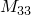

# 30.1.1 点质量


**产品：** Abaqus/Standard  Abaqus/Explicit  Abaqus/CAE  

##### **参考资料**

- ["质量单元库," 第30.1.2节](pt06ch30s01ael21.md)
- [*MASS](../key/key-link.md#usb-kws-mmass)
- ["定义点质量和转动惯量," Abaqus/CAE用户指南第33.3节](../usi/usi-link.md#usi-eng-help-pmi)

### 概述

质量单元：
- 允许在一点引入各向同性或各向异性的集中质量；
- 与节点处的三个平动自由度相关联。

如果还需要转动惯量（例如，表示刚体），请使用单元类型ROTARYI（["转动惯量," 第30.2.1节](pt06ch30s02alm22.md)）。

除了点质量外，Abaqus还提供了一种便捷的非结构质量定义，可用于将质量从对区域几乎没有结构刚度的特征（通常与非结构特征相邻）涂抹到该区域。非结构质量可以指定为总质量值、单位体积质量、单位面积质量或单位长度质量的形式（参见["非结构质量定义," 第2.7.1节](pt01ch02s07aus25.md)）。

### 定义各向同性质量值

您指定质量大小，与单元节点处三个平动自由度相关联。指定质量，而非重量。您必须将此质量与模型的某个区域相关联。

| **输入文件用法：** | ``` [*MASS](../key/key-link.md#usb-kws-mmass), ELSET=*name* *mass magnitude* ``` |
| --- | --- |
|  | 其中ELSET参数引用一组MASS单元。 |

| **Abaqus/CAE用法：** | 属性或相互作用模块：****特殊****惯性****创建****：**点质量/惯性**：选择点：**大小**：**各向同性：** *mass magnitude* |
| --- | --- |

#### 在Abaqus/Standard中显式定义质量矩阵

如果在Abaqus/Standard中希望引入质量矩阵对角线和非对角线项的单独项，您可以显式定义通用质量矩阵。参见["用户定义单元," 第32.15.1节](pt06ch32s15alm60.md)获取详细信息。

| **输入文件用法：** | 使用以下两个选项： |
| --- | --- |
|  | ``` [*USER ELEMENT](../key/key-link.md#usb-kws-muserelement) [*MATRIX](../key/key-link.md#usb-kws-mmatrix) ``` |

| **Abaqus/CAE用法：** | 在Abaqus/CAE中不支持显式定义质量矩阵。 |
| --- | --- |

### 定义各向异性质量张量

您可以通过给出三个主值和主方向来将质量指定为各向异性。当未指定主方向时，假定它们与全局轴重合。在大位移分析中，如果节点的相关转动自由度处于活动状态，则各向异性质量的局部轴会随着旋转。各向异性质量所附加的节点处转动自由度处于活动状态（如果该节点连接到梁、常规壳、转动惯量单元或刚体）。您可以指定作用于各向异性质量的质量比例载荷，如重力。阻尼和质量缩放也可以与各向异性质量一起使用。

指定质量，而非重量。您必须将此质量与模型的某个区域相关联。

| **输入文件用法：** | ``` [*MASS](../key/key-link.md#usb-kws-mmass), ELSET=*name*, TYPE=ANISOTROPIC, ORIENTATION=*orientation_name* , ,  ``` |
| --- | --- |
|  | 其中ELSET参数引用一组MASS单元。 |

| **Abaqus/CAE用法：** | 属性或相互作用模块：****特殊****惯性****创建****：**点质量/惯性**：选择点：**大小**：**各向异性：** ,  和  |
| --- | --- |

### 为MASS单元定义阻尼

在Abaqus/Standard中，您可以为直接积分动态分析定义质量比例阻尼，或为模态动态分析定义复合阻尼。虽然可以为一组MASS单元指定两种阻尼定义，但只会使用与特定动态分析过程相关的阻尼。

在Abaqus/Explicit中，可以为MASS单元定义质量比例阻尼。

#### 动力学

您可以为直接积分动态分析或显式动态分析中的MASS单元定义惯性比例阻尼。参见["材料阻尼," 第26.1.1节](pt05ch26s01abm51.md)获取详细信息。

| **输入文件用法：** | ``` [*MASS](../key/key-link.md#usb-kws-mmass), ALPHA= ``` |
| --- | --- |

| **Abaqus/CAE用法：** | 属性或相互作用模块：****特殊****惯性****创建****：**点质量/惯性**：选择点：**阻尼**：**Alpha：**  |
| --- | --- |

#### 模态动力学

当在模态动态分析中使用时，您可以为计算复合阻尼因子的MASS单元定义临界阻尼分数。参见["材料阻尼," 第26.1.1节](pt05ch26s01abm51.md)获取详细信息。

| **输入文件用法：** | ``` [*MASS](../key/key-link.md#usb-kws-mmass), COMPOSITE= ``` |
| --- | --- |

| **Abaqus/CAE用法：** | 属性或相互作用模块：****特殊****惯性****创建****：**点质量/惯性**：选择点：**阻尼**：**复合：**  |
| --- | --- |


