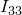
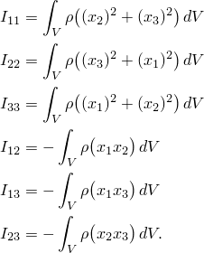

# 30.2.1 转动惯量


**产品：** Abaqus/Standard  Abaqus/Explicit  Abaqus/CAE  

##### **参考资料**

- ["转动惯量单元库," 第30.2.2节](pt06ch30s02ael22.md)
- [*ROTARY INERTIA](../key/key-link.md#usb-kws-mrotinertia)
- ["定义点质量和转动惯量," Abaqus/CAE用户指南第33.3节](../usi/usi-link.md#usi-eng-help-pmi)

### 概述

转动惯量单元：
- 允许在节点处包含转动惯量；
- 与节点处的三个转动自由度相关联；以及
- 可以与MASS单元配对（["点质量," 第30.1.1节](pt06ch30s01alm21.md)）直接定义刚体的质量和惯性特性（["刚体定义," 第2.4.1节](pt01ch02s04aus22.md)）。

### 定义转动惯量

ROTARYI单元允许在节点处包含转动惯量。假定节点是物体的质心，因此只需要二阶惯性矩。如果节点是刚体的一部分，则考虑节点与刚体质心之间的偏移。关于全局坐标系的六个转动惯量张量分量——、、、、 和 ——定义如下：



转动惯量张量必须是正半定的。

您指定惯性矩，单位应为[ML2](../popups/usb-int-iconventions-unitsym.md)。您必须将这些惯性矩与模型的某个区域相关联。

可选择性地，您可以引用局部方向（["方向," 第2.2.5节](pt01ch02s02aus15.md)）来定义给出惯性矩值的局部轴方向。如果您未指定局部方向且转动惯量单元是在零件或零件实例内定义的（参见["定义装配," 第2.10.1节](pt01ch02s10aus28.md)），则惯性矩分量必须相对于局部零件轴给出。如果您未指定局部方向且转动惯量单元不是在零件或零件实例内定义的，则惯性矩分量必须相对于全局轴给出。

| **输入文件用法：** | ``` [*ROTARY INERTIA](../key/key-link.md#usb-kws-mrotinertia), ELSET=*name*, ORIENTATION=*name* , , , , ,  ``` |
| --- | --- |
|  | 其中ELSET参数引用一组ROTARYI单元。 |

| **Abaqus/CAE用法：** | 属性或相互作用模块：****特殊****惯性****创建****：**点质量/惯性**：选择点：**大小**：**I11：** , **I22：** , **I33：** ；如有必要，切换**指定非对角项**：**I12：** , **I13：** , **I23：** ；**CSYS：编辑** |
| --- | --- |

### 为ROTARYI单元定义阻尼

在Abaqus/Standard中，您可以为直接积分动态分析定义质量比例阻尼，或为模态动态分析定义复合阻尼。虽然可以为一组ROTARYI单元指定两种阻尼定义，但只会使用与特定动态分析过程相关的阻尼。

在Abaqus/Explicit中，可以为ROTARYI单元定义质量比例阻尼。

#### 动力学

您可以为直接积分动态分析或显式动态分析中的ROTARYI单元定义惯性比例阻尼。参见["材料阻尼," 第26.1.1节](pt05ch26s01abm51.md)获取详细信息。

| **输入文件用法：** | ``` [*ROTARY INERTIA](../key/key-link.md#usb-kws-mrotinertia), ALPHA= ``` |
| --- | --- |

| **Abaqus/CAE用法：** | 属性或相互作用模块：****特殊****惯性****创建****：**点质量/惯性**：选择点：**阻尼**：**Alpha：**  |
| --- | --- |

#### 模态动力学

当在模态动态分析中使用时，您可以为计算复合阻尼因子的ROTARYI单元定义临界阻尼分数。参见["材料阻尼," 第26.1.1节](pt05ch26s01abm51.md)获取详细信息。

| **输入文件用法：** | ``` [*ROTARY INERTIA](../key/key-link.md#usb-kws-mrotinertia), COMPOSITE= ``` |
| --- | --- |

| **Abaqus/CAE用法：** | 属性或相互作用模块：****特殊****惯性****创建****：**点质量/惯性**：选择点：**阻尼**：**复合：**  |
| --- | --- |

### 在三维隐式分析中加速收敛

在Abaqus/Standard的几何非线性分析中，当运动是三维的且转动惯量不等于三个轴时，刚体转动惯量对系统矩阵有一些不对称项的贡献。因此，在转动惯量影响显著的情况下，如果对步骤使用不对称矩阵存储和求解方案（["定义分析," 第6.1.2节](pt03ch06s01abo05.md)），解决方案可能会更快收敛。


