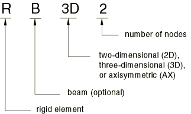

# 30.3.1 刚性单元


**产品：** Abaqus/Standard  Abaqus/Explicit  Abaqus/CAE  

##### **参考**

- ["刚体定义，" 第2.4.1节](pt01ch02s04aus22.md)
- ["刚性单元库，" 第30.3.2节](pt06ch30s03ael23.md)
- [*RIGID BODY](../key/key-link.md#usb-kws-mrigidbody)
- ["定义刚体约束，" Abaqus/CAE用户指南第15.15.2节](../usi/usi-link.md#usi-itn-helptopic-rigid)

### 概述

刚性单元：
- 可用于定义刚体表面的接触；
- 可用于定义多体动力学模拟中的刚体；
- 可附着于可变形单元；
- 可用于约束模型的某些部分；
- 用于将Abaqus/Aqua载荷施加到刚性结构；以及
- 与给定的刚体关联，并共享一个称为刚体参考节点的公共节点。

### 选择合适的单元

在平面应变或平面应力分析中使用R2D2单元，在轴对称平面几何体中使用RAX2单元，在三维分析中使用R3D3和R3D4单元。

RB2D2和RB3D2单元通常在Abaqus/Standard中用于模拟将传递Abaqus/Aqua载荷但不会变形的海洋结构。它们也可以用作可变形体节点之间的刚性连杆。

### 命名规则

Abaqus中的刚性单元命名如下：



例如，R2D2是一个二维、2节点、刚性单元。

### 单元法向定义

对于所有刚性单元，单元正向外法向一侧的面称为SPOS。另一侧的面称为SNEG。每个单元的正向法向定义如下。

R2D2、RAX2、RB2D2、R3D3和R3D4刚性单元可用于Abaqus/Standard中定义接触应用的主表面。主表面外法向的方向对于正确检测接触至关重要。有关接触表面定义的详细讨论，请参见["在Abaqus/Standard中定义接触对，" 第36.3.1节](pt09ch36s03aus145.md)。

#### 二维刚性单元

正向外的法向方向，，定义为从单元节点1到节点2的方向逆时针旋转90度。见[图30.3.1-1](pt06ch30s03alm23.md#erigid-wire-normal)。

**图30.3.1-1** 二维刚性单元的正向法向。


#### 三维刚性单元

R3D3和R3D4单元的正向法向由右手定则给出，绕单元节点按单元连通性中给出的顺序遍历。见[图30.3.1-2](pt06ch30s03alm23.md#erigid-surf-normal)。

RB3D2单元没有唯一的法向定义。

**图30.3.1-2** R3D3和R3D4单元的正向法向。


### 定义刚性单元

刚性单元必须始终是刚体的一部分。关于刚体定义的完整详细信息，请参见["刚体定义，" 第2.4.1节](pt01ch02s04aus22.md)。

| **输入文件用法：** | ``` [*RIGID BODY](../key/key-link.md#usb-kws-mrigidbody), ELSET=*name* ``` |
| --- | --- |
|  | 其中ELSET参数指一组刚性单元。 |

| **Abaqus/CAE用法：** | 相互作用模块：**创建约束**：**刚体**：**体（单元）** |
| --- | --- |

#### 质量分布

在Abaqus/Standard中，刚性单元不会对其所属的刚体贡献质量。可通过在连接到刚性单元的节点上使用点质量（["点质量，" 第30.1.1节](pt06ch30s01alm21.md)）和转动惯量单元（["转动惯量，" 第30.2.1节](pt06ch30s02alm22.md)）来考虑刚性表面上的质量分布。

默认情况下，在Abaqus/Explicit中，刚性单元不会对其所属的刚体贡献质量。要定义质量分布，您可以指定刚体中所有刚性单元的密度。当指定非零密度和厚度时，刚性单元对刚体的质量和转动惯量贡献将以与结构单元类似的方式计算。

| **输入文件用法：** | 在Abaqus/Explicit中使用以下选项指定刚性单元的密度： |
| --- | --- |
|  | ``` [*RIGID BODY](../key/key-link.md#usb-kws-mrigidbody), DENSITY=*density* ``` |

| **Abaqus/CAE用法：** | 您无法在Abaqus/CAE中指定刚性单元的密度。 |
| --- | --- |

#### Abaqus/Explicit中的几何

在Abaqus/Explicit中，您可以为属于刚体的所有刚性单元指定横截面积或厚度。如果您未指定，Abaqus/Explicit假定默认的零横截面积或零厚度。

要考虑Abaqus/Explicit中由刚性单元形成的表面厚度的连续变化，您可以在节点处指定刚性单元的厚度。

为形成接触对定义中刚性表面的刚性单元指定非零厚度可用于考虑接触约束中表面厚度的影响。它还允许将双面表面接触功能与由刚性单元形成的刚性表面一起使用。

| **输入文件用法：** | 在Abaqus/Explicit中使用以下选项为刚体中的所有刚性单元指定横截面积或厚度： |
| --- | --- |
|  | ``` [*RIGID BODY](../key/key-link.md#usb-kws-mrigidbody) *cross-sectional area or thickness* ``` 使用以下两个选项为由刚性单元形成的表面指定连续变化的厚度： ``` [*NODAL THICKNESS](../key/key-link.md#usb-kws-mnodalthickness) [*RIGID BODY](../key/key-link.md#usb-kws-mrigidbody), NODAL THICKNESS ``` |

| **Abaqus/CAE用法：** | 您无法在Abaqus/CAE中指定刚性单元的横截面积或厚度。 |
| --- | --- |

#### Abaqus/Explicit中的偏移

在Abaqus/Explicit中，您可以定义从刚性单元中面到包含单元节点的参考表面的距离（以刚性单元厚度的分数形式测量）。偏移的正值沿单元法向方向。当偏移距离为0.5时，顶面为参考表面。当偏移距离为-0.5时，底面为参考表面。默认偏移距离为0，表示刚性单元的中面为参考表面。您可以指定大于刚性单元半厚度值的偏移距离绝对值。

由于刚性单元不执行单元级计算，指定的偏移仅影响由刚性单元形成的刚性表面的接触对的处理（见["基于单元的表面定义，" 第2.3.2节](pt01ch02s03aus17.md)）。使用偏移定义的刚性单元对刚体的质量和转动惯量贡献是按偏移为零计算的。

| **输入文件用法：** | 在Abaqus/Explicit中使用以下选项为刚性单元指定表面偏移： |
| --- | --- |
|  | ``` [*RIGID BODY](../key/key-link.md#usb-kws-mrigidbody), OFFSET=*offset* ``` OFFSET参数接受值或标签（SPOS或SNEG）。指定SPOS等同于指定值0.5；指定SNEG等同于指定值-0.5。 |

| **Abaqus/CAE用法：** | 您无法在Abaqus/CAE中为刚性单元指定偏移。 |
| --- | --- |