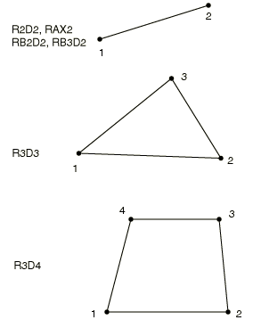

# 30.3.2 刚性单元库


**产品：** Abaqus/Standard  Abaqus/Explicit  Abaqus/CAE  

##### **参考**

- ["刚性单元，" 第30.3.1节](pt06ch30s03alm23.md)
- [*RIGID BODY](../key/key-link.md#usb-kws-mrigidbody)

### 概述

本节提供Abaqus/Standard和Abaqus/Explicit中可用刚性单元的参考。

### 单元类型

#### 2D刚性单元

| R2D2 | 2节点，线性连杆（用于平面应变或平面应力） |
| --- | --- |
|  |

| RAX2 | 2节点，线性连杆（用于轴对称平面几何） |
| --- | --- |
|  |

| RB2D2(S) | 2节点，刚性梁 |
| --- | --- |
|  |

##### 从属自由度

R2D2和RAX2：1，2

RB2D2：1，2，6

##### 主导自由度

R2D2、RAX2和RB2D2：1，2，6（位于刚体参考节点）

##### 附加求解变量

无。

#### 3D刚性单元

| R3D3 | 3节点，三角形面 |
| --- | --- |
|  |

| R3D4 | 4节点，双线性四边形 |
| --- | --- |
|  |

| RB3D2(S) | 2节点，刚性梁 |
| --- | --- |
|  |

##### 从属自由度

R3D3和R3D4：1，2，3

RB3D2：1，2，3，4，5，6

##### 主导自由度

1，2，3，4，5，6（位于刚体参考节点）

##### 附加求解变量

无。

### 所需节点坐标

R2D2和RB2D2：*X*，*Y*

RAX2：*r*，*z*

R3D3、R3D4和RB3D2：*X*，*Y*，*Z*

### 单元属性定义

对于R2D2、RB2D2和RB3D2单元，您可以指定单元的横截面积。在Abaqus/Standard中，如果未给定面积，则假定单位面积；在Abaqus/Explicit中需要面积。

对于RAX2、R3D3和R3D4单元，您可以指定单元的厚度。在Abaqus/Standard中，如果未给定厚度，则假定单位厚度；在Abaqus/Explicit中需要厚度。

横截面积或单元厚度用于定义体积力（以单位体积力给出），以及在Abaqus/Explicit中确定总质量。

| **输入文件用法：** | ``` [*RIGID BODY](../key/key-link.md#usb-kws-mrigidbody) ``` |
| --- | --- |

| **Abaqus/CAE用法：** | 相互作用模块：**创建约束**：**刚体**：**体（单元）** |
| --- | --- |

### 基于单元的载荷

### 分布载荷

分布载荷可用于具有位移自由度的单元。指定方式如["分布载荷，" 第34.4.3节](pt07ch34s04aus122.md)中所述。

####  

仅适用于R2D2单元：

**载荷ID（*DLOAD）：**  BX(S)**Abaqus/CAE载荷/相互作用：**  **体积力****单位：**  [FL3](../popups/usb-int-iconventions-unitsym.md)**描述：**  全局*X*方向的体积力。

**载荷ID（*DLOAD）：**  BY(S)**Abaqus/CAE载荷/相互作用：**  **体积力****单位：**  [FL3](../popups/usb-int-iconventions-unitsym.md)**描述：**  全局*Y*方向的体积力。

**载荷ID（*DLOAD）：**  BXNU(S)**Abaqus/CAE载荷/相互作用：**  **体积力****单位：**  [FL3](../popups/usb-int-iconventions-unitsym.md)**描述：**  全局*X*方向的非均匀体积力，幅值通过用户子程序[`DLOAD`](../sub/sub-link.md#sub-xsl-dload)提供。

**载荷ID（*DLOAD）：**  BYNU(S)**Abaqus/CAE载荷/相互作用：**  **体积力****单位：**  [FL3](../popups/usb-int-iconventions-unitsym.md)**描述：**  全局*Y*方向的非均匀体积力，幅值通过用户子程序[`DLOAD`](../sub/sub-link.md#sub-xsl-dload)提供。

**载荷ID（*DLOAD）：**  CENT(S)**Abaqus/CAE载荷/相互作用：**  不支持**单位：**  [FL4 (ML3T2)](../popups/usb-int-iconventions-unitsym.md)**描述：**  离心载荷（幅值输入为，其中是单位体积质量密度，是角速度）。

**载荷ID（*DLOAD）：**  CORIO(S)**Abaqus/CAE载荷/相互作用：**  **科里奥利力****单位：**  [FL4T (ML3T1)](../popups/usb-int-iconventions-unitsym.md)**描述：**  科里奥利力（幅值输入为，其中是单位体积质量密度，是角速度）。直接稳态动力学分析中不考虑科里奥利载荷引起的载荷刚度。

**载荷ID（*DLOAD）：**  P(E)**Abaqus/CAE载荷/相互作用：**  **压力****单位：**  [FL2](../popups/usb-int-iconventions-unitsym.md)**描述：**  单元表面上的压力。压力在正向单元法向方向为正。

**载荷ID（*DLOAD）：**  PNU(E)**Abaqus/CAE载荷/相互作用：**  不支持**单位：**  [FL2](../popups/usb-int-iconventions-unitsym.md)**描述：**  单元表面上非均匀压力，幅值通过用户子程序[`VDLOAD`](../sub/sub-link.md#sub-xsl-vdload)提供。压力在正向单元法向方向为正。

####  

仅适用于RAX2单元：

**载荷ID（*DLOAD）：**  BR(S)**Abaqus/CAE载荷/相互作用：**  **体积力****单位：**  [FL3](../popups/usb-int-iconventions-unitsym.md)**描述：**  径向单位体积体积力。

**载荷ID（*DLOAD）：**  BZ(S)**Abaqus/CAE载荷/相互作用：**  **体积力****单位：**  [FL3](../popups/usb-int-iconventions-unitsym.md)**描述：**  轴向单位体积体积力。

**载荷ID（*DLOAD)：**  BRNU(S)**Abaqus/CAE载荷/相互作用：**  **体积力****单位：**  [FL3](../popups/usb-int-iconventions-unitsym.md)**描述：**  径向非均匀单位体积体积力，幅值通过用户子程序[`DLOAD`](../sub/sub-link.md#sub-xsl-dload)提供。

**载荷ID（*DLOAD）：**  BZNU(S)**Abaqus/CAE载荷/相互作用：**  **体积力****单位：**  [FL3](../popups/usb-int-iconventions-unitsym.md)**描述：**  *z*方向非均匀单位体积体积力，幅值通过用户子程序[`DLOAD`](../sub/sub-link.md#sub-xsl-dload)提供。

**载荷ID（*DLOAD)：**  CENT(S)**Abaqus/CAE载荷/相互作用：**  不支持**单位：**  [FL4 (ML 3T2)](../popups/usb-int-iconventions-unitsym.md)**描述：**  离心载荷（幅值表示为，其中是质量密度，是角速度）。由于仅允许轴对称变形，旋转轴必须是*z*轴。

**载荷ID（*DLOAD)：**  HP(S)**Abaqus/CAE载荷/相互作用：**  不支持**单位：**  [FL2](../popups/usb-int-iconventions-unitsym.md)**描述：**  单元表面上的静水压力，沿全局*Z*线性变化。压力在正向单元法向方向为正。

**载荷ID（*DLOAD)：**  P**Abaqus/CAE载荷/相互作用：**  **压力****单位：**  [FL2](../popups/usb-int-iconventions-unitsym.md)**描述：**  单元表面上的压力。压力在正向单元法向方向为正。

**载荷ID（*DLOAD)：**  PNU**Abaqus/CAE载荷/相互作用：**  不支持**单位：**  [FL2](../popups/usb-int-iconventions-unitsym.md)**描述：**  单元表面上非均匀压力，幅值在Abaqus/Standard中通过用户子程序[`DLOAD`](../sub/sub-link.md#sub-xsl-dload)提供，在Abaqus/Explicit中通过[`VDLOAD`](../sub/sub-link.md#sub-xsl-vdload)提供。压力在正向单元法向方向为正。

**载荷ID（*DLOAD)：**  TRSHR**Abaqus/CAE载荷/相互作用：**  **表面牵引****单位：**  [FL2](../popups/usb-int-iconventions-unitsym.md)**描述：**  单元表面上的剪切牵引。

**载荷ID（*DLOAD)：**  TRSHRNU(S)**Abaqus/CAE载荷/相互作用：**  不支持**单位：**  [FL2](../popups/usb-int-iconventions-unitsym.md)**描述：**  单元表面上非均匀剪切牵引，幅值和方向通过用户子程序[`UTRACLOAD`](../sub/sub-link.md#sub-xsl-utracload)提供。

**载荷ID（*DLOAD)：**  TRVEC**Abaqus/CAE载荷/相互作用：**  **表面牵引****单位：**  [FL2](../popups/usb-int-iconventions-unitsym.md)**描述：**  单元表面上的一般牵引。

**载荷ID（*DLOAD)：**  TRVECNU(S)**Abaqus/CAE载荷/相互作用：**  不支持**单位：**  [FL2](../popups/usb-int-iconventions-unitsym.md)**描述：**  单元表面上非均匀一般牵引，幅值和方向通过用户子程序[`UTRACLOAD`](../sub/sub-link.md#sub-xsl-utracload)提供。

####  

仅适用于R3D3和R3D4单元：

**载荷ID（*DLOAD)：**  BX(S)**Abaqus/CAE载荷/相互作用：**  **体积力****单位：**  [FL3](../popups/usb-int-iconventions-unitsym.md)**描述：**  全局*X*方向的体积力。

**载荷ID（*DLOAD)：**  BY(S)**Abaqus/CAE载荷/相互作用：**  **体积力****单位：**  [FL3](../popups/usb-int-iconventions-unitsym.md)**描述：**  全局*Y*方向的体积力。

**载荷ID（*DLOAD)：**  BZ(S)**Abaqus/CAE载荷/相互作用：**  **体积力****单位：**  [FL3](../popups/usb-int-iconventions-unitsym.md)**描述：**  全局*Z*方向的体积力。

**载荷ID（*DLOAD)：**  BXNU(S)**Abaqus/CAE载荷/相互作用：**  **体积力****单位：**  [FL3](../popups/usb-int-iconventions-unitsym.md)**描述：**  全局*X*方向的非均匀体积力，幅值通过用户子程序[`DLOAD`](../sub/sub-link.md#sub-xsl-dload)提供。

**载荷ID（*DLOAD)：**  BYNU(S)**Abaqus/CAE载荷/相互作用：**  **体积力****单位：**  [FL3](../popups/usb-int-iconventions-unitsym.md)**描述：**  全局*Y*方向的非均匀体积力，幅值通过用户子程序[`DLOAD`](../sub/sub-link.md#sub-xsl-dload)提供。

**载荷ID（*DLOAD)：**  BZNU(S)**Abaqus/CAE载荷/相互作用：**  **体积力****单位：**  [FL3](../popups/usb-int-iconventions-unitsym.md)**描述：**  全局*Z*方向的非均匀体积力，幅值通过用户子程序[`DLOAD`](../sub/sub-link.md#sub-xsl-dload)提供。

**载荷ID（*DLOAD)：**  CENT(S)**Abaqus/CAE载荷/相互作用：**  不支持**单位：**  [FL4 (ML3T2)](../popups/usb-int-iconventions-unitsym.md)**描述：**  离心载荷（幅值输入为，其中是单位体积质量密度，是角速度）。

**载荷ID（*DLOAD)：**  CORIO(S)**Abaqus/CAE载荷/相互作用：**  **科里奥利力****单位：**  [FL4T (ML3T1)](../popups/usb-int-iconventions-unitsym.md)**描述：**  科里奥利力（幅值输入为，其中是单位体积质量密度，是角速度）。直接稳态动力学分析中不考虑科里奥利载荷引起的载荷刚度。

**载荷ID（*DLOAD)：**  HP(S)**Abaqus/CAE载荷/相互作用：**  不支持**单位：**  [FL2](../popups/usb-int-iconventions-unitsym.md)**描述：**  单元表面上的静水压力，沿全局*Z*线性变化。压力在正向单元法向方向为正。

**载荷ID（*DLOAD)：**  P**Abaqus/CAE载荷/相互作用：**  **压力****单位：**  [FL2](../popups/usb-int-iconventions-unitsym.md)**描述：**  单元表面上的压力。压力在正向单元法向方向为正。

**载荷ID（*DLOAD)：**  PNU**Abaqus/CAE载荷/相互作用：**  不支持**单位：**  [FL2](../popups/usb-int-iconventions-unitsym.md)**描述：**  单元表面上非均匀压力，幅值在Abaqus/Standard中通过用户子程序[`DLOAD`](../sub/sub-link.md#sub-xsl-dload)提供，在Abaqus/Explicit中通过[`VDLOAD`](../sub/sub-link.md#sub-xsl-vdload)提供。压力在正向单元法向方向为正。

**载荷ID（*DLOAD)：**  TRSHR**Abaqus/CAE载荷/相互作用：**  **表面牵引****单位：**  [FL2](../popups/usb-int-iconventions-unitsym.md)**描述：**  单元表面上的剪切牵引。

**载荷ID（*DLOAD)：**  TRSHRNU(S)**Abaqus/CAE载荷/相互作用：**  不支持**单位：**  [FL2](../popups/usb-int-iconventions-unitsym.md)**描述：**  单元表面上非均匀剪切牵引，幅值和方向通过用户子程序[`UTRACLOAD`](../sub/sub-link.md#sub-xsl-utracload)提供。

**载荷ID（*DLOAD)：**  TRVEC**Abaqus/CAE载荷/相互作用：**  **表面牵引****单位：**  [FL2](../popups/usb-int-iconventions-unitsym.md)**描述：**  单元表面上的一般牵引。

**载荷ID（*DLOAD)：**  TRVECNU(S)**Abaqus/CAE载荷/相互作用：**  不支持**单位：**  [FL2](../popups/usb-int-iconventions-unitsym.md)**描述：**  单元表面上非均匀一般牵引，幅值和方向通过用户子程序[`UTRACLOAD`](../sub/sub-link.md#sub-xsl-utracload)提供。

### Abaqus/Aqua载荷

Abaqus/Aqua载荷的指定方式如["Abaqus/Aqua分析，" 第6.11.1节](pt03ch06s11at30.md)中所述。

####  

仅适用于R3D3和R3D4单元：

**载荷ID（*CLOAD/ *DLOAD)：**  PB**Abaqus/CAE载荷/相互作用：**  不支持**单位：**  [FL2](../popups/usb-int-iconventions-unitsym.md)**描述：**  浮力。

####  

仅适用于RB2D2和RB3D2单元：

**载荷ID（*CLOAD/ *DLOAD)：**  FDD**Abaqus/CAE载荷/相互作用：**  不支持**单位：**  [FL1](../popups/usb-int-iconventions-unitsym.md)**描述：**  横向流体阻力。

**载荷ID（*CLOAD/ *DLOAD)：**  FD1**Abaqus/CAE载荷/相互作用：**  不支持**单位：**  [F](../popups/usb-int-iconventions-unitsym.md)**描述：**  刚性连杆第一端（节点1）上的流体阻力。

**载荷ID（*CLOAD/ *DLOAD)：**  FD2**Abaqus/CAE载荷/相互作用：**  不支持**单位：**  [F](../popups/usb-int-iconventions-unitsym.md)**描述：**  刚性连杆第二端（节点2）上的流体阻力。

**载荷ID（*CLOAD/ *DLOAD)：**  FDT**Abaqus/CAE载荷/相互作用：**  不支持**单位：**  [FL1](../popups/usb-int-iconventions-unitsym.md)**描述：**  切向流体阻力载荷。

**载荷ID（*CLOAD/ *DLOAD)：**  FI**Abaqus/CAE载荷/相互作用：**  不支持**单位：**  [FL1](../popups/usb-int-iconventions-unitsym.md)**描述：**  横向流体惯性载荷。

**载荷ID（*CLOAD/ *DLOAD)：**  FI1**Abaqus/CAE载荷/相互作用：**  不支持**单位：**  [F](../popups/usb-int-iconventions-unitsym.md)**描述：**  刚性连杆第一端（节点1）上的流体惯性载荷。

**载荷ID（*CLOAD/ *DLOAD)：**  FI2**Abaqus/CAE载荷/相互作用：**  不支持**单位：**  [F](../popups/usb-int-iconventions-unitsym.md)**描述：**  刚性连杆第二端（节点2）上的流体惯性载荷。

**载荷ID（*CLOAD/ *DLOAD)：**  PB**Abaqus/CAE载荷/相互作用：**  不支持**单位：**  [FL1](../popups/usb-int-iconventions-unitsym.md)**描述：**  浮力（封闭端条件）。

**载荷ID（*CLOAD/ *DLOAD)：**  WDD**Abaqus/CAE载荷/相互作用：**  不支持**单位：**  [FL1](../popups/usb-int-iconventions-unitsym.md)**描述：**  横向风阻力。

**载荷ID（*CLOAD/ *DLOAD)：**  WD1**Abaqus/CAE载荷/相互作用：**  不支持**单位：**  [F](../popups/usb-int-iconventions-unitsym.md)**描述：**  刚性连杆第一端（节点1）上的风阻力。

**载荷ID（*CLOAD/ *DLOAD)：**  WD2**Abaqus/CAE载荷/相互作用：**  不支持**单位：**  [F](../popups/usb-int-iconventions-unitsym.md)**描述：**  刚性连杆第二端（节点2）上的风阻力。

### 基于表面的载荷

### 分布载荷

基于表面的分布载荷可用于具有位移自由度的单元。指定方式如["分布载荷，" 第34.4.3节](pt07ch34s04aus122.md)中所述。

####  

仅适用于RAX2、R3D3和R3D4单元：

**载荷ID（*DSLOAD)：**  HP(S)**Abaqus/CAE载荷/相互作用：**  **压力****单位：**  [FL2](../popups/usb-int-iconventions-unitsym.md)**描述：**  单元表面上的静水压力，沿全局*Z*线性变化。压力在表面法向相反方向为正。 

**载荷ID（*DSLOAD)：**  P**Abaqus/CAE载荷/相互作用：**  **压力****单位：**  [FL2](../popups/usb-int-iconventions-unitsym.md)**描述：**  单元表面上的压力。压力在表面法向相反方向为正。

**载荷ID（*DSLOAD)：**  PNU**Abaqus/CAE载荷/相互作用：**  **压力****单位：**  [FL2](../popups/usb-int-iconventions-unitsym.md)**描述：**  单元表面上非均匀压力，幅值在Abaqus/Standard中通过用户子程序[`DLOAD`](../sub/sub-link.md#sub-xsl-dload)提供，在Abaqus/Explicit中通过[`VDLOAD`](../sub/sub-link.md#sub-xsl-vdload)提供。压力在表面法向相反方向为正。

**载荷ID（*DSLOAD)：**  TRSHR**Abaqus/CAE载荷/相互作用：**  **表面牵引****单位：**  [FL2](../popups/usb-int-iconventions-unitsym.md)**描述：**  单元表面上的剪切牵引。

**载荷ID（*DSLOAD)：**  TRSHRNU(S)**Abaqus/CAE载荷/相互作用：**  **表面牵引****单位：**  [FL2](../popups/usb-int-iconventions-unitsym.md)**描述：**  单元表面上非均匀剪切牵引，幅值和方向通过用户子程序[`UTRACLOAD`](../sub/sub-link.md#sub-xsl-utracload)提供。

**载荷ID（*DSLOAD)：**  TRVEC**Abaqus/CAE载荷/相互作用：**  **表面牵引****单位：**  [FL2](../popups/usb-int-iconventions-unitsym.md)**描述：**  单元表面上的一般牵引。

**载荷ID（*DSLOAD)：**  TRVECNU(S)**Abaqus/CAE载荷/相互作用：**  **表面牵引****单位：**  [FL2](../popups/usb-int-iconventions-unitsym.md)**描述：**  单元表面上非均匀一般牵引，幅值和方向通过用户子程序[`UTRACLOAD`](../sub/sub-link.md#sub-xsl-utracload)提供。

### 单元输出

无。

### 单元上的节点排序

