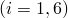
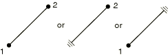

# 31.1.4 连接器单元库


**产品：** Abaqus/Standard  Abaqus/Explicit  Abaqus/CAE  

##### **参考**

- ["连接器单元，" 第31.1.2节](pt06ch31s01alm25.md)
- ["连接类型库，" 第31.1.5节](pt06ch31s01aus114.md)
- [*CONNECTOR BEHAVIOR](../key/key-link.md#usb-kws-mconnectorbehavior)
- [*CONNECTOR LOAD](../key/key-link.md#usb-kws-hconnectorload)
- [*CONNECTOR SECTION](../key/key-link.md#usb-kws-mconnectorsection)

### 概述

本节提供Abaqus/Standard和Abaqus/Explicit中可用连接器单元的参考。

### 单元类型

#### 平面中的连接器

| CONN2D2 | 两个节点之间或地面与节点之间的连接器单元。 |
| --- | --- |
|  |

##### 活动自由度

对于最一般连接类型为1、2、6。

##### 附加求解变量

在Abaqus/Standard中，可能有多达三个与连接器关联的力和力矩相关的附加约束变量。附加约束变量的数量取决于连接类型。

#### 空间中的连接器

| CONN3D2 | 两个节点之间或地面与节点之间的连接器单元。 |
| --- | --- |
|  |

##### 活动自由度

对于最一般连接类型为1、2、3、4、5、6。

##### 附加求解变量

在Abaqus/Standard中，可能有多达六个与连接器关联的力和力矩相关的附加约束变量。附加约束变量的数量取决于连接类型。

### 所需节点坐标

CONN2D2：*X*，*Y*

CONN3D2：*X*，*Y*，*Z*

### 单元属性定义

| **输入文件用法：** | ``` [*CONNECTOR SECTION](../key/key-link.md#usb-kws-mconnectorsection) ``` |
| --- | --- |

| **Abaqus/CAE用法：** | 相互作用模块：****连接器********截面********创建**** |
| --- | --- |

### 基于单元的载荷

使用连接器载荷对相对运动的可用分量施加载荷。规定连接器运动以指定相对运动的可用分量的运动学（零或非零值）。详见["连接器驱动，" 第31.1.3节](pt06ch31s01alm26.md)。

### 单元输出

#### 总力分量

| CTF1 | 1方向的总力。 |
| --- | --- |

| CTF2 | 2方向的总力。 |
| --- | --- |

| CTF3 | 3方向的总力。 |
| --- | --- |

| CTM1 | 1方向的总力矩。 |
| --- | --- |

| CTM2 | 2方向的总力矩。 |
| --- | --- |

| CTM3 | 3方向的总力矩。 |
| --- | --- |

总力获取方式为CTF = CEF + CVF + CUF + CSF + CRF – CCF。

#### 弹力分量

| CEF1 | 1方向的弹力。 |
| --- | --- |

| CEF2 | 2方向的弹力。 |
| --- | --- |

| CEF3 | 3方向的弹力。 |
| --- | --- |

| CEM1 | 1方向的弹力矩。 |
| --- | --- |

| CEM2 | 2方向的弹力矩。 |
| --- | --- |

| CEM3 | 3方向的弹力矩。 |
| --- | --- |

#### 弹性相对位移分量

| CUE1 | 1方向的弹性位移。 |
| --- | --- |

| CUE2 | 2方向的弹性位移。 |
| --- | --- |

| CUE3 | 3方向的弹性位移。 |
| --- | --- |

| CURE1 | 1方向弹性转动。 |
| --- | --- |

| CURE2 | 2方向弹性转动。 |
| --- | --- |

| CURE3 | 3方向弹性转动。 |
| --- | --- |

#### 塑性相对位移分量

| CUP1 | 1方向的塑性相对位移。 |
| --- | --- |

| CUP2 | 2方向的塑性相对位移。 |
| --- | --- |

| CUP3 | 3方向的塑性相对位移。 |
| --- | --- |

| CURP1 | 1方向塑性相对转动。 |
| --- | --- |

| CURP2 | 2方向塑性相对转动。 |
| --- | --- |

| CURP3 | 3方向塑性相对转动。 |
| --- | --- |

#### 等效塑性相对位移分量

| CUPEQ1 | 1方向的等效塑性相对位移。 |
| --- | --- |

| CUPEQ2 | 2方向的等效塑性相对位移。 |
| --- | --- |

| CUPEQ3 | 3方向的等效塑性相对位移。 |
| --- | --- |

| CURPEQ1 | 1方向等效塑性相对转动。 |
| --- | --- |

| CURPEQ2 | 2方向等效塑性相对转动。 |
| --- | --- |

| CURPEQ3 | 3方向等效塑性相对转动。 |
| --- | --- |

| CUPEQC | 用于耦合塑性定义的等效塑性相对运动。 |
| --- | --- |

#### 运动硬化偏移力分量

| CALPHAF1 | 1方向运动硬化偏移力。 |
| --- | --- |

| CALPHAF2 | 2方向运动硬化偏移力。 |
| --- | --- |

| CALPHAF3 | 3方向运动硬化偏移力。 |
| --- | --- |

| CALPHAM1 | 1方向运动硬化偏移力矩。 |
| --- | --- |

| CALPHAM2 | 2方向运动硬化偏移力矩。 |
| --- | --- |

| CALPHAM3 | 3方向运动硬化偏移力矩。 |
| --- | --- |

#### 粘 l力分量

| CVF1 | 1方向的粘 l力。 |
| --- | --- |

| CVF2 | 2方向的粘 l力。 |
| --- | --- |

| CVF3 | 3方向的粘 l力。 |
| --- | --- |

| CVM1 | 1方向的粘 l力矩。 |
| --- | --- |

| CVM2 | 2方向的粘 l力矩。 |
| --- | --- |

| CVM3 | 3方向的粘 l力矩。 |
| --- | --- |

#### 单轴力分量

连接器单轴行为只能在Abaqus/Explicit中定义；因此，Abaqus/Standard中没有单轴力输出可用。

| CUF1 | 1方向的单轴力。 |
| --- | --- |

| CUF2 | 2方向的单轴力。 |
| --- | --- |

| CUF3 | 3方向的单轴力。 |
| --- | --- |

| CUM1 | 1方向的单轴力矩。 |
| --- | --- |

| CUM2 | 2方向的单轴力矩。 |
| --- | --- |

| CUM3 | 3方向的单轴力矩。 |
| --- | --- |

#### 摩擦力分量

| CSF1 | 1方向摩擦应力产生的力。 |
| --- | --- |

| CSF2 | 2方向摩擦应力产生的力。 |
| --- | --- |

| CSF3 | 3方向摩擦应力产生的力。 |
| --- | --- |

| CSM1 | 1方向摩擦力矩。 |
| --- | --- |

| CSM2 | 2方向摩擦力矩。 |
| --- | --- |

| CSM3 | 3方向摩擦力矩。 |
| --- | --- |

| CSFC | 即时滑移方向摩擦应力产生的力。仅适用于预定义或用户定义的耦合摩擦相互作用。 |
| --- | --- |

#### 产生摩擦的接触力分量

| CNF1 | 产生1方向摩擦的接触力。 |
| --- | --- |

| CNF2 | 产生2方向摩擦的接触力。 |
| --- | --- |

| CNF3 | 产生3方向摩擦的接触力。 |
| --- | --- |

| CNM1 | 产生1方向摩擦的接触力矩。 |
| --- | --- |

| CNM2 | 产生2方向摩擦的接触力矩。 |
| --- | --- |

| CNM3 | 产生3方向摩擦的接触力矩。 |
| --- | --- |

| CNFC | 即时滑移方向产生摩擦的接触力。 |
| --- | --- |

#### 总损伤分量

| CDMG1 | 1方向的整体损伤变量。 |
| --- | --- |

| CDMG2 | 2方向的整体损伤变量。 |
| --- | --- |

| CDMG3 | 3方向的整体损伤变量。 |
| --- | --- |

| CDMGR1 | 1方向的整体损伤变量。 |
| --- | --- |

| CDMGR2 | 2方向的整体损伤变量。 |
| --- | --- |

| CDMGR3 | 3方向的整体损伤变量。 |
| --- | --- |

#### 基于连接器力的损伤起始准则

| CDIF1 | 1方向基于连接器力的损伤起始准则。 |
| --- | --- |

| CDIF2 | 2方向基于连接器力的损伤起始准则。 |
| --- | --- |

| CDIF3 | 3方向基于连接器力的损伤起始准则。 |
| --- | --- |

| CDIFR1 | 1方向基于连接器力的损伤起始准则。 |
| --- | --- |

| CDIFR2 | 2方向基于连接器力的损伤起始准则。 |
| --- | --- |

| CDIFR3 | 3方向基于连接器力的损伤起始准则。 |
| --- | --- |

| CDIFC | 即时滑移方向基于连接器力的损伤起始准则。 |
| --- | --- |

#### 基于连接器运动的损伤起始准则

| CDIM1 | 1方向基于连接器运动的损伤起始准则。 |
| --- | --- |

| CDIM2 | 2方向基于连接器运动的损伤起始准则。 |
| --- | --- |

| CDIM3 | 3方向基于连接器运动的损伤起始准则。 |
| --- | --- |

| CDIMR1 | 1方向基于连接器运动的损伤起始准则。 |
| --- | --- |

| CDIMR2 | 2方向基于连接器运动的损伤起始准则。 |
| --- | --- |

| CDIMR3 | 3方向基于连接器运动的损伤起始准则。 |
| --- | --- |

| CDIMC | 即时滑移方向基于连接器运动的损伤起始准则。 |
| --- | --- |

#### 基于连接器塑性运动的损伤起始准则

| CDIP1 | 1方向基于连接器塑性运动的损伤起始准则。 |
| --- | --- |

| CDIP2 | 2方向基于连接器塑性运动的损伤起始准则。 |
| --- | --- |

| CDIP3 | 3方向基于连接器塑性运动的损伤起始准则。 |
| --- | --- |

| CDIPR1 | 1方向基于连接器塑性运动的损伤起始准则。 |
| --- | --- |

| CDIPR2 | 2方向基于连接器塑性运动的损伤起始准则。 |
| --- | --- |

| CDIPR3 | 3方向基于连接器塑性运动的损伤起始准则。 |
| --- | --- |

| CDIPC | 即时滑移方向基于连接器塑性运动的损伤起始准则。 |
| --- | --- |

#### 连接器锁定或停止状态

| CSLST*i* | 连接器停止和连接器锁定状态标志 。 |
| --- | --- |

#### 摩擦相关累积滑移

| CASU1 | 1方向累积摩擦滑移。 |
| --- | --- |

| CASU2 | 2方向累积摩擦滑移。 |
| --- | --- |

| CASU3 | 3方向累积摩擦滑移。 |
| --- | --- |

| CASUR1 | 1方向累积摩擦转动。 |
| --- | --- |

| CASUR2 | 2方向累积摩擦转动。 |
| --- | --- |

| CASUR3 | 3方向累积摩擦转动。 |
| --- | --- |

| CASUC | 即时滑移方向累积摩擦滑移。 |
| --- | --- |

#### 滑移方向摩擦相关瞬时速度（仅当在滑移方向定义了摩擦时可用）

| CIVC | 滑移方向摩擦相关瞬时速度。 |
| --- | --- |

#### 由运动约束、连接器锁定、连接器停止和规定连接器运动引起的反力分量

| CRF1 | 1方向连接器反力。 |
| --- | --- |

| CRF2 | 2方向连接器反力。 |
| --- | --- |

| CRF3 | 3方向连接器反力。 |
| --- | --- |

| CRM1 | 1方向连接器反力矩。 |
| --- | --- |

| CRM2 | 2方向连接器反力矩。 |
| --- | --- |

| CRM3 | 3方向连接器反力矩。 |
| --- | --- |

#### 由连接器载荷引起的连接器集中力分量

| CCF1 | 1方向连接器集中力。 |
| --- | --- |

| CCF2 | 2方向连接器集中力。 |
| --- | --- |

| CCF3 | 3方向连接器集中力。 |
| --- | --- |

| CCM1 | 1方向连接器集中力矩。 |
| --- | --- |

| CCM2 | 2方向连接器集中力矩。 |
| --- | --- |

| CCM3 | 3方向连接器集中力矩。 |
| --- | --- |

#### 相对位置分量

| CP1 | 1方向相对位置。 |
| --- | --- |

| CP2 | 2方向相对位置。 |
| --- | --- |

| CP3 | 3方向相对位置。 |
| --- | --- |

| CPR1 | 1方向相对角位置。 |
| --- | --- |

| CPR2 | 2方向相对角位置。 |
| --- | --- |

| CPR3 | 3方向相对角位置。 |
| --- | --- |

#### 相对位移分量

| CU1 | 1方向相对位移。 |
| --- | --- |

| CU2 | 2方向相对位移。 |
| --- | --- |

| CU3 | 3方向相对位移。 |
| --- | --- |

| CUR1 | 1方向相对转动。 |
| --- | --- |

| CUR2 | 2方向相对转动。 |
| --- | --- |

| CUR3 | 3方向相对转动。 |
| --- | --- |

#### 本构位移分量

| CCU1 | 1方向本构位移。 |
| --- | --- |

| CCU2 | 2方向本构位移。 |
| --- | --- |

| CCU3 | 3方向本构位移。 |
| --- | --- |

| CCUR1 | 1方向本构转动。 |
| --- | --- |

| CCUR2 | 2方向本构转动。 |
| --- | --- |

| CCUR3 | 3方向本构转动。 |
| --- | --- |

#### 相对速度分量

| CV1 | 1方向相对速度。 |
| --- | --- |

| CV2 | 2方向相对速度。 |
| --- | --- |

| CV3 | 3方向相对速度。 |
| --- | --- |

| CVR1 | 1方向相对角速度。 |
| --- | --- |

| CVR2 | 2方向相对角速度。 |
| --- | --- |

| CVR3 | 3方向相对角速度。 |
| --- | --- |

#### 相对加速度分量

| CA1 | 1方向相对加速度。 |
| --- | --- |

| CA2 | 2方向相对加速度。 |
| --- | --- |

| CA3 | 3方向相对加速度。 |
| --- | --- |

| CAR1 | 1方向相对角加速度。 |
| --- | --- |

| CAR2 | 2方向相对角加速度。 |
| --- | --- |

| CAR3 | 3方向相对角加速度。 |
| --- | --- |

#### 连接器失效状态

| CFAILST*i* | 连接器失效状态标志 。 |
| --- | --- |

### 单元上的节点排序

