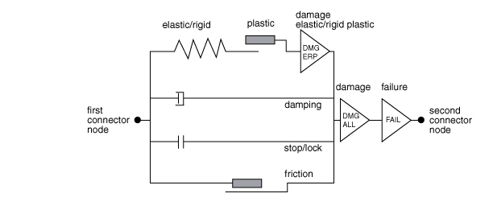
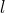
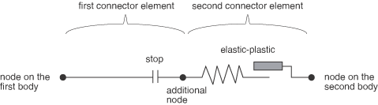
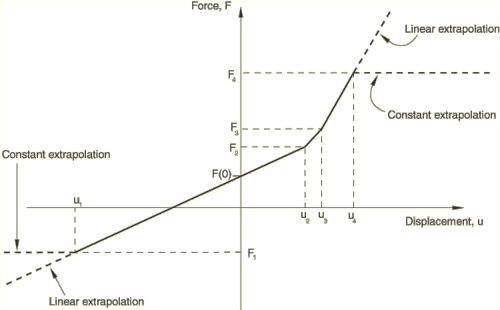
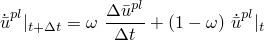
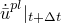
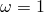

# 31.2.1 连接器行为


**产品：** Abaqus/Standard  Abaqus/Explicit  Abaqus/CAE

##### **参考文献**

- ["连接器概述，" 31.1.1节](pt06ch31s01abo28.md)
- ["连接器弹性行为，" 31.2.2节](pt06ch31s02alm28.md)
- ["连接器阻尼行为，" 31.2.3节](pt06ch31s02alm29.md)
- ["耦合行为的连接器函数，" 31.2.4节](pt06ch31s02alm30.md)
- ["连接器摩擦行为，" 31.2.5节](pt06ch31s02alm31.md)
- ["连接器塑性行为，" 31.2.6节](pt06ch31s02alm32.md)
- ["连接器损伤行为，" 31.2.7节](pt06ch31s02alm33.md)
- ["连接器止挡和锁，" 31.2.8节](pt06ch31s02alm34.md)
- ["连接器失效行为，" 31.2.9节](pt06ch31s02alm35.md)
- ["连接器单轴行为，" 31.2.10节](pt06ch31s02alm36.md)
- [*CONNECTOR BEHAVIOR](../key/key-link.md#usb-kws-mconnectorbehavior)
- [*CONNECTOR CONSTITUTIVE REFERENCE](../key/key-link.md#usb-kws-mconnectorconstref)
- [*CONNECTOR SECTION](../key/key-link.md#usb-kws-mconnectorsection)
- ["创建连接器截面，" Abaqus/CAE用户指南15.12.11节](../usi/usi-link.md#usi-itn-help-createconnprop)
- ["定义参考长度，" Abaqus/CAE用户指南15.17.12节](../usi/usi-link.md#usi-itn-help-reflength)
- ["定义时间积分，" Abaqus/CAE用户指南15.17.13节](../usi/usi-link.md#usi-itn-help-integration)

### 概述

连接器行为：
- 可为具有可用相对运动分量的连接类型定义；
- 可包含简单的弹簧、阻尼器和节点对节点接触作为特定应用；
- 可包括对未受约束相对运动分量的力对位移和力对速度行为的线性或非线性定义；
- 可包括非耦合或耦合行为规范；
- 可允许摩擦力由连接中的任何力或力矩在未受约束相对运动分量中产生；
- 可允许使用用户定义的屈服函数为单独分量或耦合塑性定义指定塑性；
- 可用于指定具有各种损伤演化定律的复杂损伤机制；
- 可提供用户定义的锁定标准，以将连接器单元中的所有相对运动或单个未受约束相对运动锁定在当前位置；
- 可用于指定连接器单元的失效；以及
- 可用于通过在可用相对运动分量中指定加载和卸载行为来指定复杂的单轴模型。

### 将连接器行为分配给连接器单元

您可以将连接器行为的名称分配给特定的连接器单元。

| **输入文件用法：** | 使用以下选项定义连接器行为： |
| --- | --- |
|  | ``` [*CONNECTOR SECTION](../key/key-link.md#usb-kws-mconnectorsection), ELSET=*name*, BEHAVIOR=*behavior name* [*CONNECTOR BEHAVIOR](../key/key-link.md#usb-kws-mconnectorbehavior), NAME=*behavior name* ``` |

| **Abaqus/CAE用法：** | 相互作用模块： ****Connector****Section****Create****：**Name:** *connector section name*：****Behavior Options**，****Add********Connector****Assignment****Create****：选择线：**Section**：*connector section name* |
| --- | --- |

### 连接器行为模型

连接器行为允许对以下类型的效果进行建模：
- 弹簧类弹性行为；
- 刚性类弹性行为；
- 阻尼器类（阻尼）行为；
- 摩擦；
- 塑性；
- 损伤；
- 止挡；
- 锁；
- 失效；和
- 单轴行为。

动力学行为只能在与连接器行为的可用相对运动分量中指定。每个连接器类型可用的相对运动分量列表在["连接类型库，" 31.1.5节](pt06ch31s01aus114.md)中给出。连接器行为可按以下方式指定：
- 非耦合：行为分别在单独的可用相对运动分量中指定；
- 耦合：所有或多个可用相对运动分量同时以耦合方式用于定义行为；或
- 组合：同时使用非耦合和耦合定义的组合。

[图31.2.1-1](pt06ch31s02alm27.md#usb-elm-econnectbehav-conceptual)展示了连接器行为如何相互作用的概念模型。大多数行为（弹性、阻尼、止挡、锁、摩擦）并行运作。塑性模型始终与弹簧类或刚性类弹性定义结合定义。损伤导致的退化可单独为弹性-塑性或刚性-塑性响应指定，或为整个连接器中的动力学响应指定。失效行为将应用于整个连接器响应。

**图31.2.1-1** 连接器行为的概念说明。



允许同一行为类型有多个定义。例如，如果在同一可用相对运动分量中以非耦合方式（或以耦合方式，或以两种方式）多次定义连接器弹性（或阻尼），弹簧类（或阻尼器类）响应将相加。只要遵循相应行为部分中概述的规则，允许摩擦、塑性和损伤行为的多个定义。允许同一分量的多个非耦合止挡和锁定义，但一次只能强制执行一个。

### 定义耦合和非耦合连接器行为

在许多情况下，连接器行为以非耦合方式在单个可用相对运动分量中指定。耦合行为可为连接器中的所有或部分可用相对运动分量定义。

对于耦合塑性、损伤和在某些情况下的摩擦行为，必须定义描述耦合效果性质的附加函数（参见["耦合行为的连接器函数，" 31.2.4节](pt06ch31s02alm30.md)）。这些函数本身不定义行为，而是用作构建所需行为的工具。例如，这些函数可用于定义：
- 耦合塑性行为连接器力空间中的复杂屈服函数；
- 摩擦行为的摩擦生成接触力；或
- 损伤行为规范中所需的力或相对运动幅度测量。

| **输入文件用法：** | 使用以下输入定义非耦合行为： |
| --- | --- |
|  | ``` **CONNECTOR BEHAVIOR OPTION*, COMPONENT=*n* ``` 使用以下输入定义耦合行为： ``` **CONNECTOR BEHAVIOR OPTION* ``` |

| **Abaqus/CAE用法：** | 相互作用模块：连接器截面编辑器： ****Add*****connector behavior*****：**Coupling：****Uncoupled** 或 ****Coupled** |
| --- | --- |

### 定义依赖于相对位置或本构位移/旋转的非线性连接器行为属性

在所有非线性非耦合连接器动力学行为中，独立变量是定义响应的方向的可用分量。在对以下连接器行为进行建模时，属性也可依赖于多个分量方向上的相对位置或本构位移/旋转：
- 连接器弹性，
- 连接器阻尼，
- 连接器导出分量，和
- 连接器摩擦。

在对连接器单轴行为进行建模时，属性也可依赖于多个分量方向上的本构位移/旋转；参见["连接器单轴行为，" 31.2.10节](pt06ch31s02alm36.md)获取更多信息。

| **输入文件用法：** | 使用以下选项指定连接器行为属性依赖于行为定义中包含的相对位置分量： |
| --- | --- |
|  | ``` **CONNECTOR BEHAVIOR OPTION*, INDEPENDENT COMPONENTS=POSITION (default) ``` 使用以下选项指定连接器行为属性依赖于包含的本构相对位移或旋转分量： ``` **CONNECTOR BEHAVIOR OPTON*, INDEPENDENT COMPONENTS=CONSTITUTIVE MOTION ``` 在任一情况下，第一数据行标识用于确定依赖关系的独立分量号，连接器行为定义的附加数据从第二数据行开始。 |

| **Abaqus/CAE用法：** | 对于弹性或阻尼行为，使用以下输入指定连接器行为属性依赖于相对位置或本构相对位移/旋转： |
| --- | --- |
|  | 相互作用模块：连接器截面编辑器： ****Add****Elasticity**** 或 ****Damping**：****Coupling：****Coupled on position** 或 ****Coupled on motion**，选择分量并输入数据 对于连接器导出分量，使用以下输入指定连接器行为属性依赖于相对位置或本构相对位移/旋转： 相互作用模块：连接器截面编辑器： ****Add****Friction****、****Plasticity**** 或 ****Damage**：****Force Potential****、****Initiation Potential**** 或 ****Evolution Potential** 指定导出分量，****Use local directions**：****Independent position components** 或 ****Independent constitutive motion components**，选择分量并输入数据 对于指定内部接触力的摩擦行为，使用以下输入指定连接器行为属性依赖于相对位置或本构相对位移/旋转： 相互作用模块：连接器截面编辑器： ****Add****Friction****：****Friction model**：****User-defined**，****Contact Force**，****Use independent components：Position** 或 ****Motion**，选择分量并输入数据 |

### 定义用于本构响应的参考长度和角度

在许多连接器行为定义中，材料类行为具有不同的参考位置，力和力矩为零，这与初始位置不同。例如，这在初始配置中具有非零力或力矩的弹簧中就是这种情况。在这些情况下，最方便的方式是相对于名义或参考几何定义连接器行为，此时力和力矩为零。

您可以通过指定多达六个参考值（每个相对运动分量一个）来定义力和矩为零的平移或角位置：三个长度和三个角度（以度为单位）。参考长度和角度仅影响弹簧类连接器弹性行为，如果摩擦生成接触力（矩）是相对位移（旋转）的函数，则影响连接器摩擦行为。默认情况下，参考长度和角度是由初始几何确定的长度值和角度值。参见["连接类型库，" 31.1.5节](pt06ch31s01aus114.md)获取每个连接类型的参考长度和角度的含义。

| **输入文件用法：** | ``` [*CONNECTOR CONSTITUTIVE REFERENCE](../key/key-link.md#usb-kws-mconnectorconstref) *length 1*, *length 2*, *length 3*, *angle 1*, *angle 2*, *angle 3* ``` |
| --- | --- |

| **Abaqus/CAE用法：** | 相互作用模块：连接器截面编辑器： ****Add****Reference Length****：****Length associated with *CORM*** |
| --- | --- |

#### 定义预压缩或预拉伸线性弹性行为

在许多情况下，连接器在装配时是预压缩或预拉伸的。在这种情况下，连接器力在初始配置中不为零。虽然可以使用非线性弹性来定义初始配置中的非零力，但通常更方便的是指定（线性）弹簧刚度加上力或矩为零的参考长度或角度。例如，用连接类型AXIAL定义的线性非耦合弹性行为，力由以下方程给出


其中。是AXIAL连接的当前长度，是用户定义的构成长度。连接器本构位移量，对于不同的连接类型在["连接类型库，" 31.1.5节](pt06ch31s01aus114.md)中描述。

#### 示例

[图31.2.1-2](pt06ch31s02alm27.md#econnector-shock-usb-elm-econnectorbehavior-reflengths)中减震器的连接器模型输入文件模板在["连接器概述，" 31.1.1节](pt06ch31s01abo28.md)中给出。为非线性扭簧定义了22.5度的参考角度，作为连接器本构参考中的第四个数据项（对应于连接器的第四个相对运动分量）：

```
[*CONNECTOR BEHAVIOR](../key/key-link.md#usb-kws-mconnectorbehavior), NAME=sbehavior
*...*
[*CONNECTOR CONSTITUTIVE REFERENCE](../key/key-link.md#usb-kws-mconnectorconstref)
 , , , 22.5
```
此参考角度的效果是非线性扭簧在22.5度时具有零力矩。

**图31.2.1-2** 减震器的简化连接器模型。


### 在Abaqus/Explicit中定义本构响应的时间积分方法

在Abaqus/Explicit中，连接器单元中的运动约束、止挡、锁和驱动运动采用隐式时间积分处理。默认情况下，连接器本构行为（如弹性、阻尼和摩擦）也是隐式积分的。隐式时间积分的优点是具有这些行为的单元不会以任何方式影响分析的稳定性或时间增量。

当用连接器模拟"软"弹簧时，可使用更传统的本构响应显式时间积分。这种显式时间积分可能会稍微提高计算性能。然而，相对较硬弹簧的显式积分将减小全局时间增量大小，因为此类连接器单元包含在稳定时间增量大小计算中。

| **输入文件用法：** | 使用以下选项指定本构响应的隐式积分： |
| --- | --- |
|  | ``` [*CONNECTOR BEHAVIOR](../key/key-link.md#usb-kws-mconnectorbehavior), INTEGRATION=IMPLICIT ``` 使用以下选项指定本构响应的显式积分： ``` [*CONNECTOR BEHAVIOR](../key/key-link.md#usb-kws-mconnectorbehavior), INTEGRATION=EXPLICIT ``` |

| **Abaqus/CAE用法：** | 相互作用模块：连接器截面编辑器： ****Add****Integration****：**Integration**：****Implicit** 或 ****Explicit** |
| --- | --- |

### 在线形摄动过程中定义连接器行为

在线形摄动过程中（参见["一般和线性摄动过程，" 6.1.3节](pt03ch06s01aus44.md)），连接器单元运动学在基态周围线性化。因此，应用运动约束的线性化版本，连接器行为在前一个一般分析步骤结束时的状态周围线性化。

### 串联或并联使用多个连接器

连接器单元行为允许在单个连接器单元内对大多数物理连接行为进行适当建模。然而，在极少数情况下，更复杂的连接行为可能需要串联或并联使用多个连接器单元。您可以通过在同一节点之间定义两个或多个连接器单元来并联放置连接器单元。您通过指定附加节点（通常在与感兴趣的节点相同的位置）然后在這些节点之间串联连接器单元来串联放置连接器。

例如，假设您希望定义一个在接触时表现出弹塑性行为的连接器止挡。由于这在同一连接器行为定义中不允许，您可以通过串联使用两个连接器单元来规避此限制。[图31.2.1-3](pt06ch31s02alm27.md#usb-elm-econnectbehav-series)说明了这个概念。第一个连接器定义止挡，第二个定义弹塑性行为。由于两个单元都承受相同的载荷（因为它们串联），因此获得所需的行为。

**图31.2.1-3** 串联的两个连接器单元/行为的概念说明。



也可以并联使用连接器来模拟复杂的动力学行为。例如，假设您需要在并联中定义具有弹簧类和阻尼器类行为的弹性粘性连接器（例如汽车悬架中的减震柱）。假设只有在拉伸/压缩超过指定限制后，阻尼器才会发生损伤。由于这在同一连接器行为定义中不允许，您可以通过并联使用两个连接器单元来规避此限制。[图31.2.1-4](pt06ch31s02alm27.md#usb-elm-econnectbehav-parallel)说明了这个概念。

**图31.2.1-4** 并联的两个连接器单元/行为的概念说明。


第一个连接器定义弹性行为，第二个定义阻尼器行为。由于两个连接器单元并联，它们经历相同的运动（拉伸/压缩）。可以基于运动的损伤行为（参见["连接器损伤行为，" 31.2.7节](pt06ch31s02alm33.md)）用于退化第二个单元中的整个行为。因此，最终只有阻尼器行为会退化。

### 使用表格数据定义连接器行为

表格数据通常用于定义连接器行为，如非线性弹性、各向同性硬化等。如[图31.2.1-5](pt06ch31s02alm27.md#espring-nonlinear-usb-elm-econnectorbehavior)所示，数据点在构型空间中构成非线性曲线。

**图31.2.1-5** 定义为表格数据的非线性连接器行为。



下面描述了定义表格查找的选项。

#### 外推选项

默认情况下，因变量在外推（使用与曲线端点对应的值作为常数值）时，在独立变量指定范围外进行外推。此选择可能导致零刚度响应，可能导致收敛问题。您可以指定线性外推，假设曲线端点给出的斜率保持不变，在独立变量指定范围外对因变量进行线性外推。外推行为如[图31.2.1-5](pt06ch31s02alm27.md#espring-nonlinear-usb-elm-econnectorbehavior)所示。

您可以为所有连接器行为全局定义外推选择，但可以单独为以下连接器行为重新定义外推选择：
- 连接器弹性；
- 连接器塑性（连接器硬化）；
- 连接器阻尼；
- 连接器单元的导出分量；
- 连接器摩擦；
- 连接器损伤（连接器损伤起始和演化）；
- 连接器锁；和
- 连接器单轴行为。

Abaqus/CAE不支持连接器止挡和锁行为选项的表格数据。

##### 为所有连接器行为指定常数外推

您可以为所有连接器行为的表格数据指定常数外推。

| **输入文件用法：** | ``` [*CONNECTOR BEHAVIOR](../key/key-link.md#usb-kws-mconnectorbehavior), EXTRAPOLATION=CONSTANT (default) ``` |
| --- | --- |

| **Abaqus/CAE用法：** | 相互作用模块：连接器截面编辑器：****Table Options****选项卡：****Extrapolation**：****Constant** |
| --- | --- |

##### 为所有连接器行为指定线性外推

您可以为所有连接器行为的表格数据指定线性外推。

| **输入文件用法：** | ``` [*CONNECTOR BEHAVIOR](../key/key-link.md#usb-kws-mconnectorbehavior), EXTRAPOLATION=LINEAR ``` |
| --- | --- |

| **Abaqus/CAE用法：** | 相互作用模块：连接器截面编辑器：****Table Options****选项卡：****Extrapolation**：****Linear** |
| --- | --- |

##### 重新定义单个连接器行为的外推选择

您可以重新定义单个连接器行为的外推选择。

| **输入文件用法：** | 使用以下任一选项： |
| --- | --- |
|  | ``` **CONNECTOR BEHAVIOR OPTION*, EXTRAPOLATION=CONSTANT ``` ``` **CONNECTOR BEHAVIOR OPTION*, EXTRAPOLATION=LINEAR ``` 例如，使用以下选项对除连接器弹性外的所有连接器行为使用常数外推： ``` [*CONNECTOR BEHAVIOR](../key/key-link.md#usb-kws-mconnectorbehavior), EXTRAPOLATION=CONSTANT ``` ``` [*CONNECTOR ELASTICITY](../key/key-link.md#usb-kws-mconnectorelasticity), EXTRAPOLATION=LINEAR ``` |

| **Abaqus/CAE用法：** | 对弹性、阻尼、摩擦、塑性和损伤行为使用以下输入： |
| --- | --- |
|  | 相互作用模块：连接器截面编辑器：****Behavior Options****选项卡：****Table Options****按钮：****Extrapolation**：切换关闭****Use behavior settings****并选择****Constant****或****Linear**** 对连接器导出分量使用以下输入： 相互作用模块：导出分量编辑器：****Add****：****Table Options****按钮：****Extrapolation**：切换关闭****Use behavior settings****并选择****Constant****或****Linear**** |

#### Abaqus/Explicit的正则化选项

默认情况下，Abaqus/Explicit将数据正则化为以独立变量均匀间隔定义的表格，因为如果插值来自独立变量的均匀间隔，表格查找最为经济。在某些情况下，当需要准确捕获连接器行为中的剧烈变化时，您可以通过关闭正则化直接使用用户定义的表格连接器行为数据。然而，表格查找将比使用均匀间隔更具计算成本。因此，几乎总是建议使用正则化。

Abaqus/Explicit使用容差来正则化输入数据。独立变量范围内间隔的数量选择为，使得分段线性正则化数据与您定义的每个点之间的误差小于因变量范围的容差乘以默认值0.03。在某些情况下，当因量以不均匀间隔的独立变量定义且独立变量的范围相对于最小间隔较大时，Abaqus/Explicit可能无法以合理数量的间隔获得数据的准确正则化。在这种情况下，Abaqus/Explicit在处理所有数据后停止并发出错误消息，您必须重新定义行为数据。参见["材料数据定义，" 21.1.2节](pt05ch21s01aus109.md)获取数据正则化的更详细讨论。

您可以全局为所有连接器行为定义正则化选择和正则化容差，但可以单独为以下连接器行为重新定义正则化选择和正则化容差：
- 连接器弹性；
- 连接器塑性（连接器硬化）
- 连接器阻尼；
- 连接器单元的导出分量；
- 连接器摩擦；
- 连接器损伤（连接器损伤起始和演化）；
- 连接器锁；和
- 连接器单轴行为。

Abaqus/CAE不支持连接器止挡和锁行为选项的表格数据。

##### 为所有连接器行为指定用户定义表格数据的正则化

您可以指定表格数据的正则化和要全局使用的正则化容差。

| **输入文件用法：** | ``` [*CONNECTOR BEHAVIOR](../key/key-link.md#usb-kws-mconnectorbehavior), REGULARIZE=ON (default), RTOL=*tolerance* ``` |
| --- | --- |

| **Abaqus/CAE用法：** | 相互作用模块：连接器截面编辑器：****Table Options****选项卡：****Regularization**：切换打开****Regularize data (Explicit only)****，****Specify**：*tolerance* |
| --- | --- |

##### 为所有连接器行为指定不使用正则化的用户定义表格数据

您可以通过关闭所有连接器行为的正则化来直接指定用户定义的表格数据。

| **输入文件用法：** | ``` [*CONNECTOR BEHAVIOR](../key/key-link.md#usb-kws-mconnectorbehavior), REGULARIZE=OFF ``` |
| --- | --- |

| **Abaqus/CAE用法：** | 相互作用模块：连接器截面编辑器：****Table Options****选项卡：****Regularization**：切换关闭****Regularize data (Explicit only)**** |
| --- | --- |

##### 重新定义单个连接器行为的正则化选项

您可以重新定义单个连接器行为的正则化和正则化容差选择。

| **输入文件用法：** | 使用以下任一选项： |
| --- | --- |
|  | ``` **CONNECTOR BEHAVIOR OPTION*, REGULARIZE=ON, RTOL=*tolerance* ``` ``` **CONNECTOR BEHAVIOR OPTION*, REGULARIZE=OFF ``` 例如，使用以下选项对除连接器弹性外的所有连接器行为正则化用户定义数据： ``` [*CONNECTOR BEHAVIOR](../key/key-link.md#usb-kws-mconnectorbehavior), REGULARIZE=ON, RTOL=0.05 ``` ``` [*CONNECTOR ELASTICITY](../key/key-link.md#usb-kws-mconnectorelasticity), REGULARIZE=OFF ``` |

| **Abaqus/CAE用法：** | 对弹性、阻尼、摩擦、塑性和损伤行为使用以下输入： |
| --- | --- |
|  | 相互作用模块：连接器截面编辑器：****Behavior Options****选项卡：****Table Options****按钮：****Regularization**：切换关闭****Use behavior settings****；切换打开****Regularize data (Explicit only)****和****Specify**：*tolerance*，或切换关闭****Regularize data (Explicit only)**** 对连接器导出分量使用以下输入： 相互作用模块：导出分量编辑器：****Add****：****Table Options****按钮：****Regularization**：切换关闭****Use behavior settings****；切换打开****Regularize data (Explicit only)****和****Specify**：*tolerance*，或切换关闭****Regularize data (Explicit only)**** |

#### 率相关数据的评估

连接器塑性中的表格各向同性硬化数据（["定义各向同性硬化分量通过指定表格数据"在"连接器塑性行为，" 31.2.6节](pt06ch31s02alm32.md#usb-elm-econnplastbehav-isohardtabular)）和塑性运动损伤起始准则（["基于塑性运动的损伤起始准则"在"连接器损伤行为，" 31.2.7节](pt06ch31s02alm33.md#usb-elm-econndamagebehav-plasticmotion)）可指定为依赖于等效相对塑性运动率。速率相关连接器单轴行为模型的加载/卸载数据可指定为依赖于变形率。

##### 指定率相关数据的线性间隔插值

默认情况下，Abaqus/Standard和Abaqus/Explicit使用相对运动率的线性间隔对率相关数据进行插值。

| **输入文件用法：** | 使用以下选项指定各向同性硬化数据的线性插值： |
| --- | --- |
|  | ``` [*CONNECTOR HARDENING](../key/key-link.md#usb-kws-mconnectorhardening), RATE INTERPOLATION=LINEAR ``` 使用以下选项指定损伤起始数据的线性插值： ``` [*CONNECTOR DAMAGE INITIATION](../key/key-link.md#usb-kws-mconnectordamageinit), RATE INTERPOLATION= LINEAR ``` 使用以下两个选项指定单轴行为加载/卸载数据的线性插值： ``` [*CONNECTOR UNIAXIAL BEHAVIOR](../key/key-link.md#usb-kws-mconnectorunibehavior) [*LOADING DATA](../key/key-link.md#usb-kws-mloadingdata), RATE INTERPOLATION=LINEAR ``` Abaqus/Standard始终使用等效相对塑性运动率的线性间隔对率相关数据进行插值。 |

| **Abaqus/CAE用法：** | 对各向同性硬化数据使用以下输入： |
| --- | --- |
|  | 相互作用模块：连接器截面编辑器： ****Add****Plasticity****：****Isotropic Hardening**：****Definition**：****Tabular**，****Table Options****按钮：****Interpolation**：****Linear**** 对损伤起始数据使用以下输入： 相互作用模块：连接器截面编辑器： ****Add****Damage****：****Initiation**：****Table Options****按钮：****Interpolation**：****Linear**** Abaqus/CAE中无法定义连接器单轴行为。 |

##### 在Abaqus/Explicit中指定率相关数据的对数间隔插值

在Abaqus/Explicit中，如果数据的率相关性以对数间隔测量，您可以指定使用相对运动率的对数间隔进行率相关数据插值。

| **输入文件用法：** | 使用以下选项指定各向同性硬化数据的线性插值： |
| --- | --- |
|  | ``` [*CONNECTOR HARDENING](../key/key-link.md#usb-kws-mconnectorhardening), RATE INTERPOLATION=LOGARITHMIC ``` 使用以下选项指定损伤起始数据的线性插值： ``` [*CONNECTOR DAMAGE INITIATION](../key/key-link.md#usb-kws-mconnectordamageinit), RATE INTERPOLATION=LOGARITHMIC ``` 使用以下两个选项指定单轴行为加载/卸载数据的线性插值： ``` [*CONNECTOR UNIAXIAL BEHAVIOR](../key/key-link.md#usb-kws-mconnectorunibehavior) [*LOADING DATA](../key/key-link.md#usb-kws-mloadingdata), RATE INTERPOLATION=LOGARITHMIC ``` |

| **Abaqus/CAE用法：** | 对各向同性硬化数据使用以下输入： |
| --- | --- |
|  | 相互作用模块：连接器截面编辑器： ****Add****Plasticity****：****Isotropic Hardening**：****Definition**：****Tabular**，****Table Options****按钮：****Interpolation**：****Logarithmic**** 对损伤起始数据使用以下输入： 相互作用模块：连接器截面编辑器： ****Add****Damage****：****Initiation**：****Table Options****按钮：****Interpolation**：****Logarithmic**** Abaqus/CAE中无法定义连接器单轴行为。 |

#### 在Abaqus/Explicit中过滤等效塑性运动率

速率敏感的连接器本构行为可能在显式动态分析中引入非物理高频振荡。为了克服这个问题，Abaqus/Explicit使用过滤的等效塑性运动率



用于评估率相关数据。是时间增量和分别是增量开始和结束时的塑性运动率。因子)有助于过滤与率相关连接器行为相关的高频振荡。您可以直接指定率过滤因子的值，。默认值为0.9。值为时不提供过滤，应谨慎使用。

| **输入文件用法：** | 使用以下任一选项： |
| --- | --- |
|  | ``` [*CONNECTOR HARDENING](../key/key-link.md#usb-kws-mconnectorhardening), RATE FILTER FACTOR= ``` ``` [*CONNECTOR DAMAGE INITIATION](../key/key-link.md#usb-kws-mconnectordamageinit), RATE FILTER FACTOR= ``` |

| **Abaqus/CAE用法：** | 对各向同性硬化数据使用以下输入： |
| --- | --- |
|  | 相互作用模块：连接器截面编辑器： ****Add****Plasticity****：****Isotropic Hardening**：****Definition**：****Tabular**，****Table Options****按钮：****Filter factor**：****Specify**：**Damage****：****Initiation**：****Table Options****按钮：****Filter factor**：****Specify**：![](../graphics/usb_eqn00348.gif] |
