# 31.2.3 连接器阻尼行为


**产品：** Abaqus/Standard  Abaqus/Explicit  Abaqus/CAE

##### **参考文献**

- ["连接器概述，" 31.1.1节](pt06ch31s01abo28.md)
- ["连接器行为，" 31.2.1节](pt06ch31s02alm27.md)
- [*CONNECTOR BEHAVIOR](../key/key-link.md#usb-kws-mconnectorbehavior)
- [*CONNECTOR DAMPING](../key/key-link.md#usb-kws-mconnectordamping)
- ["定义阻尼，" Abaqus/CAE用户指南15.17.2节](../usi/usi-link.md#usi-itn-help-damping)

### 概述

连接器阻尼行为：
- 在瞬态或稳态动态分析中可为粘性类阻尼器性质；
- 可为支持非对角阻尼的稳态动力学过程提供与复杂刚度相关的"结构"性质；
- 可在任何具有可用相对运动分量的连接器中定义；
- 可独立为每个可用相对运动分量指定，在这种情况下行为对于粘性阻尼可以是线性或非线性的；
- 可指定为依赖于多个局部方向上的相对位置或本构运动；以及
- 可为所有可用相对运动分量指定为耦合阻尼行为。

力和力矩作用的方向以及相对速度的测量方向由每个连接类型的局部方向决定，如["连接类型库，" 31.1.5节](pt06ch31s01aus114.md)中所述。在动态分析中，相对速度作为积分算子的一部分获得；在Abaqus/Standard的准静态分析中，相对速度通过将相对位移增量除以时间增量获得。

### 定义线性非耦合粘性阻尼行为

在线性非耦合阻尼的最简单情况下，您为选定的分量定义阻尼系数（即，分量1的、分量2的等），用于方程


其中是相对运动分量中的力或力矩，是方向上的速度或角速度。阻尼系数可依赖于频率（Abaqus/Standard中）、温度和场变量。参见["输入语法规则，" 1.2.1节](pt01ch01s02aus01.md)获取将数据定义为频率、温度和场变量函数的更多信息。

如果在除直接解稳态动力学之外的Abaqus/Standard分析过程指定了频率相关阻尼行为，将使用给定最低频率的数据。

| **输入文件用法：** | 使用以下选项定义线性非耦合阻尼连接器行为： |
| --- | --- |
|  | ``` [*CONNECTOR BEHAVIOR](../key/key-link.md#usb-kws-mconnectorbehavior), NAME=*name* [*CONNECTOR DAMPING](../key/key-link.md#usb-kws-mconnectordamping), COMPONENT=*component number*, DEPENDENCIES=*n* ``` |

| **Abaqus/CAE用法：** | 相互作用模块：连接器截面编辑器： ****Add****Damping****：****Definition：Linear**，****Force/Moment：****component or components**，****Coupling：Uncoupled** |
| --- | --- |

### 定义线性耦合粘性阻尼行为

在线性耦合情况下，定义阻尼系数矩阵分量，，用于方程

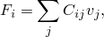

其中是相对运动分量中的力，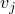是分量中的速度，是和分量之间的耦合。假设C矩阵是对称的，因此只指定矩阵的上三角。对于具有运动约束的连接器，对应于受约束相对运动分量的条目将被忽略。阻尼系数可依赖于温度和场变量。参见["输入语法规则，" 1.2.1节](pt01ch01s02aus01.md)获取将数据定义为温度和场变量函数的更多信息。

| **输入文件用法：** | 使用以下选项定义线性耦合阻尼连接器行为： |
| --- | --- |
|  | ``` [*CONNECTOR BEHAVIOR](../key/key-link.md#usb-kws-mconnectorbehavior), NAME=*name* [*CONNECTOR DAMPING](../key/key-link.md#usb-kws-mconnectordamping), DEPENDENCIES=*n* ``` |

| **Abaqus/CAE用法：** | 相互作用模块：连接器截面编辑器： ****Add****Damping****：****Definition：Linear**，****Force/Moment：****component or components**，****Coupling：Coupled** |
| --- | --- |

### 定义非对称线性耦合粘性阻尼行为

与线性耦合弹性行为一样（["连接器弹性行为，" 31.2.2节](pt06ch31s02alm28.md)），Abaqus/Standard允许您定义非对称耦合粘性阻尼矩阵。在线性耦合情况下，定义阻尼系数矩阵分量，，用于方程


其中是相对运动分量中的力，是分量中的速度，是和分量之间的耦合。假设C矩阵是非对称的，因此指定整个矩阵。对应于受约束相对运动分量的条目被忽略。当使用非对称矩阵存储和求解方案时，阻尼系数可依赖于频率、温度和场变量。参见["输入语法规则，" 1.2.1节](pt01ch01s02aus01.md)获取将数据定义为频率、温度和场变量函数的更多信息。

| **输入文件用法：** | 使用以下选项定义非对称线性耦合粘性阻尼连接器行为： |
| --- | --- |
|  | ``` [*CONNECTOR BEHAVIOR](../key/key-link.md#usb-kws-mconnectorbehavior), NAME=*name* [*CONNECTOR DAMPING](../key/key-link.md#usb-kws-mconnectordamping), UNSYMM, FREQUENCY DEPENDENCE=ON ``` |

| **Abaqus/CAE用法：** | Abaqus/CAE不支持非对称线性耦合粘性阻尼行为。 |
| --- | --- |

### 定义非线性粘性阻尼行为

对于非线性阻尼，您将力或力矩指定为可用相对运动分量方向上速度的非线性函数，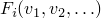。这些函数也可依赖于温度和场变量。参见["输入语法规则，" 1.2.1节](pt01ch01s02aus01.md)获取将数据定义为温度和场变量函数的更多信息。

#### 定义依赖于一个分量方向非线性粘性阻尼行为

默认情况下，每个非线性力或力矩函数仅依赖于指定相对运动分量方向上的速度。

| **输入文件用法：** | 使用以下选项： |
| --- | --- |
|  | ``` [*CONNECTOR BEHAVIOR](../key/key-link.md#usb-kws-mconnectorbehavior), NAME=*name* [*CONNECTOR DAMPING](../key/key-link.md#usb-kws-mconnectordamping), COMPONENT=*component number*, NONLINEAR, DEPENDENCIES=*n* ``` |

| **Abaqus/CAE用法：** | 相互作用模块：连接器截面编辑器： ****Add****Damping****：****Definition：Nonlinear**，****Force/Moment：****component or components**，****Coupling：Uncoupled** |
| --- | --- |

#### 定义依赖于多个分量方向非线性粘性阻尼行为

或者，函数可依赖于多个分量方向上的相对位置或本构位移/旋转，如["定义非线性连接器行为属性以依赖于相对位置或本构位移/旋转"在"连接器行为，" 31.2.1节](pt06ch31s02alm27.md#usb-elm-econnectbehav-indcomps)中所述。

| **输入文件用法：** | 使用以下选项定义依赖于相对位置分量的非线性阻尼连接器行为： |
| --- | --- |
|  | ``` [*CONNECTOR BEHAVIOR](../key/key-link.md#usb-kws-mconnectorbehavior), NAME=*name* [*CONNECTOR DAMPING](../key/key-link.md#usb-kws-mconnectordamping), COMPONENT=*component number*, NONLINEAR, INDEPENDENT COMPONENTS=POSITION, DEPENDENCIES=*n* ``` 使用以下选项定义依赖于本构位移或旋转分量的非线性阻尼连接器行为： ``` [*CONNECTOR BEHAVIOR](../key/key-link.md#usb-kws-mconnectorbehavior), NAME=*name* [*CONNECTOR DAMPING](../key/key-link.md#usb-kws-mconnectordamping), COMPONENT=*component number*, NONLINEAR, INDEPENDENT COMPONENTS=CONSTITUTIVE MOTION, DEPENDENCIES=*n* ``` |

| **Abaqus/CAE用法：** | 相互作用模块：连接器截面编辑器： ****Add****Damping****：****Definition：Nonlinear**，****Force/Moment：****component or components**，****Coupling：Coupled on position** 或 ****Coupled on motion** |
| --- | --- |

### 示例

参见[图31.2.3-1](pt06ch31s02alm29.md#econnectorbehavior-shock-damping)中的示例。

**图31.2.3-1** 减震器的简化连接器模型。


除了抵抗相对旋转的扭转弹簧外，减震器还沿减震器线用阻尼器阻尼平移运动。要包含依赖于连接点之间相对位置的非线性阻尼器行为，使用以下输入：
```
[*CONNECTOR BEHAVIOR](../key/key-link.md#usb-kws-mconnectorbehavior), NAME=sbehavior
*...*
[*CONNECTOR DAMPING](../key/key-link.md#usb-kws-mconnectordamping), COMPONENT=1,
 INDEPENDENT COMPONENTS=POSITION, NONLINEAR
1
1500.0, 0.1, 0.0
1625.0, 0.2, 0.0
1750.0, 0.1, 10.0
1925.0, 0.2, 10.0
```

### 定义线性结构阻尼行为

结构连接器阻尼在支持非对角阻尼的稳态动力学和模态瞬态过程中支持（例如，直接解稳态动力学）。

#### 定义线性非耦合结构阻尼行为

定义选定分量的阻尼系数，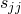（即，分量1的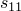、分量2的等），用于方程

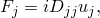

其中

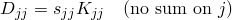

是结构阻尼矩阵，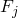是相对运动方向上力或力矩的虚部，是方向的位移，是刚度矩阵。阻尼系数可依赖于频率。

| **输入文件用法：** | 使用以下选项： |
| --- | --- |
|  | ``` [*CONNECTOR BEHAVIOR](../key/key-link.md#usb-kws-mconnectorbehavior), NAME=*name* [*CONNECTOR DAMPING](../key/key-link.md#usb-kws-mconnectordamping), COMPONENT=*component number*, TYPE=STRUCTURAL ``` |

| **Abaqus/CAE用法：** | Abaqus/CAE不支持线性非耦合结构阻尼行为。 |
| --- | --- |

#### 定义线性耦合结构阻尼行为

定义21个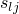阻尼系数（6×6阻尼系数矩阵的对称半部），用于方程

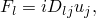

其中


是结构阻尼矩阵，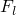是相对运动方向上力的虚部，是方向的位移，是刚度矩阵。阻尼系数矩阵不能依赖于频率。

| **输入文件用法：** | 使用以下选项： |
| --- | --- |
|  | ``` [*CONNECTOR BEHAVIOR](../key/key-link.md#usb-kws-mconnectorbehavior), NAME=*name* [*CONNECTOR DAMPING](../key/key-link.md#usb-kws-mconnectordamping), TYPE=STRUCTURAL ``` |

| **Abaqus/CAE用法：** | Abaqus/CAE不支持线性耦合结构阻尼行为。 |
| --- | --- |

### 在线形摄动过程中定义连接器阻尼行为

在直接解和基于子空间的稳态动态过程中，使用非耦合连接器阻尼行为定义的粘性或结构阻尼可能是频率相关的。在其他线性摄动过程中，连接器阻尼行为被忽略。

### 输出

连接器可用的Abaqus输出变量在["Abaqus/Standard输出变量标识符，" 4.2.1节](pt02ch04s02abv01.md)和["Abaqus/Explicit输出变量标识符，" 4.2.2节](pt02ch04s02xbv01.md)中列出。在连接器中定义阻尼时，以下输出变量特别令人关注：

| CV | 连接器相对速度/角速度。 |
| --- | --- |

| CVF | 连接器粘性力/力矩。 |
| --- | --- |
