# 31.2.7 连接器损伤行为


**产品：** Abaqus/Standard  Abaqus/Explicit  Abaqus/CAE

##### **参考文献**

- ["连接器概述，" 31.1.1节](pt06ch31s01abo28.md)
- ["连接器行为，" 31.2.1节](pt06ch31s02alm27.md)
- [*CONNECTOR BEHAVIOR](../key/key-link.md#usb-kws-mconnectorbehavior)
- [*CONNECTOR DAMAGE EVOLUTION](../key/key-link.md#usb-kws-mconnectordamageevol)
- [*CONNECTOR DAMAGE INITIATION](../key/key-link.md#usb-kws-mconnectordamageinit)
- [*CONNECTOR ELASTICITY](../key/key-link.md#usb-kws-mconnectorelasticity)
- [*CONNECTOR PLASTICITY](../key/key-link.md#usb-kws-mconnectorplasticity)
- [*CONNECTOR POTENTIAL](../key/key-link.md#usb-kws-mconnectorpotential)
- [*SECTION CONTROLS](../key/key-link.md#usb-kws-msectioncontrols)
- ["定义损伤，" Abaqus/CAE用户指南15.17.7节](../usi/usi-link.md#usi-itn-help-damage)

### 概述

连接器损伤行为：
- 可在任何具有可用相对运动分量的连接器中指定；
- 可用于降低连接器单元中的弹性、弹性-塑性或刚性塑性响应；
- 可使用基于力、基于运动或基于塑性运动的损伤起始准则来触发响应退化；
- 可使用基于（塑性）运动或基于能量的损伤演化定律来降低连接器中的力响应；
- 可以多种竞争损伤机制来定义；以及
- 可仅用作接近损伤起始点的指示器，而不降低连接器响应。

### 连接器中的损伤 formulation

如果连接中的相对力或运动超过临界值，连接器开始发生不可逆损伤（退化）。随着额外加载，损伤进一步演化导致最终失效。如果发生损伤，连接器分量*i*中的力响应将根据以下一般形式变化：


其中是标量损伤变量，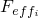是在无损伤情况下的可用相对运动分量*i*中的响应（有效响应）。

要定义连接器损伤机制，请指定以下内容：
- 损伤起始准则；和
- 指定损伤变量*d*如何演化的损伤演化定律（可选）。

在损伤起始之前，*d*值为0.0；因此，连接器中的力响应不发生变化。一旦损伤起始，如果指定了损伤演化，损伤变量将单调演化至最大值1.0。当*d*=1.0时发生完全失效。

Abaqus允许您指定最大退化值（默认值为1.0）；当损伤变量达到此值时，损伤演化将停止，并且默认情况下单元将从网格中删除。或者，您可以指定损伤连接器单元保持在分析中而不再继续损伤演化。最大退化值用于评估分析剩余部分中的损伤刚度。此功能在["节控制，" 27.1.4节](pt06ch27s01aus113.md#usb-elm-esectioncontrol-deletion)中的"控制材料损伤演化的单元删除和最大退化"中有详细讨论。

### 定义连接器损伤起始

当连接器中的力或相对运动满足某些准则时，连接器中的退化过程开始。有三种不同的准则类型可用于触发连接器中的损伤：基于力的准则、基于塑性运动的准则或基于本构运动的准则。可为每个分量独立（非耦合）指定可用相对运动分量的连接器损伤起始准则。或者，可以定义耦合连接器中全部或部分可用相对运动分量的连接器损伤起始准则。

损伤起始准则可以依赖于温度和场变量。关于将数据定义为温度和场变量函数的信息，请参见["输入语法规则，" 1.2.1节](pt01ch01s02aus01.md)。

#### 基于力的损伤起始准则

默认情况下，损伤起始准则基于连接器中的力/力矩指定。必须为起始涉及的分量定义弹性或刚性连接器行为。您提供力/力矩损伤起始值的下限（压缩）和上限（拉伸）。如果力超出两个限值规定的范围，则损伤起始。输出变量CDIF可用于监测接近损伤起始点的程度。

##### 定义非耦合基于力的损伤起始

对于非耦合基于力的损伤起始准则，将指定分量中的连接器力与指定的限值进行比较。当指定分量*i*中的力，，首次超出范围时（或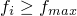），损伤起始。

| **输入文件用法：** | ``` [*CONNECTOR DAMAGE INITIATION](../key/key-link.md#usb-kws-mconnectordamageinit), COMPONENT=*component number*, CRITERION=FORCE (default), DEPENDENCIES=*n* ``` |
| --- | --- |

| **Abaqus/CAE用法：** | 相互作用模块：连接器截面编辑器：****Add****Damage****：****Coupling：Uncoupled****，****Initiation criterion：Force**** |
| --- | --- |

##### 定义耦合基于力的损伤起始

对于耦合基于力的损伤起始准则，必须指定连接器势函数来定义等效力大小（标量）。将等效力大小与指定的限值进行比较以评估损伤起始。当等效力大小，，首次超出范围时（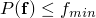或），损伤起始。

| **输入文件用法：** | 使用以下选项： |
| --- | --- |
|  | ``` [*CONNECTOR DAMAGE INITIATION](../key/key-link.md#usb-kws-mconnectordamageinit), CRITERION=FORCE (default), DEPENDENCIES=*n* [*CONNECTOR POTENTIAL](../key/key-link.md#usb-kws-mconnectorpotential) ``` |

| **Abaqus/CAE用法：** | 相互作用模块：连接器截面编辑器：****Add****Damage****：****Coupling：Coupled****，****Initiation criterion：Force****，****Initiation Potential**** |
| --- | --- |

#### 基于塑性运动的损伤起始准则

损伤起始准则可以基于连接器中的等效相对塑性运动来指定。您提供将启动损伤的相对等效塑性位移/旋转，作为相对等效塑性率的函数。输出变量CDIP可用于监测接近损伤起始点的程度。

##### 定义非耦合塑性损伤起始

对于非耦合弹性-塑性或刚性塑性损伤起始准则，必须在相对运动的指定分量中定义非耦合连接器塑性（参见["连接器塑性行为，" 31.2.6节](pt06ch31s02alm32.md)）。当由相关塑性定义定义的等效相对塑性运动首次大于指定限值时，损伤起始。

| **输入文件用法：** | 使用以下选项： |
| --- | --- |
|  | ``` [*CONNECTOR DAMAGE INITIATION](../key/key-link.md#usb-kws-mconnectordamageinit), COMPONENT=*component number*, CRITERION=PLASTIC MOTION, DEPENDENCIES=*n* [*CONNECTOR PLASTICITY](../key/key-link.md#usb-kws-mconnectorplasticity), COMPONENT=*component number* *or* [*CONNECTOR PLASTICITY](../key/key-link.md#usb-kws-mconnectorplasticity) ``` |

| **Abaqus/CAE用法：** | 相互作用模块：连接器截面编辑器：****Add****Damage****：****Initiation criterion：Plastic motion****；****Add****Plasticity**** |
| --- | --- |

##### 定义耦合塑性损伤起始

对于耦合弹性-塑性或刚性塑性损伤起始准则，必须定义耦合连接器塑性。耦合连接器塑性函数中使用的连接器势函数定义了等效相对塑性运动。将此等效相对塑性运动与指定的限值进行比较以评估损伤起始。损伤起始时的等效相对塑性运动可以是模式混合比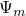的函数（参见["连接器塑性行为，" 31.2.6节](pt06ch31s02alm32.md)）。

| **输入文件用法：** | 使用以下选项： |
| --- | --- |
|  | ``` [*CONNECTOR DAMAGE INITIATION](../key/key-link.md#usb-kws-mconnectordamageinit), CRITERION=PLASTIC MOTION, DEPENDENCIES=*n* [*CONNECTOR PLASTICITY](../key/key-link.md#usb-kws-mconnectorplasticity) [*CONNECTOR POTENTIAL](../key/key-link.md#usb-kws-mconnectorpotential) ``` |

| **Abaqus/CAE用法：** | 相互作用模块：连接器截面编辑器：****Add****Damage****：****Coupling：Coupled****，****Initiation criterion：Plastic motion****；****Add****Plasticity****：****Coupling：Coupled****，****Force Potential**** |
| --- | --- |

#### 基于本构运动的损伤起始准则

损伤起始准则可以基于连接器中的相对本构位移/旋转来指定。您提供本构位移/旋转损伤起始值的下限（压缩）和上限（拉伸）。如果运动超出两个限值规定的范围，则损伤起始。输出变量CDIM可用于监测接近损伤起始点的程度。

##### 定义非耦合基于本构运动的损伤起始

对于非耦合基于运动的损伤起始准则，将指定分量中的连接器相对本构运动与指定的限值进行比较。当指定分量*i*中的相对本构位移/旋转，，首次超出范围时（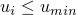或），损伤起始。

| **输入文件用法：** | ``` [*CONNECTOR DAMAGE INITIATION](../key/key-link.md#usb-kws-mconnectordamageinit), COMPONENT=*component number*, CRITERION=MOTION, DEPENDENCIES=*n* ``` |
| --- | --- |

| **Abaqus/CAE用法：** | 相互作用模块：连接器截面编辑器：****Add****Damage****：****Coupling：Uncoupled****，****Initiation criterion：Motion**** |
| --- | --- |

##### 定义耦合基于本构运动的损伤起始

对于耦合基于运动的损伤起始准则，必须指定连接器势函数来定义等效运动大小（标量），其中是连接器中所有可用相对运动分量的集合。将等效运动大小与指定的限值进行比较以评估损伤起始。当等效运动大小，，首次超出范围时（或），损伤起始。

| **输入文件用法：** | 使用以下选项： |
| --- | --- |
|  | ``` [*CONNECTOR DAMAGE INITIATION](../key/key-link.md#usb-kws-mconnectordamageinit), CRITERION=MOTION, DEPENDENCIES=*n* [*CONNECTOR POTENTIAL](../key/key-link.md#usb-kws-mconnectorpotential) ``` |

| **Abaqus/CAE用法：** | 相互作用模块：连接器截面编辑器：****Add****Damage****：****Coupling：Coupled****，****Initiation criterion：Motion****，****Initiation Potential**** |
| --- | --- |

### 定义连接器损伤演化

连接器损伤演化指定损伤变量的演化定律。演化时，连接器响应将退化。损伤的演化可以基于能量耗散准则或相对（塑性）运动。在基于运动的准则中，损伤变量*d*可以定义为相对运动的线性、指数或表格函数。

损伤演化定律可以依赖于温度和场变量。关于将数据定义为温度和场变量函数的信息，请参见["输入语法规则，" 1.2.1节](pt01ch01s02aus01.md)。

#### 指定受影响分量

默认情况下（即未明确指定受影响的分量），只有连接器中的弹性/刚性或弹性/刚性-塑性响应会受损。摩擦、阻尼和止挡/锁行为的响应不会退化。对于非耦合连接器损伤机制（非耦合损伤起始准则），只有指定的相对运动分量将发生损伤。对于耦合连接器损伤起始，默认情况下选择将退化的分量如下：
- 如果使用基于力或基于本构运动的损伤起始准则，则将影响最终贡献于损伤起始连接器势函数的固有可用分量（1到6）。
- 如果使用基于塑性运动的损伤起始准则，则将影响最终贡献于耦合塑性定义中使用的连接器势函数的固有可用分量。

或者，您可以直接指定将受损伤演化定律影响的相对运动分量。在这种情况下，受影响分量中的整个连接器响应（弹性/刚性-塑性、摩擦、阻尼、约束力和力矩等）将受损。

| **输入文件用法：** | ``` [*CONNECTOR DAMAGE EVOLUTION](../key/key-link.md#usb-kws-mconnectordamageevol), AFFECTED COMPONENTS ``` |
| --- | --- |
|  | 第一行标识将受损的分量编号，连接器损伤演化定义的附加数据从第二行开始。 |

| **Abaqus/CAE用法：** | 相互作用模块：连接器截面编辑器：****Add****Damage****：****Specify damage evolution****，****Evolution****，****Specify affected components**** |
| --- | --- |

#### 定义基于运动的线性损伤演化定律

损伤演化定律的线性形式在此以线性弹性为背景进行说明，尽管它可以在任何情况下使用。假设连接器响应是线性弹性的，并且希望在损伤起始后进行线性损伤演化，如图31.2.7-1所示。

**图31.2.7-1** 线性弹性连接器行为的线性损伤演化定律。

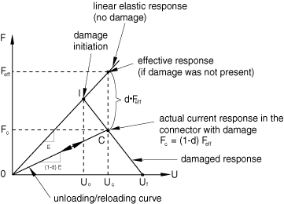

如果未指定损伤，则响应将是线性弹性的（通过原点的直线）。假设损伤已在I点起始，例如由基于力或基于运动的准则触发；此时相应的本构运动为。如果进一步加载连接器使得本构运动增加到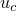，则C点处的连接器力响应变为。与有效响应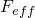（无损伤弹性响应）相比，响应降低了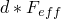。因此，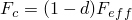。如果在C点发生卸载，则沿斜率的卸载曲线进行。只要本构运动不超过，损伤变量*d*就保持在首次达到C点时获得的值。如果继续加载，则继续发生损伤，直到达到极限失效运动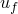（*d*=1），并且连接器分量失去承载任何载荷的能力。因此，一种可能的加载/卸载序列为OICOC。

线性损伤演化定律仅在线性弹性或具有可选理想塑性的刚性行为情况下定义真正线性损伤力响应。如果为受损分量定义了非线性弹性或具有硬化的塑性，则会观察到近似线性损伤响应。

##### 为基于力或基于本构运动的损伤起始准则定义线性演化定律

如果在分量*i*中使用了非耦合损伤起始准则，则指定极限失效时的本构相对运动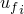与损伤起始时的本构相对运动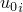之间的差值，在指定分量中（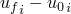）。

如果使用耦合损伤起始准则，则必须为损伤演化目的定义等效本构相对运动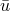。使用连接器势函数定义来定义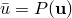。您指定极限失效时的等效运动与损伤起始时的等效运动之间的差值（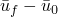）。

| **输入文件用法：** | 使用以下选项为非耦合起始准则定义线性演化定律： |
| --- | --- |
|  | ``` [*CONNECTOR DAMAGE INITIATION](../key/key-link.md#usb-kws-mconnectordamageinit), COMPONENT=*component number*, CRITERION=FORCE or MOTION [*CONNECTOR DAMAGE EVOLUTION](../key/key-link.md#usb-kws-mconnectordamageevol), TYPE=MOTION, SOFTENING=LINEAR ``` 使用以下选项为耦合起始准则定义线性演化定律： ``` [*CONNECTOR DAMAGE INITIATION](../key/key-link.md#usb-kws-mconnectordamageinit), CRITERION=FORCE or MOTION [*CONNECTOR POTENTIAL](../key/key-link.md#usb-kws-mconnectorpotential) [*CONNECTOR DAMAGE EVOLUTION](../key/key-link.md#usb-kws-mconnectordamageevol), TYPE=MOTION, SOFTENING=LINEAR [*CONNECTOR POTENTIAL](../key/key-link.md#usb-kws-mconnectorpotential) ``` 第二个[*CONNECTOR POTENTIAL](../key/key-link.md#usb-kws-mconnectorpotential)选项定义。 |

| **Abaqus/CAE用法：** | 使用以下输入为非耦合起始准则定义线性演化定律： |
| --- | --- |
|  | 相互作用模块：连接器截面编辑器：****Add****Damage****：****Coupling：Uncoupled****，****Initiation criterion：Force****或****Motion****；****Specify damage evolution****，****Evolution type：Motion****，****Evolution softening：Linear**** 使用以下输入为耦合起始准则定义线性演化定律：相互作用模块：连接器截面编辑器：****Add****Damage****：****Coupling：Coupled****，****Initiation criterion：Force****或****Motion****；****Specify damage evolution****，****Evolution type：Motion****，****Evolution softening：Linear****；****Initiation Potential****；****Evolution Potential**** |

##### 为基于塑性运动的损伤起始准则定义线性演化定律

您可以指定极限失效时的相关等效塑性相对运动与损伤起始时的相关等效塑性相对运动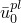之间的差值（），作为模式混合比的函数，定义于["连接器塑性行为，" 31.2.6节](pt06ch31s02alm32.md)。等效塑性相对运动从相关塑性定义（耦合或非耦合）计算。

| **输入文件用法：** | 使用以下选项： |
| --- | --- |
|  | ``` [*CONNECTOR DAMAGE INITIATION](../key/key-link.md#usb-kws-mconnectordamageinit), CRITERION=PLASTIC MOTION [*CONNECTOR DAMAGE EVOLUTION](../key/key-link.md#usb-kws-mconnectordamageevol), TYPE=MOTION, SOFTENING=LINEAR ``` |

| **Abaqus/CAE用法：** | 相互作用模块：连接器截面编辑器：****Add****Damage****：****Initiation criterion：Plastic motion****；****Specify damage evolution****，****Evolution type：Motion****，****Evolution softening：Linear**** |
| --- | --- |

#### 定义基于运动的指数损伤演化定律

损伤演化定律的指数形式在此以具有硬化的线性弹性-塑性响应为背景进行说明，尽管它可以在任何情况下使用。特定连接器分量中的力响应如图31.2.7-2所示。

**图31.2.7-2** 具有硬化的线性弹性-塑性连接器行为的指数损伤演化定律。


假设损伤在I点起始，由基于塑性运动的损伤起始准则触发。如果继续加载到C点，则响应为。从C点卸载沿斜率为的受损弹性线进行。在卸载/再加载时，损伤变量保持不变，直到再次达到C点。继续加载（超过C点）导致响应损伤程度不断增加，直到达到极限失效点（*d*=1）。损伤变量*d*由以下方程给出：

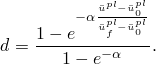

仅当使用线性弹性或理想塑性时，损伤响应才会呈现真正的指数形式。如果存在具有硬化的塑性，则会获得近似指数退化。

您指定极限失效和损伤起始之间的相对运动差值以及指数系数。相对运动差值的解释与["定义基于运动的线性损伤演化定律"](pt06ch31s02alm33.md#usb-elm-econnectbehav-linevol)中所述相同，如下所示：
- 如果使用非耦合基于力或基于本构运动的损伤起始准则，则指定指定分量*i*中极限失效和损伤起始时的相对运动差值。
- 如果使用耦合基于力或基于本构运动的损伤起始准则，则使用连接器势函数定义等效相对运动（）。指定极限失效和损伤起始时的相对运动差值。
- 如果使用基于塑性运动的损伤起始准则，则指定极限失效和损伤起始时的等效相对塑性运动差值。等效塑性相对运动从相关塑性定义计算。数据也可以是模式混合比的函数。

在前两种情况下，损伤变量方程与上面针对基于塑性运动损伤起始给出的方程类似，只是使用（等效）本构相对运动代替等效相对塑性运动。

| **输入文件用法：** | ``` [*CONNECTOR DAMAGE EVOLUTION](../key/key-link.md#usb-kws-mconnectordamageevol), TYPE=MOTION, SOFTENING=EXPONENTIAL ``` |
| --- | --- |

| **Abaqus/CAE用法：** | 相互作用模块：连接器截面编辑器：****Add****Damage****：****Specify damage evolution****，****Evolution type：Motion****，****Evolution softening：Exponential**** |
| --- | --- |

#### 定义基于运动的表格损伤演化定律

您也可以直接将损伤变量指定为极限失效相对运动与损伤起始相对运动之间差值的表格函数。相对运动差值的解释与["定义基于运动的线性损伤演化定律"](pt06ch31s02alm33.md#usb-elm-econnectbehav-linevol)中所述相同，如下所示：
- 如果使用非耦合基于力或基于本构运动的损伤起始准则，则使用指定分量*i*中极限失效和损伤起始时的本构相对运动差值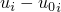来定义表格数据。
- 如果使用耦合基于力或基于本构运动的损伤起始准则，则使用连接器势函数定义等效相对运动（）。使用极限失效和损伤起始时的相对运动差值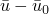来定义表格数据。
- 如果使用基于塑性运动的损伤起始准则，则使用极限失效和损伤起始时的等效相对塑性运动差值。等效塑性相对运动从相关塑性定义计算。表格数据也可以是模式混合比的函数。

| **输入文件用法：** | ``` [*CONNECTOR DAMAGE EVOLUTION](../key/key-link.md#usb-kws-mconnectordamageevol), TYPE=MOTION, SOFTENING=TABULAR, DEPENDENCIES=*n* ``` |
| --- | --- |

| **Abaqus/CAE用法：** | 相互作用模块：连接器截面编辑器：****Add****Damage****：****Specify damage evolution****，****Evolution type：Motion****，****Evolution softening：Tabular**** |
| --- | --- |

#### 使用损伤起始后耗散能定义损伤演化定律

此损伤演化定律以非线性弹性为背景进行说明，如图31.2.7-3所示。

**图31.2.7-3** 非线性弹性连接器行为的损伤起始后耗散能演化定律。

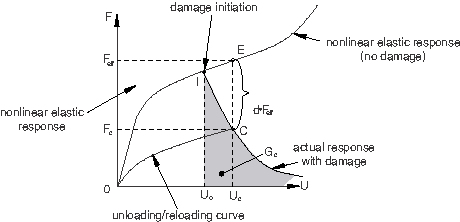

假设损伤在I点起始，当时本构相对运动为，由例如基于力或基于运动的损伤起始准则触发。C点的响应将为。从C点卸载沿CO曲线进行，这是原始非线性弹性响应曲线（OE）按（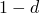）因子缩小后的曲线。损伤在卸载/再加载曲线（COC）上保持不变，仅在加载超过C点时才增加。

如果将指定为0.0，则可以在起始时指定瞬时失效。在所有其他情况下，理论上当运动趋于无穷大时（因为产生了渐近趋于零的指数类响应）才会发生最终失效（*d*=1）。当损伤耗散能达到0.99时，Abaqus将设置*d*=1。

您指定损伤起始后极限失效时的耗散能。如果使用基于塑性运动的起始准则，则可以指定为模式混合比的函数。

| **输入文件用法：** | ``` [*CONNECTOR DAMAGE EVOLUTION](../key/key-link.md#usb-kws-mconnectordamageevol), TYPE=ENERGY, DEPENDENCIES=*n* ``` |
| --- | --- |

| **Abaqus/CAE用法：** | 相互作用模块：连接器截面编辑器：****Add****Damage****：****Specify damage evolution****，****Evolution type：Energy**** |
| --- | --- |

### 使用多种损伤机制

对于每个可用相对运动分量，最多可以定义三个非耦合损伤机制（连接器损伤起始准则和连接器损伤演化定律对），每种起始准则类型（力、运动和塑性运动）一个。此外，可以定义三个耦合损伤机制（每种起始准则类型一个）。耦合和非耦合损伤定义可以组合；对于特定相对运动分量，每个分量仅使用一个总体损伤变量来使响应受损。仅输出总体损伤。

#### 指定每种损伤机制的贡献

当为同一连接器行为定义多种损伤机制时，您可以指定每种损伤机制对特定相对运动分量总体损伤效应的贡献。默认情况下，与特定机制相关的损伤值将与为连接器行为定义的任何其他损伤机制的损伤值进行比较，并且仅考虑最大值作为总体损伤。或者，您可以指定应将关联连接器行为的损伤值以乘法方式组合以获得总体损伤。请参阅下面的最后一个示例进行说明。

| **输入文件用法：** | 使用以下选项指定仅与特定连接器行为相关的最大损伤值应贡献于总体损伤效应： |
| --- | --- |
|  | ``` [*CONNECTOR DAMAGE EVOLUTION](../key/key-link.md#usb-kws-mconnectordamageevol), DEGRADATION=MAXIMUM ``` 使用以下选项指定与特定连接器行为相关的所有损伤值应以乘法方式贡献于总体损伤效应： ``` [*CONNECTOR DAMAGE EVOLUTION](../key/key-link.md#usb-kws-mconnectordamageevol), DEGRADATION=MULTIPLICATIVE ``` |

| **Abaqus/CAE用法：** | 相互作用模块：连接器截面编辑器：****Add****Damage****：****Specify damage evolution****，****Evolution****，****Degradation：Maximum****或****Multiplicative**** |
| --- | --- |

### 示例

以下示例说明定义损伤机制的多种方法。

#### 非耦合损伤

以下输入可用于定义简单的非耦合损伤机制：

```
[*CONNECTOR ELASTICITY](../key/key-link.md#usb-kws-mconnectorelasticity), COMPONENT=1
[*CONNECTOR DAMAGE INITIATION](../key/key-link.md#usb-kws-mconnectordamageinit), COMPONENT=1, CRITERION=FORCE
*force_compress*, *force_tens*
[*CONNECTOR DAMAGE EVOLUTION](../key/key-link.md#usb-kws-mconnectordamageevol), TYPE=ENERGY
0.0
```
当分量1中的弹性力小于*force_compress*或大于*force_tens*时，损伤将起始。仅分量1中的弹性响应会受损。由于为损伤演化指定的耗散能为0.0，损伤在起始后立即灾难性地演化。

#### 具有基于塑性的损伤的耦合刚性塑性

参考[图31.2.7-4](pt06ch31s02alm33.md#usb-elm-econnect-weldexample-damage)中的点焊，其中在["连接器塑性行为，" 31.2.6节](pt06ch31s02alm32.md)中定义了耦合塑性，可以按如下方式指定基于塑性运动的损伤起始和演化以及对模式混合比的依赖性：

**图31.2.7-4** 点焊连接。


```
[*PARAMETER](../key/key-link.md#usb-kws-mparameter)
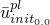=0.25
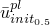=0.35
=0.45
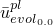=0.75
=0.78
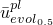=0.82
=0.85
[*CONNECTOR DAMAGE INITIATION](../key/key-link.md#usb-kws-mconnectordamageinit), CRITERION=PLASTIC MOTION
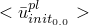, 0.0
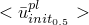, 0.5
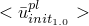, 1.0
[*CONNECTOR DAMAGE EVOLUTION](../key/key-link.md#usb-kws-mconnectordamageevol), TYPE=MOTION, SOFTENING=LINEAR
, 0.0
, 0.3
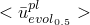, 0.5
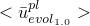, 1.0
```
数据行上的等效塑性相对运动由["连接器塑性行为，" 31.2.6节](pt06ch31s02alm32.md)中所示的相关耦合塑性定义定义。对于损伤演化，应指定损伤起始后的等效塑性相对运动。所有数据行中的第二列表示模式混合比，如["连接器塑性行为，" 31.2.6节](pt06ch31s02alm32.md)中所定义。在此特定情况下，模式混合比为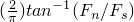。0.0处的数据点来自纯"剪切"实验，1.0处的数据点来自纯"法向"实验。中间值的数据来自组合"剪切-法向"实验。

#### 具有基于力的损伤起始和基于运动的损伤演化的耦合刚性塑性

参考[图31.2.7-4](pt06ch31s02alm33.md#usb-elm-econnect-weldexample-damage)中的点焊，并使用["为连接器单元定义导出分量"在"用于耦合行为的连接器函数，" 31.2.4节](pt06ch31s02alm30.md#usb-elm-econnectbehav-derivedcomps)中定义的导出分量`normal`和`shear`，定义点焊损伤的替代方法是使用：

```
[*PARAMETER](../key/key-link.md#usb-kws-mparameter)
=2
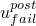=0.85
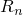=120.0
=115.0
[*CONNECTOR DAMAGE INITIATION](../key/key-link.md#usb-kws-mconnectordamageinit), CRITERION=FORCE
, 1.0
[*CONNECTOR POTENTIAL](../key/key-link.md#usb-kws-mconnectorpotential)
normal, 
shear, 
** 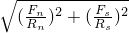
[*CONNECTOR DAMAGE EVOLUTION](../key/key-link.md#usb-kws-mconnectordamageevol), TYPE=MOTION, SOFTENING=EXPONENTIAL
, 
[*CONNECTOR POTENTIAL](../key/key-link.md#usb-kws-mconnectorpotential)
1
2
3
** 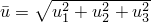
```
当由第一个连接器势函数定义定义的力大小超过指定值1.0时，损伤将起始。第一个势函数定义中的比例因子和在这种情况下用于定义在损伤起始时为1.0的力大小。选择基于运动的指数衰减损伤演化定律。第二个连接器势函数定义与连接器损伤演化定义相关，并定义连接中的等效运动。当等效起始后运动（其中是损伤起始时）达到时，发生极限失效。在这种情况下，所有分量（1到6）都受到影响，因为它们都最终贡献于第一个连接器势函数定义（有关`normal`和`shear`导出分量的具体定义，请参见["为连接器单元定义导出分量"在"用于耦合行为的连接器函数，" 31.2.4节](pt06ch31s02alm30.md#usb-elm-econnectbehav-derivedcomps)）。

#### 具有四种竞争损伤机制的弹性-塑性

本示例说明如何指定多种损伤机制对总体损伤效应的贡献，以及受损伤演化定律影响的相对运动分量。为了简洁起见，未给出大多数数据行条目或参数。

```
** 第一种损伤机制：基于力的损伤起始
** 损伤变量 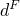
[*CONNECTOR DAMAGE INITIATION](../key/key-link.md#usb-kws-mconnectordamageinit), COMPONENT=4, CRITERION=FORCE
[*CONNECTOR DAMAGE EVOLUTION](../key/key-link.md#usb-kws-mconnectordamageevol), TYPE=MOTION, SOFTENING=EXPONENTIAL, 
DEGRADATION=MAXIMUM, AFFECTED COMPONENTS
4, 6
**
** 第二种损伤机制：基于运动的损伤起始
** 损伤变量 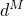
[*CONNECTOR DAMAGE INITIATION](../key/key-link.md#usb-kws-mconnectordamageinit), COMPONENT=4, CRITERION=MOTION
[*CONNECTOR DAMAGE EVOLUTION](../key/key-link.md#usb-kws-mconnectordamageevol), TYPE=MOTION, SOFTENING=LINEAR, 
DEGRADATION=MULTIPLICATIVE, AFFECTED COMPONENTS
1, 2, 6
**
** 第三种损伤机制：基于塑性运动的损伤起始
** 损伤变量 
[*CONNECTOR DAMAGE INITIATION](../key/key-link.md#usb-kws-mconnectordamageinit), COMPONENT=4, 
CRITERION=PLASTIC MOTION
[*CONNECTOR DAMAGE EVOLUTION](../key/key-link.md#usb-kws-mconnectordamageevol), TYPE=MOTION, SOFTENING=TABULAR, 
DEGRADATION=MULTIPLICATIVE, AFFECTED COMPONENTS
1, 2
**
** 第四种损伤机制：耦合基于力的损伤起始
** 损伤变量 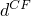
[*CONNECTOR DAMAGE INITIATION](../key/key-link.md#usb-kws-mconnectordamageinit), CRITERION=FORCE
[*CONNECTOR POTENTIAL](../key/key-link.md#usb-kws-mconnectorpotential)
** 使用分量 1, 2, 3, 4, 5, 6
[*CONNECTOR DAMAGE EVOLUTION](../key/key-link.md#usb-kws-mconnectordamageevol), TYPE=ENERGY, DEGRADATION=MAXIMUM, 
AFFECTED COMPONENTS
1, 3, 4, 6
```
指定了四种损伤机制（连接器损伤起始/连接器损伤演化对）：三种非耦合和一种耦合。每个损伤演化定义的第一行确定将由该机制损伤的分量。特定分量中的总体损伤由影响该分量的所有机制的贡献决定。例如，分量1中的总体损伤由第二、第三和第四种损伤机制决定，如下所示：

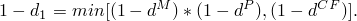

和使用乘法退化；因此，它们首先相乘：。使用最大退化，因此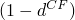与进行比较，并取最小值。

例如，假设在特定时间*t*，=0.5，=0.3，=0.2，在时间，=0.6（唯一增加的那个），而和保持不变。当使用所有三种损伤机制时，总体损伤变量比仅使用机制更快地接近极限损伤值：

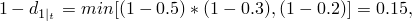

而


当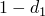达到0.0时发生完全失效。

，其中*i*指可用相对运动分量。其他分量的总体损伤变量按以下方式确定（基于每个损伤演化定律指定的受影响分量）：


### Abaqus/Standard中的最大退化和单元删除选择

您可以控制Abaqus/Standard处理严重损伤连接器单元的方式。默认情况下，材料点处总体损伤变量的上限为。您可以按照["节控制，" 27.1.4节](pt06ch27s01aus113.md#usb-elm-esectioncontrol-deletion)中的"控制材料损伤演化的单元删除和最大退化"中的讨论减少此上限。

默认情况下，一旦至少一个分量中的总体损伤变量达到，连接器单元将被删除。详见["节控制，" 27.1.4节](pt06ch27s01aus113.md#usb-elm-esectioncontrol-deletion)。删除后，连接器单元不再对后续变形提供任何阻力。

或者，您可以指定连接器单元即使在总体损伤变量达到后仍应保留在模型中。在这种情况下，一旦总体损伤变量达到，单元刚度就保持不变，为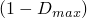乘以未损伤刚度。

### Abaqus/Standard中的粘性正则化

损伤在连接器单元中引起软化响应，这通常会在像Abaqus/Standard这样的隐式代码中导致收敛困难。克服收敛困难的一种技术是通过引入粘性损伤变量是在无粘性骨干模型中评估的损伤变量，是表示松弛时间的粘性参数。粘性材料的损伤响应给出为


由于粘性正则化，阻尼损伤变量不完全遵守指定的演化定律（只有骨干损伤变量遵守）。

| **输入文件用法：** | ``` [*SECTION CONTROLS](../key/key-link.md#usb-kws-msectioncontrols), NAME=*name*, VISCOSITY= [*CONNECTOR SECTION](../key/key-link.md#usb-kws-mconnectorsection), CONTROLS=*name* ``` |
| --- | --- |

| **Abaqus/CAE用法：** | Abaqus/CAE不支持粘性正则化。 |
| --- | --- |

### 在线形摄动过程中定义连接器损伤行为

损伤不能在线形摄动分析期间起始，损伤变量也不会在线形摄动分析期间演化。因此，在线性摄动步骤期间，损伤"冻结"在上一个一般步骤结束时的状态。

### 输出

连接器可用的Abaqus输出变量在["Abaqus/Standard输出变量标识符，" 4.2.1节](pt02ch04s02abv01.md)和["Abaqus/Explicit输出变量标识符，" 4.2.2节](pt02ch04s02xbv01.md)中列出。在连接器中定义损伤时，以下变量特别令人关注：

| CDMG | 连接器总体损伤变量。 |
| --- | --- |

| CDIF | 基于力的连接器损伤起始变量。除与连接器输出变量相关的通常六个分量外，CDIF还包括标量CDIFC，这是与耦合基于力的损伤起始准则相关的损伤起始准则值。 |
| --- | --- |

| CDIM | 基于运动的连接器损伤起始变量。CDIM包括标量CDIMC，这是与耦合基于运动的损伤起始准则相关的损伤起始准则值。 |
| --- | --- |

| CDIP | 基于塑性运动的连接器损伤起始变量。CDIP包括标量CDIPC，这是与耦合基于塑性运动的损伤起始准则相关的损伤起始准则值。 |
| --- | --- |

| ALLDMD | 损伤耗散的能量。 |
| --- | --- |

| ALLCD | 粘性正则化耗散的能量。 |
| --- | --- |


