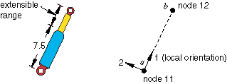

# 31.2.8 连接器止挡和锁


**产品：** Abaqus/Standard  Abaqus/Explicit  Abaqus/CAE

##### **参考文献**

- ["连接器概述，" 31.1.1节](pt06ch31s01abo28.md)
- ["连接器行为，" 31.2.1节](pt06ch31s02alm27.md)
- [*CONNECTOR BEHAVIOR](../key/key-link.md#usb-kws-mconnectorbehavior)
- [*CONNECTOR LOCK](../key/key-link.md#usb-kws-mconnectorlock)
- [*CONNECTOR STOP](../key/key-link.md#usb-kws-mconnectorstops)
- ["定义止挡，" Abaqus/CAE用户指南15.17.9节](../usi/usi-link.md#usi-itn-help-stop)
- ["定义锁，" Abaqus/CAE用户指南15.17.10节](../usi/usi-link.md#usi-itn-help-lock)

### 概述

连接器止挡和锁可以：
- 在任何具有可用相对运动分量的连接器中指定；
- 用于指定单个相对运动分量中的接触强制止挡；以及
- 用于在满足特定准则时锁定可用相对运动分量的位置。

### 定义连接器止挡

在大多数连接器的物理构造中，一个物体相对于另一个物体的允许位置受一定范围限制。在Abaqus中，这些限制被建模为内置不等式约束。您指定要定义连接器止挡的相对运动可用分量，以及相对运动分量方向上连接器允许位置范围的下限和上限值。

| **输入文件用法：** | 使用以下选项定义连接器止挡： |
| --- | --- |
|  | ``` [*CONNECTOR BEHAVIOR](../key/key-link.md#usb-kws-mconnectorbehavior), NAME=*name* [*CONNECTOR STOP](../key/key-link.md#usb-kws-mconnectorstops), COMPONENT=*component number* *lower limit*, *upper limit* ``` |

| **Abaqus/CAE用法：** | 相互作用模块：连接器截面编辑器：****Add****Stop****：****Components：****component or components****，****Lower bound：****lower limit****，****Upper bound：****upper limit**** |
| --- | --- |

#### 示例

由于[图31.2.8-1](pt06ch31s02alm34.md#econnectorbehavior-shock-stoplock)中的减震器具有有限长度，因此与减震器末端的接触决定了节点*b*相对于节点*a*可以距离的上限和下限值。

**图31.2.8-1** 减震器的简化连接器模型。



假设减震器的最大长度为15.0单位，最小长度为7.5单位。修改["连接器概述，" 31.1.1节](pt06ch31s01abo28.md)中提供的与[图31.2.8-1](pt06ch31s02alm34.md#econnectorbehavior-shock-stoplock)中的示例相关的输入文件，添加以下行：

```
[*CONNECTOR BEHAVIOR](../key/key-link.md#usb-kws-mconnectorbehavior), NAME=sbehavior
*...*
[*CONNECTOR STOP](../key/key-link.md#usb-kws-mconnectorstops), COMPONENT=1
7.5, 15.0
```

### 定义连接器锁

连接器机构可能具有设计用于在达到所需配置时将连接器锁定到位的装置。例如，旋转连接可能具有落销机制，在达到所需角度后锁定旋转运动。可以为包含可用相对运动分量的连接器单元定义用户定义的连接器锁定准则。您可以选择要为其定义锁定准则的相对运动分量。

连接器锁可用于为受约束以及可用的相对运动分量指定连接器行为。可以为连接中涉及的所有相对运动分量指定力或力矩的极限值。用于评估准则的力/力矩如输出变量CTF中所计算。此外，可以为对应于可用相对运动分量的相对位置指定极限值。如果未为可用相对运动分量指定其他行为，则力锁定准则将不起作用，因为CTF为零。

在Abaqus/Explicit中，您还可以指定可用分量中速度的极限值作为锁定的准则。速度相关锁定准则可用于模拟汽车中的安全带系统（参见["简化碰撞假人的安全带分析，" Abaqus示例问题指南3.3.1节](../exa/exa-link.md#exa-veh-seatbelt)）。此外，极限值可以依赖于温度和场变量。场变量依赖性可用于建模时间相关锁。

如果满足为所选相对运动分量指定的锁定准则，则所有分量锁定或单个可用分量锁定到位。默认情况下，在满足锁定准则时，所有相对运动分量都锁定到位。在这种情况下，连接器单元将从该点完全运动学锁定。在动态分析中，这种锁定可能引入高加速度。您可以指定仅锁定所选的相对运动分量。

| **输入文件用法：** | 使用以下选项定义连接器锁： |
| --- | --- |
|  | ``` [*CONNECTOR BEHAVIOR](../key/key-link.md#usb-kws-mconnectorbehavior), NAME=*name* [*CONNECTOR LOCK](../key/key-link.md#usb-kws-mconnectorlock), COMPONENT=*component number*, LOCK=ALL or *component number* ``` |

| **Abaqus/CAE用法：** | 相互作用模块：连接器截面编辑器：****Add****Lock****：****Components：****component or components****，****Lock：All****或****Specify****component**** |
| --- | --- |

#### 示例

在[图31.2.8-1](pt06ch31s02alm34.md#econnectorbehavior-shock-stoplock)的示例中，假设如果局部3方向上的力超过500.0单位，则绕减震器的相对旋转将锁定。

```
[*CONNECTOR BEHAVIOR](../key/key-link.md#usb-kws-mconnectorbehavior), NAME=sbehavior
[*CONNECTOR LOCK](../key/key-link.md#usb-kws-mconnectorlock), COMPONENT=3, LOCK=4
, , -500.0, 500.0
```

### 在线形摄动过程中定义连接器止挡和锁

连接器锁或止挡的状态不能在线形摄动分析期间改变；所有连接器止挡和连接器锁定义保持在与基态相同的状态。

### 输出

连接器可用的Abaqus输出变量在["Abaqus/Standard输出变量标识符，" 4.2.1节](pt02ch04s02abv01.md)和["Abaqus/Explicit输出变量标识符，" 4.2.2节](pt02ch04s02xbv01.md)中列出。在连接器中定义止挡和锁时，以下输出变量特别令人关注：

| CSLST | 连接器止挡和锁的标志。 |
| --- | --- |

| CRF | 连接器反作用力/力矩。 |
| --- | --- |

在给定时刻，对于特定相对运动分量*i*，如果连接器在该分量中实际停止或锁定（满足止挡或锁定准则），则输出变量CSLST*i*为1。在这种情况下，相应的CRF输出变量很可能非零且等于强制执行止挡或锁定约束所需的实际力/力矩。由于CRF包含在CTF的计算中，因此当锁或止挡激活时，后者也会改变。

如果在给定时刻对于特定分量*i*不满足止挡或锁定准则，则输出变量CSLST*i*为0，在大多数情况下相应的反作用力CRF为零（唯一的可能例外是当也在该分量中施加了连接器运动时）。


