# 31.2.10 连接器单轴行为


**产品：** Abaqus/Explicit

##### **参考文献**

- ["连接器概述，" 31.1.1节](pt06ch31s01abo28.md)
- ["连接器行为，" 31.2.1节](pt06ch31s02alm27.md)
- [*CONNECTOR BEHAVIOR](../key/key-link.md#usb-kws-mconnectorbehavior)
- [*LOADING DATA](../key/key-link.md#usb-kws-mloadingdata)
- [*UNLOADING DATA](../key/key-link.md#usb-kws-munloadingdata)

### 概述

连接器单轴行为：
- 可通过指定加载和卸载行为在任何具有可用相对运动分量的连接器中定义；
- 可独立为每个可用相对运动分量指定；
- 可定义拉伸和压缩方向上的单独响应；
- 可呈现非线性弹性行为、损伤弹性行为，或具有卸载后永久变形的弹性-塑性类型行为；
- 可指定卸载响应；以及
- 可指定为依赖于多个局部方向上的本构运动。

每个连接类型的局部方向（如["连接类型库，" 31.1.5节](pt06ch31s01aus114.md)中所述）决定了力矩的作用方向以及位移和旋转的测量方向。

### 为可用相对运动分量指定单轴行为

通过定义该分量的加载和卸载响应，可为可用相对运动分量指定单轴行为。对于每个分量，可分别为拉伸和压缩方向的响应定义单独的加载/卸载响应数据。加载和卸载响应可根据三种可用行为类型进行分类：
- 非线性弹性行为；
- 损伤弹性行为；和
- 具有永久变形的弹性-塑性类型行为。

要定义加载响应，您将力或力矩指定为相对运动分量的非线性函数。这些函数也可以依赖于温度、场变量以及其他分量方向上的本构位移/旋转。关于将数据定义为温度和场变量函数的更多信息，请参见["输入语法规则，" 1.2.1节](pt01ch01s02aus01.md)。

卸载响应可通过以下方式定义：
- 您可以指定多条卸载曲线，这些曲线将力或力矩表示为相对运动分量的非线性函数；Abaqus插值这些曲线以创建一条在分析中穿过卸载点的卸载曲线。
- 您可以指定能量耗散因子（以及对于具有永久变形的模型为永久变形因子），Abaqus从中计算指数/二次卸载函数。
- 您可以将力或力矩指定为相对运动分量的非线性函数，以及过渡斜率；连接器沿指定的过渡斜率卸载，直到与指定的卸载曲线相交，此时它按照该函数卸载。（此卸载定义称为组合卸载。）
- 您可以将力或力矩指定为相对运动分量的非线性函数；Abaqus沿应变轴平移指定的卸载曲线，使其穿过分析中的卸载点。

为加载响应指定的行为类型决定了您可以定义的卸载类型，如[表31.2.10-1](pt06ch31s02alm36.md#usb-elm-econnect-unloadtypes)中所总结。不同的行为类型以及相关的加载和卸载曲线将在下文中详细讨论。

**表31.2.10-1** 单轴行为类型的可用卸载定义。
| 材料行为类型 | 卸载定义 |
| --- | --- |
| 插值 | 二次 | 指数 | 组合 | 平移 |
| 率相关弹性 |  |  |  |  |  |
| 损伤弹性 |  |  |  |  |  |
| 永久变形 |  |  |  |  |  |

| **输入文件用法：** | 使用以下选项定义连接器单轴行为： |
| --- | --- |
|  | ``` [*CONNECTOR BEHAVIOR](../key/key-link.md#usb-kws-mconnectorbehavior), NAME=*name* [*CONNECTOR UNIAXIAL BEHAVIOR](../key/key-link.md#usb-kws-mconnectorunibehavior), COMPONENT=*component number* [*LOADING DATA](../key/key-link.md#usb-kws-mloadingdata), DIRECTION=*deformation direction*, TYPE=*behavior type* *data lines to define loading data* [*UNLOADING DATA](../key/key-link.md#usb-kws-munloadingdata) *data lines to define unloading data* ``` |

#### 定义变形方向

可以通过指定变形方向分别为拉伸和压缩定义加载/卸载数据。如果定义了变形方向（拉伸或压缩），则应以指定相对运动分量中的力/力矩和位移/旋转的正值来指定定义拉伸或压缩行为的表格值，且加载数据必须从原点开始。如果未在加载方向定义行为，则该方向的力响应将为零（连接器在该方向没有阻力）。

如果未定义变形方向，则数据适用于拉伸和压缩。然而，此时行为被视为非线性弹性，不能指定损伤或永久变形。如果省略了拉伸或压缩数据，则响应数据将被视为关于原点对称。

| **输入文件用法：** | 使用以下选项定义拉伸行为： |
| --- | --- |
|  | ``` [*LOADING DATA](../key/key-link.md#usb-kws-mloadingdata), DIRECTION=TENSION ``` 使用以下选项定义压缩行为： ``` [*LOADING DATA](../key/key-link.md#usb-kws-mloadingdata), DIRECTION=COMPRESSION ``` 使用以下选项在单个表中定义拉伸和压缩行为： ``` [*LOADING DATA](../key/key-link.md#usb-kws-mloadingdata) ``` |

#### 依赖于多个分量方向上相对位置或运动的行为

默认情况下，加载和卸载函数仅依赖于为连接器单轴行为定义指定的相对运动分量方向上的位移或旋转（详见["连接器行为，" 31.2.1节](pt06ch31s02alm27.md)）。但是，也可以定义依赖于多个分量方向上本构位移和旋转的加载和卸载函数。

| **输入文件用法：** | 使用以下选项定义依赖于多个分量方向上相对位移和/或旋转的连接器单轴行为： |
| --- | --- |
|  | ``` [*LOADING DATA](../key/key-link.md#usb-kws-mloadingdata), INDEPENDENT COMPONENTS=CONSTITUTIVE MOTION ``` |

### 定义率无关非线性弹性行为

当加载响应与率无关时，卸载响应也与率无关，并沿用户指定的相同加载曲线发生，如图31.2.10-1所示。不需要指定卸载曲线。

**图31.2.10-1** 非线性弹性加载。

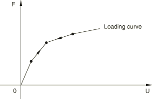

| **输入文件用法：** | ``` [*LOADING DATA](../key/key-link.md#usb-kws-mloadingdata), TYPE=ELASTIC ``` |
| --- | --- |

### 定义率相关行为

率相关模型需要指定不同变形率下的力-位移曲线，以描述加载和卸载行为。如果未指定卸载行为，则卸载沿具有最小变形率的加载曲线发生。随着变形率的变化，通过对指定的加载/卸载数据进行插值获得响应。使用基于粘塑性正则化的技术防止了由于变形率突然变化而导致的力中非物理跳跃。该技术还以非常简单的方式帮助建模松弛效应，松弛时间给出为，其中、和是材料参数，是伸长率。是线性粘性参数，当时控制松弛时间。应使用此参数的较小值。是非线性粘性参数，在较高的值时控制松弛时间。此值越小，松驰时间越短。控制松弛速度对相对运动分量中伸长率的敏感性。这些参数的建议值为、和。图31.2.10-2说明当连接器以率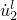加载然后以率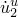卸载时的加载/卸载行为。

**图31.2.10-2** 率相关加载/卸载。

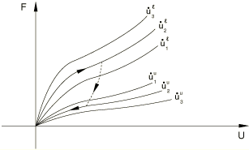

[图31.2.10-3](pt06ch31s02alm36.md#eusb-elm-econnect-ratedep1)显示了两个不同松弛时间和（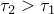）的连接器单元的加载/卸载响应。松弛时间越长，达到施加变形率指定的加载/卸载响应所需时间越长。

**图31.2.10-3** 率相关加载/卸载。

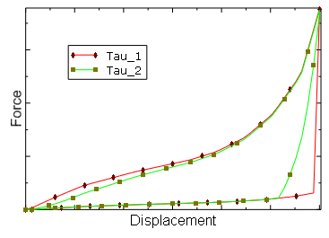

| **输入文件用法：** | 当卸载也与率相关时，使用以下选项： |
| --- | --- |
|  | ``` [*LOADING DATA](../key/key-link.md#usb-kws-mloadingdata), TYPE=ELASTIC, RATE DEPENDENT [*UNLOADING DATA](../key/key-link.md#usb-kws-munloadingdata), DEFINITION=INTERPOLATED CURVE, RATE DEPENDENT ``` 当卸载与率无关时，使用以下选项： ``` [*LOADING DATA](../key/key-link.md#usb-kws-mloadingdata), TYPE=ELASTIC, RATE DEPENDENT [*UNLOADING DATA](../key/key-link.md#usb-kws-munloadingdata), DEFINITION=INTERPOLATED CURVE ``` |

### 定义带损伤的模型

损伤模型在卸载时耗散能量，卸载后没有永久变形。卸载行为控制损伤机制耗散的能量量，可通过以下方式之一指定：
- 解析卸载曲线（指数/二次）；
- 从多个用户指定的卸载曲线插值的卸载曲线；或
- 沿过渡卸载曲线（由用户指定的恒定斜率）卸载到用户指定的卸载曲线（组合卸载）。

有关不同可用行为的概述，请参见上文["为可用相对运动分量指定单轴行为"](pt06ch31s02alm36.md#usb-elm-econnuniaxialbehav-behavior)。各种卸载类型将在下文中讨论。

#### 定义损伤起始

您可以通过定义低于该值时沿加载曲线卸载的位移来指定损伤起始。

| **输入文件用法：** | ``` [*LOADING DATA](../key/key-link.md#usb-kws-mloadingdata), TYPE=DAMAGE, DAMAGE ONSET=*value* ``` |
| --- | --- |

#### 指定指数/二次卸载

[图31.2.10-4](pt06ch31s02alm36.md#usb-elm-econnect-damage-expquadunload-nls)中的损伤模型基于解析卸载曲线，该曲线由能量耗散因子（在任何位移水平下耗散的能量分数）导出。当连接器加载时，力沿加载曲线给出的路径。如果连接器卸载（例如在B点），则力沿卸载曲线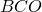。卸载后的再加载沿卸载路径进行，直到加载使得位移变得大于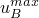，之后加载路径沿加载曲线进行。[图31.2.10-4](pt06ch31s02alm36.md#usb-elm-econnect-damage-expquadunload-nls)中所示的箭头说明此模型的加载/卸载路径。

**图31.2.10-4** 指数/二次卸载。

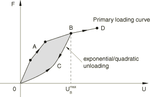

当计算的卸载曲线位于加载曲线上方以防止能量产生时，卸载响应沿加载曲线进行；当卸载曲线产生负响应时，卸载响应沿零力响应进行。在这种情况下，耗散能量将小于能量耗散因子指定的值。

| **输入文件用法：** | 使用以下选项定义二次卸载行为： |
| --- | --- |
|  | ``` [*UNLOADING DATA](../key/key-link.md#usb-kws-munloadingdata), DEFINITION=QUADRATIC ``` 使用以下选项定义指数卸载行为： ``` [*UNLOADING DATA](../key/key-link.md#usb-kws-munloadingdata), DEFINITION=EXPONENTIAL ``` |

#### 指定插值曲线卸载

[图31.2.10-5](pt06ch31s02alm36.md#usb-elm-econnect-damage-interpcurveunload-nls)中的损伤模型说明了基于多个卸载曲线的插值卸载响应，这些曲线在递增的力/位移值处与主加载曲线相交。您可以指定任意数量的必要卸载曲线来定义卸载响应。每条卸载曲线始终从O点开始，即零力和零位移点，因为损伤模型不允许任何永久变形。卸载曲线以归一化形式存储，因此它们在单位位移单位力处与加载曲线相交，插值在这些归一化曲线之间进行。如果从未指定卸载曲线的最大位移进行卸载，则从相邻卸载曲线进行插值。当连接器加载时，力沿加载曲线给出的路径。如果连接器卸载（例如在B点），则力沿卸载曲线进行。卸载后的再加载沿卸载路径进行，直到加载使得位移变得大于，之后加载路径沿加载曲线进行。

**图31.2.10-5** 插值曲线卸载。

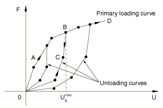

如果加载曲线依赖于多个分量方向上的本构位移/旋转，则卸载曲线也依赖于相同的分量方向。卸载曲线还具有与加载曲线相同的温度和场变量依赖性。

| **输入文件用法：** | ``` [*UNLOADING DATA](../key/key-link.md#usb-kws-munloadingdata), DEFINITION=INTERPOLATED CURVE ``` |
| --- | --- |

#### 指定组合卸载

如图31.2.10-6](pt06ch31s02alm36.md#usb-elm-econnect-damage-combinedunload-nls)所示，除了加载曲线外，您还可以指定卸载曲线，以及连接加载曲线和卸载曲线的恒定过渡斜率。当连接器加载时，力沿加载曲线给出的路径。如果连接器卸载（例如在B点），则力沿卸载曲线进行。路径由恒定过渡斜率定义，位于指定的卸载曲线上。卸载后的再加载沿卸载路径进行，直到加载使得位移变得大于，之后加载路径沿加载曲线进行。

**图31.2.10-6** 组合卸载。

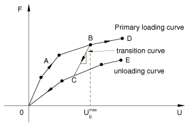

如果加载曲线依赖于多个分量方向上的本构位移/旋转，则卸载曲线也依赖于相同的分量方向。卸载曲线还具有与加载曲线相同的温度和场变量依赖性。

| **输入文件用法：** | ``` [*UNLOADING DATA](../key/key-link.md#usb-kws-munloadingdata), DEFINITION=COMBINED ``` |
| --- | --- |

### 定义带永久变形的模型

这些模型在卸载时耗散能量，卸载后表现出永久变形。卸载行为控制耗散的能量量以及永久变形量。卸载行为可通过以下方式之一指定：
- 解析卸载曲线（指数/二次）；
- 从多个用户指定的卸载曲线插值的卸载曲线；或
- 通过将用户指定的卸载曲线平移到卸载点获得的卸载曲线。

有关不同可用行为的概述，请参见上文["为可用相对运动分量指定单轴行为"](pt06ch31s02alm36.md#usb-elm-econnuniaxialbehav-behavior)。各种卸载类型将在下文中讨论。

#### 定义永久变形起始

默认情况下，屈服的起始将在沿加载曲线行进时，加载曲线斜率从那时记录的最大斜率下降10%时获得。要覆盖确定屈服起始的默认方法，您可以指定加载曲线斜率下降值（不是默认值10%（斜率下降=0.1）），或者定义低于该值时沿加载曲线卸载的位移。如果指定了斜率下降，则屈服起始将在加载曲线斜率从那时记录的最大斜率下降指定因子时立即获得。

| **输入文件用法：** | 使用以下选项通过定义低于该值时沿加载曲线卸载的位移来指定屈服起始： |
| --- | --- |
|  | ``` [*LOADING DATA](../key/key-link.md#usb-kws-mloadingdata), TYPE=PERMANENT DEFORMATION, YIELD ONSET=*value* ``` 使用以下选项通过定义加载曲线的斜率下降来指定屈服起始： ``` [*LOADING DATA](../key/key-link.md#usb-kws-mloadingdata), TYPE=PERMANENT DEFORMATION, SLOPE DROP=*value* ``` |

#### 指定指数/二次卸载

[图31.2.10-7](pt06ch31s02alm36.md#usb-elm-econnect-plastic-expquadunload-nls)中的模型基于解析卸载曲线，该曲线基于能量耗散因子（在任何位移水平下耗散的能量分数）和永久变形因子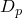导出。当连接器加载时，力沿加载曲线给出的路径。如果连接器卸载（例如在B点），则力沿卸载曲线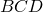进行。D点对应永久变形，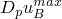。卸载后的再加载沿卸载路径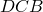进行，直到加载使得位移变得大于，之后加载路径沿加载曲线进行。[图31.2.10-7](pt06ch31s02alm36.md#usb-elm-econnect-plastic-expquadunload-nls)中所示的箭头说明此模型的加载/卸载路径。

**图31.2.10-7** 指数/二次卸载。

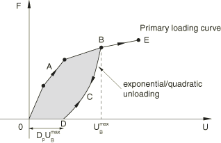

当计算的卸载曲线位于加载曲线上方以防止能量产生时，卸载响应沿加载曲线进行；当卸载曲线产生负响应时，卸载响应沿零力响应进行。在这种情况下，耗散能量将小于能量耗散因子指定的值。

| **输入文件用法：** | 使用以下选项定义二次卸载行为： |
| --- | --- |
|  | ``` [*UNLOADING DATA](../key/key-link.md#usb-kws-munloadingdata), DEFINITION=QUADRATIC ``` 使用以下选项定义指数卸载行为： ``` [*UNLOADING DATA](../key/key-link.md#usb-kws-munloadingdata), DEFINITION=EXPONENTIAL ``` |

#### 指定插值曲线卸载

[图31.2.10-8](pt06ch31s02alm36.md#usb-elm-econnect-plastic-interpcurveunload-nls)中的模型说明了基于多个卸载曲线的插值卸载响应，这些曲线在递增的力/位移值处与主加载曲线相交。您可以指定任意数量的必要卸载曲线来定义卸载响应。每条卸载曲线的第一个点定义了如果连接器完全卸载时的永久变形。卸载曲线以归一化形式存储，因此它们在单位位移单位力处与加载曲线相交，插值在这些归一化曲线之间进行。如果从未指定卸载曲线的最大位移进行卸载，则从相邻卸载曲线进行插值卸载曲线。当连接器加载时，力沿加载曲线给出的路径。如果连接器卸载（例如在B点），则力沿卸载曲线进行。卸载后的再加载沿卸载路径进行，直到加载使得位移变得大于，之后加载路径沿加载曲线进行。

**图31.2.10-8** 插值曲线卸载。

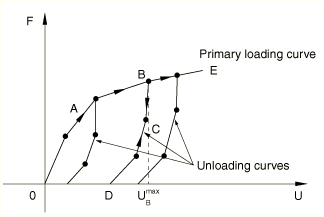

如果加载曲线依赖于多个分量方向上的本构位移/旋转，则卸载曲线也依赖于相同的分量方向。卸载曲线还具有与加载曲线相同的温度和场变量依赖性。

| **输入文件用法：** | ``` [*UNLOADING DATA](../key/key-link.md#usb-kws-munloadingdata), DEFINITION=INTERPOLATED CURVE ``` |
| --- | --- |

#### 指定平移曲线卸载

您可以指定一条通过原点的卸载曲线以及加载曲线。实际卸载曲线通过将用户指定的卸载曲线水平平移以穿过卸载点来获得，如图31.2.10-9所示。完全卸载时的永久变形是应用于卸载曲线的水平平移。

**图31.2.10-9** 平移曲线卸载。

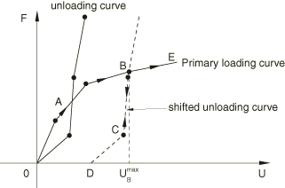

如果加载曲线依赖于多个分量方向上的本构位移/旋转，则卸载曲线也依赖于相同的分量方向。卸载曲线还具有与加载曲线相同的温度和场变量依赖性。

| **输入文件用法：** | ``` [*UNLOADING DATA](../key/key-link.md#usb-kws-munloadingdata), DEFINITION=SHIFTED CURVE ``` |
| --- | --- |

### 在拉伸和压缩中使用不同的单轴模型

在适当情况下，可以在拉伸和压缩中使用不同的单轴行为模型。例如，可以将拉伸中具有永久变形和指数卸载的模型与压缩中的非线性弹性模型组合（参见[图31.2.10-10](pt06ch31s02alm36.md#usb-elm-econnect-mixed-tenscomp-nls)）。

**图31.2.10-10** 拉伸和压缩中不同的单轴模型。

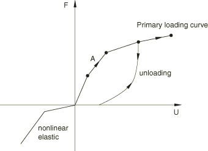

### 输出

连接器可用的Abaqus输出变量在["Abaqus/Standard输出变量标识符，" 4.2.1节](pt02ch04s02abv01.md)和["Abaqus/Explicit输出变量标识符，" 4.2.2节](pt02ch04s02xbv01.md)中列出。在连接器中定义单轴行为时，以下输出变量特别令人关注：

| CU | 连接器相对位移/旋转。 |
| --- | --- |

| CUF | 连接器单轴力/力矩。 |
| --- | --- |


