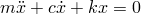
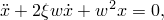
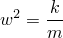
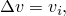
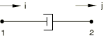
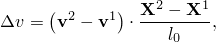
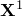
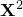
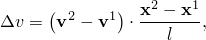
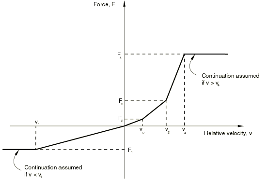

# 32.2.1 阻尼器


**产品：** Abaqus/Standard  Abaqus/Explicit  Abaqus/CAE

##### **参考文献**

- ["阻尼器单元库，" 32.2.2节](pt06ch32s02ael27.md)
- [*DASHPOT](../key/key-link.md#usb-kws-mdashpot)
- ["定义弹簧和阻尼器，" Abaqus/CAE用户指南37.1节](../usi/usi-link.md#usi-eng-springs-overview)

### 概述

阻尼器单元：
- 可以将力与相对速度耦合；
- 在Abaqus/Standard中可以是将力矩与相对角速度耦合；
- 可以是线性或非线性的；
- 如果是线性的，可以在直接解稳态动力学分析中依赖于频率；
- 可以依赖于温度和场变量；以及
- 可用于任何应力分析过程。

在阻尼器单元的整个描述中使用了"力"和"速度"术语。当阻尼器与平移自由度相关时，这些变量是阻尼器中的力和相对速度。如果阻尼器与旋转自由度相关，则是扭转阻尼器；这些变量将是阻尼器传递的力矩和跨越阻尼器的相对角速度。

在动力学分析中，速度作为积分算子的一部分获得；在Abaqus/Standard的准静态分析中，速度通过将位移增量除以时间增量获得。

### 典型应用

阻尼器用于建模相对速度依赖的力或扭转阻力。它们还可以提供粘性能量耗散机制。

阻尼器在不适于使用修正Riks算法的不稳定非线性静态分析中通常很有用（参见["不稳定坍塌和后屈曲分析，" 6.2.4节"](pt03ch06s02at03.md)，了解修正Riks算法的讨论），并且在自动时间步长算法使用时，因为配置中的突然变化可以由阻尼器中产生的力来控制。在这种情况下，阻尼大小必须与时间段结合选择，以便有足够的阻尼来控制此类困难，但当获得稳定的静态响应时阻尼力可以忽略不计。另请参阅Abaqus/Standard中接触单元可用的接触阻尼（参见["接触阻尼，" 37.1.3节"](pt09ch37s01aus167.md)）。

### 选择适当的单元

DASHPOT1和DASHPOT2单元仅在Abaqus/Standard中可用。DASHPOT1是在指定自由度与地面之间。DASHPOT2是在两个指定自由度之间。

DASHPOTA单元在Abaqus/Standard和Abaqus/Explicit中都可用。DASHPOTA是在两个节点之间，其作用线是连接两节点的直线。

这些单元中的阻尼器行为可以是线性的或非线性的。

| **输入文件用法：** | 使用以下选项指定指定自由度与地面之间的阻尼器单元： |
| --- | --- |
|  | ``` [*ELEMENT](../key/key-link.md#usb-kws-melement), TYPE=DASHPOT1 ``` 使用以下选项指定两个自由度之间的阻尼器单元： ``` [*ELEMENT](../key/key-link.md#usb-kws-melement), TYPE=DASHPOT2 ``` 使用以下选项指定两节点之间作用线为连接两节点直线的阻尼器单元： ``` [*ELEMENT](../key/key-link.md#usb-kws-melement), TYPE=DASHPOTA ``` |

| **Abaqus/CAE用法：** | 属性或相互作用模块：****Special****Springs/Dashpots****Create****，然后选择以下之一：**Connect points to ground**：选择点：切换****Dashpot coefficient****（相当于DASHPOT1）**Connect two points**：选择点：****Axis****：****Specify fixed direction****：切换****Dashpot coefficient****（相当于DASHPOT2）**Connect two points**：选择点：****Axis****：****Follow line of action****：切换****Dashpot coefficient****（相当于DASHPOTA） |
| --- | --- |

### Abaqus/Explicit中的稳定性考虑

Abaqus/Explicit在确定稳定时间步长时不考虑阻尼器；因此，在将阻尼器引入网格时应小心。

DASHPOTA单元在两个自由度之间引入阻尼力，而不引入这些自由度之间的任何刚度，也不在节点处引入任何质量。这可能导致稳定时间增量减小。例如，考虑一个简单的桁架单元和阻尼器单元系统，如图32.2.1-1所示。

**图32.2.1-1** 一个简单的桁架和阻尼器系统。


该系统的动力学方程为



或



其中



和


弹簧-阻尼器系统的稳定时间增量为


随着阻尼系数*c*增加，稳定时间增量将减小。

为避免稳定时间增量减小，阻尼器应与弹簧或桁架单元并行使用，其中弹簧或桁架单元的刚度选择为使得阻尼器和弹簧或桁架的稳定时间增量大于Abaqus/Explicit计算的稳定临界时间增量。如果这需要具有不可接受力的弹簧或桁架，请直接为步骤指定时间增量大小（参见["显式动力学分析，" 6.3.3节"](pt03ch06s03at08.md)）。

### 相对速度定义

相对速度定义取决于单元类型。

#### DASHPOT1单元

DASHPOT1单元的相对速度是阻尼器节点的第*i*个速度分量：



其中*i*定义如下，且可以在局部方向上（参见["为DASHPOT1和DASHPOT2单元定义作用方向"](pt06ch32s02alm38.md#usb-elm-edashpot-orient)")。

#### DASHPOT2单元

DASHPOT2单元的相对速度是阻尼器第一节点第*i*个速度分量与阻尼器第二节点第*j*个速度分量之间的差：


其中*i*和*j*定义如下，且可以在局部方向上（参见["为DASHPOT1和DASHPOT2单元定义作用方向"](pt06ch32s02alm38.md#usb-elm-edashpot-orient)")。

重要的是要理解DASHPOT2单元根据上述相对位移方程的行为，因为该单元可能产生反直觉的结果。例如，以以下方式设置的DASHPOT2单元将是"压缩"阻尼器：



如果节点具有使得和的速度，则阻尼器被压缩，而阻尼器中的力为正。要获得"拉伸"阻尼器，应按以下方式设置DASHPOT2单元：


#### DASHPOTA单元

DASHPOTA单元的相对速度是阻尼器第二节点与第一节点速度之间的差，取沿阻尼器当前轴线的方向。

对于几何线性分析，



其中是阻尼器第一节点的参考位置，是阻尼器第二节点的参考位置，是阻尼器的参考长度。

对于几何非线性分析，



其中是阻尼器第一节点的当前位置，是阻尼器第二节点的当前位置，*l*是阻尼器的当前长度。

在这两种情况下，如果DASHPOTA单元正在伸长，则其中的力为正。

### 定义阻尼器行为

阻尼器行为可以是线性的或非线性的。在任何情况下，您都必须将阻尼器行为与模型的某个区域相关联。

| **输入文件用法：** | ``` [*DASHPOT](../key/key-link.md#usb-kws-mdashpot), ELSET=*name* ``` |
| --- | --- |
|  | 其中ELSET参数引用一组阻尼器单元。 |

| **Abaqus/CAE用法：** | 属性或相互作用模块：****Special****Springs/Dashpots****Create****：选择连接类型：选择点 |
| --- | --- |

#### 线性阻尼器行为

通过指定恒定阻尼系数（每相对速度的力）来定义线性阻尼器行为。

阻尼系数可以依赖于温度和场变量。关于将数据定义为温度和独立场变量的函数的信息，请参见["输入语法规则，" 1.2.1节"](pt01ch01s02aus01.md)。

对于直接解稳态动力学分析，阻尼系数可以依赖于频率，以及温度和场变量。如果在Abaqus/Standard的任何其他分析过程中指定了依赖于频率的阻尼系数，则将使用给定最低频率的数据。

| **输入文件用法：** | ``` [*DASHPOT](../key/key-link.md#usb-kws-mdashpot), DEPENDENCIES=*n* *first data line* *dashpot coefficient*, *frequency*, *temperature*, *field variable 1*, etc. ... ``` |
| --- | --- |

| **Abaqus/CAE用法：** | 属性或相互作用模块：****Special****Springs/Dashpots****Create****：选择连接类型：选择点：****Property****：****Dashpot coefficient****：*dashpot coefficient* |
| --- | --- |
|  | 当您将阻尼器定义为工程特征时，Abaqus/CAE不支持将阻尼系数定义为频率、温度和场变量的函数；相反，您可以定义具有类阻尼器阻尼行为的连接器（参见["连接器阻尼行为，" 31.2.3节"](pt06ch31s02alm29.md)）。 |

#### 非线性阻尼器行为

通过给出力-相对速度值对来定义非线性阻尼器行为。这些值应按相对速度升序给出，并应在足够宽的相对速度值范围内提供，以便正确定义行为。Abaqus假定力在给定范围外保持恒定（参见[图32.2.1-2](pt06ch32s02alm38.md#edashpot-nonlinear)）。此外，曲线应穿过原点。也就是说，力在零相对速度时应为零。

**图32.2.1-2** 非线性阻尼器力-相对速度关系。



阻尼系数可以依赖于温度和场变量。关于将数据定义为温度和独立场变量的函数的信息，请参见["输入语法规则，" 1.2.1节"](pt01ch01s02aus01.md)。

Abaqus/Explicit会将数据正则化为以自变量偶数间隔定义的表。在某些情况下，当力在自变量（相对速度）的不均匀间隔上定义且自变量范围相对于最小间隔较大时，Abaqus/Explicit可能无法在合理数量的间隔中获得数据的准确正则化。在这种情况下，程序将在处理所有数据后停止，并显示错误消息，要求您重新定义材料数据。有关数据正则化的更详细讨论，请参见["材料数据定义，" 21.1.2节"](pt05ch21s01aus109.md)。

| **输入文件用法：** | ``` [*DASHPOT](../key/key-link.md#usb-kws-mdashpot), NONLINEAR, DEPENDENCIES=*n* *first data line* *force*, *relative velocity*, *temperature*, *field variable 1*, etc. ... ``` |
| --- | --- |

| **Abaqus/CAE用法：** | 当您将阻尼器定义为工程特征时，Abaqus/CAE不支持定义非线性阻尼器行为；相反，您可以定义具有类阻尼器阻尼行为的连接器（参见["连接器阻尼行为，" 31.2.3节"](pt06ch31s02alm29.md)）。 |
| --- | --- |

### 为DASHPOT1和DASHPOT2单元定义作用方向

通过给出单元每个节点处的自由度来定义DASHPOT1和DASHPOT2单元的作用方向。这个自由度可以在局部坐标系中（["方向，" 2.2.5节"](pt01ch02s02aus15.md)）。这个局部系统被认为是固定的：即使在大位移分析中，DASHPOT1和DASHPOT2单元在整个分析过程中也沿固定方向作用。

| **输入文件用法：** | ``` [*DASHPOT](../key/key-link.md#usb-kws-mdashpot), ORIENTATION=*name* *dof at node 1*, *dof at node 2* ``` |
| --- | --- |

| **Abaqus/CAE用法：** | 属性或相互作用模块：****Special****Springs/Dashpots****Create****，然后选择以下之一：**Connect points to ground**：选择点：****Orientation****：****Edit****：选择方向**Connect two points**：选择点：****Axis****：****Specify fixed direction****：****Orientation****：****Edit****：选择方向 |
| --- | --- |

### 子结构中的阻尼器

阻尼器不能用于子结构内部。您可以在子结构定义中或在使用级别定义Rayleigh阻尼以在子结构内部创建阻尼；有关更多信息，请参见["在子结构中定义阻尼"在"使用子结构，" 10.1.1节"](pt04ch10s01aus58.md#usb-anl-asuperelements-damping)。


