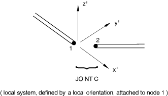

# 32.3.2 柔性连接单元库


**产品：** Abaqus/Standard

##### **参考文献**

- ["柔性连接单元，" 32.3.1节](pt06ch32s03alm39.md)
- [*JOINT](../key/key-link.md#usb-kws-mjoint)

### 概述

本节提供Abaqus/Standard中可用柔性连接单元的参考。

### 单元类型

| JOINTC | 关节相互作用单元 |
| --- | --- |
|  |

##### 激活的自由度

1、2、3、4、5、6

##### 附加解变量

无。

### 所需节点坐标

无。单元节点不需要定义坐标，因为与这些单元相关的作用是通过指定所涉及的自由度来定义的。

### 单元属性定义

| **输入文件用法：** | ``` [*JOINT](../key/key-link.md#usb-kws-mjoint) ``` |
| --- | --- |

### 基于单元的加载

无。

### 单元输出

| S11 | 第一个局部方向的总直接力。 |
| --- | --- |

| S22 | 第二个局部方向的总直接力。 |
| --- | --- |

| S33 | 第三个局部方向的总直接力。 |
| --- | --- |

| S12 | 绕第一个局部方向的总力矩。 |
| --- | --- |

| S13 | 绕第二个局部方向的总力矩。 |
| --- | --- |

| S23 | 绕第三个局部方向的总力矩。 |
| --- | --- |

上述力和力矩对应的相对位移和旋转通过请求相应的"应变"来选择。

### 与单元关联的节点

两个节点。单元第一个节点处的旋转定义局部轴系统的旋转。




