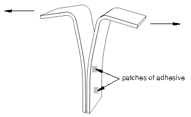
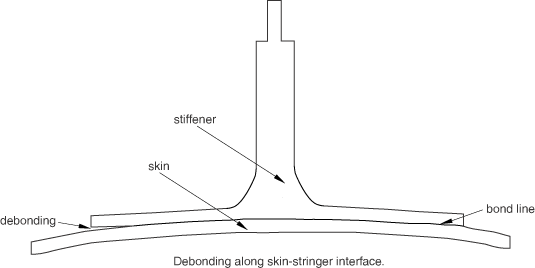
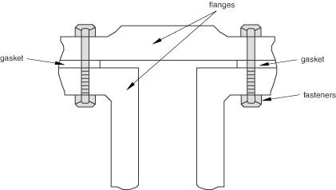
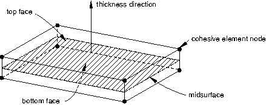
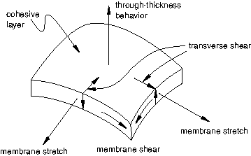

# 32.5.1 内聚单元：概述

Abaqus提供了内聚单元库，用于建模粘接接头、复合材料中的界面以及界面完整性和强度可能令人关注的其它情况。

### 概述

使用内聚单元的建模包括：
- 选择适当的内聚单元类型（["选择内聚单元，" 第32.5.2节](pt06ch32s05alm41.md)）；
- 将内聚单元包含在有限元模型中，连接到其他组件，并理解使用内聚单元建模过程中出现的典型建模问题（["使用内聚单元建模，" 第32.5.3节](pt06ch32s05alm42.md)）；
- 定义内聚单元的初始几何（["定义内聚单元的初始几何，" 第32.5.4节](pt06ch32s05alm43.md)）；以及
- 定义内聚单元的机械以及可选的流体本构行为。

内聚单元的机械本构行为可以定义为：
- 使用基于连续体的本构模型（["使用连续体方法定义粘接层"在"使用连续体方法定义内聚单元的本构响应，" 第32.5.5节](pt06ch32s05alm44.md#usb-elm-ecohesivematbehavior-continuum)），
- 使用单轴应力本构模型，用于建模垫片和/或单个粘接斑块（["使用连续体方法建模垫片和/或小型粘接斑块"在"使用连续体方法定义内聚单元的本构响应，" 第32.5.5节](pt06ch32s05alm44.md#usb-elm-ecohesivematbehavior-gasket)），或
- 使用直接以牵引力-分离形式指定的本构模型（["使用牵引力-分离描述定义内聚单元的本构响应，" 第32.5.6节](pt06ch32s05alm45.md)）。

当孔隙压力内聚单元用于Abaqus/Standard中的土壤过程时，内聚单元的流体本构行为可以定义为（["定义内聚单元间隙内的流体本构响应，" 第32.5.7节](pt06ch32s05alm46.md)）：
- 定义切向流体流动关系，和
- 定义流体泄漏系数，用于解释岩石断裂中的结垢或淤塞效应。

### 典型应用

内聚单元可用于建模粘接剂、粘接界面、垫片和岩石断裂。这些单元的本构响应取决于特定的应用，基于对每个应用领域适当的变形和应力状态的一定假设。机械本构响应的性质可大致分类为基于：
- 材料的连续体描述；
- 界面的牵引力-分离描述；或
- 用于建模垫片和/或侧向不受约束的粘接斑块的适当单轴应力状态。

以下简要讨论每种本构响应类型。

#### 基于连续体的建模

粘接接头的建模涉及通过粘接材料（如图32.5.1-1所示）连接在一起的两个物体的情况（请参见[图32.5.1-1](pt06ch32s05abo29.md#ecohesive-tpeel)）。当粘接具有有限厚度时，粘接的基于连续体的建模是适当的。粘接材料的宏观特性（如刚度和强度）可以通过实验测量，并直接用于建模目的（请参见["使用连续体方法定义内聚单元的本构响应，" 第32.5.5节](pt06ch32s05alm44.md)，了解详细信息）。粘接材料通常比周围材料更柔软。内聚单元对材料中的初始加载、损伤起始和导致最终失效的损伤扩展进行建模。

**图32.5.1-1** 使用内聚单元建模有限厚度粘接剂的典型剥离测试。

在三维问题中，基于连续体的本构模型假定在材料点处激活一个直接（厚度方向）应变、两个横向剪切应变和所有（六个）应力分量。在二维问题中，它假定在材料点处激活一个直接（厚度方向）应变、一个横向剪切应变和所有（四个）应力分量。

#### 基于牵引力-分离的建模

复合材料中粘接界面的建模通常涉及中间粘接材料非常薄的情况，实际上可以认为是零厚度（请参见[图32.5.1-2](pt06ch32s05abo29.md#ecohesive-debond)）。

**图32.5.1-2** 皮肤-桁条界面处的脱粘：基于牵引力-分离建模的典型情况。

在这种情况下，宏观材料特性不能直接使用，分析师必须求助于断裂力学概念，如创建新表面所需的能量（请参见["使用牵引力-分离描述定义内聚单元的本构响应，" 第32.5.6节](pt06ch32s05alm45.md)，了解详细信息）。内聚单元对粘接界面上的初始加载、损伤起始和导致最终失效的损伤扩展进行建模。界面在损伤起始前的行为通常描述为线性弹性，以在拉伸和/或剪切加载下降级的罚刚度的形式，但不受纯压缩影响。

您可以在预期会出现裂纹的模型区域使用内聚单元。然而，模型开始时不需要有任何裂纹。事实上，裂纹起始的精确位置（所有使用内聚单元建模的区域中）以及此类裂纹的演化特性被确定为解的一部分。裂纹被限制为沿内聚单元层扩展，不会偏转到周围材料中。

在三维问题中，基于牵引力-分离的模型假定三个分离分量——一个垂直于界面，两个平行于界面；并且假定在材料点处激活相应的应力分量。在二维问题中，基于牵引力-分离的模型假定两个分离分量——一个垂直于界面，另一个平行于界面；并且假定在材料点处激活相应的应力分量。

#### 垫片和/或侧向不受约束的粘接斑块的建模

内聚单元还为建模垫片提供了一些有限的能力（请参见[图32.5.1-3](pt06ch32s05abo29.md#ecohesive-gasket)）。

**图32.5.1-3** 涉及垫片的典型应用。

用内聚单元建模的垫圈的本构响应只能使用宏观特性（如刚度和强度）来定义（请参见["使用连续体方法定义内聚单元的本构响应，" 第32.5.5节](pt06ch32s05alm44.md)，了解详细信息）。没有可用的专用垫片行为（通常以压力对闭合的形式定义）。与Abaqus/Standard中可用的垫片单元类别相比（["垫片单元：概述，" 第32.6.1节](pt06ch32s06abo30.md)），内聚单元
- 是完全非线性的（可用于有限应变和旋转）；
- 可以在动态分析中具有质量；并且
- 在Abaqus/Standard和Abaqus/Explicit中都可用。

假定垫片承受单轴应力状态。单轴应力状态也适用于建模侧向不受约束的小型粘接斑块。

Abaqus中可用于一维单元（梁、桁架或钢筋）的任何材料模型——包括例如超弹性材料和弹性泡沫材料模型（在该背景下可用于建模垫片、密封剂或由多孔体制成的减震器）——可用于此方法。

### 内聚单元的空间表示

[图32.5.1-4](pt06ch32s05abo29.md#ecohesive-spatial-rep)展示了用于定义内聚单元的关键几何特性。

**图32.5.1-4** 三维内聚单元的空间表示。

内聚单元的连接性类似于连续体单元的连接性，但将内聚单元视为由厚度分开的两个面组成很有用。底面和顶面之间沿厚度方向（对于三维单元为局部3方向；对于二维单元为局部2方向——请参见["定义内聚单元的初始几何，" 第32.5.4节](pt06ch32s05alm43.md)，了解局部方向的更多细节）的相对运动表示界面的打开或关闭。底面和顶面在垂直于厚度方向的平面中的位置的相对变化量化了内聚单元的横向剪切行为。单元中间面（底面和顶面之间的中面）的拉伸和剪切与内聚单元中的膜应变相关；然而，假定内聚单元在纯膜响应中不产生任何应力。[图32.5.1-5](pt06ch32s05abo29.md#ecohesive-def-modes)显示了内聚单元的不同变形模式。

**图32.5.1-5** 内聚单元的变形模式。

### 使用内聚单元建模的一般问题

在使用内聚单元时，您应该注意这些单元特有的重要问题。这些问题包括与接触相互作用结合使用内聚单元的特殊考虑、Abaqus/Explicit中稳定时间增量大小的潜在降级以及Abaqus/Standard中的潜在收敛问题。这些问题在["使用内聚单元建模，" 第32.5.3节](pt06ch32s05alm42.md)中详细讨论。内聚单元通常用于将组件粘接在一起。[ "使用内聚单元建模，" 第32.5.3节](pt06ch32s05alm42.md)还讨论了将内聚层连接到相邻组件的方法。

### 允许使用内聚单元的过程

没有孔隙压力自由度的内聚单元可用于所有应力/位移分析类型。虽然它们除了位移外没有其他自由度，但它们可用于耦合过程，将由耦合温度-位移单元制成的组件粘接在一起，以及在Abaqus/Standard中耦合孔隙压力-位移单元和/或压电单元，以模拟界面的机械失效。在此类耦合过程中，内聚单元的响应仅为机械的（例如，在耦合温度-位移问题中不会发生热传递）。

具有孔隙压力自由度的内聚单元可用于耦合孔隙流体扩散/应力分析（["耦合孔隙流体扩散和应力分析，" 第6.8.1节](pt03ch06s08at26.md)）。耦合孔隙压力-位移单元的机械响应与等效的仅位移单元相同，只是间隙流体压力被视为开放面上的牵引力。

