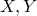
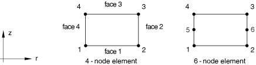
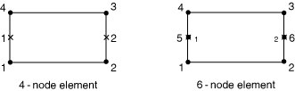

# 32.5.10 轴对称内聚单元库


**产品：** Abaqus/Standard  Abaqus/Explicit  Abaqus/CAE  

##### **参考资料**

- ["内聚单元：概述，" 第32.5.1节](pt06ch32s05abo29.md)
- ["选择内聚单元，" 第32.5.2节](pt06ch32s05alm41.md)
- [*COHESIVE SECTION](../key/key-link.md#usb-kws-mcohesivesection)
- [Abaqus/CAE用户指南第21章"粘接接头和粘合界面"](../usi/usi-link.md#usi-adv-cohesive)

### 概述

本节提供Abaqus/Standard和Abaqus/Explicit中可用的轴对称内聚单元的参考。

### 单元类型

#### 通用单元

| COHAX4 | 4节点轴对称内聚单元 |
| --- | --- |
|  |

##### 激活的自由度

1, 2 (, )

##### 附加求解变量

无。

#### 孔隙压力单元

| COHAX4P | 6节点位移和孔隙压力轴对称内聚单元 |
| --- | --- |
|  |

##### 激活的自由度

1, 2, 8

##### 附加求解变量

无。

### 需要的节点坐标



### 单元属性定义

您可以定义单元的初始本构厚度。内聚单元的默认初始本构厚度取决于这些单元的响应。对于连续体响应，默认初始本构厚度基于节点坐标计算。对于牵引-分离响应，默认初始本构厚度假定为1.0。对于基于单轴应力状态的响应，没有默认值；您必须指明计算初始本构厚度的方法。详见["定义内聚单元的初始几何，" 第32.5.4节中的"指定本构厚度"](pt06ch32s05alm43.md#usb-elm-ecohesiveinit-thickmag)。

Abaqus根据单元的中面自动计算厚度方向。

| **输入文件用法：** | ``` [*COHESIVE SECTION](../key/key-link.md#usb-kws-mcohesivesection) ``` |
| --- | --- |

| **Abaqus/CAE用法：** | 属性模块：**Create Section**：选择**Other**作为section **Category**，选择**Cohesive**作为section **Type** |
| --- | --- |

### 基于单元的加载

### 分布载荷

分布载荷如["分布载荷，" 第34.4.3节](pt07ch34s04aus122.md)中所述进行指定。

**载荷ID (*DLOAD)：**  BR **Abaqus/CAE载荷/相互作用：**  **体力** **单位：**  [FL3](../popups/usb-int-iconventions-unitsym.md) **描述：**  径向方向的体力。

**载荷ID (*DLOAD)：**  BY **Abaqus/CAE载荷/相互作用：**  **体力** **单位：**  [FL3](../popups/usb-int-iconventions-unitsym.md) **描述：**  轴向方向的体力。

**载荷ID (*DLOAD)：**  BRNU **Abaqus/CAE载荷/相互作用：**  **体力** **单位：**  [FL3](../popups/usb-int-iconventions-unitsym.md) **描述：**  径向方向的非均匀体力，幅度通过Abaqus/Standard中的用户子程序[`DLOAD`](../sub/sub-link.md#sub-xsl-dload)和Abaqus/Explicit中的[`VDLOAD`](../sub/sub-link.md#sub-xsl-vdload)提供。

**载荷ID (*DLOAD)：**  BZNU **Abaqus/CAE载荷/相互作用：**  **体力** **单位：**  [FL3](../popups/usb-int-iconventions-unitsym.md) **描述：**  轴向方向的非均匀体力，幅度通过Abaqus/Standard中的用户子程序[`DLOAD`](../sub/sub-link.md#sub-xsl-dload)和Abaqus/Explicit中的[`VDLOAD`](../sub/sub-link.md#sub-xsl-vdload)提供。

**载荷ID (*DLOAD)：**  CENT(S) **Abaqus/CAE载荷/相互作用：**  不支持 **单位：**  [FL4(ML3T2)](../popups/usb-int-iconventions-unitsym.md) **描述：**  离心载荷（幅度输入为，其中是单位体积质量密度，是角速度）。

**载荷ID (*DLOAD)：**  CENTRIF(S) **Abaqus/CAE载荷/相互作用：**  **旋转体力** **单位：**  [T2](../popups/usb-int-iconventions-unitsym.md) **描述：**  离心载荷（幅度输入为，其中是角速度）。

**载荷ID (*DLOAD)：**  GRAV **Abaqus/CAE载荷/相互作用：**  **重力** **单位：**  [LT2](../popups/usb-int-iconventions-unitsym.md) **描述：**  指定方向的重力加载（幅度输入为加速度）。

**载荷ID (*DLOAD)：**  P*n* **Abaqus/CAE载荷/相互作用：**  **压力** **单位：**  [FL2](../popups/usb-int-iconventions-unitsym.md) **描述：**  面*n*上的压力。

**载荷ID (*DLOAD)：**  P*n*NU **Abaqus/CAE载荷/相互作用：**  不支持 **单位：**  [FL2](../popups/usb-int-iconventions-unitsym.md) **描述：**  面*n*上的非均匀压力，幅度通过Abaqus/Standard中的用户子程序[`DLOAD`](../sub/sub-link.md#sub-xsl-dload)和Abaqus/Explicit中的[`VDLOAD`](../sub/sub-link.md#sub-xsl-vdload)提供。

**载荷ID (*DLOAD)：**  SBF(E) **Abaqus/CAE载荷/相互作用：**  不支持 **单位：**  [FL5T2](../popups/usb-int-iconventions-unitsym.md) **描述：**  径向和轴向方向的滞止体力。

**载荷ID (*DLOAD)：**  SP*n*(E) **Abaqus/CAE载荷/相互作用：**  不支持 **单位：**  [FL4T2](../popups/usb-int-iconventions-unitsym.md) **描述：**  面*n*上的滞止压力。

**载荷ID (*DLOAD)：**  VBF(E) **Abaqus/CAE载荷/相互作用：**  不支持 **单位：**  [FL4T](../popups/usb-int-iconventions-unitsym.md) **描述：**  径向和轴向方向的粘性体力。

**载荷ID (*DLOAD)：**  VP*n*(E) **Abaqus/CAE载荷/相互作用：**  不支持 **单位：**  [FL3T](../popups/usb-int-iconventions-unitsym.md) **描述：**  面*n*上的粘性压力，施加与面法向速度成正比且阻碍运动的压力。

### 基于表面的加载

### 分布载荷

基于表面的分布载荷如["分布载荷，" 第34.4.3节](pt07ch34s04aus122.md)中所述进行指定。

**载荷ID (*DSLOAD)：**  P **Abaqus/CAE载荷/相互作用：**  **压力** **单位：**  [FL2](../popups/usb-int-iconventions-unitsym.md) **描述：**  单元表面上的压力。

**载荷ID (*DSLOAD)：**  PNU **Abaqus/CAE载荷/相互作用：**  **压力** **单位：**  [FL2](../popups/usb-int-iconventions-unitsym.md) **描述：**  单元表面上的非均匀压力，幅度通过Abaqus/Standard中的用户子程序[`DLOAD`](../sub/sub-link.md#sub-xsl-dload)和Abaqus/Explicit中的[`VDLOAD`](../sub/sub-link.md#sub-xsl-vdload)提供。

**载荷ID (*DSLOAD)：**  SP(E) **Abaqus/CAE载荷/相互作用：**  **压力** **单位：**  [FL4T2](../popups/usb-int-iconventions-unitsym.md) **描述：**  单元表面上的滞止压力。

**载荷ID (*DSLOAD)：**  VP(E) **Abaqus/CAE载荷/相互作用：**  **压力** **单位：**  [FL3T](../popups/usb-int-iconventions-unitsym.md) **描述：**  施加在单元表面上的粘性压力。粘性压力与单元面法向速度成正比且阻碍运动。

### 单元输出

可用于输出的应力、应变和其他张量分量取决于内聚单元是否用于模拟粘接接头、垫片或分层问题。您通过在为这些单元定义截面属性时选择适当的响应类型来指明内聚单元的预期用途。可用的响应类型在["使用连续体方法定义内聚单元的本构响应，" 第32.5.5节](pt06ch32s05alm44.md)和["使用牵引-分离描述定义内聚单元的本构响应，" 第32.5.6节](pt06ch32s05alm45.md)中讨论。

#### 使用连续体响应的内聚单元

对于具有连续体响应的单元，应力和其他张量（包括应变张量）可用。应力张量和应变张量都包含真实值。对于使用连续体响应的本构计算，仅假定直接的厚度方向应变和横向剪切应变为非零。所有其他应变分量（即膜应变）假定为零（详见["使用连续体方法定义内聚单元的本构响应，" 第32.5.5节中的"有限厚度粘接层的建模"](pt06ch32s05alm44.md#usb-elm-ecohesivematbehavior-continuum)）。所有张量具有相同数量的分量。例如，应力分量如下：

| S11 | 直接膜应力。 |
| --- | --- |

| S22 | 直接厚度方向应力。 |
| --- | --- |

| S33 | 直接膜应力。 |
| --- | --- |

| S12 | 横向剪切应力。 |
| --- | --- |

#### 使用单轴应力状态的内聚单元

对于具有单轴应力响应的内聚单元，应力和其他张量（包括应变张量）可用。应力张量和应变张量都包含真实值。对于使用单轴应力响应的本构计算，仅假定直接的厚度方向应力为非零。所有其他应力分量（即膜应力和横向剪切应力）假定为零（详见["使用连续体方法定义内聚单元的本构响应，" 第32.5.5节中的"垫片和/或小粘接贴片的建模"](pt06ch32s05alm44.md#usb-elm-ecohesivematbehavior-gasket)）。所有张量具有相同数量的分量。例如，应力分量如下：

| S22 | 直接厚度方向应力。 |
| --- | --- |

#### 使用牵引-分离响应的内聚单元

对于具有牵引-分离响应的单元，应力和其他张量（包括应变张量）可用。应力张量和应变张量都包含名义值。当内聚单元的响应以牵引与分离的形式定义时，输出变量E、LE和NE都包含名义应变。所有张量具有相同数量的分量。例如，应力分量如下：

| S22 | 直接厚度方向应力。 |
| --- | --- |

| S12 | 横向剪切应力。 |
| --- | --- |

### 单元上的节点排序和面编号



##### 单元面

| 面1 | 1 -- 2面 |
| --- | --- |
| 面2 | 2 -- 3面 |
| 面3 | 3 -- 4面 |
| 面4 | 4 -- 1面 |

### 用于输出的积分点编号




