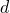
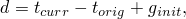
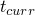
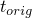
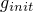
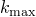
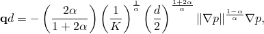
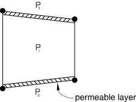
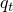
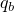

# 32.5.7 定义内聚单元间隙内流体的本构响应


**产品：** Abaqus/Standard  Abaqus/CAE  

##### **参考资料**

- ["内聚单元：概述，" 第32.5.1节](pt06ch32s05abo29.md)
- ["使用牵引-分离描述定义内聚单元的本构响应，" 第32.5.6节](pt06ch32s05alm45.md)
- [*FLUID LEAKOFF](../key/key-link.md#usb-kws-mfluidleakoff)
- [*GAP FLOW](../key/key-link.md#usb-kws-mgapflow)
- [Abaqus/CAE用户指南第21章"粘接接头和粘合界面"](../usi/usi-link.md#usi-adv-cohesive)

### 概述

内聚单元流体流动模型：
- 通常用于地质技术应用，必须保持间隙内和穿过界面的流体流动连续性；
- 使内聚单元表面上的流体压力能够贡献于其力学行为，从而能够对水力驱动裂缝进行建模；
- 能够对内聚单元表面上的额外阻力层进行建模；和
- 只能与牵引-分离行为结合使用。

本节描述的功能用于对孔隙压力内聚单元内部和穿过其表面的流体流动进行建模。

### 定义孔隙流体流动特性

流体本构响应包括：
- 间隙内的切向流动，可以用牛顿流体或幂律流体模型进行建模；和
- 穿过间隙的法向流动，可以反映结垢或淤积效应的影响。

单元内孔隙流体的流动模式如图32.5.7--1所示。

**图32.5.7-1** 内聚单元内的流动。


流体被认为是不可压缩的，公式基于考虑切向和法向流动以及内聚单元开口速率的流动连续性声明。

### 指定流体流动特性

您可以分别指定切向和法向流动特性。

#### 切向流动

默认情况下，内聚单元内没有孔隙流体的切向流动。要允许切向流动，请结合孔隙流体材料定义定义间隙流动特性。

##### 牛顿流体

对于牛顿流体，体积流率密度向量由下式给出


其中是切向渗透率（对流体流动的阻力），是沿内聚单元的压力梯度，是间隙开口。

在Abaqus中，间隙开口定义为



其中和分别是当前和原始内聚单元几何厚度，是初始间隙开口，默认值为0.002。

Abaqus根据雷诺方程定义切向渗透率或流动阻力：


其中是流体粘度，是间隙开口。您还可以指定值的上限。

| **输入文件用法：** | 使用以下选项直接定义初始间隙开口： |
| --- | --- |
|  | ``` [*SECTION CONTROLS](../key/key-link.md#usb-kws-msectioncontrols), INITIAL GAP OPENING ``` 使用以下选项定义牛顿流体中的切向流动： ``` [*GAP FLOW](../key/key-link.md#usb-kws-mgapflow), TYPE=NEWTONIAN, KMAX ``` |

| **Abaqus/CAE用法：** | Abaqus/CAE不支持初始间隙开口。 |
| --- | --- |
|  | 属性模块：材料编辑器：****Other****Pore Fluid****Gap Flow****：Type：**Newtonian**：切换**Maximum Permeability**并输入的值 |

##### 幂律流体

对于幂律流体，本构关系定义为


其中是剪切应力，是剪切应变率，是流体稠度，是幂律系数。Abaqus将切向体积流率密度定义为



其中是间隙开口。

| **输入文件用法：** | [*GAP FLOW](../key/key-link.md#usb-kws-mgapflow), TYPE=POWER LAW |
| --- | --- |

| **Abaqus/CAE用法：** | 属性模块：材料编辑器：****Other****Pore Fluid****Gap Flow****：Type：**Power law** |
| --- | --- |

#### 穿过间隙表面的法向流动

您可以通过为孔隙流体材料定义流体渗漏系数来允许法向流动。该系数定义内聚单元中间节点与其相邻表面节点之间的压力-流动关系。流体渗漏系数可以解释为内聚单元表面上一层有限厚度材料的渗透率，如图32.5.7--2所示。

**图32.5.7-2** 作为可渗透层的渗漏系数解释。



法向流动定义为


和


其中和分别是流入顶面和底面的流率，是中间面压力，和分别是顶面和底面上的孔隙压力。

| **输入文件用法：** | [*FLUID LEAKOFF](../key/key-link.md#usb-kws-mfluidleakoff) |
| --- | --- |

| **Abaqus/CAE用法：** | 属性模块：材料编辑器：****Other****Pore Fluid****Fluid Leakoff****：Type：**Coefficients** |
| --- | --- |

##### 将渗漏系数定义为温度和场变量的函数

您可以选择将渗漏系数定义为温度和场变量的函数。

| **输入文件用法：** | [*FLUID LEAKOFF](../key/key-link.md#usb-kws-mfluidleakoff), DEPENDENCIES |
| --- | --- |

| **Abaqus/CAE用法：** | 属性模块：材料编辑器：****Other****Pore Fluid****Fluid Leakoff****：Type：**Coefficients**：切换**Use temperature-dependent data**并选择场变量的数量。 |
| --- | --- |

##### 在用户子程序中定义渗漏系数

用户子程序[`UFLUIDLEAKOFF`](../sub/sub-link.md#sub-xsl-ufluidleakoff)也可用于定义更复杂的渗漏行为，包括通过使用解依赖状态变量定义时间累积阻力或结垢的能力。

| **输入文件用法：** | [*FLUID LEAKOFF](../key/key-link.md#usb-kws-mfluidleakoff), USER |
| --- | --- |

| **Abaqus/CAE用法：** | 属性模块：材料编辑器：****Other****Pore Fluid****Fluid Leakoff****：Type：**User** |
| --- | --- |

#### 切向和法向流动组合

[表32.5.7-1](pt06ch32s05alm46.md#ecohesivefluidtable)显示了切向和法向流动的允许组合及其效果。

**表32.5.7-1** 流动特性定义组合的效果。
|  | 定义了法向流动 | 未定义法向流动 |
| --- | --- | --- |
| 定义了切向流动 | 建模切向和法向流动。 | 建模切向流动。仅当单元闭合时，才在内聚单元的相对节点之间强制孔隙压力连续。否则，表面在法向上是不可渗透的。 |
| 未定义切向流动 | 建模法向流动。 | 不建模切向流动。始终在内聚单元的相对节点之间强制孔隙压力连续。 |

### 初始开口单元

当内聚单元的开口主要由流体进入间隙驱动时，您必须将一个或多个单元定义为初始开口，因为切向流动仅在开口单元中可能发生。将初始开口单元识别为初始条件。

| **输入文件用法：** | [*INITIAL CONDITIONS](../key/key-link.md#usb-kws-minitialcond), TYPE=INITIAL GAP |
| --- | --- |

| **Abaqus/CAE用法：** | Abaqus/CAE不支持初始间隙定义。 |
| --- | --- |

### 使用非对称矩阵存储和求解

孔隙压力内聚单元矩阵是非对称的；因此，可能需要非对称矩阵存储和求解来改善收敛（见["在Abaqus/Standard中定义分析"中的"矩阵存储和求解方案"，第6.1.2节](pt03ch06s01abo05.md#usb-anl-unsymm)）。

### 附加注意事项

在某些情况下，您的内聚单元流体特性的使用和您的特性值可能会影响您的解决方案。

#### 大的系数值

您必须确保切向渗透率或流体渗漏系数不会过大。如果任一系数比相邻连续体单元的渗透率高几个数量级，可能会出现矩阵条件问题，导致求解器奇异和不可靠的结果。

#### 在总孔隙压力模拟中的使用

如果使用总孔隙压力公式且静水压力梯度对间隙内的切向流动有显著贡献，则定义切向流动特性可能导致不准确的结果。如果您将重力分布载荷应用于模型中的所有单元，则调用总孔隙压力公式。如果静水压力梯度（即重力向量）垂直于内聚单元，结果将是准确的。

### 输出

当在孔隙压力内聚单元中启用流动时，以下输出变量可用：

| GFVR | 间隙流体体积流率。 |
| --- | --- |

| PFOPEN | 裂缝开口。 |
| --- | --- |

| LEAKVRT | 单元顶部的渗漏流率。 |
| --- | --- |

| ALEAKVRT | 单元顶部的累积渗漏体积。 |
| --- | --- |

| LEAKVRB | 单元底部的渗漏流率。 |
| --- | --- |

| ALEAKVRB | 单元底部的累积渗漏体积。 |
| --- | --- |


