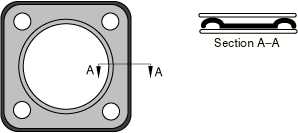
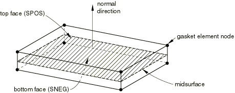
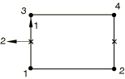
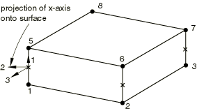
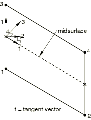

# 32.6.1 垫片单元：概述


Abaqus/Standard提供了用于模拟垫片行为的垫片单元库。

### 概述

垫片建模包括：
- 选择适当的垫片单元类型（["选择垫片单元，" 第32.6.2节](pt06ch32s06alm47.md)）；
- 将垫片单元包含在有限元模型中（["在模型中包含垫片单元，" 第32.6.3节](pt06ch32s06alm48.md)）；
- 定义垫片的初始几何（["定义垫片单元的初始几何，" 第32.6.4节](pt06ch32s06alm49.md)）；和
- 使用材料模型（["使用材料模型定义垫片行为，" 第32.6.5节](pt06ch32s06alm50.md)）或垫片行为模型（["直接使用垫片行为模型定义垫片行为，" 第32.6.6节](pt06ch32s06alm51.md)）定义垫片行为。

### 垫片单元的动机

垫片以多种方式制造并由多种材料制成。某些类型的垫片由多层预成形金属组成，可能带有薄 elastomeric 涂层或 elastomeric 插入件（见图32.6.1--1）。其他使用塑料以及 elastomeric 插入件。

**图32.6.1-1** 由多层预成形金属组成的典型垫片。



垫片通常非常薄，充当结构部件之间的密封组件。它们经过精心设计，通过其厚度方向（垫片的薄方向）提供适当的压力-闭合行为，以便在部件由于热和机械载荷而发生变形时保持密封效果。使用可用材料库很难使用实体连续体单元来模拟垫片的厚度方向行为。因此，Abaqus/Standard提供了各种专用于垫片研究的具有厚度方向行为的垫片单元。

垫片行为模型与材料库中的模型分开，假定厚度方向、横向剪切和膜行为是解耦的（详见["直接使用垫片行为模型定义垫片行为，" 第32.6.6节](pt06ch32s06alm51.md)）。对于不能容易地通过这些特殊行为模型解决的垫片行为，例如必须考虑耦合行为或厚度方向拉伸行为的情况，Abaqus/Standard通过允许垫片单元使用内置或用户定义材料模型（详见["使用材料模型定义垫片行为，" 第32.6.5节](pt06ch32s06alm50.md)）提供了一种通用替代方案。

### 垫片单元的空间表示

[图32.6.1-2](pt06ch32s06abo30.md#egasket-spatial-rep)演示了用于定义垫片单元的关键几何特征。垫片单元由被厚度分开的两个表面组成。底面和顶面之间沿厚度方向测量的相对运动量化了垫片单元的厚度方向（局部1方向）行为。底面和顶面位置的变化在垂直于厚度方向的平面中测量，量化了垫片单元的横向剪切行为。单元中面（底面和顶面之间的中点处的表面）的拉伸和剪切量化了垫片单元的膜行为。

**图32.6.1-2** 垫片单元的空间表示。



### 积分点处定义的局部行为方向

垫片单元积分点处定义的厚度方向构成局部1方向。横向剪切行为在局部1-2和1-3平面中定义。膜行为在2-3平面中定义。对于仅具有一个自由度节点的单元，局部2和3方向未定义，因为这些单元仅考虑垫片的厚度方向行为。局部方向用于指定垫片行为以及描述垫片当前变形状态的所有量的输出。Abaqus/Standard默认计算局部方向。对于某些单元类型，您也可以定义它们。

#### 默认局部方向

Abaqus/Standard按照["定义垫片单元的初始几何，" 第32.6.4节](pt06ch32s06alm49.md)中所述计算局部1方向。

对于二维和轴对称垫片单元，局部2方向定义使得局部1和2方向的叉乘给出面外方向（见图32.6.1-3）。

**图32.6.1-3** 二维和轴对称垫片单元的局部方向。



对于三维面积和三维链接单元，局部2和3方向垂直于局部1方向（见图32.6.1-4），并由表面上局部方向的标准Abaqus约定定义（见["约定，" 第1.2.2节](pt01ch01s02aus02.md)）。

**图32.6.1-4** 三维面积和三维链接垫片单元的局部方向。



对于三维线单元，局部2方向通过将单元中面切线投影到垂直于局部1方向的平面上获得（见图32.6.1-5）。然后局部3方向通过局部1和2方向的叉乘获得。

**图32.6.1-5** 三维线垫片单元的局部方向。



#### 指定局部方向

您可以按照["定义垫片单元的初始几何，" 第32.6.4节](pt06ch32s06alm49.md)中所述定义局部1方向。对于考虑横向剪切和膜变形的三维面积和三维链接单元，可以使用局部方向（["方向，" 第2.2.5节](pt01ch02s02aus15.md)）定义局部2和3方向。

| **输入文件用法：** | 使用以下选项将局部方向与特定垫片单元集关联： |
| --- | --- |
|  | ``` [*GASKET SECTION](../key/key-link.md#usb-kws-mgasketsection), ELSET=*name*, ORIENTATION=*name* ``` |

| **Abaqus/CAE用法：** | 属性模块：****Assign****Material Orientation**** |
| --- | --- |

### 允许使用垫片单元的分析过程

垫片单元可用于静态、静态扰动、准静态、动态和频率分析。但是，垫片单元假定没有质量；因此，不能为垫片单元定义密度。


