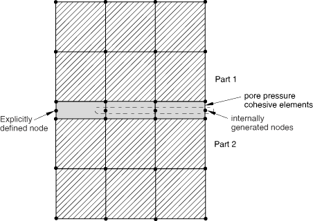
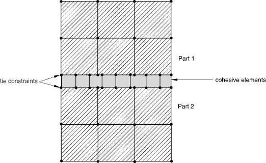
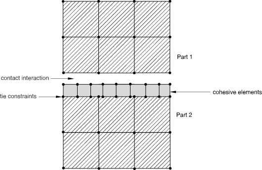
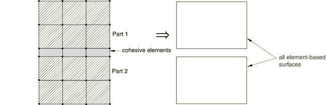
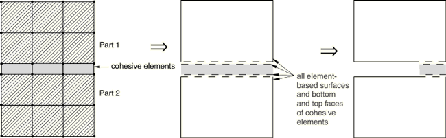
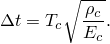
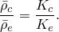
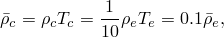
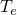

# 32.5.3 使用内聚单元建模


**产品：** Abaqus/Standard  Abaqus/Explicit  Abaqus/CAE  

##### **参考资料**

- ["内聚单元：概述，" 第32.5.1节](pt06ch32s05abo29.md)
- ["选择内聚单元，" 第32.5.2节](pt06ch32s05alm41.md)
- [*COHESIVE SECTION](../key/key-link.md#usb-kws-mcohesivesection)
- [Abaqus/CAE用户指南第21章"粘接接头和粘合界面"](../usi/usi-link.md#usi-adv-cohesive)

### 概述

内聚单元：
- 用于模拟两个组件之间的粘接剂，每个组件可以是可变形或刚性的；
- 用于使用内聚区框架模拟界面脱粘；
- 用于模拟垫片和/或小粘接贴片；
- 可以通过共享节点、使用网格绑定约束或使用MPC类型TIE或PIN连接到相邻组件；和
- 可能通过接触与垫片应用中的其他组件相互作用。

本节讨论可用于离散内聚区并将其组装在表示彼此粘合的多个组件的模型中的技术。它还讨论了与内聚单元相关的几个常见建模问题。

### 使用内聚单元离散内聚区

内聚区必须通过厚度方向的单一内聚单元层进行离散。如果内聚区表示具有有限厚度的粘接材料，可以直接使用该材料的宏观连续体特性来模拟内聚区的本构响应。或者，如果内聚区表示粘接界面上的无限薄粘接层，则可能更相关的是直接根据界面上的牵引与穿过界面的相对运动来定义界面响应。最后，如果内聚区表示小粘接贴片或没有横向约束的垫片，单轴应力状态提供了对这些单元状态的良好近似。Abaqus为上述所有情况提供建模能力。详细信息在后面的章节中讨论。

### 将内聚单元连接到其他组件

内聚单元的顶面或底面中至少必须约束到另一个组件。在大多数应用中，使内聚单元的两个面都绑定到相邻组件是合适的。如果仅内聚单元的一个面被约束而另一个面是自由的，则内聚单元表现出一种或（对于三维单元）多种奇异变形模式，这是由于缺乏膜刚度。奇异模式可以从一个内聚单元传播到相邻单元，但可以通过约束一系列内聚单元端部侧面上的节点来抑制。

在某些情况下，使内聚单元与相邻部件上的单元共享节点是方便和适当的。更一般地，当内聚区中的网格与相邻组件的网格不匹配时，内聚单元可以绑定到其他组件。当内聚单元用于模拟垫片时，在一侧绑定或共享节点并在另一侧定义接触可能更合适。这样可以防止垫片承受拉应力。

#### 让内聚单元与其他单元共享节点

当内聚单元及其相邻部件具有匹配的网格时，通过共享节点（见图32.5.3-1）将内聚单元连接到模型中的其他组件是很直接的。

**图32.5.3-1** 与其他Abaqus单元共享节点的内聚单元。



当这些单元用作粘接剂或用于模拟脱粘时，此方法可用于从模型获取初步结果——更精确的局部结果（在脱粘区）通常需要内聚区比周围组件的单元更细化。当这些单元用于模拟垫片时，当粘接垫片与周围组件之间不发生摩擦滑动时，此方法是合适的。垫片应用中的节点共享方法将导致垫片中产生拉应力（如果连接到垫片的部件被拉开）。在一侧的内聚单元上定义接触将避免此类拉应力。

#### 使用基于表面的绑定约束连接内聚单元与其他组件

如果两个相邻部件没有匹配的网格，例如当内聚层中的离散化级别（通常更细化）与周围结构中的离散化级别不同时，可以使用绑定约束（["网格绑定约束，" 第35.3.1节](pt08ch35s03aus132.md)）将内聚层的顶面和/或底面绑定到周围结构。[图32.5.3-2](pt06ch32s05alm42.md#ecohesive-tied)显示了一个示例，其中对内聚层使用比相邻部件更细化的离散化。

**图32.5.3-2** 具有绑定约束的独立网格。



#### 内聚单元与其他组件之间的接触相互作用

对于涉及垫片的某些应用，在内聚单元的一侧定义接触是合适的（见图32.5.3-3）。

**图32.5.3-3** 内聚区一侧的接触相互作用。



可以使用Abaqus/Explicit中的通用接触算法（["在Abaqus/Explicit中定义通用接触相互作用，" 第36.4.1节](pt09ch36s04aus155.md)）或Abaqus/Standard（["在Abaqus/Standard中定义接触对，" 第36.3.1节](pt09ch36s03aus145.md)）或Abaqus/Explicit（["在Abaqus/Explicit中定义接触对，" 第36.5.1节](pt09ch36s05aus160.md)）中的接触对算法定义接触。如果使用纯主-从接触，通常内聚单元的表面应该是从表面，相邻部件的表面应该是主表面。这种主从选择基于内聚区通常由较软材料组成且具有更细化离散化的事实。第二个考虑因素还表明，在涉及内聚单元的分析中经常使用不匹配网格。如果使用不匹配网格，则可能无法准确预测内聚单元上的压力分布；可能需要使用子模型（["子建模：概述，" 第10.2.1节](pt04ch10s02aus60.md)）来获取精确的局部结果。

### 在大位移分析中使用内聚单元

内聚单元可用于大位移分析。包含内聚单元的装配件可以经历有限位移以及有限旋转。

### 选择内聚单元本构响应的大类

如前所述，内聚单元可用于模拟有限厚度粘接剂、可忽略不计的薄粘接层用于脱粘应用，以及垫片和/或小粘接贴片。定义内聚单元的截面属性时，必须选择这些广泛的应用类别之一。每个选择的详细含义在["使用连续体方法定义内聚单元的本构响应，" 第32.5.5节](pt06ch32s05alm44.md)和["使用牵引-分离描述定义内聚单元的本构响应，" 第32.5.6节](pt06ch32s05alm45.md)中讨论。

| **输入文件用法：** | 使用以下选项使用基于连续体的本构响应建模有限厚度粘接层： |
| --- | --- |
|  | ``` [*COHESIVE SECTION](../key/key-link.md#usb-kws-mcohesivesection), RESPONSE=CONTINUUM ``` 使用以下选项使用基于牵引-分离的响应建模可忽略（几何）薄粘接层： ``` [*COHESIVE SECTION](../key/key-link.md#usb-kws-mcohesivesection), RESPONSE=TRACTION SEPARATION ``` 使用以下选项使用内聚单元作为垫片和/或小粘接贴片： ``` [*COHESIVE SECTION](../key/key-link.md#usb-kws-mcohesivesection), RESPONSE=GASKET ``` |

| **Abaqus/CAE用法：** | 属性模块：**Create Section**：选择**Other**作为section **Category**和**Cohesive**作为section **Type**：**Response**：**Continuum**、**Traction Separation**或**Gasket** |
| --- | --- |

### 为内聚单元分配材料行为

您将材料定义的名称分配给特定单元集。您为本构行为定义的元素集完全由内聚层的本构厚度（见["定义内聚单元的初始几何，" 第32.5.4节中的"指定本构厚度"](pt06ch32s05alm43.md#usb-elm-ecohesiveinit-thickmag)）和引用相同名称的材料特性定义。

内聚单元的本构行为可以基于Abaqus提供的材料模型或用户定义材料模型（见["用户定义力学材料行为，" 第26.7.1节](pt05ch26s07abm69.md)）来定义。当内聚单元用于涉及有限厚度粘接剂的应用时，Abaqus中任何可用的材料模型，包括用于渐进损伤的材料模型，都可以使用。对于涉及垫片和/或有限厚度小粘接贴片的应用，任何可以与一维单元（如梁、桁架和钢筋）一起使用的材料模型，包括用于渐进损伤的材料模型，都可以使用。更多详细信息，请参阅["使用连续体方法定义内聚单元的本构响应，" 第32.5.5节](pt06ch32s05alm44.md)。对于本构行为直接以牵引与分离的形式定义的应用，响应只能以线性弹性关系（在牵引和分离之间）以及渐进损伤来定义（见["使用牵引-分离描述定义内聚单元的本构响应，" 第32.5.6节](pt06ch32s05alm45.md)）。

要定义内聚单元的本构行为，您通过截面定义将材料模型的名称分配给特定单元集。实际的用户定义材料模型在Abaqus/Standard中的用户子程序[`UMAT`](../sub/sub-link.md#sub-xsl-umat)或Abaqus/Explicit中的[`VUMAT`](../sub/sub-link.md#sub-xsl-vumat)中定义。

| **输入文件用法：** | ``` [*COHESIVE SECTION](../key/key-link.md#usb-kws-mcohesivesection), ELSET=*name*, MATERIAL=*name* ``` |
| --- | --- |

| **Abaqus/CAE用法：** | 属性模块：内聚截面编辑器：**Material**：*name* |
| --- | --- |

### 在耦合孔隙流体扩散/应力分析中使用内聚单元

具有或不具有孔隙压力自由度的内聚单元可用于耦合孔隙流体扩散/应力分析。不具有孔隙压力自由度的内聚单元仅贡献力学行为，并且当内聚单元打开时暴露的表面将对流体流动不可渗透。

具有孔隙压力自由度的内聚单元提供更一般的响应，包括模拟切向流动和从间隙到相邻材料的渗漏流的能力。这些单元在间隙内部有额外的孔隙压力节点，您可以选择显式定义这些节点或让Abaqus/Standard自动生成它们。

在典型用法中，您将让这些间隙内部节点为模型中的大多数内聚单元自动生成。您可以按照["定义内聚单元的初始几何"中的"通过定义底面单元连通性和整数偏移量"第32.5.4节](pt06ch32s05alm43.md#usb-elm-ecohesiveinit-offset)中所讨论调用自动节点生成。

### 定义周围组件之间的接触

内聚单元用于粘合两个不同的组件。通常内聚单元在拉伸和/或剪切中逐渐退化。最终，最初由内聚单元粘合在一起的组件可能会相互接触。模拟这种接触的方法包括：
- 在某些情况下，这种接触可以由内聚单元本身处理。默认情况下，即使内聚单元对其他变形模式的阻力完全退化，它们仍保留对压缩的阻力。因此，即使内聚单元在拉伸和/或剪切中完全退化，内聚单元仍能抵抗周围组件的相互穿透。当内聚单元的顶面和底面在变形过程中没有相对切向位移时，此方法效果最佳。换言之，为了模拟上述情况，内聚单元的变形应限于"小滑动"。
- 另一种可能的方法是在可能接触的周围组件的表面之间定义接触，并在内聚单元完全损坏后将其删除。因此，接触在整个分析过程中被建模。如果模型中内聚单元的几何厚度非常小或为零（内聚单元的几何厚度可能与您在定义内聚单元的截面属性时指定の本构厚度不同——见["定义内聚单元的初始几何"中的"指定本构厚度"第32.5.4节](pt06ch32s05alm43.md#usb-elm-ecohesiveinit-thickmag)），不建议使用此方法，因为接触将有效地对内聚层产生非物理压缩阻力，而内聚单元仍然活跃。如果建模摩擦接触，也可能存在非物理剪切力。这将是Abaqus/Explicit中通用接触算法的默认行为。[图32.5.3-4](pt06ch32s05alm42.md#ecohesive-gencontact1)、[图32.5.3-5](pt06ch32s05alm42.md#ecohesive-gencontact2)和[图32.5.3-6](pt06ch32s05alm42.md#ecohesive-gencontact3)显示了通用接触的默认表面。此表面：
  - 对内聚单元与周围单元共享节点、被绑定在一起还是未连接不敏感；和
  - 不包括内聚单元的面。

**图32.5.3-4** 当内聚单元与周围单元共享节点时的默认表面。



**图32.5.3-5** 当内聚单元绑定到周围单元时的默认表面。


**图32.5.3-6** 当内聚单元在一侧绑定并在另一侧通过接触相互作用时的默认表面。


[图32.5.3-7](pt06ch32s05alm42.md#ecohesive-gencontact4)显示了当内聚单元的表面也添加到默认表面时的情况。Abaqus/Explicit自动生成接触排除项，以便通用接触算法避免考虑内聚单元底面与Part 2顶面之间的接触，因为这些表面绑定在一起。

**图32.5.3-7** 当内聚单元在一侧绑定并在另一侧通过接触相互作用时，内聚单元的顶面和底面以及默认表面。


| **输入文件用法：** | 使用以下选项将内聚单元的顶面和底面添加到默认通用接触表面（内聚单元包含在元素集*COH_ELEMS*中）： |
| --- | --- |
|  | ``` [*SURFACE](../key/key-link.md#usb-kws-msurface), NAME=*DEFAULT_PLUS_COH* , *COH_ELEMS*, [*CONTACT](../key/key-link.md#usb-kws-hcontact) [*CONTACT INCLUSIONS](../key/key-link.md#usb-kws-hcontactinclusions) *DEFAULT_PLUS_COH*, ``` |
| **Abaqus/CAE用法：** | 除Sketch、Job和Visualization之外的任何模块：****Tools****Surface****Create****：**Name：** *default_plus_coh*：在视口中选择面 |
|  | 相互作用模块：**Create Interaction**：**General contact (Explicit)**：**Included surface pairs：Selected surface pairs：Edit**，选择左侧列中的表面，然后点击中间的箭头将它们转移到包含对列表中 |

- 对于Abaqus/Explicit中的通用接触，另一种模拟周围结构之间接触的方法是在内聚单元完全退化并从模型中删除时才激活接触（见["使用牵引-分离描述定义内聚单元的本构响应"中的"最大退化和单元移除选择"第32.5.6节](pt06ch32s05alm45.md#usb-elm-ecohesivebehavior-deletion)）。对于这种方法，内聚单元必须与相邻单元共享节点，通用接触定义必须包括内聚单元顶面和底面上的表面，如图32.5.3-8所示。由于内聚单元的每个表面面直接与相邻单元的表面面对立，当两个父单元都活跃时，通用接触算法不考虑这些面。但是，如果内聚单元失效，相对的表面面变得活跃。

| **输入文件用法：** | 使用以下选项将内聚单元的顶面和底面包含在通用接触定义中（内聚单元包含在元素集*COH_ELEMS*中）： |
| --- | --- |
|  | ``` [*SURFACE](../key/key-link.md#usb-kws-msurface), NAME=*gc_surf* , *COH_ELEMS*, [*CONTACT](../key/key-link.md#usb-kws-hcontact) [*CONTACT INCLUSIONS](../key/key-link.md#usb-kws-hcontactinclusions) *gc_surf*, ``` |
| **Abaqus/CAE用法：** | 除Sketch、Job和Visualization之外的任何模块：****Tools****Surface****Create****：**Name：** *gc_surf*：在视口中选择面 |
|  | 相互作用模块：**Create Interaction**：**General contact (Explicit)**：**Included surface pairs：Selected surface pairs：Edit**，选择左侧列中的表面，然后点击中间的箭头将它们转移到包含对列表中 |

**图32.5.3-8** 当内聚单元包含在表面定义中并使用侵蚀时，参与通用接触的表面。



### Abaqus/Explicit中的稳定时间增量

Abaqus/Explicit中内聚单元的稳定时间增量等于应力波穿过内聚层本构厚度所需的时间，：


其中是波速，和分别表示粘接材料的体积刚度和密度。波速表达式中，稳定时间增量可以写成



对于本构响应以牵引与分离定义的情况，牵引与分离关系的斜率是（见["使用牵引-分离描述定义内聚单元的本构响应，" 第32.5.6节](pt06ch32s05alm45.md)，了解更多详细信息）。因此，对于牵引与分离，时间增量的表达式变为


除非您采取一些行动来改变影响时间增量的因素之一，否则内聚单元的时间增量通常将显著小于模型中其他单元的时间增量。这需要您进行一些判断。以下讨论提供了一些关于控制不同材料响应方法时间增量的建议。然而，在某些需要建模薄而刚性内聚层的应用中，Abaqus/Standard可能是更好的选择。

#### 本构响应以连续体或单轴应力状态方法定义

对于以连续体或单轴应力状态方法定义的本构响应，内聚单元与其他单元的稳定时间增量之比为


其中下标"c"和"e"分别代表内聚单元和周围单元。内聚层的厚度通常小于模型中其他单元的特征长度，因此量）。但是，如果内聚区厚度非常小，实现合理时间增量所需的质量缩放可能会显著影响结果。在这种情况下，可能需要除了某些质量缩放外，还要人为降低内聚刚度。这种方法涉及使用可能与界面测量刚度不同的刚度；但是，如果峰值强度和断裂能保持不变，在许多情况下全局响应不会受到显著影响。

#### 本构响应以牵引与分离定义

对于以牵引与分离定义的本构响应，内聚单元与其他单元的稳定时间增量之比为


其中下标"c"和"e"分别代表内聚单元和周围单元。

确保内聚单元对稳定时间增量没有不利影响的一种方法是选择材料特性使得，这意味着



如果例如内聚单元刚度和单位面积密度选择使得




其中表示相邻非内聚单元的特征长度。通过选择，内聚层相对于周围单元的刚度将与Abaqus/Explicit中惩罚接触使用的默认刚度相似（相对于周围单元的等效一维刚度）。这种方法涉及使用可能与界面测量刚度不同的刚度；但是，如果峰值强度和断裂能保持不变，在许多情况下全局响应不会受到显著影响。

### Abaqus/Standard中的收敛问题

在许多问题中，内聚单元被建模为经历导致失效的渐进损伤。渐进损伤的建模涉及材料响应中的软化，这已知会导致隐式求解程序（如Abaqus/Standard）中的收敛困难。在不稳定裂缝扩展期间，当可用能量高于材料的断裂韧性时，也可能发生收敛困难。有几种方法可以帮助避免这些收敛问题。

#### 使用粘性正则化

Abaqus/Standard提供了一种粘性正则化功能，可帮助改善此类问题的收敛。此功能在["在Abaqus/Standard中与内聚单元、连接单元以及可与延性金属和纤维增强复合材料的损伤演化模型一起使用的单元一起使用粘性正则化"中的"截面控制"第27.1.4节](pt06ch27s01aus113.md#usb-elm-esectioncontrol-viscosity)和["在Abaqus/Standard中使用牵引-分离描述定义内聚单元的本构响应"中的"粘性正则化"第32.5.6节](pt06ch32s05alm45.md#usb-elm-ecohesivebehavior-regularize)中有详细讨论。

#### 使用自动稳定

帮助收敛行为的另一种方法是使用自动稳定（见["静态应力分析，" 第6.2.2节](pt03ch06s02at01.md)和["求解非线性问题，" 第7.1.1节](pt03ch07s01aus49.md)，了解更多详细信息），当问题由于局部不稳定而是不稳定时，这很有用。通常，如果使用足够的粘性正则化（通过粘度系数衡量——见["在Abaqus/Standard中与内聚单元一起使用粘性正则化"中的"粘性正则化"第32.5.6节](pt06ch32s05alm45.md#usb-elm-ecohesivebehavior-regularize)，了解更多详细信息），则不需要使用自动稳定技术。在使用少量或不使用粘性正则化的问题中，自动稳定将改善收敛特性。

#### 使用非默认求解控制

使用非默认求解控制（见["常用控制参数，" 第7.2.2节](pt03ch07s02aus50.md)和["非线性问题的收敛准则，" 第7.2.3节](pt03ch07s02aus51.md)，了解更多详细信息）以及激活线搜索技术（["通过使用线搜索算法提高求解效率"中的"非线性问题的收敛准则，" 第7.2.3节](pt03ch07s02aus51.md#usb-anl-aconvergcriteria-linesearch)）可能有助于提高求解效率。


