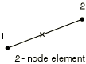
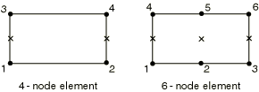

# 32.6.9 轴对称垫片单元库


**产品：** Abaqus/Standard  Abaqus/CAE  

##### **参考文献**

- ["垫片单元：概述，" 第 32.6.1 节](pt06ch32s06abo30.md)
- ["选择垫片单元，" 第 32.6.2 节](pt06ch32s06alm47.md)
- [*GASKET SECTION](../key/key-link.md#usb-kws-mgasketsection)

### 概述

本节提供 Abaqus/Standard 中可用的轴对称垫片单元的参考。

### 单元类型

#### 连接单元

| GKAX2 | 2 节点，轴对称垫片单元 |
| --- | --- |

| GKAX2N | 2 节点，仅具有厚度方向行为的轴对称垫片单元 |
| --- | --- |

##### 激活的自由度

对于仅具有厚度方向行为的垫片单元为 1。

对于其他垫片单元为 1, 2。

##### 附加解变量

无。

#### 通用单元

| GKAX4 | 4 节点，轴对称垫片单元 |
| --- | --- |

| GKAX4N | 4 节点，仅具有厚度方向行为的轴对称垫片单元 |
| --- | --- |

| GKAX6 | 6 节点，轴对称垫片单元 |
| --- | --- |

| GKAX6N | 6 节点，仅具有厚度方向行为的轴对称垫片单元 |
| --- | --- |

##### 激活的自由度

对于仅具有厚度方向行为的垫片单元为 1。

对于其他垫片单元为 1, 2。

##### 附加解变量

无。

### 所需的节点坐标


### 单元属性定义

您必须定义单元的初始间隙和初始孔隙。此外，对于连接单元，您必须定义单元的宽度。

您可以在垫片截面定义中指定厚度方向，也可以在节点上指定法线方向指定厚度方向；您可以在垫片截面定义中指定单元厚度。否则，Abaqus/Standard 将计算厚度方向和厚度。对于连接单元，厚度方向是从第一个节点到第二个节点的方向，厚度是节点之间的距离。对于通用单元，厚度方向基于单元的中面，积分点处的厚度基于节点位置。有关详细信息，请参阅 ["定义垫片单元的初始几何，" 第 32.6.4 节](pt06ch32s06alm49.md)。

| **输入文件用法：** | ``` [*GASKET SECTION](../key/key-link.md#usb-kws-mgasketsection) ``` |
| --- | --- |

| **Abaqus/CAE 用法：** | Property 模块：**Create Section**：选择 **Other** 作为截面 **Category** 和 **Gasket** 作为截面 **Type** |
| --- | --- |

### 基于单元的载荷

无。

### 单元输出

#### GKAX2 单元

| S11 | 垫片单元中的压力或厚度方向单位长度力。 |
| --- | --- |

| CS11 | 垫片单元中的接触压力（仅当 S11 是单位长度力且垫片响应不是使用材料模型定义时可用）。 |
| --- | --- |

| S22 | 环向应力。 |
| --- | --- |

| S12 | 剪切应力或单位长度剪切力。 |
| --- | --- |

| E11 | 如果垫片响应直接使用垫片行为模型定义，则为垫片闭合；如果垫片响应使用材料模型定义，则为应变。 |
| --- | --- |

| E22 | 环向应变。 |
| --- | --- |

| E12 | 如果垫片响应直接使用垫片行为模型定义，则为剪切运动；如果垫片响应使用材料模型定义，则为应变。 |
| --- | --- |

| NE11 | 有效厚度方向应变。 |
| --- | --- |

| NE22 | 环向应变。 |
| --- | --- |

| NE12 | 有效剪切应变。 |
| --- | --- |

#### GKAX2N 单元

| S11 | 垫片单元中的压力或厚度方向单位长度力。 |
| --- | --- |

| CS11 | 垫片单元中的接触压力（仅当 S11 是单位长度力且垫片响应不是使用材料模型定义时可用）。 |
| --- | --- |

| E11 | 如果垫片响应直接使用垫片行为模型定义，则为垫片闭合；如果垫片响应使用材料模型定义，则为应变。 |
| --- | --- |

| NE11 | 有效厚度方向应变。 |
| --- | --- |

#### 仅具有厚度方向行为的通用单元

| S11 | 垫片单元中的压力。 |
| --- | --- |

| E11 | 如果垫片响应直接使用垫片行为模型定义，则为垫片闭合；如果垫片响应使用材料模型定义，则为应变。 |
| --- | --- |

| NE11 | 有效厚度方向应变。 |
| --- | --- |

#### 其他通用单元

| S11 | 垫片单元中的压力。 |
| --- | --- |

| S22 | 直接膜应力。 |
| --- | --- |

| S33 | 环向应力。 |
| --- | --- |

| S12 | 剪切应力。 |
| --- | --- |

| E11 | 如果垫片响应直接使用垫片行为模型定义，则为垫片闭合；如果垫片响应使用材料模型定义，则为应变。 |
| --- | --- |

| E22 | 直接膜应变。 |
| --- | --- |

| E33 | 环向应变。 |
| --- | --- |

| E12 | 如果垫片响应直接使用垫片行为模型定义，则为剪切运动；如果垫片响应使用材料模型定义，则为应变。 |
| --- | --- |

| NE11 | 有效厚度方向应变。 |
| --- | --- |

| NE22 | 直接膜应变。 |
| --- | --- |

| NE33 | 直接膜应变。 |
| --- | --- |

| NE12 | 有效剪切应变。 |
| --- | --- |

### 节点排序和积分点编号

#### 连接单元



#### 通用单元




