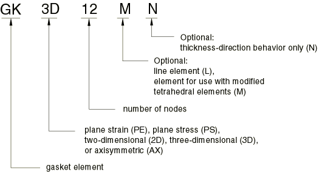
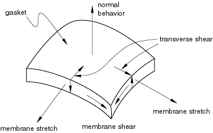

# 32.6.2 选择垫片单元

**产品：** Abaqus/Standard  Abaqus/CAE  

##### **参考文献**

- ["垫片单元：概述，" 第 32.6.1 节](pt06ch32s06abo30.md)
- ["二维垫片单元库，" 第 32.6.7 节](pt06ch32s06ael33.md)
- ["三维垫片单元库，" 第 32.6.8 节](pt06ch32s06ael34.md)
- ["轴对称垫片单元库，" 第 32.6.9 节](pt06ch32s06ael35.md)
- [Abaqus/CAE 用户指南第 32 章，"垫片"](../usi/usi-link.md#usi-adv-gasket)

### 概述

Abaqus/Standard 垫片单元库包括：
- 二维分析用的单元；
- 三维分析用的单元；
- 轴对称分析用的单元；
- 仅考虑垫片厚度方向行为的单元；以及
- 考虑垫片的厚度方向、膜和横向剪切行为的单元。

### 命名约定

Abaqus/Standard 中使用的垫片单元命名如下：

例如，GKPE4 是一个 4 节点平面应变垫片单元，考虑厚度方向、膜和横向剪切行为。

### 一般用途单元与仅具有厚度方向行为的单元

Abaqus/Standard 提供两类垫片单元。在这两类中，材料属性可以通过特殊的垫片行为模型或内置材料模型（包括用户定义材料）来指定（请参阅 ["直接使用垫片行为模型定义垫片行为，" 第 32.6.6 节](pt06ch32s06alm51.md)，和 ["使用材料模型定义垫片行为，" 第 32.6.5 节](pt06ch32s06alm50.md)）。第一类是垫片单元的集合，这些单元在其节点处具有所有位移自由度。当垫片的膜和/或横向剪切行为很重要时，这些单元是必需的（请参阅 [图 32.6.2--1](pt06ch32s06alm47.md#egasket-def-modes)）。当单元与特殊垫片行为模型结合使用时，厚度方向、横向剪切和膜行为只能定义为非耦合行为。在某些情况下，膜效应只是次要的；在这种情况下，可以仅对厚度方向和横向剪切行为进行建模。这些单元适用于厚度方向行为和摩擦效应都很重要的分析。

**图 32.6.2–1** 垫片的不同变形模式。

在第二类垫片单元中，变形仅在厚度方向上测量。垫片对任何其他变形模式的响应都被忽略。这些单元的节点只有一个位移自由度，位于垫片的厚度方向上。这类单元旨在在垫片的厚度方向行为是唯一重要的行为时降低分析的计算成本。这种行为可以很容易地用垫片压力与垫片闭合的关系来指定。此类单元不能传递摩擦力，并且不考虑垫片平面内的任何热膨胀或拉伸。

### 用于二维、三维和轴对称分析的单元

对于两类垫片单元，Abaqus/Standard 都提供二维、三维和轴对称单元的选择。分别为二维分析提供平面应力和平面应变单元，以分别表示平面外的薄垫片或厚垫片。为几何和载荷具有轴对称性的情况提供轴对称垫片单元。

Abaqus/Standard 为二维、三维和轴对称分析提供 2 节点或连接单元；三维线单元；以及与改进型四面体单元一起使用的三维 12 节点单元。这些单元具有特定的特性，在对垫片进行建模时很有用。

#### 连接单元

由于连接垫片单元只有两个节点，它们的几何形状仅定义了垫片的一个维度——通过厚度维度。连接垫片单元通常用于模拟螺栓下使用的垫圈，当螺栓本身用桁架单元建模时。对于二维和三维连接单元，垫片的横截面是未确定的。对于轴对称连接单元，单元的宽度是未确定的。这些单元维度的降低为垫片行为的指定提供了灵活性，在某些情况下可能非常高效；有关更多详细信息，请参阅 ["直接使用垫片行为模型定义垫片行为，" 第 32.6.6 节](pt06ch32s06alm51.md)。

#### 三维线单元

三维线垫片单元通常用于模拟垫片中狭窄、较厚的特征，例如孔周围的弹性体嵌件。由于它们用于三维分析，因此单元的宽度从单元几何形状中是未确定的。这些单元维度的降低为垫片行为的指定提供了灵活性，在某些情况下可能非常高效；有关更多详细信息，请参阅 ["直接使用垫片行为模型定义垫片行为，" 第 32.6.6 节](pt06ch32s06alm51.md)。

#### 与改进型四面体单元一起使用的 12 节点单元

12 节点垫片单元与改进的 10 节点四面体具有相同的接触特性；这些单元在角节点和中侧节点具有一致的节点力。它们主要用于与改进型四面体单元结合使用，但也可以通过接触对与其他实体连续体单元结合使用。在后一种情况下，对于不匹配的网格，解决方案可能会有噪声。

