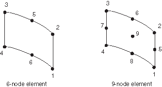
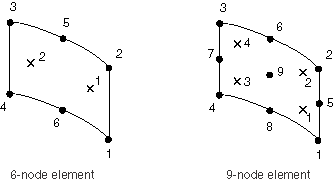

# 32.7.3 圆柱表面单元库


**产品：** Abaqus/Standard  

##### **参考资料**

- ["表面单元，" 第32.7.1节](pt06ch32s07alm52.md)
- [*SURFACE SECTION](../key/key-link.md#usb-kws-msurfacesection)
- [*REBAR LAYER](../key/key-link.md#usb-kws-mrebarlayer)

### 概述

本节提供Abaqus/Standard中可用的圆柱表面单元的参考。

### 单元类型

| SFMCL6 | 6节点圆柱表面 |
| --- | --- |
|  |

| SFMCL9 | 9节点圆柱表面 |
| --- | --- |
|  |

##### 活动自由度

 1, 2, 3

##### 附加解变量

无。

### 所需节点坐标

 *X*, *Y*, *Z*

### 单元属性定义

| **输入文件用法：** | 使用以下选项定义表面单元属性： |
| --- | --- |
|  | ``` [*SURFACE SECTION](../key/key-link.md#usb-kws-msurfacesection) ``` 如果定义了钢筋，请将以下选项与[*SURFACE SECTION](../key/key-link.md#usb-kws-msurfacesection)选项结合使用： ``` [*REBAR LAYER](../key/key-link.md#usb-kws-mrebarlayer) ``` 使用以下选项定义单位面积质量密度： ``` [*SURFACE SECTION](../key/key-link.md#usb-kws-msurfacesection), DENSITY=*number* ``` |

### 基于单元的加载

### 分布载荷

分布载荷如["分布载荷，" 第34.4.3节](pt07ch34s04aus122.md)中所述进行指定。仅当表面单元定义了钢筋或单元具有定义的质量密度时，重力、离心力、旋转加速度和科里奥利力载荷才适用。

**载荷ID (*DLOAD)：**  BX**单位：**  [FL<sup>3</sup>](../popups/usb-int-iconventions-unitsym.md)**描述：**  全局*X*方向的体力。

**载荷ID (*DLOAD)：**  BY**单位：**  [FL<sup>2</sup>](../popups/usb-int-iconventions-unitsym.md)**描述：**  全局*Y*方向的体力。

**载荷ID (*DLOAD)：**  BZ**单位：**  [FL<sup>2</sup>](../popups/usb-int-iconventions-unitsym.md)**描述：**  全局*Z*方向的体力。

**载荷ID (*DLOAD)：**  BXNU**单位：**  [FL<sup>2</sup>](../popups/usb-int-iconventions-unitsym.md)**描述：**  全局*X*方向的非均匀体力，幅度通过用户子程序[`DLOAD`](../sub/sub-link.md#sub-xsl-dload)提供。

**载荷ID (*DLOAD)：**  BYNU**单位：**  [FL<sup>2</sup>](../popups/usb-int-iconventions-unitsym.md)**描述：**  全局*Y*方向的非均匀体力，幅度通过用户子程序[`DLOAD`](../sub/sub-link.md#sub-xsl-dload)提供。

**载荷ID (*DLOAD)：**  BZNU**单位：**  [FL<sup>2</sup>](../popups/usb-int-iconventions-unitsym.md)**描述：**  全局*Z*方向的非均匀体力，幅度通过用户子程序[`DLOAD`](../sub/sub-link.md#sub-xsl-dload)提供。

**载荷ID (*DLOAD)：**  CENT**单位：**  [FL<sup>3</sup>(ML<sup>2</sup> T<sup>2</sup>)](../popups/usb-int-iconventions-unitsym.md)**描述：**  离心载荷（幅度输入为，其中是单位面积质量密度，是角速度）。

**载荷ID (*DLOAD)：**  CENTRIF**单位：**  [T<sup>2</sup>](../popups/usb-int-iconventions-unitsym.md)**描述：**  离心载荷（幅度输入为，其中是角速度）。

**载荷ID (*DLOAD)：**  CORIO**单位：**  [FL<sup>3</sup>T (ML<sup>2</sup> T<sup>1</sup>)](../popups/usb-int-iconventions-unitsym.md)**描述：**  科里奥利力（幅度输入为，其中是单位面积质量密度，是角速度）。在直接稳态动力学分析中不考虑科里奥利载荷的载荷刚度。

**载荷ID (*DLOAD)：**  GRAV**单位：**  [LT<sup>2</sup>](../popups/usb-int-iconventions-unitsym.md)**描述：**  指定方向的重力载荷（幅度输入为加速度）。

**载荷ID (*DLOAD)：**  HP**单位：**  [FL<sup>2</sup>](../popups/usb-int-iconventions-unitsym.md)**描述：**  作用于单元参考表面并相对于全局*Z*成线性分布的静水压力。压力在正单元法线方向为正。

**载荷ID (*DLOAD)：**  P**单位：**  [FL<sup>2</sup>](../popups/usb-int-iconventions-unitsym.md)**描述：**  作用于单元参考表面的压力。压力在正单元法线方向为正。

**载荷ID (*DLOAD)：**  PNU**单位：**  [FL<sup>2</sup>](../popups/usb-int-iconventions-unitsym.md)**描述：**  非均匀压力作用于单元参考表面，幅度通过用户子程序[`DLOAD`](../sub/sub-link.md#sub-xsl-dload)提供。

**载荷ID (*DLOAD)：**  ROTA**单位：**  [T<sup>2</sup>](../popups/usb-int-iconventions-unitsym.md)**描述：**  旋转加速度载荷（幅度输入为，其中是旋转加速度）。

**载荷ID (*DLOAD)：**  TRSHR**单位：**  [FL<sup>2</sup>](../popups/usb-int-iconventions-unitsym.md)**描述：**  单元参考表面上的剪切牵引力。

**载荷ID (*DLOAD)：**  TRSHRNU(S)**单位：**  [FL<sup>2</sup>](../popups/usb-int-iconventions-unitsym.md)**描述：**  非均匀剪切牵引力作用于单元参考表面，幅度和方向通过用户子程序[`UTRACLOAD`](../sub/sub-link.md#sub-xsl-utracload)提供。

**载荷ID (*DLOAD)：**  TRVEC**单位：**  [FL<sup>2</sup>](../popups/usb-int-iconventions-unitsym.md)**描述：**  单元参考表面上的通用牵引力。

**载荷ID (*DLOAD)：**  TRVECNU(S)**单位：**  [FL<sup>2</sup>](../popups/usb-int-iconventions-unitsym.md)**描述：**  非均匀通用牵引力作用于单元参考表面，幅度和方向通过用户子程序[`UTRACLOAD`](../sub/sub-link.md#sub-xsl-utracload)提供。

### 基础

基础如["单元基础，" 第2.2.2节](pt01ch02s02aus12.md)中所述进行指定。

**载荷ID (*FOUNDATION)：**  F**单位：**  [FL<sup>2</sup>](../popups/usb-int-iconventions-unitsym.md)**描述：**  弹性基础。

### 基于表面的加载

### 分布载荷

基于表面的分布载荷如["分布载荷，" 第34.4.3节](pt07ch34s04aus122.md)中所述进行指定。

**载荷ID (*DSLOAD)：**  HP**单位：**  [FL<sup>2</sup>](../popups/usb-int-iconventions-unitsym.md)**描述：**  作用于单元参考表面并相对于全局*Z*成线性分布的静水压力。压力在表面法线相反方向为正。

**载荷ID (*DSLOAD)：**  P**单位：**  [FL<sup>2</sup>](../popups/usb-int-iconventions-unitsym.md)**描述：**  作用于单元参考表面的压力。压力在表面法线相反方向为正。

**载荷ID (*DSLOAD)：**  PNU**单位：**  [FL<sup>2</sup>](../popups/usb-int-iconventions-unitsym.md)**描述：**  非均匀压力作用于单元参考表面，幅度通过用户子程序[`DLOAD`](../sub/sub-link.md#sub-xsl-dload)提供。压力在表面法线相反方向为正。

**载荷ID (*DSLOAD)：**  TRSHR**单位：**  [FL<sup>2</sup>](../popups/usb-int-iconventions-unitsym.md)**描述：**  单元参考表面上的剪切牵引力。

**载荷ID (*DSLOAD)：**  TRSHRNU(S)**单位：**  [FL<sup>2</sup>](../popups/usb-int-iconventions-unitsym.md)**描述：**  非均匀剪切牵引力作用于单元参考表面，幅度和方向通过用户子程序[`UTRACLOAD`](../sub/sub-link.md#sub-xsl-utracload)提供。

**载荷ID (*DSLOAD)：**  TRVEC**单位：**  [FL<sup>2</sup>](../popups/usb-int-iconventions-unitsym.md)**描述：**  单元参考表面上的通用牵引力。

**载荷ID (*DSLOAD)：**  TRVECNU(S)**单位：**  [FL<sup>2</sup>](../popups/usb-int-iconventions-unitsym.md)**描述：**  非均匀通用牵引力作用于单元参考表面，幅度和方向通过用户子程序[`UTRACLOAD`](../sub/sub-link.md#sub-xsl-utracload)提供。

### 入射波载荷

这些单元也支持基于表面的入射波载荷。参见["声学和冲击载荷，" 第34.4.6节](pt07ch34s04aus125.md)。

### 单元输出

当前仅在表面单元用于承载钢筋层时才可用输出。详细信息请参见["定义钢筋，" 第2.2.3节](pt01ch02s02aus13.md)。

### 单元上的节点排序和面编号



### 用于输出的积分点编号




