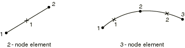

# 32.7.4 轴对称表面单元库


**产品：** Abaqus/Standard  Abaqus/CAE  

##### **参考资料**

- ["表面单元，" 第32.7.1节](pt06ch32s07alm52.md)
- [*SURFACE SECTION](../key/key-link.md#usb-kws-msurfacesection)
- [*REBAR LAYER](../key/key-link.md#usb-kws-mrebarlayer)

### 概述

本节提供Abaqus/Standard中可用的轴对称表面单元的参考。

### 约定

坐标1是*r*，坐标2是*z*。在处，*r*方向对应全局*X*方向，*z*方向对应全局*Y*方向。当数据必须以全局方向给出时，这很重要。坐标1应该大于或等于零。

自由度1是，自由度2是。具有扭转的广义轴对称单元有一个额外的自由度5，对应于扭转角度（以弧度为单位）。

Abaqus/Standard不会自动对位于对称轴上的节点施加任何边界条件。如果需要，你必须在这些节点上施加径向或对称边界条件。

点载荷和力矩应作为绕圆周积分的值给出；也就是说，环上的总值。

### 单元类型

#### 常规轴对称表面单元

| SFMAX1 | 2节点线性，无扭转 |
| --- | --- |
|  |

| SFMAX2 | 3节点二次，无扭转 |
| --- | --- |
|  |

##### 活动自由度

1, 2

##### 附加解变量

无。

#### 广义轴对称表面单元

| SFMGAX1 | 2节点线性，有扭转 |
| --- | --- |
|  |

| SFMGAX2 | 3节点二次，有扭转 |
| --- | --- |
|  |

##### 活动自由度

 1, 2, 5

##### 附加解变量

无。

### 所需节点坐标

 *R*, *Z*

### 单元属性定义

| **输入文件用法：** | 使用以下选项定义表面单元： |
| --- | --- |
|  | ``` [*SURFACE SECTION](../key/key-link.md#usb-kws-msurfacesection) ``` 如果定义了钢筋，请将以下选项与[*SURFACE SECTION](../key/key-link.md#usb-kws-msurfacesection)选项结合使用： ``` [*REBAR LAYER](../key/key-link.md#usb-kws-mrebarlayer) ``` 使用以下选项定义单位面积质量密度： ``` [*SURFACE SECTION](../key/key-link.md#usb-kws-msurfacesection), DENSITY=*number* ``` |

| **Abaqus/CAE用法：** | 属性模块：**创建截面**：选择**壳**作为截面**类别**和**表面**作为截面**类型**，**钢筋层**（可选） |
| --- | --- |
|  | 你无法在Abaqus/CAE中为表面截面定义单位面积质量。 |

### 基于单元的加载

### 分布载荷

分布载荷如["分布载荷，" 第34.4.3节](pt07ch34s04aus122.md)中所述进行指定。仅当表面单元定义了钢筋或单元具有定义的质量密度时，重力和离心力载荷才适用。

**载荷ID (*DLOAD)：**  BR**Abaqus/CAE载荷/相互作用：**  **体力****单位：**  [FL<sup>2</sup>](../popups/usb-int-iconventions-unitsym.md)**描述：**  径向（1或*r*）方向的体力。

**载荷ID (*DLOAD)：**  BZ**Abaqus/CAE载荷/相互作用：**  **体力****单位：**  [FL<sup>2</sup>](../popups/usb-int-iconventions-unitsym.md)**描述：**  轴向（2或*z*）方向的体力。

**载荷ID (*DLOAD)：**  BRNU**Abaqus/CAE载荷/相互作用：**  **体力****单位：**  [FL<sup>2</sup>](../popups/usb-int-iconventions-unitsym.md)**描述：**  径向方向的非均匀体力，幅度通过用户子程序[`DLOAD`](../sub/sub-link.md#sub-xsl-dload)提供。

**载荷ID (*DLOAD)：**  BZNU**Abaqus/CAE载荷/相互作用：**  **体力****单位：**  [FL<sup>2</sup>](../popups/usb-int-iconventions-unitsym.md)**描述：**  轴向方向的非均匀体力，幅度通过用户子程序[`DLOAD`](../sub/sub-link.md#sub-xsl-dload)提供。

**载荷ID (*DLOAD)：**  CENT**Abaqus/CAE载荷/相互作用：**  不支持**单位：**  [FL<sup>3</sup> (ML<sup>2</sup>T<sup>2</sup>)](../popups/usb-int-iconventions-unitsym.md)**描述：**  离心载荷（幅度输入为，其中是单位面积质量密度，是角速度）。由于仅允许轴对称变形，旋转轴必须是*z*轴。

**载荷ID (*DLOAD)：**  CENTRIF**Abaqus/CAE载荷/相互作用：**  **旋转体力力****单位：**  [T<sup>2</sup>](../popups/usb-int-iconventions-unitsym.md)**描述：**  离心载荷（幅度输入为，其中是角速度）。由于仅允许轴对称变形，旋转轴必须是*z*轴。

**载荷ID (*DLOAD)：**  GRAV**Abaqus/CAE载荷/相互作用：**  **重力****单位：**  [LT<sup>2</sup>](../popups/usb-int-iconventions-unitsym.md)**描述：**  指定方向的重力载荷（幅度输入为加速度）。

**载荷ID (*DLOAD)：**  HP**Abaqus/CAE载荷/相互作用：**  不支持**单位：**  [FL<sup>2</sup>](../popups/usb-int-iconventions-unitsym.md)**描述：**  作用于单元参考表面并相对于全局*Z*成线性分布的静水压力。压力在正单元法线方向为正。

**载荷ID (*DLOAD)：**  P**Abaqus/CAE载荷/相互作用：**  **压力****单位：**  [FL<sup>2</sup>](../popups/usb-int-iconventions-unitsym.md)**描述：**  作用于单元参考表面的压力。压力在正单元法线方向为正。

**载荷ID (*DLOAD)：**  PNU**Abaqus/CAE载荷/相互作用：**  不支持**单位：**  [FL<sup>2</sup>](../popups/usb-int-iconventions-unitsym.md)**描述：**  非均匀压力作用于单元参考表面，幅度通过用户子程序[`DLOAD`](../sub/sub-link.md#sub-xsl-dload)提供。压力在正单元法线方向为正。

**载荷ID (*DLOAD)：**  TRSHR**Abaqus/CAE载荷/相互作用：**  **表面牵引力****单位：**  [FL<sup>2</sup>](../popups/usb-int-iconventions-unitsym.md)**描述：**  单元参考表面上的剪切牵引力。

**载荷ID (*DLOAD)：**  TRSHRNU(S)**Abaqus/CAE载荷/相互作用：**  不支持**单位：**  [FL<sup>2</sup>](../popups/usb-int-iconventions-unitsym.md)**描述：**  非均匀剪切牵引力作用于单元参考表面，幅度和方向通过用户子程序[`UTRACLOAD`](../sub/sub-link.md#sub-xsl-utracload)提供。

**载荷ID (*DLOAD)：**  TRVEC**Abaqus/CAE载荷/相互作用：**  **表面牵引力****单位：**  [FL<sup>2</sup>](../popups/usb-int-iconventions-unitsym.md)**描述：**  单元参考表面上的通用牵引力。

**载荷ID (*DLOAD)：**  TRVECNU(S)**Abaqus/CAE载荷/相互作用：**  不支持**单位：**  [FL<sup>2</sup>](../popups/usb-int-iconventions-unitsym.md)**描述：**  非均匀通用牵引力作用于单元参考表面，幅度和方向通过用户子程序[`UTRACLOAD`](../sub/sub-link.md#sub-xsl-utracload)提供。

### 基础

基础如["单元基础，" 第2.2.2节](pt01ch02s02aus12.md)中所述进行指定。

**载荷ID (*FOUNDATION)：**  F**Abaqus/CAE载荷/相互作用：**  **弹性基础****单位：**  [FL<sup>2</sup>](../popups/usb-int-iconventions-unitsym.md)**描述：**  弹性基础。对于SFMGAX1和SFMGAX2单元，弹性基础仅应用于自由度和。

### 基于表面的加载

### 分布载荷

基于表面的分布载荷如["分布载荷，" 第34.4.3节](pt07ch34s04aus122.md)中所述进行指定。

**载荷ID (*DSLOAD)：**  HP**Abaqus/CAE载荷/相互作用：**  **压力****单位：**  [FL<sup>2</sup>](../popups/usb-int-iconventions-unitsym.md)**描述：**  作用于单元参考表面并相对于全局*Z*成线性分布的静水压力。压力在表面法线相反方向为正。

**载荷ID (*DSLOAD)：**  P**Abaqus/CAE载荷/相互作用：**  **压力****单位：**  [FL<sup>2</sup>](../popups/usb-int-iconventions-unitsym.md)**描述：**  作用于单元参考表面的压力。压力在表面法线相反方向为正。

**载荷ID (*DSLOAD)：**  PNU**Abaqus/CAE载荷/相互作用：**  **压力****单位：**  [FL<sup>2</sup>](../popups/usb-int-iconventions-unitsym.md)**描述：**  非均匀压力作用于单元参考表面，幅度通过用户子程序[`DLOAD`](../sub/sub-link.md#sub-xsl-dload)提供。压力在表面法线相反方向为正。

**载荷ID (*DSLOAD)：**  TRSHR**Abaqus/CAE载荷/相互作用：**  **表面牵引力****单位：**  [FL<sup>2</sup>](../popups/usb-int-iconventions-unitsym.md)**描述：**  单元参考表面上的剪切牵引力。

**载荷ID (*DSLOAD)：**  TRSHRNU(S)**Abaqus/CAE载荷/相互作用：**  **表面牵引力****单位：**  [FL<sup>2</sup>](../popups/usb-int-iconventions-unitsym.md)**描述：**  非均匀剪切牵引力作用于单元参考表面，幅度和方向通过用户子程序[`UTRACLOAD`](../sub/sub-link.md#sub-xsl-utracload)提供。

**载荷ID (*DSLOAD)：**  TRVEC**Abaqus/CAE载荷/相互作用：**  **表面牵引力****单位：**  [FL<sup>2</sup>](../popups/usb-int-iconventions-unitsym.md)**描述：**  单元参考表面上的通用牵引力。

**载荷ID (*DSLOAD)：**  TRVECNU(S)**Abaqus/CAE载荷/相互作用：**  **表面牵引力****单位：**  [FL<sup>2</sup>](../popups/usb-int-iconventions-unitsym.md)**描述：**  非均匀通用牵引力作用于单元参考表面，幅度和方向通过用户子程序[`UTRACLOAD`](../sub/sub-link.md#sub-xsl-utracload)提供。

### 入射波载荷

这些单元也支持基于表面的入射波载荷。参见["声学和冲击载荷，" 第34.4.6节](pt07ch34s04aus125.md)。

### 单元输出

当前仅在表面单元用于承载钢筋层时才可用输出。详细信息请参见["定义钢筋，" 第2.2.3节](pt01ch02s02aus13.md)。

### 单元上的节点排序


### 用于输出的积分点编号




