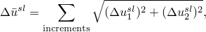
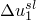
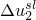

# 32.8.2 管道支撑单元库


**产品：** Abaqus/Standard  

##### **参考资料**

- ["管道支撑单元，" 第32.8.1节](pt06ch32s08alm53.md)
- [*ITS](../key/key-link.md#usb-kws-mits)

### 概述

本节提供Abaqus/Standard中可用的管道支撑单元的参考。

### 单元类型

| ITSUNI | 单向管道支撑单元 |
| --- | --- |
|  |

| ITSCYL | 圆柱几何管道支撑单元 |
| --- | --- |
|  |

##### 活动自由度

1, 2, 3, 4, 5, 6

##### 附加解变量

无。

### 所需节点坐标

*X*, *Y*, *Z*

### 单元属性定义

| **输入文件用法：** | ``` [*ITS](../key/key-link.md#usb-kws-mits) ``` |
| --- | --- |

### 基于单元的加载

无。

### 单元输出

| S11 | 单元中的总直接力。 |
| --- | --- |

| S12 | 平面内的切向（剪切）力分量，由摩擦引起。 |
| --- | --- |

| S13 | 平行于管道轴线的切向（剪切）力分量，由摩擦引起。 |
| --- | --- |

弹簧连杆中的力和阻尼器中的力被定义为广义子应力，因此可作为子应力选择用于输出选项，如下所示：

| SS1 | 弹簧连杆中的力。 |
| --- | --- |

| SS2 | 阻尼器中的力。 |
| --- | --- |

上述力对应的相对轴向和切向位移通过请求相应的"应变"来选择，但在ITSCYL单元类型中未定义"应变"分量E13。

滑动过程中的相对切向（剪切）位移分量可作为"塑性应变"分量PE12和PE13使用。"等效塑性应变"在这些单元中定义为



其中和是两个相对切向位移分量。

### 与单元关联的节点

ITSUNI：两个节点——一个在管道轴线上，一个在两个平行支撑板之间的等距位置。

ITSCYL：两个节点——一个在管道轴线上，一个在支撑板孔的中心。


