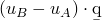
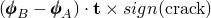
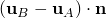
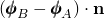
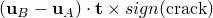
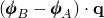
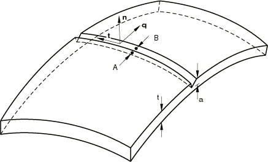
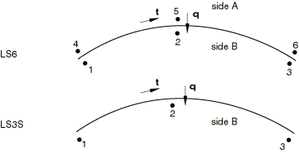
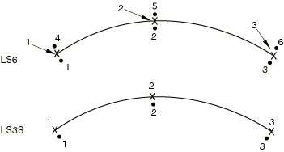

# 32.9.2 线弹簧单元库


**产品：** Abaqus/Standard  

##### **参考资料**

- ["用于建模壳中部分穿透裂纹的线弹簧单元，" 第32.9.1节](pt06ch32s09alm54.md)
- [*SHELL SECTION](../key/key-link.md#usb-kws-mshellsection)
- [*SURFACE FLAW](../key/key-link.md#usb-kws-msurfaceflaw)

### 概述

本节提供Abaqus/Standard中可用的线弹簧单元的参考。

### 单元类型

| LS6 | 6节点通用二阶线弹簧 |
| --- | --- |
|  |

| LS3S | 用于对称平面的3节点二阶线弹簧 |
| --- | --- |
|  |

##### 活动自由度

1, 2, 3, 4, 5, 6

##### 附加解变量

无。

### 所需节点坐标

在每个节点处需要*X*, *Y*, *Z*，以及可选地，、、（壳法线的方向余弦）在每个节点处。

用户定义的法线定义（请参阅["节点处的法线定义，" 第2.1.4节](pt01ch02s01aus08.md)）也可用于指定、、。如果未指定，则与所有其他壳单元一样，通过对附着在每个节点上的壳单元进行平均来构建。

### 单元属性定义

唯一使用的单元属性是厚度；积分点数量被忽略，因为单元基于截面属性工作。

| **输入文件用法：** | 使用以下选项定义线弹簧单元属性： |
| --- | --- |
|  | ``` [*SHELL SECTION](../key/key-link.md#usb-kws-mshellsection) ``` 使用以下选项定义裂纹深度作为位置的函数： ``` [*SURFACE FLAW](../key/key-link.md#usb-kws-msurfaceflaw) ``` |

### 基于单元的加载

### 分布载荷

分布载荷如["分布载荷，" 第34.4.3节](pt07ch34s04aus122.md)中所述进行指定。

裂纹面压力加载使用三个高斯点。

**载荷ID (*DLOAD)：**  HP**单位：**  [FL<sup>2</sup>](../popups/usb-int-iconventions-unitsym.md)**描述：**  裂纹面上相对于全局*Z*方向线性变化的静水表面压力。

**载荷ID (*DLOAD)：**  P**单位：**  [FL<sup>2</sup>](../popups/usb-int-iconventions-unitsym.md)**描述：**  裂纹面上的表面压力。

### 单元输出

单元上的节点1、2和3定义侧面*B*，节点4、5和6定义侧面*A*（请参见[图32.9.2-1](pt06ch32s09ael40.md#elinespring-strain-not)）。裂纹的符号由裂纹起源的壳表面标识，你在定义裂纹深度时指定（请参阅["用于建模壳中部分穿透裂纹的线弹簧单元，" 第32.9.1节](pt06ch32s09alm54.md)）。如果裂纹起源于壳的正表面，*sign*(裂纹)=1.0；如果裂纹起源于壳的负表面，*sign*(裂纹)=1.0。

向量由切线（从节点1到节点3为正）和法线（给出坐标时定义，或由用户定义的法线定义）的叉乘通过右手定则定义。对于LS3S单元类型，向量必须指向模型内部（远离对称平面）。对于LS6单元类型，向量必须从侧面*A*指向侧面*B*。

#### "应变"

| E11 | I型张开位移， |
| --- | --- |

| E22 | I型张开旋转， |
| --- | --- |

以下应变仅适用于LS6：

| E33 | II型厚度剪切， |
| --- | --- |

| E12 | II型旋转，（此应变不起作用） |
| --- | --- |

| E13 | III型反平面剪切， |
| --- | --- |

| E23 | III型张开旋转， |
| --- | --- |

通过请求"应力"输出，可以获得共轭力和力矩。

*J*积分在每个积分点提供。如果定义了弹塑性材料行为，则提供*J*的弹性和塑性部分。应力强度因子*K*也根据*J*的弹性部分提供。

**图32.9.2-1** 线弹簧应变符号。



### 与单元关联的节点



### 用于输出的积分点编号

三个点（这些点在节点处）用于积分和单元输出。




