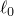
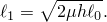
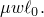
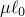

# 32.11.1 拖链


**产品：** Abaqus/Standard

##### **参考资料**

- ["拖链单元库，" 第32.11.2节](pt06ch32s11ael42.md)
- [*DRAG CHAIN](../key/key-link.md#usb-kws-mdragchain)
- [*RIGID SURFACE](../key/key-link.md#usb-kws-mrigidsurf)

### 概述

拖链单元：
- 用于模拟海床上拖链对近底弯曲模拟建模的影响；以及
- 可用于二维或三维问题。

### 典型应用

拖链被建模为海床上的集中重量，链条连接在重量和管道上的连接点之间（参见图32.11.1-1）。

**图32.11.1-1** 拖链模型。


给定总长度、单位长度重量w以及与海床之间的摩擦系数的均匀拖链，连接在管道上高度h（高于海床），滑动时在海床上的链条长度由下式给出


悬吊长度的水平投影为



因此，等效模型应具有摩擦极限。滑动时的水平长度可以取从到的任何值。与实验比较表明，取此长度为是合理的选择。

当管道连接点直接在重量上方时，拖链单元不会提供任何水平力或水平刚度；此位置假定为初始条件。随着管道相对于海床移动，拖链引起的管道水平力阻碍相对运动并逐渐增加（使用近似的悬链线方程将力与偏移量关联），直到拖链滑动当力达到摩擦极限。高度h假定相对于很小。

### 选择适当的单元

提供二维和三维拖链单元。

单元DRAG2D假定海床是平坦的且平行于管道运动的平面；因此，不需要明确建模海床。

单元DRAG3D要求将海床定义为解析刚体表面，该表面必须平坦且平行于全局(*X*, *Y*)平面，并在整个分析过程中被视为固定。

#### 为三维拖链定义海床

海床被定义为解析刚体表面。此表面定义用于根据管道节点与海床表面位置之间的分离来确定链条是否接触海床。有关详细信息，请参见["解析刚体表面定义，" 第2.3.4节](pt01ch02s03aus19.md)。

由于海床被认为是固定的，边界条件必须施加到海床表面的刚体参考节点，该节点也是DRAG3D单元的第二个节点。

| **输入文件用法：** | 使用以下选项为DRAG3D单元定义海床表面： |
| --- | --- |
|  | ``` [*RIGID SURFACE](../key/key-link.md#usb-kws-mrigidsurf) ``` 在以部件实例组装定义的模型中，定义海床的刚体表面定义必须出现在与拖链单元相同的部件定义中。 |

### 定义拖链行为

对于DRAG2D单元，您指定连接点和集中重量之间的最大水平长度。在此长度下，重量将开始在海床上滑动。此外，您指定滑动时重量与海床之间的水平力（即摩擦极限）。

对于DRAG3D单元，您指定链条的总长度、摩擦系数和链条的单位长度重量。

您必须将拖链行为与一组拖链单元关联。

| **输入文件用法：** | ``` [*DRAG CHAIN](../key/key-link.md#usb-kws-mdragchain), ELSET=*name* *drag chain data* ``` |
| --- | --- |


