# 32.12.1 管土相互作用单元


**产品：** Abaqus/Standard

##### **参考资料**

- ["管土相互作用单元库，" 第32.12.2节](pt06ch32s12ael43.md)
- [*PIPE-SOIL INTERACTION](../key/key-link.md#usb-kws-mpipesoilinter)
- [*PIPE-SOIL STIFFNESS](../key/key-link.md#usb-kws-mpipesoilstiff)

### 概述

Abaqus/Standard中的管土相互作用单元：
- 可用于模拟埋地管道与周围土壤之间的相互作用；
- 必须与梁单元、管道或弯头单元一起使用（参见["梁建模：概述，" 第29.3.1节](pt06ch29s03abo26.md)，和["具有变形截面的管道和弯头：弯头单元，" 第29.5.1节](pt06ch29s05alm15.md)）；以及
- 可以具有线性或非线性本构行为。

### 管道基础单元

Abaqus/Standard提供二维（PSI24和PSI26）和三维（PSI34和PSI36）管土相互作用单元，用于模拟埋地管道与周围土壤之间的相互作用。

管道本身使用Abaqus/Standard单元库中的任何梁、管道或弯头单元建模（参见["梁建模：概述，" 第29.3.1节](pt06ch29s03abo26.md)，和["具有变形截面的管道和弯头：弯头单元，" 第29.5.1节](pt06ch29s05alm15.md)）。地面行为和土-管道相互作用使用管土相互作用（PSI）单元建模。这些单元的节点仅具有位移自由度。单元的一侧或边缘与建模管道的底层梁、管道或弯头单元共享节点（参见图32.12.1-1）。另一边缘上的节点代表远场表面（如地面），用于通过边界条件以及需要的振幅参考来规定远场地面运动。

**图32.12.1-1** 管土相互作用模型。

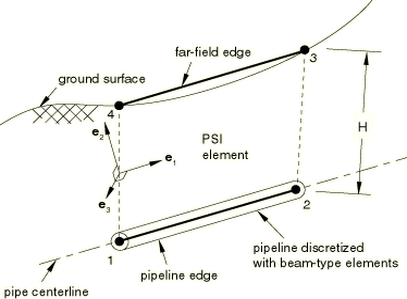

远场侧和与管道共享节点的侧由单元连通性定义。在将底层单元连接到PSI单元的正确边缘时必须小心，因为管土单元的连通性决定了下文定义的局部坐标系以及管道相对于地面表面的深度H。相对于表面的深度沿PSI单元的边缘测量，如图32.12.1-1所示，并在几何非线性分析期间更新。

重要的是要注意，PSI单元不离散周围土壤的实际域。土壤域的范围通过单元的刚度来反映，这由本构模型决定，如后所述。

管土相互作用模型不包含周围土壤介质的密度。如有需要，可以通过在管土相互作用单元的节点上施加集中MASS单元（参见["点质量，" 第30.1.1节](pt06ch30s01alm21.md)）将质量与模型关联。

### 为PSI单元分配管土相互作用行为

您必须将管土相互作用行为分配给一组管土相互作用单元。

| **输入文件用法：** | 使用以下选项将管土相互作用行为分配给特定单元集： |
| --- | --- |
|  | ``` [*PIPE-SOIL INTERACTION](../key/key-link.md#usb-kws-mpipesoilinter), ELSET=*name* ``` 在[*PIPE-SOIL INTERACTION](../key/key-link.md#usb-kws-mpipesoilinter)选项之后立即使用以下选项来定义单元集的刚度行为： ``` [*PIPE-SOIL STIFFNESS](../key/key-link.md#usb-kws-mpipesoilstiff) ``` |

### 运动学和局部坐标系

管土相互作用单元的变形通过单元两个边缘之间的相对位移来表征。当单元因相对位移而"应变"时，力被施加到管道节点。这些力可以是"应变"的线性（弹性）或非线性（弹塑性）函数，取决于用于单元的本构模型类型。正"应变"定义为


其中

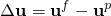

是两个边缘之间的相对位移（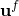是远场位移，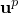是管道位移），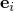是局部方向，索引*i*（=1, 2, 3）指三个局部方向。对于二维单元，仅存在平面内应变分量、。对于三维单元，所有三个应变分量、和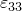都存在。

局部方向系统由三个正交方向定义：、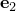和。默认局部方向定义为：是沿管道（轴向）的方向，是垂直于单元平面的方向（横向水平方向），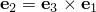是单元平面内定义横向垂直行为的平面内方向。正默认方向定义为：指向第二个管道节点，从管道边缘指向远场边缘，如图32.12.1-1所示。您还可以通过为管土相互作用指定局部方向来定义这些局部方向（["方向，" 第2.2.5节](pt01ch02s02aus15.md)）。

在大位移分析中，局部坐标系随底层管道的刚体运动旋转。在小位移分析中，局部系统由PSI单元的初始几何形状定义，并在分析过程中保持固定在空间中。

| **输入文件用法：** | 使用以下选项将局部方向与管土相互作用行为关联： |
| --- | --- |
|  | ``` [*PIPE-SOIL INTERACTION](../key/key-link.md#usb-kws-mpipesoilinter), ORIENTATION=*name* ``` |

### 本构模型

管土相互作用的本构行为由沿管道每点的应力"或"每单位长度的力来定义，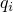，由该点与远场表面上的点之间的相对位移或"应变"引起，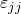：

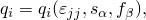

其中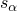是状态变量（如塑性应变），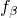是温度和/或场变量。

您可以通过在用户子程序[`UMAT`](../sub/sub-link.md#sub-xsl-umat)中编程来相当通用地定义这些关系。或者，您可以通过直接指定数据来定义关系。在这种情况下，假定基础行为是可分离的：

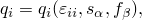

在这种情况下，每个独立关系必须分别定义。Abaqus/Standard默认假定这些关系关于原点对称（如轴向和横向水平运动通常适用）。但是，您可以为三个相对运动中的任何一个给出非对称行为（当管道埋深不太深时，垂直方向通常就是这种情况）。这些模型假定正"应变"产生的力沿局部坐标系的正方向作用在管道上。

### 使用用户子程序指定本构行为

要相当通用地定义关系，您可以在用户子程序[`UMAT`](../sub/sub-link.md#sub-xsl-umat)中编程。

| **输入文件用法：** | ``` [*PIPE-SOIL STIFFNESS](../key/key-link.md#usb-kws-mpipesoilstiff), TYPE=USER ``` |
| --- | --- |

### 直接指定本构行为

提供了两种直接指定本构行为数据的方法。一种方法是以表格（分段线性）形式直接定义关系。另一种方法是使用ASCE公式。这些适合与砂和粘土一起使用的关系形式在ASCE油气管道系统抗震设计指南中有详细定义。

#### 使用表格输入直接指定本构行为

您可以使用表格输入定义具有不同拉伸和压缩行为的线性或非线性本构模型。

##### 线性模型

要定义线性本构模型，您将刚度指定为温度和场变量的函数（参见图32.12.1-2）。您可以为正负"应变"输入不同的值。Abaqus/Standard默认假定关系关于原点对称。

**图32.12.1-2** 线性本构模型。

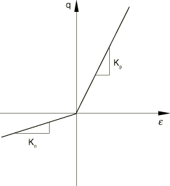

| **输入文件用法：** | ``` [*PIPE-SOIL STIFFNESS](../key/key-link.md#usb-kws-mpipesoilstiff), TYPE=LINEAR ``` |
| --- | --- |

##### 非线性模型

要定义非线性本构模型，您将关系指定为正负相对位移（"应变"）、温度和场变量的函数（参见图32.12.1-3）。如果仅提供正或负数据，则假定行为关于原点对称。

**图32.12.1-3** 非线性本构关系。

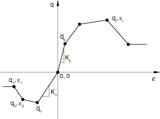

您必须按相对位移升序提供数据；您应该提供足够宽的相对位移范围，以便正确定义行为。力在数据点范围之外保持不变。您必须通过指定力-相对位移图原点处的数据点来分隔正负数据。紧邻原点前后方的两个数据点定义弹性刚度，和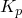，以及初始弹性极限，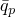和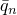，如图32.12.1-3所示。

如果

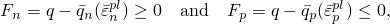

其中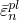和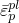是与负正变形相关的等效塑性应变，则模型提供线性弹性行为。当相对力超过这些弹性极限时发生非弹性变形。

模型的强化由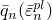和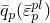的独立演化控制。模型假定当相对位移增量为负时，保持不变，当相对位移增量为正时，保持不变。该模型在完整加载循环中预测的响应如图32.12.1-4所示，适用于使用与正负力相关的不同双线性行为的简单本构定律。图32.12.1-4显示，与正力相关的屈服应力更新为，而与负力相关的初始屈服应力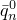在初始加载期间保持不变。类似地，在随后的反向加载期间，与负力相关的屈服应力更新为，而与正力相关的屈服应力保持不变。因此，在下一次载荷反向时，屈服发生在。这种行为适用于管道横截面方向，在这些方向上，管道与土壤之间的相对正运动预计与管道与土壤之间的相对负运动无关。

**图32.12.1-4** 双线模型的循环加载。

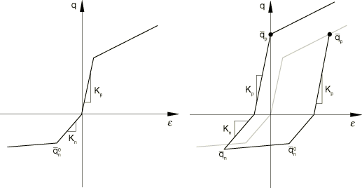

如果行为关于原点对称（当仅提供正或负数据时），则使用等向强化模型。在这种情况下，仅使用一个等效塑性应变变量，当发生负或正非弹性变形时会更新。这种演化模型更适用于轴向方向，在这些方向上，正非弹性变形预计会影响后续的负非弹性变形。

| **输入文件用法：** | ``` [*PIPE-SOIL STIFFNESS](../key/key-link.md#usb-kws-mpipesoilstiff), TYPE=NONLINEAR ``` |
| --- | --- |

#### 使用ASCE公式直接指定本构行为

Abaqus/Standard还提供描述管土相互作用的分析模型。这些模型定义了可以施加在管道上的恒定极限力。换句话说，这些模型描述了弹性、理想塑性行为。适合与砂和粘土一起使用的公式形式在ASCE油气管道系统抗震设计指南中有详细描述。

ASCE公式可以通过将方向定义与单元关联应用于任何任意局部系统中。但是，这些公式旨在用于默认局部坐标系，以便轴向行为公式应用于沿管道轴线的方向（1方向），垂直行为公式应用于2方向，水平行为公式应用于3方向。当使用ASCE公式描述行为时，必须指定行为被定义的方向。

您指定下面表达式中的所有参数，除了从地面表面到管道中心的深度H，该深度沿PSI单元的边缘测量如图32.12.1-1所示，并在几何非线性分析期间更新。其余参数的值可以在标准土力学教科书中找到。典型值也在ASCE油气管道系统抗震设计指南中提供。

##### 轴向行为

砂的极限轴向载荷，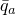，由下式给出

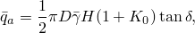

其中是静止土压力系数，H是从地面表面到管道中心的深度，D是管道的外径，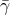是土壤的有效单位重量，是界面摩擦角。

粘土的极限轴向载荷由下式给出

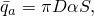

其中S是土壤的不排水剪切强度，是经验粘附系数，将土壤的不排水剪切强度与内聚力，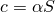关联。

最大载荷在极限相对位移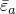处达到，对于砂约为2.5至5.0 mm（0.1至0.2英寸），对于粘土约为2.5至10.0 mm（0.2至0.4英寸）。对于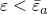，假定线性弹性响应。

轴向行为假定关于原点对称。因此，仅一个等效塑性应变变量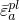描述模型的演化。当发生负或正非弹性变形时，等效塑性应变更新。

| **输入文件用法：** | 使用以下选项之一定义轴向行为： |
| --- | --- |
|  | ``` [*PIPE-SOIL STIFFNESS](../key/key-link.md#usb-kws-mpipesoilstiff), DIRECTION=AXIAL, TYPE=SAND [*PIPE-SOIL STIFFNESS](../key/key-link.md#usb-kws-mpipesoilstiff), DIRECTION=AXIAL, TYPE=CLAY ``` |

##### 横向垂直行为

垂直行为由"向上"运动（当管道相对于地面表面升起时）和"向下"运动的关系描述。向下运动产生正相对位移，从而对管道施加正力。类似地，向上运动产生负相对位移和管道力。

管道在砂中向下运动的极限力由下式给出

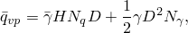

其中和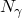是垂直条形基础的承载能力系数，在向下方向垂直加载，是土壤的总单位重量。其他参数在前一节中定义。管道在粘土中向下运动的极限力由下式给出

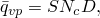

其中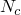是承载能力系数。极限力在相对位移约为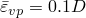至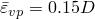处达到，对于砂和粘土都是如此。

管道在砂中向上运动的极限力由下式给出

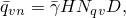

对于粘土由下式给出

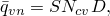

其中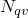和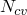是垂直提升系数。

极限力在相对位移约为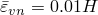至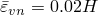处达到对于砂，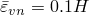至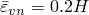对于粘土。

横向垂直行为关于原点非对称。因此，使用两个等效塑性应变变量——一个与负相对位移关联，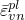，另一个与正相对位移关联，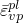——来描述模型的演化。模型假定当相对位移增量为负时，保持不变，当相对位移增量为正时，保持不变。

| **输入文件用法：** | 使用以下选项之一定义垂直行为： |
| --- | --- |
|  | ``` [*PIPE-SOIL STIFFNESS](../key/key-link.md#usb-kws-mpipesoilstiff), DIRECTION=VERTICAL, TYPE=SAND [*PIPE-SOIL STIFFNESS](../key/key-link.md#usb-kws-mpipesoilstiff), DIRECTION=VERTICAL, TYPE=CLAY ``` |

##### 横向水平行为

砂的水平力-相对位移关系由下式给出


粘土由下式给出


其中和是水平承载能力系数。其他变量在前几节中定义。极限力在相对位移约为处达到，其中松砂为0.07至0.1，中砂和粘土为0.03至0.05，密砂为0.02至0.03。

横向水平行为假定关于原点对称。因此，仅一个等效塑性应变变量描述模型的演化。当发生负或正非弹性变形时，等效塑性应变更新。

| **输入文件用法：** | 使用以下选项之一定义水平行为： |
| --- | --- |
|  | ``` [*PIPE-SOIL STIFFNESS](../key/key-link.md#usb-kws-mpipesoilstiff), DIRECTION=HORIZONTAL, TYPE=SAND [*PIPE-SOIL STIFFNESS](../key/key-link.md#usb-kws-mpipesoilstiff), DIRECTION=HORIZONTAL, TYPE=CLAY ``` |

#### 指定定义本构行为的方向

如果您通过直接指定数据来定义本构行为，默认假定各向同性模型。如果模型不是各向同性的，您可以沿每个方向指定不同的本构关系。对于二维非各向同性模型，必须沿两个方向指定行为；对于三维非各向同性模型，必须沿三个方向指定行为。您必须指明行为被定义的方向。您可以指定1方向、2方向、3方向、轴向方向、垂直方向或水平方向。Abaqus/Standard假定轴向方向等效于1方向，垂直方向等效于2方向，水平方向等效于3方向。

| **输入文件用法：** | 使用以下选项定义各向同性本构模型： |
| --- | --- |
|  | ``` [*PIPE-SOIL STIFFNESS](../key/key-link.md#usb-kws-mpipesoilstiff) ``` 使用以下选项沿特定方向定义本构模型： ``` [*PIPE-SOIL STIFFNESS](../key/key-link.md#usb-kws-mpipesoilstiff), DIRECTION=*direction* ``` 其中*direction*可以是1、2、3、AXIAL、VERTICAL或HORIZONTAL。根据需要重复[*PIPE-SOIL STIFFNESS](../key/key-link.md#usb-kws-mpipesoilstiff)选项和DIRECTION参数来定义每个方向的行为。 |

### 输出

单元局部系统中每单位长度的力可通过"应力"输出变量S获得。相对变形可通过"应变"输出变量E获得。弹性和塑性"应变"可通过输出变量EE和PE获得。

单元节点力（单元在全局系统中施加在管道节点上的力）可通过单元变量NFORC获得。

#### 额外参考

- Audibert, J. M. E., D. J. Nyman, and T. D. O'Rourke, "Differential Ground Movement Effects on Buried Pipelines," Guidelines for the Seismic Design of Oil and Gas Pipeline Systems, ASCE publication, pp. 151--180, 1984.


