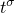
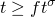
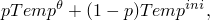
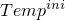
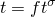
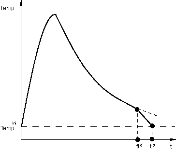
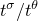
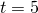

# 34.6.1 预定义场


**产品：** Abaqus/Standard  Abaqus/Explicit  Abaqus/CAE

##### **参考文献**

- ["预定义条件：概述，" 第34.1.1节](pt07ch34s01abo31.md)
- [*TEMPERATURE](../key/key-link.md#usb-kws-htemperature)
- [*FIELD](../key/key-link.md#usb-kws-hfield)
- [*PRESSURE STRESS](../key/key-link.md#usb-kws-hpressure)
- [*MASS FLOW RATE](../key/key-link.md#usb-kws-hmassflowrate)
- ["定义温度场，" Abaqus/CAE用户指南第16.11.9节](../usi/usi-link.md#usi-lbi-helptopics-temp)

### 概述

本节介绍如何在分析过程中指定以下类型预定义场的值：
- 温度，
- 场变量，
- 等效压力应力，以及
- 质量流率。

可以使用这些场的步骤在["预定义条件：概述，" 第34.1.1节](pt07ch34s01abo31.md)中概述。

温度、场变量、等效压力应力和质量流率是随时间变化的预定义（非解依赖）场，存在于模型的空间域中。它们可以：
- 通过直接输入数据来定义，
- 通过读取在先前分析期间生成的Abaqus结果文件（通常是Abaqus/Standard热传递分析）来读取，或
- 在Abaqus/Standard用户子程序中定义。

温度也可以通过读取在先前分析期间生成的Abaqus输出数据库文件来定义。在Abaqus/Standard中，场变量也可以通过读取在先前分析期间生成的Abaqus输出数据库文件来定义。

场变量也可以成为解依赖的，这允许您在Abaqus材料模型中引入额外的非线性。

### 预定义温度

在应力/位移分析中，预定义温度场与任何初始温度（["Abaqus/Standard和Abaqus/Explicit中的初始条件，" 第34.2.1节](pt07ch34s02aus116.md)）之间的温度差会在材料给出热膨胀系数时产生热应变（["热膨胀，" 第26.1.2节"](pt05ch26s01abm52.md)）。预定义温度场也会影响温度依赖性材料属性（如果有）。在Abaqus/Explicit中，温度依赖性材料属性可能导致比恒定属性更长的运行时间。

您可以在节点处定义温度的幅值和时间变化，Abaqus会将温度插值到材料点。

| **输入文件用法：** | 使用以下选项指定预定义温度场： |
| --- | --- |
|  | ``` [*TEMPERATURE](../key/key-link.md#usb-kws-htemperature) ``` |

| **Abaqus/CAE用法：** | Load模块：**Create Predefined Field**：**Step：** *analysis_step*：为**Category**选择**Other**，为**Types for Selected Step**选择**Temperature** |
| --- | --- |

#### 限制

不要在纯热传递分析、耦合热电分析、完全耦合温度-位移分析或完全耦合热电结构分析中指定预定义温度场；而是指定边界条件（["Abaqus/Standard和Abaqus/Explicit中的边界条件，" 第34.3.1节"](pt07ch34s03aus118.md)）来施加温度自由度（11、12、...）。

预定义温度场不能在绝热分析步骤或任何基于模式的动态分析步骤中指定。

要在重启分析中指定预定义温度场，相应的预定义场必须已在原始分析中指定为初始温度（请参见["定义初始温度"在"Abaqus/Standard和Abaqus/Explicit中的初始条件，" 第34.2.1节](pt07ch34s02aus116.md#usb-prc-pinitialcond-temp)）或预定义温度场。

### 预定义场变量

预定义场变量的使用和处理方式与温度完全类似。您可以规定模型所有节点上场的幅值和时间变化，Abaqus会将值插值到材料点。

在规定场变量值时，必须指定正在定义的场变量编号；默认为场变量编号1。场变量必须从1开始连续编号。重复场变量定义以定义多个场变量。

场变量可以是真实场（如电磁场），由先前模拟（Abaqus或其他分析代码）生成。它也可以是您定义的虚拟场，用于在分析过程中修改某些材料属性。例如，假设您希望杨氏模量在响应过程中在30×10^6和35×10^6之间线性变化。可以使用[表34.6.1-1](pt07ch34s06aus128.md#usb-prc-pfields-samplemat)中所示的线性弹性材料定义。

**表34.6.1-1** 材料定义示例。
| 场变量依赖数量：1 |
| --- |
| 杨氏模量 | 泊松比 | 场变量1的值 |
| 30.E6 | 0.3 | 1.0 |
| 35.E6 | 0.3 | 2.0 |

定义初始条件以为节点集指定场变量1的初始值为1.0。然后，在分析步骤中定义预定义场变量，以为节点集指定场变量1的值为2.0。杨氏模量将在步骤过程中随场变量的值从1.0斜升到2.0而平滑变化。

场变量也可用于通过使属性依赖场变量（如上所述）并为不同节点分配不同的场变量值来在空间中改变真实属性。

使属性依赖场变量将增加所需的计算机时间，因为Abaqus必须执行必要的表查找。

在Abaqus/Standard应力/位移分析中，预定义场变量与其初始值（["Abaqus/Standard和Abaqus/Explicit中的初始条件，" 第34.2.1节"](pt07ch34s02aus116.md)）之间的差异会在材料给出（对应场变量的）场膨胀系数时产生类似于热应变的体积应变（["热膨胀，" 第26.1.2节"](pt05ch26s01abm52.md)）。

| **输入文件用法：** | 使用以下选项指定预定义场变量： |
| --- | --- |
|  | ``` [*FIELD](../key/key-link.md#usb-kws-hfield), VARIABLE=*n* ``` |

| **Abaqus/CAE用法：** | 预定义场变量在Abaqus/CAE中不受支持。 |
| --- | --- |

#### 限制

要在重启分析中指定预定义场变量，相应的预定义场必须已在原始分析中指定为初始场变量值（请参见["在Abaqus/Standard和Abaqus/Explicit中的初始条件中定义预定义场变量的初始值，" 第34.2.1节](pt07ch34s02aus116.md#usb-prc-pinitialcond-field)）或预定义场变量。

### 预定义压力应力

您可以在质量扩散分析中将等效压力应力作为预定义场施加。压力应力的使用和处理方式与温度和场变量类似。在Abaqus中，等效压力应力在压缩时为正。

| **输入文件用法：** | 使用以下选项指定预定义等效压力应力场： |
| --- | --- |
|  | ``` [*PRESSURE STRESS](../key/key-link.md#usb-kws-hpressure) ``` |

| **Abaqus/CAE用法：** | 预定义等效压力应力在Abaqus/CAE中不受支持。 |
| --- | --- |

#### 限制

预定义等效压力应力场只能在与质量扩散步骤一起指定（请参见["质量扩散分析，" 第6.9.1节"](pt03ch06s09at28.md)）。

要在重启分析中指定预定义等效压力应力场，相应的预定义场必须已在原始分析中指定为初始压力应力（请参见["在Abaqus/Standard和Abaqus/Explicit中的初始条件中定义质量扩散分析中的初始压力应力，" 第34.2.1节](pt07ch34s02aus116.md#usb-prc-pinitialcond-pressurestress)）或预定义等效压力应力场。

### 预定义质量流率

您可以为热传递分析中的强制对流/扩散元素指定单位面积质量流率（或对于一维元素为通过整个截面的质量流率）。质量流率的使用和处理方式与温度和场变量类似。

| **输入文件用法：** | 使用以下选项指定预定义质量流率场： |
| --- | --- |
|  | ``` [*MASS FLOW RATE](../key/key-link.md#usb-kws-hmassflowrate) ``` |

| **Abaqus/CAE用法：** | 预定义质量流率在Abaqus/CAE中不受支持。 |
| --- | --- |

#### 限制

预定义质量流率场只能与热传递步骤中的强制对流/扩散元素一起指定（请参见["非耦合热传递分析，" 第6.5.2节"](pt03ch06s05at18.md)）。

要在重启分析中指定预定义质量流率场，相应的预定义场必须已在原始分析中通过使用初始质量流率（请参见["在强制对流热传递元素中定义初始质量流率"在"Abaqus/Standard和Abaqus/Explicit中的初始条件，" 第34.2.1节](pt07ch34s02aus116.md#usb-prc-pinitialcond-massflowrate)）或预定义质量流率场来指定。

### 从用户指定的结果文件读取场的初始值

Abaqus/Standard结果文件可用于指定以下初始值
- 温度（请参见["在Abaqus/Standard和Abaqus/Explicit中的初始条件中定义初始温度，" 第34.2.1节](pt07ch34s02aus116.md#usb-prc-pinitialcond-temp)）；
- 场变量（请参见["在Abaqus/Standard和Abaqus/Explicit中的初始条件中定义预定义场变量的初始值，" 第34.2.1节](pt07ch34s02aus116.md#usb-prc-pinitialcond-field)）；和
- 压力应力（请参见["在Abaqus/Standard和Abaqus/Explicit中的初始条件中定义质量扩散分析中的初始压力应力，" 第34.2.1节](pt07ch34s02aus116.md#usb-prc-pinitialcond-pressurestress)）。

必须从温度记录中读取场变量值（请参见["从用户指定的结果文件读取场值"](pt07ch34s06aus128.md#usb-prc-pfields-readvalues-results)"下文）。从结果文件读取数据时，也需要原始分析的零件（`.prt`）文件。

如果请求将零增量结果输出到Abaqus/Standard结果文件（请参见["输出中的在步骤开始时获取结果，" 第4.1.1节"](pt02ch04s01aus38.md#usb-out-ooutput-zeroinc)），您可以将预定义场的初始值定义为先前热传递分析（场变量和温度）或应力/位移分析（压力应力）步骤开始时存在的值。`.fil`文件扩展名是可选的。

### 从用户指定的输出数据库文件读取温度场的初始值

Abaqus/Standard输出数据库文件可用于指定温度的初始值（请参见["在Abaqus/Standard和Abaqus/Explicit中的初始条件中定义初始温度，" 第34.2.1节](pt07ch34s02aus116.md#usb-prc-pinitialcond-temp)）。从输出数据库文件读取数据时，也需要原始分析的零件（`.prt`）文件。温度值可以在不同网格之间读取，如["在Abaqus/Standard和Abaqus/Explicit中的初始条件中从用户指定的结果或输出数据库文件为不同网格插值初始温度，" 第34.2.1节](pt07ch34s02aus116.md#usb-prc-pinitialcond-temp-interpolate)中所述。

### 在Abaqus/Standard中从用户指定的输出数据库文件初始化预定义场变量

在Abaqus/Standard中，温度（NT）、归一化浓度（NNC）和电势（EPOT）的节点值可用于初始化预定义场（请参见["在Abaqus/Standard和Abaqus/Explicit中的初始条件中定义预定义场变量的初始值，" 第34.2.1节](pt07ch34s02aus116.md#usb-prc-pinitialcond-field)）。从输出数据库文件读取数据时，也需要原始分析的零件（`.prt`）文件。标量节点值可以在不同网格之间映射，如["在Abaqus/Standard和Abaqus/Explicit中的初始条件中通过从用户指定的输出数据库文件为不同网格插值标量节点输出变量来定义初始预定义场变量，" 第34.2.1节](pt07ch34s02aus116.md#usb-prc-pinitialcond-field-interpolate)中所述。

### 定义随时间变化的场

场的规定幅值可以根据幅值函数在步骤期间随时间变化。详情请参见["预定义条件：概述，" 第34.1.1节"](pt07ch34s01abo31.md)和["幅值曲线，" 第34.1.2节"](pt07ch34s01aus115.md)。

| **输入文件用法：** | 使用以下选项之一： |
| --- | --- |
|  | ``` [*TEMPERATURE](../key/key-link.md#usb-kws-htemperature), AMPLITUDE=*amplitude_name* [*FIELD](../key/key-link.md#usb-kws-hfield), AMPLITUDE=*amplitude_name* [*PRESSURE STRESS](../key/key-link.md#usb-kws-hpressure), AMPLITUDE=*amplitude_name* [*MASS FLOW RATE](../key/key-link.md#usb-kws-hmassflowrate), AMPLITUDE=*amplitude_name* ``` |

| **Abaqus/CAE用法：** | 在Abaqus/CAE中只有预定义温度场可用。 |
| --- | --- |
|  | Load模块：**Create Predefined Field**：**Step：** *analysis_step*：为**Category**选择**Other**，为**Types for Selected Step**选择**Temperature**：选择区域：**Distribution：** **Direct specification**或选择解析场或离散场，**Amplitude：** *amplitude_name* |

### 场传播

默认情况下，在前一个通用分析步骤中定义的所有场在后续通用步骤或后续连续线性扰动步骤中保持不变。场不会在线性扰动步骤之间传播。您定义的是对给定步骤生效的场，相对于预先存在的场。在每个新步骤中，现有的场可以被修改，也可以指定额外的场。如果为某个场指定了额外的值，则该场的定义将扩展到先前未定义该场的那些节点。或者，您可以在步骤中释放先前应用的所有特定类型的场，并指定新的场。在这种情况下，必须重新指定要保留的该类型的所有场。

#### 修改场

默认情况下，当修改现有温度、场变量、压力应力或质量流率时，该场的所有现有值保持不变。

| **输入文件用法：** | 使用以下选项之一修改现有场或指定额外场： |
| --- | --- |
|  | ``` [*TEMPERATURE](../key/key-link.md#usb-kws-htemperature), OP=MOD [*FIELD](../key/key-link.md#usb-kws-hfield), OP=MOD [*PRESSURE STRESS](../key/key-link.md#usb-kws-hpressure), OP=MOD [*MASS FLOW RATE](../key/key-link.md#usb-kws-hmassflowrate), OP=MOD ``` |

| **Abaqus/CAE用法：** | 在Abaqus/CAE中只有预定义温度场可用。 |
| --- | --- |
|  | Load模块：**Create Predefined Field**或**Predefined Field Manager**：**Edit** |

#### 移除场

被移除的场将重置为初始条件中给出的值，如果没有定义初始条件则重置为零。当场重置为其初始条件时，场定义中引用的幅值不适用。在Abaqus/Standard中，为步骤定义的幅值变化控制行为；在大多数Abaqus/Standard步骤中，默认是将场斜降回其初始条件（请参见["定义分析，" 第6.1.2节"](pt03ch06s01abo05.md)）。在Abaqus/Explicit中，值始终在步骤中线性斜降回其初始条件。

如果温度、场变量、压力应力或质量流率被重置为新值（不是其初始条件），则应用场定义中引用的幅值。

如果您选择在任何步骤中移除任何场，则该类型的场不会从前一个通用步骤传播。在该步骤中生效的同一类型的所有场必须重新指定。

| **输入文件用法：** | 使用以下选项之一释放先前应用的所有特定类型的场并指定新场： |
| --- | --- |
|  | ``` [*TEMPERATURE](../key/key-link.md#usb-kws-htemperature), OP=NEW [*FIELD](../key/key-link.md#usb-kws-hfield), OP=NEW [*PRESSURE STRESS](../key/key-link.md#usb-kws-hpressure), OP=NEW [*MASS FLOW RATE](../key/key-link.md#usb-kws-hmassflowrate), OP=NEW ``` 如果在任何场选项上使用OP=NEW参数，则必须在步骤中对该类型的所有场选项使用它。 |

| **Abaqus/CAE用法：** | 使用以下选项将温度场重置为初始步骤中规定的值（或者如果未定义初始值则重置为零）： |
| --- | --- |
|  | Load模块：温度场编辑器：**Reset to initial** |

### 直接从备用输入文件读取场的值

预定义温度、场变量、压力应力或质量流率的数据可以包含在单独的文件中（请参见["输入语法规则，" 第1.2.1节"](pt01ch01s02aus01.md)）。

| **输入文件用法：** | 使用以下选项之一： |
| --- | --- |
|  | ``` [*TEMPERATURE](../key/key-link.md#usb-kws-htemperature), INPUT=*file_name* [*FIELD](../key/key-link.md#usb-kws-hfield), INPUT=*file_name* [*PRESSURE STRESS](../key/key-link.md#usb-kws-hpressure), INPUT=*file_name* [*MASS FLOW RATE](../key/key-link.md#usb-kws-hmassflowrate), INPUT=*file_name* ``` 如果省略INPUT参数，则假定数据行跟随在关键字行之后。 |

| **Abaqus/CAE用法：** | 您不能在Abaqus/CAE中从单独的文件读取场数据。 |
| --- | --- |

### 从用户指定的文件读取场的值

可以在后续分析中使用Abaqus/Standard热传递或耦合热电分析中计算的节点温度来定义温度。温度必须已写入结果或输出数据库文件。

如果在Abaqus/Standard热传递或耦合热电分析期间将节点温度写入结果文件，它们可用于在后续分析中定义场变量。

在Abaqus/Standard中，如果将温度（NT）、归一化浓度（NNC）或电势（EPOT）的节点值写入输出数据库文件，它们可用于在后续Abaqus/Standard分析中定义场变量。

在Abaqus/Standard中，如果在机械分析中计算的等效压力应力可用于后续质量扩散分析，则元素输出变量SINV必须以节点平均值写入结果文件（请参见["输出到数据和结果文件中的元素输出，" 第4.1.2节"](pt02ch04s01aus39.md#usb-out-oprintfile-elementoutput)）。

一旦数据在结果文件或输出数据库文件中可用，就可以作为预定义场读入后续分析。场变量和压力应力的数据可以从先前生成的结果文件读取。在Abaqus/Standard中，数据也可以从先前生成的输出数据库文件读取。温度数据可以从先前生成的结果或输出数据库文件读取。温度（和Abaqus/Standard中的场变量）的数据只能在输出数据库文件中的不同网格之间读取。还需要原始分析的零件（`.prt`）文件以便从结果或输出数据库文件读取数据。

当使用涉及梁和/或壳单元的Abaqus分析输出文件定义温度时，必须确保在相应元素定义的截面中定义的温度点数量在两个分析之间一致。不一致的温度点定义将导致预定义场数量转移不正确。

#### 从用户指定的结果文件读取场值

要从用户指定的结果文件读取场值，数据必须已作为节点输出写入结果文件（请参见["输出到数据和结果文件中的节点输出，" 第4.1.2节"](pt02ch04s01aus39.md#usb-out-oprintfile-nodaloutput)）。只能从结果文件读取节点量。由于场变量只能作为元素量（记录键9）写入结果文件，因此不能直接读入后续分析。在这种情况下，即使当前分析中的场变量与先前分析中的场变量相同，也必须生成一个将结果数据写入温度记录的结果文件。多个场变量需要生成多个结果文件。

为了生成结果文件，您可以编写一个程序来创建结果文件（无需运行Abaqus分析），格式如[第5章，"文件输出格式"](pt02ch05.md)中所述。该章中显示了此类程序的示例。如果值将作为温度或场变量读取，数据必须作为节点量写入，记录键为201。如果值将作为压力应力场读取，数据必须在节点处取平均值（如["输出到数据和结果文件，" 第4.1.2节"](pt02ch04s01aus39.md)中所述）并写为记录键12。

##### 指定要读取的结果文件

您必须指定要读取温度、场变量或压力应力数据的结果文件的名称。`.fil`文件扩展名是可选的。如果温度场同时存在`.fil`和`.odb`文件且未指定扩展名，则将使用结果文件。

| **输入文件用法：** | ``` [*TEMPERATURE](../key/key-link.md#usb-kws-htemperature), FILE=*file* [*FIELD](../key/key-link.md#usb-kws-hfield), FILE=*file* [*PRESSURE STRESS](../key/key-link.md#usb-kws-hpressure), FILE=*file* ``` |
| --- | --- |

| **Abaqus/CAE用法：** | 在Abaqus/CAE中只有预定义温度场可用。 |
| --- | --- |
|  | Load模块：**Create Predefined Field**：**Step：** *analysis_step*：为**Category**选择**Other**，为**Types for Selected Step**选择**Temperature**：选择区域：**Distribution: From results or output database file**，**File name：** *file* |

##### 创建循环温度历史

在Abaqus/Standard的直接循环分析中，温度值必须在步骤上循环：起始值必须等于结束值。要从非循环的先前热传递分析创建循环温度历史，您可以设置开始时间*f*（相对于总步骤时间段测量），之后从结果文件读取的温度将被斜降回其初始条件值。在任何时间点，温度值等于



其中、是初始条件值，是从结果文件在时间*t*获得的插值值，如图[图34.6.1-1](pt07ch34s06aus128.md#usb-prc-pfields-tempramp)所示。

**图34.6.1-1** 在后将温度斜降回其初始条件值以创建循环温度历史。



| **输入文件用法：** | 使用以下选项设置循环温度历史的开始时间： |
| --- | --- |
|  | ``` [*TEMPERATURE](../key/key-link.md#usb-kws-htemperature), FILE=*file*, BTRAMP=*f* ``` |

| **Abaqus/CAE用法：** | 循环温度历史在Abaqus/CAE中不受支持。 |
| --- | --- |

#### 从用户指定的输出数据库文件读取温度值

要从用户指定的输出数据库文件读取温度值，温度必须已作为节点输出写入输出数据库文件（请参见["输出到输出数据库中的节点输出，" 第4.1.3节"](pt02ch04s01aus40.md#usb-out-odboutput-nodaloutput)）。

##### 为温度场指定要读取的输出数据库文件

您必须指定要读取温度数据的输出数据库文件的名称。如果结果文件和输出数据库文件同时存在，必须包含`.odb`扩展名。只有两个分析共有的零件实例的数据将被传输。如果零件实例名称不同，则必须激活通用插值功能。

| **输入文件用法：** | ``` [*TEMPERATURE](../key/key-link.md#usb-kws-htemperature), FILE=*file* ``` |
| --- | --- |

| **Abaqus/CAE用法：** | Load模块：**Create Predefined Field**：**Step：** *analysis_step*：为**Category**选择**Other**，为**Types for Selected Step**选择**Temperature**：选择区域：**Distribution: From results or output database file**，**File name：** *file* |
| --- | --- |

#### 使用用户指定的输出数据库文件中的节点标量输出值定义场

在Abaqus/Standard中，如果将温度（NT）、归一化浓度（NNC）或电势（EPOT）的节点值写入输出数据库文件，它们可用于在后续Abaqus/Standard分析中定义场变量。要从用户指定的输出数据库文件读取这些值，它们必须已作为节点输出写入输出数据库文件（请参见["输出到输出数据库中的节点输出，" 第4.1.3节"](pt02ch04s01aus40.md#usb-out-odboutput-nodaloutput)）。

##### 为场变量指定要读取的输出数据库文件

您必须指定要读取场变量数据的输出数据库文件的名称。如果结果文件和输出数据库文件同时存在，必须包含`.odb`扩展名。

| **输入文件用法：** | ``` [*FIELD](../key/key-link.md#usb-kws-hfield), FILE=*file*, OUTPUT VARIABLE=*scalar nodal output variable*, ``` |
| --- | --- |

| **Abaqus/CAE用法：** | 预定义场变量在Abaqus/CAE中不受支持。 |
| --- | --- |

#### 在网格之间插值数据

数据可以在相同网格之间、仅在元素阶次不同的网格之间（一阶元素在热传递分析和二阶元素在热应力分析中）映射，也可以在匹配元素维度（三维实体单元到三维实体单元或壳单元到壳单元）的不同网格之间映射。如果数据在相同网格之间映射，则不需要额外的计算。要在仅元素阶次不同的网格之间传输数据，必须激活中节点功能。要在不同网格之间映射数据，必须激活通用插值功能。中节点功能仅适用于温度。中间节点功能和通用插值功能是互斥的。

##### 将二阶应力元素与一阶热传递元素一起使用（中节点功能）

在某些情况下，使用一阶元素执行Abaqus/Standard热传递分析，然后使用二阶元素执行热应力分析是有意义的（例如，包括潜热效应的热传递分析最适合一阶元素），随后使用二阶元素执行应力分析，二阶元素通常具有更好的变形特性。此外，热传递分析中计算的一阶温度场与二阶应力/位移单元提供的一阶热应变场一致。

对于在热传递分析和应力分析之间元素温度变量的插值阶次发生变化的情况，必须根据热传递单元角节点的温度为应力/位移单元的中节点分配温度。如果您指定需要中节点温度，Abaqus将使用一阶插值从角节点插值二阶应力/位移单元的中节点温度。如果在热传递分析和应力分析都使用二阶元素的情况下激活中节点功能，它将被忽略。一个例外是，如果在应力分析中使用了可变节点二阶应力/位移单元，激活中节点功能将导致Abaqus使用一阶插值从角节点或中节点插值可变节点单元中面的温度。

由于假定角节点温度是在先前热传递分析中生成的，中节点功能只能在温度场值从用户指定的结果或输出数据库文件读取时使用。您必须确保在热传递分析期间计算的节点温度被写入结果或输出数据库文件。一旦在后续应力/位移分析中读取角节点的温度，Abaqus就会插值中节点温度，以便为所有节点分配温度。

您必须确保属于要插值中节点温度的元素的角节点的所有温度都从热传递分析结果或输出数据库文件读取。如果角节点温度是使用直接数据输入、从结果文件或输出数据库文件读取以及用户子程序[`UTEMP`](../sub/sub-link.md#sub-xsl-utemp)的组合定义的，则可能导致中节点温度产生不现实的温度场。实际上，从结果或输出数据库文件读取整个网格的热传递分析温度时，在应力分析期间计算中节点温度的功能最有用。一旦在步骤中激活中节点功能，该功能将在分析的其余部分保持活跃。

在原始分析中存在但在当前分析中不存在的节点的温度值将被忽略。类似地，如果当前分析中存在额外节点（但不是中节点），则无法通过读取输出文件来规定这些节点的场值。

| **输入文件用法：** | 使用以下选项在仅元素阶次不同的网格之间插值温度： |
| --- | --- |
|  | ``` [*TEMPERATURE](../key/key-link.md#usb-kws-htemperature), FILE=*file*, MIDSIDE ``` |

| **Abaqus/CAE用法：** | Load模块：**Create Predefined Field**：**Step：** *analysis_step*：为**Category**选择**Other**，为**Types for Selected Step**选择**Temperature**：选择区域：**Distribution: From results or output database file**，**File name：** *file*，**Mesh compatibility: Compatible**，并切换**Interpolate midside nodes** |
| --- | --- |

##### 在不同网格之间插值温度（通用插值功能）

在某些情况下，热传递分析模型和热应力分析模型可能需要不同的网格；例如，您可能希望在热传递分析中对平滑温度分布进行建模，在热应力分析中对应力集中区域进行建模。在这种情况下，两个网格必须不同且彼此独立。Abaqus提供了通用插值功能，允许对热传递和热应力分析使用不同的网格。

插值始终基于初始（未变形）配置。如果获取温度场的网格与热应力分析的初始（未变形）配置有很大不同，则插值可能无法正常工作，即使使用下面讨论的容差参数。

温度只能在从输出数据库文件读取时在不同网格之间插值。如果写入输出数据库文件的节点在热传递分析中需要用于插值的温度不存在，则这些节点上的值被假定为零，可能导致热应力分析中温度值不正确。类似地，如果热应力分析的网格中存在额外节点，则假定这些节点的温度值为零。温度插值也可用于在子模型热应力分析中将温度指定为场变量，其中温度值直接从全局热传递分析读取。

您可以指定用于定位热传递分析中节点的插值容差。容差可以指定为绝对值或平均元素尺寸的分数。在多步骤热应力分析中，如果多个步骤从同一文件读取温度值，Abaqus仅插值温度值一次。如果每个步骤使用不同的插值容差值，则插值基于最大指定容差值。如果从热应力分析的特定步骤执行重启分析，则重启插值基于该步骤指定的容差值。

| **输入文件用法：** | 使用以下选项在不同网格之间插值温度： |
| --- | --- |
|  | ``` [*TEMPERATURE](../key/key-link.md#usb-kws-htemperature), FILE=*file*`.odb`, INTERPOLATE ``` 使用以下选项将插值容差指定为绝对值： ``` [*TEMPERATURE](../key/key-link.md#usb-kws-htemperature), FILE=*file*`.odb`, INTERPOLATE, ABSOLUTE EXTERIOR TOLERANCE=*tolerance* ``` 使用以下选项将插值容差指定为平均元素尺寸的分数： ``` [*TEMPERATURE](../key/key-link.md#usb-kws-htemperature), FILE=*file*`.odb`, INTERPOLATE, EXTERIOR TOLERANCE=*tolerance* ``` |

| **Abaqus/CAE用法：** | Load模块：**Create Predefined Field**：**Step：** *analysis_step*：为**Category**选择**Other**，为**Types for Selected Step**选择**Temperature**：选择区域：**Distribution: From results or output database file**，**File name：** *file*`.odb`，**Mesh compatibility: Incompatible**，exterior tolerance：**absolute**或**relative** *tolerance* |
| --- | --- |

##### 使用用户指定区域在不同网格之间插值温度

当热传递分析中元素区域接近或接触时，不同网格插值功能可能导致温度关联不明确。例如，考虑当前模型中位于或接近热传递模型中两个相邻部分之间的边界处的节点，并考虑这些部分温度不同的情况。在插值时，Abaqus将从热传递分析中识别该节点的对应父元素。此父元素识别使用基于容差的搜索方法。因此，在此示例中，父元素可能在任一相邻部分中找到，导致节点处温度定义不明确。您可以通过指定温度要插值的源区域来消除这种歧义。源区域指热传递分析，由元素集指定。目标区域指当前分析，由节点集指定。

| **输入文件用法：** | 使用以下选项使用用户指定区域在不同网格之间插值温度： |
| --- | --- |
|  | ``` [*TEMPERATURE](../key/key-link.md#usb-kws-htemperature), FILE=*file*`.odb`, INTERPOLATE, DRIVING ELSETS ``` |

| **Abaqus/CAE用法：** | 您不能在Abaqus/CAE中指定要插值温度的区域。 |
| --- | --- |

##### 在不同网格之间将标量节点输出变量插值到Abaqus/Standard中的场变量（通用插值功能）

Abaqus/Standard提供了通用插值功能，允许将一个分析的温度、归一化浓度和电势的节点值映射到后续分析中网格不同情况下的场变量。

插值始终基于初始（未变形）配置。如果获取场变量的网格与原始分析（未变形）配置有很大不同，则插值可能无法正常工作，即使使用下面讨论的容差参数。

温度、归一化浓度和电势只能在与网格不同情况下从输出数据库文件读取时插值到场变量。如果当前分析中需要用于插值的节点标量值未写入输出数据库文件，则假定这些节点上的值为零，可能导致场变量不正确的结果。类似地，如果当前分析的网格中存在额外节点，则假定这些节点的场变量值为零。

您可以指定用于在原始分析中定位节点的插值容差。容差可以指定为绝对值或平均元素尺寸的分数。在多步骤分析中，如果多个步骤从同一文件读取节点输出变量值，Abaqus仅插值节点值一次。如果每个步骤使用不同的插值容差值，则插值基于最大指定容差值。如果从原始分析的特定步骤执行重启分析，则重启插值基于该步骤指定的容差值。

| **输入文件用法：** | 使用以下选项在不同网格之间插值标量节点输出变量： |
| --- | --- |
|  | ``` [*FIELD](../key/key-link.md#usb-kws-hfield), FILE=*file*`.odb`, OUTPUT VARIABLE=*scalar nodal output variable*, INTERPOLATE ``` 使用以下选项将插值容差指定为绝对值： ``` [*FIELD](../key/key-link.md#usb-kws-hfield), FILE=*file*`.odb`, OUTPUT VARIABLE=*scalar nodal output variable*, INTERPOLATE, ABSOLUTE EXTERIOR TOLERANCE=*tolerance* ``` 使用以下选项将插值容差指定为平均元素尺寸的分数： ``` [*FIELD](../key/key-link.md#usb-kws-hfield), FILE=*file*`.odb`, OUTPUT VARIABLE=*scalar nodal output variable*, INTERPOLATE, EXTERIOR TOLERANCE=*tolerance* ``` |

| **Abaqus/CAE用法：** | 预定义场变量在Abaqus/CAE中不受支持。 |
| --- | --- |

#### 指定要从文件读取的步骤和增量

您可以分别指定要读取结果的第一步和最后一步。同样，您可以指定要读取结果的第一增量号和最后增量号。您可以指定这些值的任何组合。存在于此处指定的步骤和增量处的结果必须已写入结果或输出数据库文件。

如果结果文件中存在零增量文件输出（仅在请求零增量结果时写入；请参见["输出中的在步骤开始时获取结果，" 第4.1.1节"](pt02ch04s01aus38.md#usb-out-ooutput-zeroinc)），Abaqus/Standard分析的任何零增量文件输出都将被忽略。

如果您未指定开始读取的第一步，Abaqus将从结果或输出数据库文件中可用的第一步开始读取。

如果您未指定开始读取的第一增量，Abaqus将从要读取结果的第一步中可用的第一增量开始读取（如果结果文件中存在零增量文件输出，则为紧随零增量之后的第一增量）。

如果您未指定最后读取的步骤，则开始读取结果的第一步也将是最后一步。

如果您未指定最后读取的增量，Abaqus将读取结果或输出数据库文件，直到达到要读取结果的最后一步中可用的最后增量。

| **输入文件用法：** | 使用以下选项之一： |
| --- | --- |
|  | ``` [*TEMPERATURE](../key/key-link.md#usb-kws-htemperature), FILE=*file*, BSTEP=*bstep*, BINC=*binc*, ESTEP=*estep*, EINC=*einc* [*FIELD](../key/key-link.md#usb-kws-hfield), FILE=*file*, BSTEP=*bstep*, BINC=*binc*, ESTEP=*estep*, EINC=*einc* [*PRESSURE STRESS](../key/key-link.md#usb-kws-hpressure), FILE=*file*, BSTEP=*bstep*, BINC=*binc*, ESTEP=*estep*, EINC=*einc* ``` 例如，以下输入将从输出数据库文件`heat.odb`读取温度数据，从Step 2，Increment 2开始，到Step 3，Increment 5结束： ``` [*TEMPERATURE](../key/key-link.md#usb-kws-htemperature), FILE=`heat.odb`, BSTEP=2, BINC=2, ESTEP=3, EINC=5 ``` |

| **Abaqus/CAE用法：** | 在Abaqus/CAE中只有预定义温度场可用。 |
| --- | --- |
|  | Load模块：**Create Predefined Field**：**Step：** *analysis_step*：为**Category**选择**Other**，为**Types for Selected Step**选择**Temperature**：选择区域：**Distribution: From results or output database file**，**File name：** *file*，**Begin step：** *bstep*，**Begin increment：** *binc*，**End step：** *estep*，和**End increment：** *einc* |

#### 时间插值

当Abaqus从结果文件读取温度、场变量或等效压力应力数据，或从输出数据库文件读取温度时，它必须获取分析使用的时间点的场值。由于这些时间点的数据通常不存在于结果或输出数据库文件中，Abaqus将在线性时间内在存储的时间点之间进行插值，以获取分析所需时间点的值。由于插值是线性的，您必须注意在结果或输出数据库文件中提供足够的数据，以使此插值有意义。

为了进行这种插值，读取结果的时间段确定如下：
- 周期从相关字段的最新写入增量开始，该增量在前一个开始增量之前。例如，如果您的结果文件在增量5、10和15处包含温度场数据；并且您在读取这些结果时指定开始增量号为10；结果周期从与增量5关联的时间开始，因为那是紧随指定开始增量10之前的最新增量。您可以通过以增量频率1写入结果数据来确保结果开始时间与指定的开始增量开始时间匹配。
- 周期在结束增量完成时结束（用户指定或默认）。

如果分析需要的数据时间点早于任一文件中第一个增量可用数据的增量，Abaux将在给定初始条件数据和存储在文件中的第一增量数据之间进行插值。

##### 为多个场读取结果

如果在同一步骤中读取多个场的数据，并且对应于开始步骤和增量或结束步骤和增量时间值对于不同场不同，Abaqus会在任何文件中选择的 earliest 时间点到 latest 时间点之间通过整个时间段进行插值。例如，假设温度文件中开始步骤的开始增量在3秒开始，结束步骤的结束增量在6秒结束。在同一步骤中，我们还读取场变量数据，其中开始步骤的开始增量在2秒开始，结束步骤的结束增量在5秒结束。在这种情况下，用于插值的时间段为2秒到6秒。

##### 自动调整时间尺度

将步骤的时间段设置为与读取的文件时间段相等是方便的。否则，Abaqus将自动将结果或输出数据库文件的时间段缩放以匹配应力分析的时间段。比例因子为，其中是应力分析的时间段，是从所有结果或输出数据库文件获得的总时间段，如上所述。

##### 在特定时间点获取结果

在Abaqus/Standard中，有时需要进行对应于特定时间点的场值的计算。例如，假设输出文件在时间的增量10处和的增量15处有温度数据，并且您希望基于的温度值进行静态分析。在这种情况下，Abaqus必须在和的结果之间线性插值，以获得处的中间结果。为了完成此任务，您应为静态分析步骤指定4.5的初始时间增量和5.0的时间段，并从步骤1、增量1开始到步骤1、增量15结束读取温度值。指定开始增量为1而不是10可确保是输出文件中存储的整个时间段，而不仅仅是增量10和15之间的时间段；因此，输出文件数据和静态分析之间的比例因子为1，4.5的初始时间具有所需的含义。

##### 初始瞬态

为了准确跟踪初始瞬态，Abaqus/Standard可能会自动减少步骤的初始时间增量。如果用户指定的建议初始时间增量大于从Abaqus/Standard结果文件读取的第一时间增量的缩放值，Abaqus/Standard将使用该缩放值。

#### 限制

存在以下限制：
- 温度和场变量不能从修改后的Riks静态分析步骤中的用户指定文件读取（["不稳定坍塌和后屈曲分析，" 第6.2.4节"](pt03ch06s02at03.md)）。
- 温度不能从耦合热电分析中插值。
- 如果模型通过零件实例程序集定义，则不能从结果文件读取等效压力应力。
- 在Abaqus/Explicit中，场变量不能从输出数据库文件读取。
- 压力应力不能从输出数据库文件读取。
- 不支持温度映射插值的元素包括：对流热传递元素的完整库、非线性轴对称变形的轴对称元素、轴对称表面元素、静水压力流体元素、实体无限应力元素和耦合热/电元素。其他不支持的特定元素包括：GKPS6、GKPE6、GKAX6、GK3D18、GK3D12M、GK3D4L、GK3D6L、GKPS4N、GKAX6N、GK3D18N、GK3D12MN、GK3D4LN和GK3D6LN。

### 在用户子程序中定义预定义场的值

在Abaqus/Standard中，您可以在用户子程序中在节点处指定预定义温度、场变量、等效压力应力或质量流率。温度值可以在用户子程序[`UTEMP`](../sub/sub-link.md#sub-xsl-utemp)中定义；场变量值可以在用户子程序[`UFIELD`](../sub/sub-link.md#sub-xsl-ufield)中定义；等效压力应力值可以在用户子程序[`UPRESS`](../sub/sub-link.md#sub-xsl-upress)中定义；质量流率可以在用户子程序[`UMASFL`](../sub/sub-link.md#sub-xsl-umasfl)中定义。

用户子程序（[`UTEMP`](../sub/sub-link.md#sub-xsl-utemp)、[`UFIELD`](../sub/sub-link.md#sub-xsl-ufield)、[`UPRESS`](../sub/sub-link.md#sub-xsl-upress)或[`UMASFL`](../sub/sub-link.md#sub-xsl-umasfl)）将为每个指定节点调用。直接输入的场值将被忽略。如果除了用户子程序外还指定了结果或输出数据库文件，则从结果或输出数据库文件读取的值将被传递到用户子程序中进行可能的修改。

| **输入文件用法：** | 使用以下选项之一： |
| --- | --- |
|  | ``` [*TEMPERATURE](../key/key-link.md#usb-kws-htemperature), USER [*FIELD](../key/key-link.md#usb-kws-hfield), USER [*PRESSURE STRESS](../key/key-link.md#usb-kws-hpressure), USER [*MASS FLOW RATE](../key/link.md#usb-kws-hmassflowrate), USER ``` |

| **Abaqus/CAE用法：** | 在Abaqus/CAE中只有预定义温度场可用。 |
| --- | --- |
|  | Load模块：**Create Predefined Field**：**Step：** *analysis_step*：为**Category**选择**Other**，为**Types for Selected Step**选择**Temperature**：选择区域：**Distribution: User-defined**或**From results or output database file and user-defined** |

#### 更新多个预定义场变量

如果预定义了多个场变量，则一次只能在用户子程序[`UFIELD`](../sub/sub-link.md#sub-xsl-ufield)中重新定义一个场变量。在某些情况下，分析需要一些相对于解预定义的场变量，但它们相互依赖。您可以指定在一点同时更新的场变量数*n*。Abaqus/Standard将每个指定节点上的*n*个场变量信息传递到[`UFIELD`](../sub/sub-link.md#sub-xsl-ufield)中。

您可以更新分析中使用的全部或部分场变量，但必须记住场变量从1开始连续编号。例如，如果您有四个场变量在分析中，并希望在子程序[`UFIELD`](../sub/sub-link.md#sub-xsl-ufield)中同时更新第二和第三个变量，则必须指定*n*=3。在这种情况下，Abaqus/Standard将前三个场变量的信息传递到子程序[`UFIELD`](../sub/sub-link.md#sub-xsl-ufield)中，并且您只更新第二和第三个变量。

| **输入文件用法：** | ``` [*FIELD](../key/key-link.md#usb-kws-hfield), USER, NUMBER=*n* ``` |
| --- | --- |

| **Abaqus/CAE用法：** | 预定义场变量在Abaqus/CAE中不受支持。 |
| --- | --- |

### 定义解依赖场变量

在Abaqus/Standard中，解依赖场变量可以在用户子程序[`USDFLD`](../sub/sub-link.md#sub-xsl-usdfld)中定义。预定义场变量或初始场的值可以传递到用户子程序[`USDFLD`](../sub/sub-link.md#sub-xsl-usdfld)中，并可以在该程序中更改——请参见["材料数据定义，" 第21.1.2节"](pt05ch21s01aus109.md)。

[`USDFLD`](../sub/sub-link.md#sub-xsl-usdfld)中场变量的更改是局部于材料点的，不影响节点值。

### 数据层次

如果在同一步骤中同时使用了结果或输出数据库文件输入和直接数据输入，如果两者在同一节点定义场，则直接数据输入优先。如果指定了用户子程序输入，则忽略直接给定的值，用户子程序修改从结果或输出数据库文件读取的值。

### 元素类型注意事项

您可以在节点处指定预定义场的一个或多个值，这取决于所使用的元素类型。在选择预定义场规范形式时，应注意以下事项。

#### 在质量扩散分析中使用

对于实体元素，只能在节点处给出一个值。由于只能使用实体元素进行质量扩散分析，因此这是唯一可以在节点处定义等效压力应力的方式。

#### 与梁和壳元素一起使用

梁和壳元素中温度和场变量规范存在以下可能性：
- 对于具有一般截面定义的壳和梁元素，截面中点的温度和场变量幅值由参考表面的值定义。忽略在截面上指定的这些变量的任何梯度。
- 对于需要数值积分的截面壳和梁元素，截面中点的温度和场变量幅值可以从参考表面的值和截面的梯度来定义，也可以通过给出截面上多个点的值来定义。这两种方法之间的选择在截面定义中进行（请参见["使用在分析期间集成的壳截面定义截面行为，" 第29.6.5节](pt06ch29s06alm19.md#usb-elm-eusingshellsection-temp)中的"指定温度和场变量"，和["使用在分析期间集成的梁截面定义截面行为，" 第29.3.6节](pt06ch29s03alm11.md#usb-elm-eusingbeamsection-temp)中的"指定温度和场变量"，了解详情）。

有关与每个元素类型一起使用的详细信息，请参阅[第六部分，"单元"](pt06.md)。如果只给出一个值，则默认为截面上恒定的幅值。

### 跨元素的温度和场变量兼容性

Abaqus假定所有元素节点上的场定义（包括初始条件）与为元素选择的场定义方法兼容。可能会出现场定义从一个元素到下一个元素发生变化的情况（例如，当两个相邻壳元素在厚度方向上具有不同数量的截面点时，或者当一个梁元素的温度和场变量幅值通过给出截面上多个点的值来定义，而相邻梁元素从参考表面值和截面的梯度来定义时）。在这些情况下，应在这种元素的界面上使用单独的节点，并应施加多点约束以使相应节点的位移和旋转相同（请参见["通用多点约束，" 第35.2.2节](pt08ch35s02aus130.md)）；否则，将使用界面节点处的场进行每个相邻元素的场定义方法。


