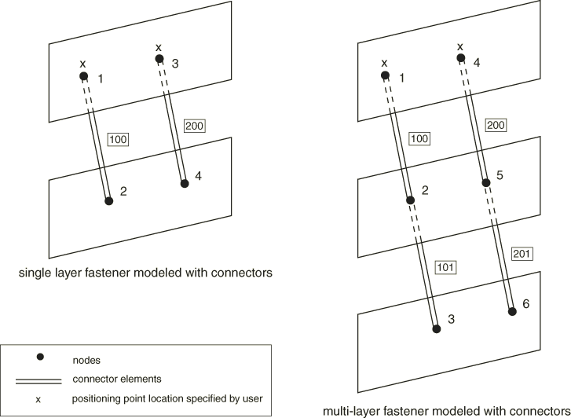
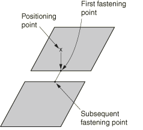
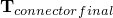
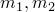

# 35.3.4 网格无关紧固件


**产品：** Abaqus/Standard  Abaqus/Explicit  Abaqus/CAE

##### **参考文献**

- ["表面：概述，" 第2.3.1节](pt01ch02s03aus16.md)
- ["耦合约束，" 第35.3.2节](pt08ch35s03aus133.md)
- ["连接器单元，" 第31.1.2节](pt06ch31s01alm25.md)
- [*FASTENER](../key/key-link.md#usb-kws-mfastener)
- [*FASTENER PROPERTY](../key/key-link.md#usb-kws-mfastenerproperty)
- ["关于紧固件，" Abaqus/CAE用户指南第29.1节](../usi/usi-link.md#usi-eng-fastener-overview)

### 概述

网格无关紧固件功能：
- 是一种定义两个或多个表面之间点对点连接的便捷方法，如点焊或铆钉连接；
- 使用紧固件位置的空間坐标来定义独立于底层网格的点对点连接；
- 将连接器单元或BEAM MPC与分布耦合约束相结合，以提供一种连接，该连接可以位于两个或多个表面之间的任意位置，而不考虑每个表面上网格的细化程度或节点位置；
- 可用于连接变形和刚体基于单元的表面；
- 可以通过使用连接器行为定义的通用性来模拟刚性、弹性或具有失效的非弹性连接；以及
- 仅在三维中可用。

### 引言

许多应用需要模拟零件之间点对点连接。这些连接可能以点焊、铆钉、螺钉、螺栓或其他类型的紧固机制的形式出现。在大型系统模型（如汽车或飞机机身）中可能有数百甚至数千个这种连接。

紧固件可以位于与要连接的零件无关的网格位置。换句话说，紧固件的位置可以独立于要连接的表面节点的位置。相反，紧固件到每个被连接零件的连接被分布到紧固点附近表面上多个节点。[图35.3.4-1](pt08ch35s03aus135.md#aspotweld-project)显示了一个典型单层和双层紧固件配置。

**图35.3.4-1** 典型单层和双层紧固件配置。


每一层使用连接器单元或BEAM MPC连接两个紧固点。每个紧固点使用分布耦合约束连接到表面，该耦合将每个紧固点的位移和旋转耦合到附近节点的平均位移和旋转。

Abaqus中的网格无关紧固件功能旨在以便捷的方式对这些连接进行建模。紧固件自动：
- 确定在两个或多个表面之间连接器单元或BEAM MPC的节点位置和方向；
- 生成分布耦合约束，以网格无关的方式将连接器单元或BEAM MPC连接到每个表面；以及
- 计算完成网格无关连接的分布耦合约束的权重。

有关网格无关紧固件的使用示例，请参见["带点焊的柱屈曲，" Abaqus示例问题指南第1.2.3节](../exa/exa-link.md#exa-sta-bucklespotweld)。网格无关紧固件在Abaqus/CAE中称为基于点的紧固件。有关更多信息，请参见["关于紧固件，" Abaqus/CAE用户指南第29.1节](../usi/usi-link.md#usi-eng-fastener-overview)。也可以在Abaqus/CAE中使用连接器单元、耦合约束等组装紧固件。有关更多详细信息，请参见["关于组装紧固件，" Abaqus/CAE用户指南第29.1.3节](../usi/usi-link.md#usi-eng-fastener-overview-assm)。

### 紧固件交互

紧固件在称为交互的组中定义，这些组被分配名称。每个交互定义一个或多个紧固件。单个紧固件的数量等于用于定位紧固件的定位点数量。每个表面上的紧固点通过考虑定位点位置来确定，如后续章节所述。

紧固件可以使用连接器单元或BEAM MPC定义。BEAM MPC允许对组件之间的完美刚性连接进行建模；而连接器单元允许您对更复杂的行为进行建模，如包括弹性、损伤、塑性和摩擦影响的变形连接器。

| **输入文件用法：** | ``` [*FASTENER](../key/key-link.md#usb-kws-mfastener), INTERACTION NAME=*name* ``` |
| --- | --- |

| **Abaqus/CAE用法：** | Interaction模块：**Special****Fasteners****Create****：**Name**：*name*，**Type**：**Point-based** |
| --- | --- |

#### 使用BEAM MPC定义紧固件

对于建模完美刚性连接，您不需要使用连接器单元定义紧固件。相反，Abaqus可以在内部生成连接紧固件紧固点的BEAM MPC。在这种方法是，您分配一个包含用户定义节点列表的参考节点集到紧固件交互。参考节点集中的节点将用作定位点来定位紧固件。如果要建模单层紧固件，Abaqus会生成单个BEAM MPC，参考节点集中的每个节点成为每个BEAM MPC的第一个节点。每个BEAM MPC的第二个节点将由Abaqus在内部生成。如果要定义多层紧固件，Abaqus会生成链接的BEAM MPC集，参考节点集中的每个节点成为每个链接集中第一个BEAM MPC的第一个节点。每个链接集中的后续节点将由Abaqus在内部生成。对于多层紧固件，每个链接集包含与紧固件层数相同数量的BEAM MPC。

| **输入文件用法：** | 使用以下选项： |
| --- | --- |
|  | ``` [*FASTENER](../key/key-link.md#usb-kws-mfastener), INTERACTION NAME=*name*, REFERENCE NODE SET=*node set label* [*NSET](../key/key-link.md#usb-kws-mnset), NSET=*node set label* ``` |

| **Abaqus/CAE用法：** | Interaction模块：**Special****Fasteners****Create****：**Point-based**：选择定位点：**Property**：**Section**：**Rigid MPC** |
| --- | --- |

#### 使用连接器单元定义紧固件

使用连接器单元作为点对点连接的基础，可以对具有紧固件的非常复杂的行为进行建模。与连接器单元的其他用途一样，连接可以是完全刚性的，也可以允许局部连接器组件中的无约束相对运动。此外，可以使用可以包括弹性、阻尼、塑性、损伤和摩擦影响的连接器行为定义来指定变形行为。有两种方法可以使用连接器单元来定义紧固件，以建模紧固点之间的行为。对于这两种方法，紧固件交互都引用包含连接器单元的单元集。您必须指定引用此单元集的连接器截面定义。在下面["定义紧固件方向"](pt08ch35s03aus135.md#usb-cni-afastener-orientation)中讨论的指定连接器方向（如果需要）时应小心。

##### 直接定义连接器单元

使用连接器单元指定紧固件的最可控方法是显式定义连接器单元并将其与单元集关联。紧固件交互引用该单元集。紧固件交互中的每个紧固件对应于一个或多个连接器单元，这取决于紧固件的层数（见[图35.3.4-2](pt08ch35s03aus135.md#aspotweld-connectors)）。

**图35.3.4-2** 使用连接器单元建模的单层和多层紧固件。



每一层关联一个连接器单元，连接器单元的两个节点对应于两个相邻表面的紧固点。在指定多层紧固件时，每层的连接器单元应与相邻层的连接器单元共享节点。

对于单层紧固件，用于定位紧固件及其紧固点的定位点取自连接器单元第一个节点的节点坐标。对于多层紧固件，定位点取自链接集中第一个连接器的第一个节点，链接集中的成员数与层数相同。在本节末尾包含了定义单层和多层紧固件的示例。

| **输入文件用法：** | 使用以下选项： |
| --- | --- |
|  | ``` [*FASTENER](../key/key-link.md#usb-kws-mfastener), INTERACTION NAME=*name*, ELSET=*element set label* *blank line* [*ELEMENT](../key/key-link.md#usb-kws-melement), TYPE=CONN3D2, ELSET=*element set label* [*CONNECTOR SECTION](../key/key-link.md#usb-kws-mconnectorsection), ELSET=*element set label* ``` |

| **Abaqus/CAE用法：** | 对于Abaqus/CAE中的基于点的紧固件，您不能直接定义连接器单元；连接器单元由Abaqus生成。 |
| --- | --- |

##### 由Abaqus生成的连接器单元

在这种方法中，您不需要显式定义连接紧固件紧固点的连接器单元。紧固件交互引用一个空单元集。您必须指定引用此单元集的连接器截面定义。此外，您分配一个包含用户定义节点列表的参考节点集到紧固件交互。参考节点集中的节点用作定位点来定位紧固件。

如果要建模单层紧固件，Abaqus会生成单个连接器单元，参考节点集中的每个节点成为连接器单元的第一个节点。每个连接器单元的第二个节点将由Abaqus在内部生成。如果要定义多层紧固件，Abaqus会生成链接的连接器单元集，参考节点集中的每个节点成为每个链接集中第一个连接器单元的第一个节点。每个链接集中的后续节点将由Abaqus在内部生成。对于多层紧固件，每个链接集包含与紧固件层数相同数量的连接器单元。连接器单元被赋予内部生成的单元编号并分配给命名用户指定的单元集。您可以使用此单元集来请求这些连接器单元的输出。但是，不应将此单元集包含在另一个单元集定义中。

| **输入文件用法：** | 使用以下选项： |
| --- | --- |
|  | ``` [*FASTENER](../key/key-link.md#usb-kws-mfastener), INTERACTION NAME=*name*, ELSET=*element set label*, REFERENCE NODE SET=*node set label* *blank line* [*NSET](../key/key-link.md#usb-kws-mnset), NSET=*node set label* [*CONNECTOR SECTION](../key/key-link.md#usb-kws-mconnectorsection), ELSET=*element set label* ``` |

| **Abaqus/CAE用法：** | Interaction模块：**Special****Fasteners****Create****：**Point-based**：选择定位点：**Property**：**Section**：**Connector section**：选择连接器截面 |
| --- | --- |

##### 示例：直接使用连接器单元定义单层紧固件

要直接使用连接器单元定义单层紧固件：
- 使用用户单元编号100和200定义两个连接器单元，用户定义节点编号分别为1、2和3、4，并将它们包含在一个单元集中。节点1和3用作两个紧固件的定位点（见[图35.3.4-2](pt08ch35s03aus135.md#aspotweld-connectors)）。
- 在紧固件交互和连接器截面定义中引用该单元集。
- 为紧固件分配截面属性。假设在此示例中，允许紧固点之间的相对位移。因此，必须为紧固件分配具有可用运动分量的截面；例如，可以使用CARTESIAN截面。
- 紧固点之间的相对位移产生弹性变形。因此，使用连接器弹性将紧固件之间的材料建模为线性弹性，弹簧刚度为10000。

可以使用以下输入：
```
[*FASTENER](../key/key-link.md#usb-kws-mfastener), INTERACTION NAME=*fastinter*, ELSET=*fastconn*, PROPERTY=*fastprop*
*blank line*
surface1, surface2
[*ELEMENT](../key/key-link.md#usb-kws-melement), TYPE=CONN3D2, ELSET=*fastconn*
100, 1, 2
200, 3, 4
[*CONNECTOR SECTION](../key/key-link.md#usb-kws-mconnectorsection), ELSET=*fastconn*, BEHAVIOR=*behav*
CARTESIAN, 
[*CONNECTOR BEHAVIOR](../key/key-link.md#usb-kws-mconnectorbehavior), NAME=*behav*
[*CONNECTOR ELASTICITY](../key/key-link.md#usb-kws-mconnectorelasticity), COMPONENT=*1*
10000,
[*CONNECTOR ELASTICITY](../key/key-link.md#usb-kws-mconnectorelasticity), COMPONENT=*2*
10000,
[*CONNECTOR ELASTICITY](../key/key-link.md#usb-kws-mconnectorelasticity), COMPONENT=*3*
10000,
```

##### 示例：直接使用连接器单元定义多层紧固件

要直接使用连接器单元定义多层紧固件：
- 定义两组链接的连接器单元，每组恰好包含两个连接器。第一组包含单元编号100和101，节点编号分别为1、2和2、3。第二组包含单元编号200和201，节点编号分别为4、5和5、6。将连接器单元包含在一个单元集中。节点1和4用作两个紧固件的定位点（见[图35.3.4-2](pt08ch35s03aus135.md#aspotweld-connectors)）。
- 在紧固件交互和连接器截面定义中引用该单元集
- 为紧固件分配截面属性。假设在此示例中，要建模紧固点之间的刚性梁类型行为；在这种情况下，必须为紧固件分配BEAM截面。

可以使用以下输入：
```
[*FASTENER](../key/key-link.md#usb-kws-mfastener), INTERACTION NAME=*fastinter*, ELSET=*fastconn*, PROPERTY=*fastprop*
*blank line*
surface1, surface2, surface3
[*ELEMENT](../key/key-link.md#usb-kws-melement), TYPE=CONN3D2, ELSET=*fastconn*
100, 1, 2
101, 2, 3
200, 4, 5
201, 5, 6
[*CONNECTOR SECTION](../key/key-link.md#usb-kws-mconnectorsection), ELSET=*fastconn*
BEAM, 
```

### 指定定位点、投影方法和紧固点

每个交互定义一个或多个紧固件。单个紧固件的数量等于用于定位紧固件的定位点数量。定位点是位于紧固件位置并作为参考节点集分配给交互的节点。

通常，定位点应尽可能靠近要连接的表面。指定定位点的参考节点可以是要连接表面上的节点之一，也可以单独定义。Abaqus通过首先将定位点投影到最近表面上来确定紧固件层连接到要连接的表面的实际点。Abaqus提供以下投影方法来找出指定表面上的紧固点以形成紧固件：
- 面到面
- 面到边
- 边到面
- 边到边
- 连接器方向

方法的选择取决于表面的相对方向。

#### 紧固几乎平行的表面

最常见的是要紧固在一起的表面几乎彼此平行；在这种情况下，紧固点位于远离表面周长的元素facet上。面到面投影方法最适合这种情况。它也是默认的投影方法。

在面到面投影方法中，Abaqus沿垂直于表面的有向线段将每个定位点投影到最近表面。或者，您可以指定投影方向。当使用二维图纸来识别定位点位置且这些位置在两个维度中精确已知但在第三个维度中不精确时，指定方向可能很有用。对于这种情况，指定的方向通常是图纸平面的法线。

一旦确定了最近表面上的紧固点，Abaqus通过沿紧固件法线方向将第一个紧固点投影到要连接的其他表面上来确定其他表面上的点，紧固件法线方向通常垂直于最近表面。[图35.3.4-3](pt08ch35s03aus135.md#aspotweld-config)显示了定位投影点的两种方法。当要紧固的表面不完全平行时，Abaqus有时会将连接点设置为在表面最近的facet边缘或角上，而不是沿紧固件法线方向。

**图35.3.4-3** 有向投影和法线投影以定位面到面投影方法的紧固点。


定位点（参考节点集中的节点）的位置可能与Abaqus找到的紧固点位置不一致。因此，当节点移动到紧固点时，定位点处节点的坐标可能会从用户规定的值更改。如果定位点处的节点是用户定义单元连接性的一部分，这可能导致该单元（包括该节点的单元）产生不可接受的初始畸变。在这种情况下，建议您单独定义定位点处的节点。通常，您不应将此节点指定为连接表面节点之一。

| **输入文件用法：** | 使用以下选项允许Abaqus定义投影方向： |
| --- | --- |
|  | ``` [*FASTENER](../key/key-link.md#usb-kws-mfastener), REFERENCE NODE SET=*node set label*, ATTACHMENT METHOD=FACETOFACE (default) *blank line* ``` 使用以下选项直接定义投影方向： ``` [*FASTENER](../key/key-link.md#usb-kws-mfastener), REFERENCE NODE SET=*node set label*, ATTACHMENT METHOD=FACETOFACE (default) *x-component, y-component, z-component* ``` |

| **Abaqus/CAE用法：** | 使用以下输入允许Abaqus定义投影方向： |
| --- | --- |
|  | Interaction模块：**Special****Fasteners****Create****：**Point-based**：选择定位点：**Domain**选项卡：**Direction vector**：**Default**，**Criteria**选项卡：**Attachment method**：**Face-to-Face** 使用以下输入直接定义投影方向： Interaction模块：**Special****Fasteners****Create****：**Point-based**：选择定位点：**Domain**选项卡：**Direction vector**：**Specify**，**Criteria**选项卡：**Attachment method**：**Face-to-Face** |

#### 紧固几乎垂直的表面

当需要紧固彼此垂直或几乎垂直的表面时；即形成T形交叉，面到边或边到面投影方法是合适的选择。[图35.3.4-4](pt08ch35s03aus135.md#aspotweld-fe-ef-nls)显示了点到边和边到面投影方法的连接。

**图35.3.4-4** 面到边和边到面投影方法，用于定位形成T形交叉的表面的紧固点。


##### 在面上创建第一个紧固点

在面到边投影方法中，Abaqus沿垂直于表面的有向线段将定位点投影到最近表面。后续紧固点通过在剩余指定表面上搜索最近点来找到。最近的紧固点可能落在表面的边缘或角上。

| **输入文件用法：** | ``` [*FASTENER](../key/key-link.md#usb-kws-mfastener), REFERENCE NODE SET=*node set label*, ATTACHMENT METHOD=FACETOEDGE *blank line* ``` |
| --- | --- |

| **Abaqus/CAE用法：** | Interaction模块：**Special****Fasteners****Create****：**Point-based**：选择定位点：**Criteria**：**Attachment method**：**Face-to-Edge** |
| --- | --- |

##### 在边上创建第一个紧固点

在边到面投影方法中，首先通过在指定表面或表面上搜索最近点来找到第一个紧固点。最近点可能在表面的边缘或角上。对于后续紧固点，Abaqus沿垂直于表面的有向线段投影前一个紧固点。

| **输入文件用法：** | ``` [*FASTENER](../key/key-link.md#usb-kws-mfastener), REFERENCE NODE SET=*node set label*, ATTACHMENT METHOD=EDGETOFACE *blank line* ``` |
| --- | --- |

| **Abaqus/CAE用法：** | Interaction模块：**Special****Fasteners****Create****：**Point-based**：选择定位点：**Criteria**：**Attachment method**：**Edge-to-Face** |
| --- | --- |

#### 紧固对接表面

当需要在彼此对接的表面之间形成紧固件时，边到边投影方法是合适的。在这种方ers, Abaqus searches for the closest point on the specified surface or surfaces. The fastening points in this method may be located on the edge of a surface. [Figure 35.3.4-5](pt08ch35s03aus135.md#aspotweld-ee-nls) shows attachments for the edge-to-edge projection method. 

**图35.3.4-5** 边到边投影方法，用于定位对接表面的紧固点。



| **输入文件用法：** | ``` [*FASTENER](../key/key-link.md#usb-kws-mfastener), REFERENCE NODE SET=*node set label*, ATTACHMENT METHOD=EDGETOEDGE *blank line* ``` |
| --- | --- |

| **Abaqus/CAE用法：** | Interaction模块：**Special****Fasteners****Create****：**Point-based**：选择定位点：**Criteria**：**Attachment method**：**Edge-to-Edge** |
| --- | --- |

#### 紧固不平行表面

当紧固彼此不平行的表面时，您可以控制紧固件的精确位置和方向。要定义位置和方向，请为每个紧固件规定一个在特定位置有节点的连接器单元。Abaqus维持连接器单元的位置和方向。

| **输入文件用法：** | ``` [*FASTENER](../key/key-link.md#usb-kws-mfastener), ELSET=*element set label*, ATTACHMENT METHOD=CONNECTORDIRECTION *blank line* ``` |
| --- | --- |

| **Abaqus/CAE用法：** | 在Abaqus/CAE中不支持选择连接器来控制紧固件的位置和方向。 |
| --- | --- |

### 指定要紧固的表面

一旦指定了定位点，可以使用两种不同方法指定要紧固的表面。在第一种方法中，您直接指定要使用紧固件连接的表面。在第二种方法中，您指定搜索区域，Abaqus自动识别要连接的表面。但是，在第二种方法中，AbaUS不区分重叠facet。因此，如果要紧固重叠facet，您应该指定包含每个重叠facet的单独表面，并使用第一种方法。只能紧固在一起基于面的表面定义的表面（请参见["基于单元的表面定义，" 第2.3.2节](pt01ch02s03aus17.md)和["在表面上操作，" 第2.3.6节](pt01ch02s03aus21.md)）。

#### 在用户指定的表面上形成紧固件

如果在交互定义中指定了多个表面，则要紧固的表面仅限于这些表面。通常，指定多个表面是定义紧固件的首选方式；这种方法导致更精确的紧固件构造定义。每个紧固件的层数比指定的表面数少一。在每个表面上找到一个紧固点。

| **输入文件用法：** | ``` [*FASTENER](../key/key-link.md#usb-kws-mfastener) *first data line* *surface1, surface2, surface3, etc.* ``` |
| --- | --- |

| **Abaqus/CAE用法：** | Interaction模块：**Special****Fasteners****Create****：**Point-based**：**Domain**：**Approach**：**Fasten specified surfaces by proximity**，选择表面 |
| --- | --- |
|  | 当您为单个表面区域选择多个表面时，Abaqus/CAE使用单一表面搜索方法组合多个表面，如下所述["在用户指定的搜索区域内表面上形成紧固件"](pt08ch35s03aus135.md#usb-cni-afastener-zone)。 |

#### 控制用户指定表面上紧固件的连接性

默认情况下，紧固点的连接性由它们沿紧固件投影方向的相对位置决定。例如，[图35.3.4-1](pt08ch35s03aus135.md#aspotweld-project)所示两层示例的默认连接性将紧固点A连接到点B（第一层）和点B连接到点C（第二层）。

当在用户指定的表面上形成紧固件时，您可以控制紧固点的连接性。您可以指定紧固点的连接性由您指定关联表面的顺序定义。

| **输入文件用法：** | ``` [*FASTENER](../key/key-link.md#usb-kws-mfastener), UNSORTED *first data line* *surface1, surface2, surface3, etc.* ``` |
| --- | --- |
|  | 如果数据行上未包含用户指定的表面，则忽略UNSORTED参数。 |

| **Abaqus/CAE用法：** | Interaction模块：**Special****Fasteners****Create****：**Point-based**：**Domain**：**Approach**：**Fasten in specified order**，选择表面 |
| --- | --- |

#### 在用户指定的搜索区域内表面上形成紧固件

如果在交互定义中未指定任何表面，AbaqUS会在以定位点为中心、半径为用户指定半径R的球体内搜索落在该球体内的所有元素facet上的紧固点。如果未指定搜索半径，AbaqUS会根据每个定位点附近facet的厚度（对于壳单元facet）或特征单元长度（对于其他单元类型）的五倍计算默认搜索半径。

为了细化搜索，您可以指定一个单一表面定义，将facet搜索限制为属于该表面的元素facet。在这种情况下，您必须定义至少包括每个连接表面的集合表面。也可以使用组合表面（请参见["在表面上操作，" 第2.3.6节](pt01ch02s03aus21.md)，了解组合表面的讨论）。

为了进一步细化搜索，您可以为每个紧固件的层数指定一个正整数值*N*。AbaqUS搜索距定位点最近的*N$个紧固点。如果使用BEAM MPC对紧固件进行建模，则如果未找到所需数量的紧固点，将发出警告消息。但是，如果使用连接器单元对紧固件进行建模且未找到所需数量的紧固点，AbaqUS会发出错误消息。因此，在指定层数时，应确保指定了搜索半径，使得可以找到*N$个紧固点。

如果在紧固件定义中列出了多个表面，则每个紧固件的层数将被忽略。如果对多表面情况使用用户指定的搜索半径，AbaqUS会在以定位点为中心、半径为用户指定半径R的球体内，搜索属于每个列出表面的落在该球体内的所有facet。位于该球体外的列出多表面的facet不包含在搜索中。可以为特定紧固件定义指定最多15层。

您应始终检查AbaqUS创建的紧固件定义，以确保它们适合您的模型。

| **输入文件用法：** | ``` [*FASTENER](../key/key-link.md#usb-kws-mfastener), SEARCH RADIUS=*R*, NUMBER OF LAYERS=*N* *first data line* ``` |
| --- | --- |

| **Abaqus/CAE用法：** | Interaction模块：**Special****Fasteners****Create****：**Point-based**：**Criteria**：**Search radius**：**Specify**：*R*，**Maximum layers for projection**：**Specify**：*N* |
| --- | --- |

### 定义影响半径

每个紧固点与紧固点附近表面上的一组节点关联，称为影响区域。然后，通过分布耦合约束，紧固点的运动以加权方式耦合到该区域节点的运动。提供了多种加权选项，将在下一节讨论。

为了定义影响区域，AbaqUS根据紧固件的几何属性、连接facet的特征长度以及使用的加权函数类型计算内部影响半径。默认影响半径始终选择为内部计算的影响半径、物理紧固件半径和投影点到最近节点距离中的最大值。您也可以指定所需的影响半径。但是，AbaqUS会覆盖小于计算默认影响半径的用户指定影响半径。无论如何，每个影响区域将包含至少三个节点。

| **输入文件用法：** | ``` [*FASTENER](../key/key-link.md#usb-kws-mfastener), RADIUS OF INFLUENCE=*distance* *blank line* ``` |
| --- | --- |

| **Abaqus/CAE用法：** | Interaction模块：**Special****Fasteners****Create****：**Point-based**：**Adjust**：**Influence radius**：**Specify**：*distance* |
| --- | --- |

### 定义加权方法

为紧固件交互创建的分布耦合约束可用的加权方法与AbaqUS中基于表面的耦合约束可用的方法相同（请参见["耦合约束，" 第35.3.2节](pt08ch35s03aus133.md)）。除了基于面积的均匀加权方案外，还提供了多种随距紧固点径向距离单调递减的加权方法：线性、二次和三次多项式权重分布。默认情况下，AbaqUS使用均匀加权方法。您可以修改默认权重分布。

AbaqUS计算的高阶加权方法的默认影响半径更大，因为距紧固点较远的节点的权重对紧固点运动的贡献相对较小。因此，为了确保有足够的"模糊"效果，有必要通过增加默认影响半径的大小来增加影响区域中的节点数量。相比之下，对于均匀加权方案，远离紧固点的表面节点对紧固点运动有显著贡献。对于这种情况，默认影响半径可以相对较小，因为即使影响区域中节点数量较少，模糊效果也足够强。如果找到的云节点少于三个，增加影响半径可能有助于通过在耦合节点云中包含更多节点来形成紧固件。

| **输入文件用法：** | 使用以下选项指定均匀权重分布： |
| --- | --- |
|  | ``` [*FASTENER](../key/key-link.md#usb-kws-mfastener), WEIGHTING METHOD=UNIFORM *blank line* ``` 使用以下选项指定线性权重分布： ``` [*FASTENER](../key/key-link.md#usb-kws-mfastener), WEIGHTING METHOD=LINEAR *blank line* ``` 使用以下选项指定二次多项式权重分布： ``` [*FASTENER](../key/key-link.md#usb-kws-mfastener), WEIGHTING METHOD=QUADRATIC *blank line* ``` 使用以下选项指定三次多项式权重分布： ``` [*FASTENER](../key/key-link.md#usb-kws-mfastener), WEIGHTING METHOD=CUBIC *blank line* ``` |

| **Abaqus/CAE用法：** | Interaction模块：**Special****Fasteners****Create****：**Point-based**：**Formulation**：**Weighting method**：**Uniform**、**Linear**、**Quadratic**或**Cubic** |
| --- | --- |

### 定义紧固件方向

每个紧固件都在随紧固件运动旋转的局部坐标系中制定。默认情况下，AbaqUS通过根据空间中表面的通常约定将全局坐标系投影到来定义局部系统来确定局部系统（请参见["约定，" 第1.2.2节](pt01ch01s02aus02.md)以获取更多信息）。以这种方式指定的局部方向使得每个紧固件的局部*z*轴垂直于最靠近紧固件参考节点的表面。

您可以通过为紧固件交互指定局部坐标系来覆盖默认局部系统。通常，用户定义的方向应使得方向的局部*z*轴大致垂直于要连接的表面，局部*x*和*y*轴大致与要连接的表面相切。默认情况下，AbaqUS会调整用户定义的方向，使得每个紧固件的局部*z*轴垂直于最靠近紧固件参考节点的表面。在您希望精确定义局部方向的情况下，您可以指定AbaqUS不应调整它们。

紧固件仅支持矩形、圆柱和球面方向定义。方向定义的一部分定义的额外旋转将被忽略。

在几何非线性分析步骤中，局部方向随紧固件参考节点的运动而旋转。

#### 使用连接器单元时的局部坐标系

如果使用连接器单元对紧固件进行建模，则连接器截面上定义的局部坐标系，，作用于紧固件的局部坐标系，，以确定连接器单元的最终局部坐标系，。换句话说，


在上述方程中，和被假定为正交旋转矩阵，局部1-、2-和3-方向分别是第一、第二和第三行。使用连接器单元建模紧固件的局部坐标系应相对于紧固件的局部坐标系指定。Abaq/CAE的可视化模块中显示的方向是紧固件位置处的局部坐标系，，除非您指定不将方向写入数据库；在这种情况下，只显示。如果请求连接器场输出，则会自动生成连接器节点处附加节点旋转的场输出，以确保在分析进行过程中显示适当的连接器方向方向。否则，在整个分析过程中显示计算开始时计算的局部坐标系，，而更新的方向用于计算目的。

例如，假设您使用HINGE连接器，并且希望释放的旋转自由度（位于连接器的局部1方向）垂直于正在紧固的表面。如果使用紧固件的默认局部坐标系（局部3方向垂直于表面），则连接器的局部1方向应设置为(0., 0., 1.)；即紧固件的局部3方向。当与紧固件的局部坐标系复合时，连接器的局部1方向将垂直于表面。请参见["网格无关点焊，" Abaqus验证指南第5.1.16节](../ver/ver-link.md#ver-msc-meshindepspotweld)，了解复合方向的示例。

| **输入文件用法：** | ``` [*FASTENER](../key/key-link.md#usb-kws-mfastener), ORIENTATION=*orientation name*, ADJUST ORIENTATION=NO *blank line* ``` |
| --- | --- |

| **Abaqus/CAE用法：** | Interaction模块：**Special****Fasteners****Create****：**Point-based**：**Adjust**：**Fastener CSYS**：**Edit**：选择局部坐标系，切换关闭**Adjust CSYS to make local Z-axis normal to closest surface** |
| --- | --- |

##### 关于计算的澄清

关于使用连接器单元对紧固件进行建模时默认定义的需要一些澄清。定位点始终投影到要紧固的最接近表面。因此，参考节点相对于要紧固的表面堆栈的坐标选择决定了用于计算局部方向的表面。通常，在实际应用中，这种选择并不重要，因为要紧固的表面在紧固件区域或多或少彼此平行。

参考节点到最近表面的投影为连接器单元生成一个紧固点。每个紧固件的局部*z*轴（）垂直于该紧固点处的表面。默认情况下，在最近表面上生成的紧固点是第一个紧固点，因此是第一个连接器节点。局部*z*轴指向的精确方向选择为使得其与从连接器第一个节点到连接器第二个节点的单位向量的点积为正。如上所述，您可以通过选择未排序表面来控制连接器中紧固点的连接性。因此，您可以通过选择参考节点和/或使用未排序表面来控制局部*z*轴沿表面法线的精确指向。

中的两个切向方向默认根据空间中表面的通常约定计算（请参见["约定，" 第1.2.2节](pt01ch01s02aus02.md)）。将全局*X*轴投影到紧固点位置处的最近表面上，以确定中的局部*x*轴。如果全局*X*轴在0.1度以内垂直于表面，则局部*x*轴为全局*Z*轴在最近表面上的投影。然后，中的局部*y*轴与局部*x*轴和*z*轴成直角，使得三个局部轴形成右手系。

在默认定义的不适合您应用的极少数情况下，您可以始终直接指定方向。如果您直接定义方向，AbaqUS将首先检查您指定的局部*x*和*y*轴，以确定这两个轴中哪一个最接近当前facet的平面。如果局部*x*轴最接近，AbaqUS将重新计算局部*y*轴作为facet法线和指定*x*轴的归一化叉积，然后计算新的局部*x*轴作为重新计算的*y*轴和facet法线的归一化叉积。如果局部*y*轴最接近，AbaqUS将重新计算局部*x*轴作为指定*y*轴和facet法线的归一化叉积，然后计算新的局部*y*轴作为facet法线和重新计算的*x*轴的归一化叉积。

##### 常见建模实践

在大多数应用中，的默认选择与在两个连接器节点处使用全局系统的选择组合将是最合适的。您选择的连接类型取决于几个建模考虑，但通常BUSHING连接类型提供最佳选择。为简化讨论，假设只紧固两个表面，这是一种非常常见的情况，如["连接器耦合行为的连接器函数，" 第31.2.4节](pt06ch31s02alm30.md)中的点焊示例所示。对于这个常见选择，具有垂直于最近表面并从第一个紧固点（第一个连接器节点）指向第二个紧固点（第二个连接器节点）的局部*z*轴。这种选择确保对于承受拉力载荷的紧固件（紧固板被拉开），无论定位点的坐标选择和/或使用未排序表面如何，正力总是沿局部*z*轴（CTF3）在连接器中发展。相反，如果施加压力载荷（紧固板被压在一起），则在连接器中产生负力。

在大多数情况下，由局部*x*和局部*y*轴定义的切向平面中的行为是各向同性的；因此，这两个轴的精确方向对您来说不太感兴趣。["连接器耦合行为的连接器函数，" 第31.2.4节](pt06ch31s02alm30.md)中的点焊示例说明了这种典型情况，其中两个平面力（）和两个力矩（）的（各向同性）大小用于连接器单元的运动行为。

如果您需要在切向平面中指定各向异性行为，您需要精确理解中方向是如何定义的。如上所述，定位点相对于要紧固的表面堆栈的坐标选择和/或使用未排序表面决定了默认局部轴的精确方向。在大多数情况下，您有两种常见的建模选择。在第一种情况下，您可以指定定位点的坐标恰好在或非常接近要放置第一个紧固点（连接器节点）的表面上，并使用默认排序表面。在这种情况下，您不需要单独指定要紧固的表面。但是，在许多实际情况下，要紧固的表面的几何不精确和/或紧固件参考节点的坐标不精确使得将参考节点一致地放置在特定表面附近非常困难。第二种建模技术包括使用排序表面。参考节点相对于要紧固的表面堆栈的确切位置并不重要，因为第一个紧固点始终在第一个指定表面上。在这种情况下，您确实必须指定两个或多个要紧固的单独表面。在这两种建模技术都不适合您应用的极少数情况下，您可以直接指定紧固件方向以精确匹配您的需求。

### 定义表面耦合方法

有两种方法可用于将每个紧固点的运动耦合到紧固表面上的相关耦合节点的运动：连续体耦合方法和结构耦合方法。默认使用连续体耦合方法。

在许多情况下，当一对紧固表面彼此接近时，如果使用连续体耦合方法，可能会在两个表面之间产生不现实的接触交互。在壳弯曲应用中尤其如此。此外，在许多情况下，如果两个表面被撬开，连续体耦合方法可能产生过于刚性的响应，特别是当紧固件半径较小时。结构耦合方法可用于缓解这些问题。

#### 连续体耦合方法

默认的连续体耦合方法将每个紧固点的平移和旋转耦合到每个紧固表面上耦合节点组的平均平移。约束将紧固点处的力和力矩仅作为耦合节点力分布来分配。力分布等效于经典螺栓模式力分布，当权重因子被解释为螺栓横截面积时。对于每对紧固点和耦合节点组，约束在紧固点和位于耦合节点加权位置中心的移动点之间强制执行刚性梁连接。公式在["分布耦合单元，" Abaqus理论指南第3.9.8节](../stm/stm-link.md#stm-elm-distcouplingelem)中详细讨论。

| **输入文件用法：** | ``` [*FASTENER](../key/key-link.md#usb-kws-mfastener), COUPLING=CONTINUUM ``` |
| --- | --- |

| **Abaqus/CAE用法：** | Interaction模块：**Special****Fasteners****Create****：**Point-based**：**Formulation**：**Coupling type**：**Continuum distributing** |
| --- | --- |

#### 结构耦合方法

结构耦合方法将每个紧固点的平移和旋转耦合到每个紧固表面上耦合节点组的平移和旋转运动。约束将紧固点处的力和力矩作为耦合节点力和力矩来分配。要激活此耦合方法，所有耦合节点上的所有旋转自由度必须是活动的（当壳体紧固在一起时就是这种情况），并且所有自由度都必须被约束（这是默认设置；请参见下面的["定义紧固件属性"](pt08ch35s03aus135.md#usb-cni-afastener-dfastprop)")。

关于平移，对于每对紧固点和耦合节点组，约束在紧固点和紧固表面附近任何时候都保持位置的移动点之间强制执行刚性梁连接。此移动点的位置由表面的当前曲率、耦合节点加权位置中心的当前位置以及紧固件投影方向决定。这种选择避免了在表面接近时紧固表面之间的不现实接触交互（通常是这种情况）。

关于旋转，对于每对紧固点和耦合节点组，约束在不同局部方向上不同。沿投影方向（扭转方向），约束与通过连续体耦合方法强制的约束相同（请参见["分布耦合单元，" Abaqus理论指南第3.9.8节](../stm/stm-link.md#stm-elm-distcouplingelem)。相比之下，垂直于投影方向的平面中的旋转约束将紧固点的面内旋转与紧固点附近耦合节点的面内旋转相关联。当紧固表面被撬开时，这种选择提供了更真实的响应。

| **输入文件用法：** | ``` [*FASTENER](../key/key-link.md#usb-kws-mfastener), COUPLING=STRUCTURAL ``` |
| --- | --- |

| **Abaqus/CAE用法：** | Interaction模块：**Special****Fasteners****Create****：**Point-based**：**Formulation**：**Coupling type**：**Structural distributing** |
| --- | --- |

### 定义紧固件属性

每个紧固件交互定义必须引用属性，该属性定义紧固件的几何截面属性。

| **输入文件用法：** | 使用以下两个选项： |
| --- | --- |
|  | ``` [*FASTENER](../key/key-link.md#usb-kws-mfastener), PROPERTY=*fastener property name* [*FASTENER PROPERTY](../key/key-link.md#usb-kws-mfastenerproperty), NAME=*fastener property name* ``` |

| **Abaqus/CAE用法：** | Interaction模块：**Special****Fasteners****Create****：**Point-based**：**Property** |
| --- | --- |

#### 几何截面量

紧固件被假定为在连接的表面上具有圆形投影。您需要指定紧固件的半径。

| **输入文件用法：** | ``` [*FASTENER PROPERTY](../key/key-link.md#usb-kws-mfastenerproperty) *r* ``` |
| --- | --- |

| **Abaqus/CAE用法：** | Interaction模块：**Special****Fasteners****Create****：**Point-based**：**Property**：**Physical radius**：*r* |
| --- | --- |

#### 质量

在许多情况下，紧固件可能会为组件增加质量。要对增加的质量进行建模，请指定分配给每个紧固件并集中到紧固点的附加质量。

| **输入文件用法：** | ``` [*FASTENER PROPERTY](../key/key-link.md#usb-kws-mfastenerproperty), MASS=*mass value* ``` |
| --- | --- |

| **Abaqus/CAE用法：** | Interaction模块：**Special****Fasteners****Create****：**Point-based**：**Property**：**Additional mass**：*mass value* |
| --- | --- |

#### 使用连接器单元释

放紧固件上的自由度

对于使用连接器单元建模的紧固件，可以通过规定具有无约束（可用）自由度的连接器截面类型来释放平移以及旋转自由度。例如，可以使用HINGE连接器来释放连接器局部1方向中的旋转自由度。

#### 使用BEAM MPC释放紧固件上的自由度

对于使用BEAM MPC建模的紧固件，可以在1、2或3个方向上释放紧固点处旋转自由度与耦合节点平均旋转之间的约束。您可以在默认局部坐标系或用户定义的局部坐标系中指定力矩约束方向。紧固点上三个平移自由度始终耦合到耦合节点的平均平移。您可以指定紧固点的自由度，以作为紧固件属性定义的一部分耦合到耦合节点的平均运动。

如果未在紧固件属性定义中指定任何自由度，则耦合所有六个自由度。如果您指定了一个或多个自由度但不是所有可用的平移自由度，AbaqUS会发出警告消息，并将所有可用的平移自由度添加到约束中。如果为紧固件交互指定了用户定义的局部方向，则局部自由度相对于用户定义的坐标系。

| **输入文件用法：** | ``` [*FASTENER PROPERTY](../key/key-link.md#usb-kws-mfastenerproperty) *section properties* *first dof*, *last dof* ``` |
| --- | --- |
|  | 例如，如果使用默认局部坐标系，则以下属性定义将释放连接部件关于表面法线的相对旋转约束： ``` [*FASTENER PROPERTY](../key/key-link.md#usb-kws-mfastenerproperty) *section properties* 1, 5 ``` 上述属性定义可用于近似铆接连接。 |

| **Abaqus/CAE用法：** | Abaqus/CAE总是在紧固件中约束所有平移自由度。使用以下输入移除旋转自由度的约束： |
| --- | --- |
|  | Interaction模块：**Special****Fasteners****Create****：**Point-based**：**Formulation**：切换关闭**UR1**、**UR2**或**UR3** |

### 使用BEAM MPC建模的紧固件中的过度约束

在使用BEAM MPC建模紧固件的模型中，有几种情况可能会被过度约束。以下描述了AbaqUS在求解器输入文件处理期间自动尝试检测和解决的两种潜在过度约束。

#### 紧固件和刚体

紧固件可用于连接变形和刚体基于单元的表面。但是，如果使用BEAM MPC对紧固件进行建模，则如果给定的紧固件定义中涉及多个刚体表面，可能会产生潜在的过度约束。AbaqUS自动尝试通过在任何单个紧固件定义中最多允许一个刚体表面来移除这些类型的过度约束。如果检测到这种类型的过度约束，将生成警告消息。

例如，假设[图35.3.4-1](pt08ch35s03aus135.md#aspotweld-project)中的表面A和C是同一刚体的一部分，表面B是变形的。AbaqUS自动从紧固件定义中移除表面A或表面C，仅在变形表面和剩余刚体表面之间形成紧固件。如果表面A和表面C属于两个独立的刚体，则它们的相应刚体参考节点将由内部生成的BEAM MPC连接。

在另一个示例中，假设[图35.3.4-1](pt08ch35s03aus135.md#aspotweld-project)中的所有三个表面都是刚性的。在这种情况下，不会形成紧固件，表面A、B和C的唯一刚体参考节点将由梁MPC连接。如果在已由BEAM MPC连接的刚体参考节点上放置不一致的运动约束（如位移边界条件），则可能会产生无法解决的过度约束。在这种情况下，您必须修改模型以解决过度约束。可能采取的行动包括从紧固件定义中移除一些刚体表面，或从刚体参考节点移除不一致的运动条件。

上述解决紧固件和刚体过度约束的过程将保留原始模型的运动学。在Abaq/Standard中，您可以绕过过度约束检查并在模型预处理器中防止自动模型修改（请参见["过度约束检查，" 第35.6.1节](pt08ch35s06aus138.md)）。

#### 重叠紧固件

如果任何相关分布耦合单元的所有耦合节点完全包含在一个或多个其他紧固件定义中，则存在具有刚性紧固件的潜在过度约束。当定位点之间的间距相对于网格中的典型单元尺寸较小时（这在汽车模型中通常是情况），就会发生这种情况。为了避免这种情况下的过度约束，AbaqUS对所有满足上述条件的紧固件分布耦合单元使用惩罚公式。惩罚分布耦合公式在小程度上放宽了分布耦合单元参考节点与其耦合节点之间运动的约束。

### 输出

如果使用连接器单元对紧固件进行建模，则可以使用连接器单元输出变量来请求紧固件输出（请参见["连接器单元，" 第31.1.2节](pt06ch31s01alm25.md))。如果使用BEAM MPC对紧固件进行建模，则没有可用的紧固件输出。


