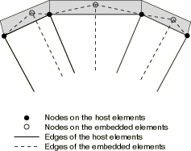
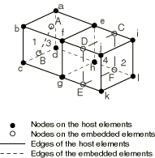

# 35.4.1 埋入单元


**产品：** Abaqus/Standard  Abaqus/Explicit  Abaqus/CAE

##### **参考文献**

- ["运动约束：概述，" 第35.1.1节](pt08ch35s01abo32.md)
- [*EMBEDDED ELEMENT](../key/key-link.md#usb-kws-membeddedelement)
- ["定义埋入区域约束，" Abaqus/CAE用户指南第15.15.8节](../usi/usi-link.md#usi-itn-helptopic-embedded)

### 概述

埋入单元技术：
- 用于指定嵌入在一组宿主单元中的单元或单元组，这些宿主单元的响应将用于约束埋入节点（即埋入单元的节点）的平移自由度；
- 可用于几何线性或非线性分析；
- 不适用于具有旋转自由度的宿主单元；
- 可用于模拟位于三维实体（连续体）单元组中的钢筋增强膜单元、壳单元或表面单元组；位于实体单元组中的桁架或梁单元组；或嵌入另一组实体单元中的一组实体单元；
- 当壳单元或梁单元嵌入实体单元时，不会约束埋入节点的旋转自由度；以及
- 可以从Abaqus/Standard导入到Abaqus/Explicit，反之亦然。

### 引言

埋入单元技术用于指定一个或一组单元嵌入"宿主"单元中。例如，埋入单元技术可用于模拟钢筋加固。Abaqus搜索埋入单元节点与宿主单元之间的几何关系。如果埋入单元的节点位于宿主单元内，则该节点的平移自由度被消除，该节点成为"埋入节点"。埋入节点的平移自由度被约束为宿主单元相应自由度的插值。埋入单元可以具有旋转自由度，但这些旋转不受嵌入约束。允许多个埋入单元定义。

### 可用的埋入单元类型

埋入单元集和宿主单元集可以使用不同的单元类型。但是，所有宿主单元只能有平移自由度，埋入单元节点上的平移自由度数量必须与宿主单元节点上的平移自由度数量相同。

提供以下"埋入单元在宿主单元中"的一般类型：
- 二维模型：
  - 梁在实体中
  - 实体在实体中
  - 桁架在实体中
- 轴对称模型：
  - 膜在实体中（仅限Abaqus/Standard）
  - 壳在实体中
  - 实体在实体中
  - 表面在实体中（仅限Abaqus/Standard）
- 三维模型：
  - 梁在实体中
  - 膜在实体中
  - 壳在实体中
  - 实体在实体中
  - 表面在实体中
  - 桁架在实体中

### 指定宿主单元

默认情况下，会搜索埋入单元附近的单元，以找到包含埋入节点的单元；然后这些宿主单元的响应会约束这些埋入节点。为了排除某些单元对埋入节点的约束，可以定义一个宿主单元集；搜索将仅限于模型中宿主单元的这个子集。如果埋入节点接近模型中的不连续处（裂纹、接触对等），强烈建议使用此功能。

| **输入文件用法：** | ``` [*EMBEDDED ELEMENT](../key/key-link.md#usb-kws-membeddedelement), HOST ELSET=*name* ``` |
| --- | --- |
|  | [*EMBEDDED ELEMENT](../key/key-link.md#usb-kws-membeddedelement)选项必须包含在模型定义部分的输入文件中。允许多个[*EMBEDDED ELEMENT](../key/key-link.md#usb-kws-membeddedelement)选项。 |

| **Abaqus/CAE用法：** | Interaction模块：**Create Constraint**：**Embedded region**：在选择宿主区域时，从提示区域选择**Select Region** |
| --- | --- |

### 指定埋入单元

必须指定埋入单元。可以指定单个单元或单元集。默认情况下，如果Abaqus无法成功将所有指定的埋入单元完全嵌入宿主单元，将发出错误消息。可选地，可以允许部分嵌入，即只有位于宿主单元内的埋入单元节点才会被约束。

埋入单元可以与宿主单元共享一些节点。但是，这些节点不会被视为埋入节点。

| **输入文件用法：** | 使用以下选项完全嵌入单元（默认）： |
| --- | --- |
|  | ``` [*EMBEDDED ELEMENT](../key/key-link.md#usb-kws-membeddedelement), PARTIAL EMBED=NO *埋入单元* ``` 使用以下选项部分嵌入单元： ``` [*EMBEDDED ELEMENT](../key/key-link.md#usb-kws-membeddedelement), PARTIAL EMBED=YES *埋入单元* ``` |

| **Abaqus/CAE用法：** | 在Abaqus/CAE中只能完全嵌入单元。 |
| --- | --- |
|  | Interaction模块：**Create Constraint**：**Embedded region**：选择埋入区域 |

### 定义几何容差

几何容差用于定义埋入节点可以远离模型中宿主单元区域的距离。默认情况下，埋入节点必须位于由所有非埋入单元的平均尺寸乘以0.05计算的距离内；但是，您可以更改此容差。

您可以将几何容差定义为模型中所有非埋入单元平均尺寸的分数。或者，您可以将几何容差定义为所选模型长度单位的绝对距离。如果同时指定了两个外部容差，Abaqus将使用两者中更严格的容差。计算所有非埋入单元的平均尺寸，并乘以分数外部容差，然后与绝对外部容差进行比较，以确定两者中更严格的容差。宿主单元中埋入单元的外部容差由[图35.4.1-1](pt08ch35s04aus136.md#embed-exteriortol)中的阴影区域表示。

**图35.4.1-1** 埋入单元的外部容差。



如果埋入节点位于指定容差区域内，则该节点被约束到宿主单元。该节点的位置将被调整，以使节点精确地位于宿主单元上。如果埋入节点位于指定容差区域外，将发出错误消息。

| **输入文件用法：** | 使用以下选项将容差定义为分数： |
| --- | --- |
|  | ``` [*EMBEDDED ELEMENT](../key/key-link.md#usb-kws-membeddedelement), EXTERIOR TOLERANCE=*tolerance* ``` 使用以下选项将容差定义为绝对距离： ``` [*EMBEDDED ELEMENT](../key/key-link.md#usb-kws-membeddedelement), ABSOLUTE EXTERIOR TOLERANCE=*tolerance* ``` |

| **Abaqus/CAE用法：** | Interaction模块：**Create Constraint**：**Embedded region**：**Fractional exterior tolerance** 或 **Absolute exterior tolerance** |
| --- | --- |

### 调整埋入节点的位置

如果埋入节点靠近宿主单元内的单元边缘或单元面，则对埋入节点的位置进行小幅调整以使其精确位于宿主单元的边缘或面上，这在计算上是高效的。定义了一个小容差，低于该容差时，与埋入节点关联的宿主单元节点上的权重因子将被清零。小权重因子将按其初始权重的比例重新分配给宿主单元上的其他节点，并且埋入节点的位置将根据新的权重因子进行调整。此调整仅在分析开始时执行，不会对模型产生任何应变。这对于对埋入节点进行小幅调整以使其位于宿主单元的边缘或面上最有用。如果使用较大的非默认舍入容差值对埋入节点位置进行大幅调整，您应该仔细检查调整后获得的网格。

| **输入文件用法：** | ``` [*EMBEDDED ELEMENT](../key/key-link.md#usb-kws-membeddedelement), ROUNDOFF TOLERANCE=*tolerance* ``` |

| **Abaqus/CAE用法：** | Interaction模块：**Create Constraint**：**Embedded region**：**Weight factor roundoff tolerance** |
| --- | --- |

### 与其他多点运动约束一起使用

如果埋入节点也被多点约束、方程约束、运动耦合、表面绑定约束或刚体约束绑定，则会引入过度约束，并将发出错误消息。如果边界条件应用于埋入节点，则埋入单元定义始终优先。边界条件将被忽略，并将发出警告消息。

### 在埋入单元上定义表面

由于嵌入，埋入单元没有外部（自由）表面。因此，对于使用通用接触建模的交互自动定义的包容性表面，其面不是其中的一部分。此外，基于这些单元的任何表面定义必须明确指定面标识符（请参见["基于单元的表面定义，" 第2.3.2节](pt01ch02s03aus17.md)）。

### 限制

埋入单元技术存在以下限制：
- 具有旋转自由度的单元（除具有扭转的轴对称单元外）不能用作宿主单元。
- 埋入节点的旋转、温度、孔隙压力、声压和电势自由度不受约束。
- 宿主单元不能被嵌入。
- 宿主单元定义的材料不会在嵌入单元所在位置被埋入单元定义的材料替换。
- 埋入单元带来的额外质量和刚度被添加到模型中。
- 如果使用改进的四面体单元作为宿主单元，则仅使用角节点来约束适当的埋入节点。

### 示例

考虑[图35.4.1-2](pt08ch35s04aus136.md#embedded-elements)中的示例。

**图35.4.1-2** 单元嵌入在宿主单元中。



单元3（桁架）和单元4（膜）嵌入在单元1和单元2中。单元1由节点a、b、c、d、e、f、g和h形成；单元2由节点e、f、g、h、i、j、k和l形成；单元3由节点A和B形成；单元4由节点C、D、E和F形成。如果宿主单元集包括单元1和单元2，埋入单元集分别包含单元3和单元4，Abaqus将尝试查找是否有任何埋入节点（A、B、C、D、E和F）位于宿主单元1或2内。如果发现节点A位于单元1的a-b-f-e面附近，则节点A的所有自由度被约束到节点a、b、f和e，并根据节点A在单元1中的几何位置确定适当的权重因子。类似地，如果发现节点B位于单元1内部，且节点E分别位于单元2的g-k边附近，则节点B的所有自由度被约束到节点a、b、c、d、e、f、g和h，节点E的所有自由度被约束到节点g和k，并根据节点B在单元1中的几何位置和节点E在单元2的g-k边上的几何位置分别确定适当的权重因子。

您应确保所需埋入单元上的所有节点都正确约束到宿主单元上的节点。可以通过执行数据检查分析来验证这一点（请参见["Abaqus/Standard、Abaqus/Explicit和Abaqus/CFD执行，" 第3.2.2节](pt01ch03s02abx02.md)）。对于每个埋入节点，在数据检查分析期间，会将用于约束该节点的节点列表及相关权重因子输出到数据文件。如果使用完全嵌入且埋入节点未受约束，则会发出错误消息。

### 模板

```
[*HEADING](../key/key-link.md#usb-kws-mheading)
…
[*NODE](../key/key-link.md#usb-kws-mnode)
*数据行定义节点坐标*
[*ELEMENT](../key/key-link.md#usb-kws-melement), TYPE=C3D8, ELSET=SOLID3D
*数据行定义实体单元*
[*ELEMENT](../key/key-link.md#usb-kws-melement), TYPE=T3D2, ELSET=TRUSS
*数据行定义桁架单元*
[*ELEMENT](../key/key-link.md#usb-kws-melement), TYPE=M3D4, ELSET=MEMB
*数据行定义膜单元*
[*EMBEDDED ELEMENT](../key/key-link.md#usb-kws-membeddedelement), EXTERIOR TOLERANCE=*tolerance*, HOST ELSET=SOLID3D
TRUSS, MEMB
[*STEP](../key/key-link.md#usb-kws-hstep)
[*STATIC](../key/key-link.md#usb-kws-hstatic) *（或任何其他允许的步骤）*
*数据行定义步骤时间和控制增量*
…
[*END STEP](../key/key-link.md#usb-kws-hendstep)
```


