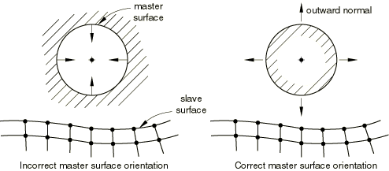
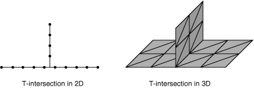

# 36.3.1 在 Abaqus/Standard 中定义接触对


**产品：** Abaqus/Standard  Abaqus/CAE  

##### **参考文献**

- ["基于单元的表面定义，" 第 2.3.2 节](pt01ch02s03aus17.md)
- ["基于节点的表面定义，" 第 2.3.3 节](pt01ch02s03aus18.md)
- ["解析刚体表面定义，" 第 2.3.4 节](pt01ch02s03aus19.md)
- ["接触相互作用分析概述，" 第 36.1.1 节](pt09ch36s01abo33.md)
- [*CONTACT PAIR](../key/key-link.md#usb-kws-hcontactpair)
- [*SURFACE](../key/key-link.md#usb-kws-msurface)
- [*MODEL CHANGE](../key/key-link.md#usb-kws-hmodelchange)
- ["定义面-面接触，" Abaqus/CAE 用户指南第 15.13.7 节](../usi/usi-link.md#usi-itn-help-surftosurf)
- ["定义自接触，" Abaqus/CAE 用户指南第 15.13.8 节](../usi/usi-link.md#usi-itn-help-self)
- ["使用接触和约束检测，" Abaqus/CAE 用户指南第 15.16 节](../usi/usi-link.md#usi-itn-detectioneditor)

### 概述

Abaqus/Standard 中的接触对：
- 可用于定义机械、耦合温度-位移、耦合热-电-结构、耦合孔隙压力-位移、耦合热-电和热传递模拟中物体之间的相互作用；
- 是模型定义的一部分；
- 可以使用一对刚体或可变形表面或单个可变形表面形成；
- 不必使用匹配网格的表面；以及
- 不能由一个二维表面和一个三维表面形成。

您可以在 Abaqus/Standard 中以两个可能彼此相互作用的表面的"接触对"形式或以可能与自身相互作用的单个表面的"自接触"形式定义接触。Abaqus/Standard 通过形成涉及附近节点组的方程来 enforcement 接触条件，或者在自接触的情况下，涉及同一表面不同区域的节点。本节描述定义接触对的各个方面，并参考其他章节以获取更多详细信息。

### 定义接触对

要定义接触对，您必须指明哪些表面对可能彼此相互作用或哪些表面可能与自身相互作用。接触表面应扩展得足够远，以包括分析过程中可能接触的所有区域；但是，包括永远不会接触的额外表面节点和面可能导致显著的计算成本（例如，扩展从表面使其包含许多在分析过程中始终与主表面分离的节点可能会显著增加内存使用，除非使用惩罚接触 enforcement）。

每个接触对都被分配一个接触 formulation（显式或默认），并且必须引用相互作用属性。各种可用接触 formulations（基于跟踪方法是否假定有限或小滑动——以及接触离散化是否基于节点-面或面-面方法）的讨论在 ["Abaqus/Standard 中的接触 formulations，" 第 38.1.1 节](pt09ch38s01aus177.md) 中提供。相互作用属性定义在 ["在 Abaqus/Standard 中为接触对分配接触属性，" 第 36.3.3 节](pt09ch36s03aus147.md) 中讨论。

#### 定义两个独立表面之间的接触

当接触对包含两个表面时，两个表面不能包含任何相同的节点，您必须选择哪个表面作为从表面，哪个作为主表面。主从表面的选择在 ["在两面接触对中选择主从角色" 中详细讨论，在 "Abaqus/Standard 中的接触 formulations，" 第 38.1.1 节](pt09ch38s01aus177.md#usb-cni-acontactpairform-masterslave)。对于由两个可变形表面组成的简单接触对，可以使用以下基本指南：
- 两个表面中较大的一个应作为主表面。
- 如果表面大小相当，较硬物体上的表面应作为主表面。
- 如果表面大小和硬度相当，网格较粗的表面应作为主表面。

默认使用有限滑动、节点-面 formulation（除了在 Abaqus/CAE 中，默认是有限滑动、面-面 formulation）。

##### 使用有限滑动、节点-面 formulation 定义接触对

提供有限滑动、节点-面 formulation。

| **输入文件用法：** | ``` [*CONTACT PAIR](../key/key-link.md#usb-kws-hcontactpair), INTERACTION=*interaction_property_name* *slave_surface_name*, *master_surface_name* ``` |
| --- | --- |
|  | 您也可以直接指定接触离散化： ``` [*CONTACT PAIR](../key/key-link.md#usb-kws-hcontactpair), INTERACTION=*interaction_property_name*, TYPE=NODE TO SURFACE *slave_surface_name*, *master_surface_name* ``` |

| **Abaqus/CAE 用法：** | Interaction 模块： **Create Interaction**: **Surface-to-surface contact (Standard)**: 选择主表面，点击 **Surface** 或 **Node Region**，选择从表面，Interaction 编辑器，**Sliding formulation: Finite sliding**，**Discretization method: Node to surface**，**Contact interaction property**: *interaction_property_name* |
| --- | --- |

##### 使用有限滑动、面-面 formulation 定义接触对

基于节点的从表面不能使用面-面离散化。使用有限滑动、面-面 formulation 时，某些接触功能不可用，包括裂纹扩展（见 ["裂纹扩展分析，" 第 11.4.3 节](pt04ch11s04aus69.md)）。

| **输入文件用法：** | 使用以下选项使用有限滑动、面-面 formulation 定义接触约束： |
| --- | --- |
|  | ``` [*CONTACT PAIR](../key/key-link.md#usb-kws-hcontactpair), INTERACTION=*interaction_property_name*, TYPE=SURFACE TO SURFACE *slave_surface_name*, *master_surface_name* ``` |

| **Abaqus/CAE 用法：** | Interaction 模块： **Create Interaction**: **Surface-to-surface contact (Standard)**: 选择主表面，点击 **Surface**，选择从表面，Interaction 编辑器，**Sliding formulation: Finite sliding**，**Discretization method: Surface to surface**，**Contact interaction property**: *interaction_property_name* |
| --- | --- |

##### 使用小滑动、节点-面 formulation 定义接触对

小滑动跟踪方法默认使用节点-面离散化。关于分析中何时适合使用小滑动跟踪方法的说明，请参见 ["使用小滑动跟踪方法" 在 "Abaqus/Standard 中的接触 formulations，" 第 38.1.1 节](pt09ch38s01aus177.md#usb-cni-acontactpairform-smsliding)。

| **输入文件用法：** | ``` [*CONTACT PAIR](../key/key-link.md#usb-kws-hcontactpair), INTERACTION=*interaction_property_name*, SMALL SLIDING *slave_surface_name*, *master_surface_name* ``` |
| --- | --- |
|  | 您也可以直接指定接触离散化： ``` [*CONTACT PAIR](../key/key-link.md#usb-kws-hcontactpair), INTERACTION=*interaction_property_name*, SMALL SLIDING, TYPE=NODE TO SURFACE *slave_surface_name*, *master_surface_name* ``` |

| **Abaqus/CAE 用法：** | Interaction 模块： **Create Interaction**: **Surface-to-surface contact (Standard)**: 选择主表面，点击 **Surface** 或 **Node Region**，选择从表面，Interaction 编辑器，**Sliding formulation: Small sliding**，**Discretization method: Node to surface**，**Contact interaction property**: *interaction_property_name* |
| --- | --- |

##### 使用小滑动、面-面 formulation 定义接触对

基于节点的从表面不能使用面-面离散化。

| **输入文件用法：** | ``` [*CONTACT PAIR](../key/link.md#usb-kws-hcontactpair), INTERACTION=*interaction_property_name*, SMALL SLIDING, TYPE=SURFACE TO SURFACE *slave_surface_name*, *master_surface_name* ``` |

| **Abaqus/CAE 用法：** | Interaction 模块： **Create Interaction**: **Surface-to-surface contact (Standard)**: 选择主表面，点击 **Surface**，选择从表面，Interaction 编辑器，**Sliding formulation: Small sliding**，**Discretization method: Surface to surface**，**Contact interaction property**: *interaction_property_name* |
| --- | --- |

#### 使用对称主-从接触对改善接触建模

对于节点-面接触，主表面节点可能穿透从表面而无阻力，这种情况可能发生于主表面比从表面网格更细的情况，或在软体之间形成大接触压力的情况。细化从表面网格通常可以最小化主表面节点的穿透。如果细化技术不起作用或不可行，如果两个表面都是具有可变形或可变形-刚体父单元的基于单元的表面，则可以使用对称主-从方法。要使用此方法，使用相同的两个表面定义两个接触对，但切换两个接触对的主从表面。此方法导致 Abaqus/Standard 将每个表面视为主表面，因此需要额外的计算成本，因为必须对相同的接触对进行两次接触搜索。此方法提供的精度提高必须与额外的计算成本进行比较。

所有接触 formulations 都可用于对称主-从接触对，并且可以使用上面讨论的相同选项应用。

| **输入文件用法：** | ``` [*CONTACT PAIR](../key/key-link.md#usb-kws-hcontactpair), INTERACTION=*interaction_property_name* *surface_1*, *surface_2* *surface_2*, *surface_1* ``` |

| **Abaqus/CAE 用法：** | Interaction 模块： **Create Interaction**: **Surface-to-surface contact (Standard)**: 选择主表面，点击 **Surface**，选择从表面。复制此相互作用到新相互作用，并编辑新相互作用。在相互作用编辑器中，点击 **Switch** 以反转主从表面。 |
| --- | --- |

##### 对称主-从接触对的限制

当 enforcement 非常硬或"硬"接触条件时，使用对称主-从接触对可能导致过度约束问题。见 ["Abaqus/Standard 中的接触约束 enforcement 方法，" 第 38.1.2 节](pt09ch38s01aus178.md)，了解关于过度约束和替代约束 enforcement 方法的讨论。

对于软化接触条件，使用对称主-从接触对将导致与指定的压力-过盈量行为的偏差，因为两个接触对都贡献于整体界面应力，而不相互考虑。例如，如果指定了线性压力-过盈量关系，对称主-从接触对实际上使整体接触刚度翻倍。

同样，如果指定了可选的剪切应力极限（见 ["使用可选的剪切应力极限" 在 "摩擦行为，" 第 37.1.5 节](pt09ch37s01aus169.md#usb-cni-afriction-taumax)），使用对称主-从接触对将导致与摩擦模型的偏差，因为每个接触对观察到的接触应力大约是总界面应力的一半。

同样，对于对称主-从接触对，可能难以解释界面处的结果。在这种情况下，界面两侧的表面都作为从表面，因此每个都有与其关联的接触约束值。表示接触压力的约束值不是彼此独立的。因此，数据（`.dat`）和结果（`.fil`）文件中报告的约束值仅代表总界面压力的一部分，必须求和才能获得总计。

在输出数据库中，机械接触变量在主表面和从表面上报告（每接触对），而不仅仅是在形成约束的从表面上。因此，每个对称主-从接触对表面有两个结果集；当表面作为从和作为主时，各有一个。对于节点接触压力，Abaqus/CAE 的 Visualization 模块仅报告与节点关联的两个压力值中的最大值，即使包含该节点的表面作为主或从表面。即使在这种情况下，接触压力也不代表真实界面压力。

除了接触压力，某些接触输出可能与对称主-从接触对混淆。例如，Abaqus/Standard 可能报告接触界面一侧的正开口距离，而另一侧为零开口距离（即接触）。这通常是由两个表面的形状或相对网格细化引起的。

#### 定义自接触

通过仅指定单个表面或两次指定相同表面来定义表面与自身之间的接触。小滑动跟踪方法不能与自接触一起使用。

##### 使用节点-面离散化定义自接触

Abaqus/Standard 默认对自接触使用节点-面接触离散化。

| **输入文件用法：** | 使用以下任一选项： |
| --- | --- |
|  | ``` [*CONTACT PAIR](../key/key-link.md#usb-kws-hcontactpair), INTERACTION=*interaction_property_name* *surface_1,* ``` ``` [*CONTACT PAIR](../key/key-link.md#usb-kws-hcontactpair), INTERACTION=*interaction_property_name* *surface_1*, *surface_1* ``` |

| **Abaqus/CAE 用法：** | Interaction 模块： **Create Interaction**: **Self-contact (Standard)**: 选择表面，Interaction 编辑器，**Discretization method: Node to surface**，**Contact interaction property**: *interaction_property_name* |
| --- | --- |
|  | 或 Interaction 模块： **Create Interaction**: **Surface-to-surface contact (Standard)**: 选择表面，点击 **Surface**，再次选择表面，Interaction 编辑器，**Sliding formulation: Finite sliding**，**Discretization method: Node to surface**，**Contact interaction property**: *interaction_property_name* |

##### 使用面-面离散化定义自接触

面-面离散化通常可以更准确地模拟自接触仿真。但是，因为自接触表面同时充当主和从，面-面离散化有时可能会显著增加解决方案成本。

| **输入文件用法：** | 使用以下任一选项： |
| --- | --- |
|  | ``` [*CONTACT PAIR](../key/key-link.md#usb-kws-hcontactpair), INTERACTION=*interaction_property_name*, TYPE=SURFACE TO SURFACE *surface_1,* ``` ``` [*CONTACT PAIR](../key/key-link.md#usb-kws-hcontactpair), INTERACTION=*interaction_property_name*, TYPE=SURFACE TO SURFACE *surface_1*, *surface_1* ``` |

| **Abaqus/CAE 用法：** | Interaction 模块： **Create Interaction**: **Self-contact (Standard)**: 选择表面，Interaction 编辑器，**Discretization method: Surface to surface**，**Contact interaction property**: *interaction_property_name* |
| --- | --- |
|  | 或 Interaction 模块： **Create Interaction**: **Surface-to-surface contact (Standard)**: 选择表面，点击 **Surface**，再次选择表面，Interaction 编辑器，**Sliding formulation: Finite sliding**，**Discretization method: Surface to surface**，**Contact interaction property**: *interaction_property_name* |

##### 自接触的限制

自接触仅对机械表面相互作用有效，仅限于具有基于单元表面的有限滑动。

自接触表面的节点可以是二维自接触（使用面-面 formulation）和所有三维自接触中同时作为从节点和主表面成员。在这种情况下，接触行为类似于对称主-从接触对，并且 ["使用对称主-从接触对改善接触建模"](pt09ch36s03aus145.md#usb-cni-acontactpair-symm) 中讨论的问题适用。Abaqus/Standard 自动对接触条件应用一些数值"软化"，如 ["Abaqus/Standard 中的接触约束 enforcement 方法，" 第 38.1.2 节](pt09ch38s01aus178.md) 中所述。

直接 enforcement 硬接触条件是二维自接触（使用节点-面 formulation）的默认约束 enforcement 方法。在这种情况下，在二维表面折叠到自身的顶点处，每个邻近节点的从或主角色在分析期间自动分配。因为接触约束直接抵抗作为从节点的穿透，如果节点仅作为二维自接触（使用节点-面 formulation）的主节点，则可能存在一些未解决的穿透可能性。

### 选择接触对中使用的表面

创建表面的方法在 ["基于单元的表面定义，" 第 2.3.2 节](pt01ch02s03aus17.md)；["基于节点的表面定义，" 第 2.3.3 节](pt01ch02s03aus18.md)；和 ["解析刚体表面定义，" 第 2.3.4 节](pt01ch02s03aus19.md) 中讨论；这些章节讨论了各种表面类型的一般限制。与各种接触 formulations 相关的表面特性注意事项在 ["Abaqus/Standard 中的接触 formulations，" 第 38.1.1 节](pt09ch38s01aus177.md) 中讨论。接触定义中使用的表面的其他注意事项在下面讨论。

#### 壳状表面的方向注意事项

Abaqus/Standard 要求主接触表面对于节点-面接触和某些面-面接触 formulations 是单面的（见 ["影响接触 formulation 的基本选择" 在 "Abaqus/Standard 中的接触 formulations，" 第 38.1.1 节](pt09ch38s01aus177.md#usb-cni-acontactpairform-choices)，了解详细信息）。这要求您考虑在具有正面和负面方向的壳和膜等单元上定义的主表面的正确方向。对于节点-面接触，从表面法线的方向无关紧要，但对于面-面接触，单面从表面的方向会被考虑。

双面基于单元的表面允许用于默认面-面接触 formulations，尽管它们并不总是适合深初始穿透的情况。如果主表面和从表面都是双面的，则选择正面或负面接触法线方向以最小化（或避免）每个接触约束的穿透。如果任一表面或两个表面是单面的，则正面或负面接触法线方向将根据单面表面法线确定，而不是根据表面的相对位置。

当接触表面的方向与接触 formulation 相关时，必须考虑结构（梁和壳）、膜、桁架或刚性单元上表面的以下方面：
- 相邻表面面必须具有一致的法线方向。如果相邻表面面在单面表面上法线不一致，Abaqus/Standard 将发出错误消息。
- 除了初始干扰配合问题（见 ["在 Abaqus/Standard 中建立接触干扰配合模型，" 第 36.3.4 节](pt09ch36s03aus148.md)）外，从表面应位于主表面外法线所在的同一侧。如果在初始配置中从表面位于主表面外法线相对的一侧，Abaqus/Standard 将检测表面的过盈量，并且如果过盈量严重可能难以找到初始解决方案。外法线的不正确规范通常会导致分析立即无法收敛。[图 36.3.1-1](pt09ch36s03aus145.md#asurfover-good-bad-master) 说明了主表面外法线的正确和错误规范。

**图 36.3.1-1** 主表面方向正确和错误的示例。


- 如果单面从表面和主表面具有大约相同方向的法线（例如，如果从表面和主表面法线的点积为正），则使用面-面离散化时将忽略接触。

以下来自数据分析检查分析（见 ["Abaqus/Standard、Abaqus/Explicit 和 Abaqus/CFD 执行，" 第 3.2.2 节](pt01ch03s02abx02.md)）的输出可用于识别方向错误的主表面：- 初始间隙可以在 Abaqus/CAE 中以第一步骤增量 0 的变量 COPEN 的轮廓图显示；初始过盈量对应于负间隙。
- Abaqus/Standard 提供模型初始接触状态的详细打印。

#### 表面连接限制

某些连接限制适用于接触表面，具体取决于接触 formulation 的类型。各种接触 formulations 的表面连接限制总结在 [表 36.3.1-1](pt09ch36s03aus145.md#table-connectivity-restrictions) 中。如该表所示，连接限制有时对主表面和从表面不同。自接触表面同时充当主和从表面；因此，如果限制适用于主表面或从表面，它也适用于自接触。下面描述 [表 36.3.1-1](pt09ch36s03aus145.md#table-connectivity-restrictions) 中提到的潜在连接限制：

**表 36.3.1-1** 各种接触 formulations 允许的基于单元表面的连接特性摘要。
| 接触 formulation | 连接特性 |
| --- | --- |
| 不连续（或仅在个节点连接的三维面） | T 形相交 |
| 有限滑动、节点-面 | 主：不允许从：允许 | 主：不允许从：允许 |
| 小滑动、节点-面 | 主：允许从：允许 | 主：不允许从：允许 |
| 有限滑动、面-面 | 主：允许从：允许 | 主：允许从：允许 |
| 小滑动、面-面 | 主：允许从：允许 | 主：不允许从：允许 |

- 不连续表面：在许多情况下允许不连续接触表面，但有限滑动、节点-面接触的主表面不能由两个或多个断开的区域组成（它们必须在三维模型中的单元边缘或二维模型中的节点之间连续）。[图 36.3.1-2](pt09ch36s03aus145.md#acontsurf-continuous) 显示了连续表面的示例，而 [图 36.3.1-3](pt09ch36s03aus145.md#acontsurf-discontinuous-2d) 和 [图 36.3.1-4](pt09ch36s03aus145.md#acontsurf-discontinuous-3d) 显示了不连续表面的示例。[图 36.3.1-5](pt09ch36s03aus145.md#asurfover-auto-free-surf) 显示了由包含两个不相连单元组的单元集指定自动生成的自由表面。结果表面不连续，因为它由两个不相连的开放曲线组成，因此作为有限滑动、节点-面接触的主表面无效。

**图 36.3.1-2** 连续表面示例。


**图 36.3.1-3** 不连续二维表面示例。


**图 36.3.1-4** 不连续三维表面示例。


**图 36.3.1-5** 由不相连单元集的自动自由表面生成产生的不连续表面示例。


- 在仅一个节点连接的三维表面的部分：有限滑动、节点-面接触 formulation 也不允许三维主表面面在单个节点上连接（它们必须在公共单元边缘上连接）。[图 36.3.1-6](pt09ch36s03aus145.md#acontsurf-connect-by-point) 显示了具有通过单个节点连接的两个面的表面示例。

**图 36.3.1-6** 通过单个节点共享两个面的三维表面示例。


- 具有 T 相交的表面：在某些情况下，接触表面不能在二维中的公共主节点或三维中的公共主边缘上具有共享公共面的两个以上的面。例如，[图 36.3.1-7](pt09ch36s03aus145.md#acontsurf-t-intersection) 显示了具有 T 相交的表面示例，其中三个面在二维中共享一个公共节点或在三维中共享一个公共边缘。虽然节点-面 formulations 中两个以上表面面可以在二维中的公共从节点或三维中的公共从边缘上共享，但从面必须是单面的，这排除了节点-面 formulations 最常见的 T 相交情况。

**图 36.3.1-7** 具有 T 相交的表面示例。



#### 解析刚体表面

解析刚体表面通常可有效地模拟曲线、刚性几何形状，如 ["解析刚体表面定义，" 第 2.3.4 节](pt01ch02s03aus19.md) 中所述。对于需要大量段（数千）来定义解析刚体表面的极少数情况，使用基于单元的刚体表面可以获得更好的性能（见 ["基于单元的表面定义，" 第 2.3.2 节](pt01ch02s03aus17.md)）。

#### 三维梁和桁架表面

Abaqus/Standard 不能使用三维梁或桁架形成主表面，因为单元没有足够的信息来创建唯一的表面法线。但是，这些单元可用于定义从表面。二维梁和桁架可用于形成主表面和从表面。

#### 基于边的表面

三维壳单元上的基于边的表面（["基于单元的表面定义，" 第 2.3.2 节](pt01ch02s03aus17.md)）不能用于 Abaqus/Standard 中的接触分析。

#### 基于节点的表面的限制

当接触属性定义包括用户定义的软化接触属性或热或电相互作用时，谨慎使用基于节点的表面，因为接触本构行为（依赖于接触压力、热通量或电流的精确计算）将无法正确 enforcement，除非将精确的表面面积与每个节点关联。详情见 ["接触压力-过盈量关系，" 第 37.1.2 节](pt09ch37s01aus166.md)；["热接触属性，" 第 37.2.1 节](pt09ch37s02aus174.md)；或 ["电接触属性，" 第 37.3.1 节](pt09ch37s03aus175.md)。

### 移除和重新激活接触对

您可以临时从模拟中移除接触对，这可以通过消除模拟期间不必要的接触搜索和表面方向更新来节省大量计算成本。接触对的移除和重新激活通常用于复杂成形过程，在分析的不同阶段需要多个工具与工件相互作用。

您不能从模拟中移除绑定的接触对（见 ["在 Abaqus/Standard 中定义绑定接触，" 第 36.3.7 节](pt09ch36s03aus151.md)）。

#### 移除接触对

接触对的移除是一种有用的技术，用于解耦组件直到它们应该结合在一起（例如，制造过程模拟中的工具）。移除接触对并在适当时引入可以节省大量计算成本，从而无需监控接触条件，除非它们是相关的。

| **输入文件用法：** | ``` [*MODEL CHANGE](../key/key-link.md#usb-kws-hmodelchange), TYPE=CONTACT PAIR, REMOVE *slave_surface, master_surface* ``` |
| --- | --- |
|  | 根据需要重复数据行。 |

| **Abaqus/CAE 用法：** | 使用以下任一选项： |
| --- | --- |
|  | Interaction 模块： **Create Interaction**: 面-面接触或自接触相互作用编辑器：关闭 **Active in this step** Interaction 模块： interaction manager：选择相互作用，**Deactivate** |

##### 移除与闭合接触对关联的接触力

当移除接触对时如果表面处于接触状态，Abaqus/Standard 会存储每个表面上每个节点的相应接触力（或如果存在热相互作用则是热通量，或者如果是耦合热电分析则是电流）。Abaqus/Standard 自动在移除步骤期间将这些力（或热通量或电流）线性斜降为零。Abaqus/Standard 始终立即移除机械表面相互作用的接触约束。

在瞬态过程中移除接触对时要注意。在瞬态热传递、完全耦合温度-位移或完全耦合热-电-结构分析中，如果通量高且步骤长，这种斜降可能会影响身体的其余部分的冷却或加热。在动态分析中，如果力高且步骤长，可能会给模型的其余部分赋予动能。可以通过在分析之前的非常短的瞬态步骤中移除接触对来避免此问题。此步骤可以在单个增量中完成。

##### 使用容许接触干扰停用接触对

可以通过为接触对分配非常大的容许接触干扰来在分析期间停用具有机械接触相互作用的接触对（见 ["在 Abaqus/Standard 中建立接触干扰配合模型，" 第 36.3.4 节](pt09ch36s03aus148.md)）。此方法的缺点是不会减少分析的计算成本，因为接触算法仍会在每个增量中计算接触对的接触条件。

#### 重新激活接触对

模拟中使用的所有接触对必须在分析开始时创建；一旦模拟开始就不能创建。但是，可以创建接触对，在第一步开始时移除，然后在模拟中稍后重新激活。

在 Abaqus/CAE 中，您可以在任何步骤中创建接触对。如果接触对是在初始步骤以外的步骤中创建的，Abaqus/CAE 会自动在初始步骤中停用接触对，并在创建它的步骤中重新激活。

| **输入文件用法：** | ``` [*MODEL CHANGE](../key/key-link.md#usb-kws-hmodelchange), TYPE=CONTACT PAIR, ADD *slave_surface, master_surface* ``` |
| --- | --- |
|  | 根据需要重复数据行。 |

| **Abaqus/CAE 用法：** | Interaction 模块： **Create Interaction**: 面-面接触或自接触相互作用编辑器：打开 **Active in this step** |
| --- | --- |

##### 重新激活过盈接触对

当重新激活接触对时，接触约束立即变为活动状态。在机械模拟中，接触对 inactive 时，表面的接触对可能移动得变得过盈。如果在接触对 inactive 时过盈量太严重，当重新激活接触对时，Abaqus/Standard 可能会在尝试 enforcement 突然激活的接触约束时遇到收敛问题。为避免此类问题，您可以为接触对指定一个容许干扰值 *v*，该值大于接触对的过盈量。Abaqus/Standard 将 v 在步骤中斜降到零。有关指定容许干扰的详细信息，请参见 ["在 Abaqus/Standard 中建立接触干扰配合模型，" 第 36.3.4 节](pt09ch36s03aus148.md)。

### 输出

与接触对的相互作用关联的输出变量分为两类：节点变量（有时称为约束变量）和整个表面变量。此外，Abaqus 输出与接触相互作用关联的诊断信息数组，如 ["Abaqus/Standard 分析中的接触诊断，" 第 39.1.1 节](pt09ch39s01aus183.md) 中所述。

有关与热、电和孔隙流体分析相关的变量的更详细讨论，请参阅本指南中关于相关接触属性的章节 [第 37 章，"接触属性模型"](pt09ch37.md)。

#### 节点接触变量

节点接触变量可以在 Abaqus/CAE 的 Visualization 模块中的接触表面上绘制轮廓。节点接触变量包括接触压力和力、摩擦剪切应力和力、接触期间表面的相对切向运动（滑动）、表面之间的间隙、热或流体通量每单位面积、流体压力和电流每单位面积。写入输出数据库（`.odb`）文件的许多节点接触变量通常可用于所有接触节点，无论它们是作为从节点还是主节点。其他节点接触变量仅在作为从节点的节点上可用。对于写入数据（`.dat`）文件、结果（`.fil`）文件和工具子程序 `GETVRMAVGATNODE` 的大多数接触输出与单个约束关联。对于写入输出数据库（`.odb`）文件的接触输出，应用一些过滤以减少接触输出噪声。

接触压力分布在许多 Abaqus 分析中是关键关注点。您可以查看除解析刚体表面和基于刚性类型单元的离散刚体表面外的所有接触表面上的接触压力（后者限制不适用于通用接触）。您可以请求接触压力误差指标的轮廓图以及接触压力的轮廓图，以在接触压力解决方案重要的区域获得接触压力解决方案局部精度的视角（见 ["选择影响自适应重新网格化的误差指标，" 第 12.3.2 节](pt04ch12s03aus84.md)，了解关于误差指标输出的进一步讨论）。

在某些情况下，您可能会观察到接触压力超出实际接触区域，如下因素所致：
- 轮廓图是通过插值节点值构建的，这可能导致在接触区域外的面部分内出现非零值。例如，这种效果在角落处通常很明显，例如当两个相同大小、对齐的块处于接触时——如果接触表面缠绕在角落上，接触压力轮廓将略微延伸到角落周围。
- 为最小化主动接触区域内的接触应力噪声，Abaqus/Standard 将节点接触应力计算为节点参与的主动接触约束的值的加权平均值。应用一些过滤来减少在主动接触区域边缘（仅弱参与接触约束）的节点上报告的接触应力值，但这种过滤不是"完美的"，可能导致接触区域大小看起来有些夸张。同样，接触状态输出也会在位于主动接触区域边缘的节点上受到影响。在这种情况下，即使接触状态实际为开放，接触状态也可能报告为闭合。

由于这些因素，试图从接触应力分布推断接触力分布可能会产生一些误导。相反，您可以请求节点接触力输出，它准确地表示分析中存在的接触力分布。

#### 整个表面变量

整个表面变量是整个从表面的属性。作为历史输出可用，这些变量记录由于接触压力和摩擦应力产生的总力和力矩、压力和摩擦应力中心（定义为表面上最接近表面质心的点，位于合力作用线上，使合力矩最小的点），以及总接触面积（定义为存在接触力的所有面的总和）。每个变量名称的最后一个字母（除了变量 CAREA）表示用于计算合力的表面上的哪个接触力分布：

| N | 使用法向接触力导出导出量。 |
| --- | --- |
| S | 使用剪切接触力导出导出量。 |
| T | 使用法向和剪切接触力的总和导出导出量。 |

例如，CFN 是由于接触压力产生的总力，CFS 是由于摩擦应力产生的总力，CFT 是由于接触压力和摩擦应力产生的总力。

每个总力矩输出变量不一定等于相应的力中心向量和合力向量的叉积。表面上两个不同节点上的力可能具有方向相反的分量，使得这些节点力分量产生净力矩但不产生净力；因此，总力矩可能并非完全来自合力。力中心输出变量在表面节点力大致沿相同方向作用时最有意。

#### 请求输出

某些接触变量必须作为一组请求。例如，要输出表面之间的间隙（COPEN），您必须请求变量 CDISP（接触位移）。CDISP 输出 COPEN 和 CSLIP（接触期间表面的切向运动）。可用接触对变量和标识符的完整列表在 ["Abaqus/Standard 输出变量标识符，" 第 4.2.1 节](pt02ch04s02abv01.md) 中给出。

输出请求可以限制为单个接触对或从表面的部分。您可以：
- 请求与给定接触对关联的输出；
- 请求与给定从表面关联的输出，包括来自该从表面所属所有接触对的贡献；以及
- 通过指定包含从表面节点子集的节点集来限制输出。

形成这些输出请求的说明可在以下章节中获得：
- 要请求输出到数据（`.dat`）文件，请参见 ["Abaqus/Standard 的表面输出" 在 "输出到数据和结果文件，" 第 4.1.2 节](pt02ch04s01aus39.md#usb-out-oprintfile-surface)。
- 要请求输出到输出数据库（`.odb`）文件，请参见 ["Abaqus/Standard 和 Abaqus/Explicit 的表面输出" 在 "输出到输出数据库，" 第 4.1.3 节](pt02ch04s01aus40.md#usb-out-odboutput-surface)。

#### 小滑动和有限滑动接触的差异

对于小滑动接触问题，接触面积在输入文件预处理器中根据模型的未变形形状计算；因此，它不会在整个分析过程中改变，小滑动接触的接触压力根据此不变接触面积计算。此行为与有限滑动接触问题不同，在有限滑动接触问题中，接触面积和接触压力根据模型的变形形状计算。

#### 切向结果的输出

Abaqus 报告切向变量（摩擦剪切应力、粘性剪切应力和相对切向运动）的值，相对于表面上定义的局部切向方向。局部切向方向的定义在 ["表面上局部切向方向" 在 "Abaqus/Standard 中的接触 formulations，" 第 38.1.1 节](pt09ch38s01aus177.md#usb-cni-acontactpairform-slipdir) 中解释。这些方向并不总是对应于全局坐标系，并且在几何非线性分析中它们随接触对旋转。

Abaqus/Standard 通过获取变量向量与约束点关联的局部切向方向  或  的标量积来计算每个约束点处的切向结果。变量名称末尾的数字表示变量对应于第一个还是第二个局部切向方向。例如，CSHEAR1 是第一个局部切向方向中的摩擦剪切应力分量，而 CSHEAR2 是第二个局部切向方向中的摩擦剪切应力分量。

##### 累积增量相对运动（滑动）的定义

Abaqus/Standard 将增量相对运动（也称为滑动）定义为增量相对节点位移向量和局部切向方向的标量积。增量相对节点位移向量测量从节点相对于主表面运动的运动。增量滑动仅在从节点接触主表面时累积。在分析期间所有此类增量滑动的总和报告为 CSLIP1 和 CSLIP2。有关此量计算的详细信息，请参见 ["物体之间的小滑动相互作用，" Abaqus Theory Guide 第 5.1.1 节](../stm/stm-link.md#stm-ifc-smslidcontact)；["可变形体之间的有限滑动相互作用，" Abaqus Theory Guide 第 5.1.2 节](../stm/stm-link.md#stm-ifc-slidecontactelem)；以及 ["可变形体和刚体之间的有限滑动相互作用，" Abaqus Theory Guide 第 5.1.3 节](../stm/stm-link.md#stm-ifc-defbodyrigidsurf)。

#### 扩展提供间隙接触开口输出的范围

为降低计算成本，默认情况下，在表面分离距离大于接触力（或热通量等）可能传输的最小间隙距离的情况下，会避免详细计算以监控潜在的相互作用点。因此，对于有限滑动接触，通常不会为表面开口超过相对于表面 facet 尺寸的一小段距离的接触开口提供接触开口（COPEN）输出。您可以扩展 Abaqus/Standard 提供接触开口输出的范围；将提供高达指定"跟踪厚度"的间隙距离的 COPEN。使用此控件可能会增加计算成本，特别是如果您指定大的跟踪厚度值。

| **输入文件用法：** | [*SURFACE INTERACTION](../key/key-link.md#usb-kws-hsurfaceinteraction), TRACKING THICKNESS=*value* |
| --- | --- |

| **Abaqus/CAE 用法：** | 您不能在 Abaqus/CAE 中调整默认跟踪厚度。 |
| --- | --- |

#### 轴对称模型的输出

在轴对称分析中，由于接触压力和摩擦应力而在接触体之间传递的总力和力矩的计算方式与二维分析相同。因此，沿 r 轴的总力分量为非零，总力矩的分量包括沿 r 轴的总力的贡献。

#### 在轴对称分析中获得关于 z 轴可以传递的"最大扭矩"

当使用轴对称单元（单元类型 CAX 和 CGAX）对表面进行接触建模时，Abaqus/Standard 可以计算可以围绕 z 轴传递的最大扭矩（输出变量 CTRQ）。当建模螺纹连接器时，此功能通常很有趣（见 ["螺纹连接的轴对称分析，" Abaqus 例题指南第 1.1.20 节](../exa/exa-link.md#exa-sta-threadedconnection)）。最大扭矩 T 定义为


其中 p 是穿过界面的压力，r 是界面上一点到旋转轴的距离，s 是 r-z 平面中沿界面的当前距离。此"扭矩"定义有效假定摩擦系数为 unity。

#### 与整个模型接触相关的能量变量

对于接触对，Abaqus/Standard 中提供了与通用接触相同的接触相关能量变量，如 ["整个模型接触相关能量变量" 在 "在 Abaqus/Standard 中定义通用接触相互作用，" 第 36.2.1 节](pt09ch36s02aus139.md#usb-cni-acontactgeneralstd-contener) 中所述。
