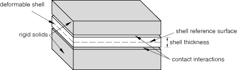

# 36.3.2 在 Abaqus/Standard 中为接触对分配表面属性


**产品：** Abaqus/Standard  Abaqus/CAE  

##### **参考文献**

- ["在 Abaqus/Standard 中定义接触对，" 第 36.3.1 节](pt09ch36s03aus145.md)
- [*CONTACT PAIR](../key/key-link.md#usb-kws-hcontactpair)
- ["定义面-面接触，" Abaqus/CAE 用户指南第 15.13.7 节](../usi/usi-link.md#usi-itn-help-surftosurf)
- ["定义自接触，" Abaqus/CAE 用户指南第 15.13.8 节](../usi/usi-link.md#usi-itn-help-self)

### 概述

本节描述如何修改与接触对定义中的表面关联的属性。

### 考虑壳和膜厚度

除有限滑动、节点-面 formulation 外的所有接触 formulations 默认考虑基于单元表面的初始壳和膜厚度。有限滑动、节点-面 formulation 不会考虑表面厚度。无论与表面节点连接的单元类型如何，基于节点的表面都没有厚度。在接触计算中考虑单元厚度通常是可取的，但如果不需要，可以避免考虑厚度。

| **输入文件用法：** | ``` [*CONTACT PAIR](../key/key-link.md#usb-kws-hcontactpair), NO THICKNESS ``` |
| --- | --- |

| **Abaqus/CAE 用法：** | Interaction 模块： interaction editor: **Sliding formulation: Small sliding** 或 **Finite sliding**，**Discretization method**: **Surface to surface** 或 **Node to surface**，切换 **Exclude shell/membrane element thickness** |
| --- | --- |

#### 示例

考虑壳被两个刚性表面夹在之间的情况，如图 [图 36.3.2-1](pt09ch36s03aus146.md#pinchedshellcontact) 所示。

**图 36.3.2-1** 被两个刚体夹住的壳。



在此示例中，使用小滑动、节点-面 formulation 的接触对在壳的顶表面和顶部刚性表面之间以及壳的底表面和底部刚性表面之间定义。虽然壳表面在壳参考位置定义，但接触相互作用考虑了壳的厚度并从参考表面偏移。使用惩罚约束 enforcement 方法（见 ["接触压力-过盈量关系，" 第 37.1.2 节](pt09ch37s01aus166.md)）来避免过度约束从节点。使用以下输入：

```
[*SURFACE](../key/key-link.md#usb-kws-msurface), NAME=TOP_RIG_SURF
TOP_RIG_ELS,
[*SURFACE](../key/key-link.md#usb-kws-msurface), NAME=SHELL_TOP_SURF
SHELL_ELS,SPOS
[*SURFACE](../key/key-link.md#usb-kws-msurface), NAME=SHELL_BOT_SURF
SHELL_ELS,SNEG
[*SURFACE](../key/key-link.md#usb-kws-msurface), NAME=BOT_RIG_SURF
BOT_RIG_ELS,
[*CONTACT PAIR](../key/key-link.md#usb-kws-hcontactpair), INTERACTION=INTER_AL, SMALL SLIDING
SHELL_TOP_SURF, TOP_RIG_SURF
SHELL_BOT_SURF, BOT_RIG_SURF
[*SURFACE INTERACTION](../key/key-link.md#usb-kws-hsurfaceinteraction), NAME=INTER_AL
[*SURFACE BEHAVIOR](../key/key-link.md#usb-kws-hsurfacebehavior), PENALTY
```

### 指定表面几何校正

使用有限元方法，曲线几何表面自然近似为连接的单元面组。使用面状表面几何而非真实表面几何可能会显著导致接触应力不准确，尤其是在面状和真实表面之间的差异大小相对于接触组件的变形不小时。克服与接触相互作用中面状表面相关的收敛和精度困难的方法在 ["Abaqus/Standard 中的接触 formulations，" 第 38.1.1 节](pt09ch38s01aus177.md) 和 ["在 Abaqus/Standard 中平滑接触表面，" 第 38.1.3 节](pt09ch38s01aus179.md) 中讨论。
