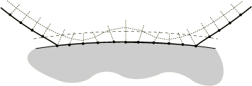
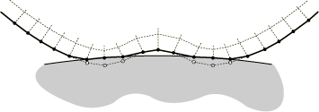
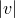

# 36.3.5 在 Abaqus/Standard 接触对中调整初始曲面位置并指定初始间隙


**产品：**Abaqus/Standard  Abaqus/CAE  

##### **参考**

- ["在 Abaqus/Standard 中定义接触对," 第 36.3.1 节](pt09ch36s03aus145.md)
- ["在 Abaqus/Standard 中建模接触干涉配合," 第 36.3.4 节](pt09ch36s03aus148.md)
- ["在 Abaqus/Standard 中定义绑定接触," 第 36.3.7 节](pt09ch36s03aus151.md)
- ["Abaqus/Standard 中的接触公式," 第 38.1.1 节](pt09ch38s01aus177.md)
- [*CLEARANCE](../key/key-link.md#usb-kws-mclearance)
- [*CONTACT PAIR](../key/key-link.md#usb-kws-hcontactpair)
- ["定义面-面接触," Abaqus/CAE 用户指南第 15.13.7 节](../usi/usi-link.md#usi-itn-help-surftosurf)
- ["使用接触和约束检测," Abaqus/CAE 用户指南第 15.16 节](../usi/usi-link.md#usi-itn-detectioneditor)

### 概述

调整 Abaqus/Standard 接触对中曲面的位置：
- 只能在模拟开始时执行；
- 会使 Abaqus/Standard 移动从曲面的节点，使其精确接触主曲面（对于面-面离散化和重叠相互作用定义有一些例外）；
- 不会在模型中产生任何应变；
- 可以消除由于图形预处理器（如 Abaqus/CAE）使用数值舍入而产生的小间隙或穿透，从而防止可能的收敛问题；
- 当两个曲面在分析过程中始终绑定在一起时是必需的；
- 不应用于校正网格设计中的重大错误；
- 不能与对称主-从接触一起使用；以及
- 将考虑壳和膜厚度以及壳偏移（对于除默认有限滑动、点-面接触公式以外的接触公式，这些因素在调整区域和调整中被考虑）（参见 ["Abaqus/Standard 中的接触公式," 第 38.1.1 节](pt09ch38s01aus177.md)）。

除了将两个曲面调整到精确接触外，Abaqus/Standard 还提供了多种方法来精确指定两个曲面之间初始间隙的大小和方向。关于负间隙或干涉配合的响应，请参见 ["在 Abaqus/Standard 中建模接触干涉配合," 第 36.3.4 节](pt09ch36s03aus148.md)。

### 调整接触对中的曲面

您可以让 Abaqus/Standard 通过指定浮点值 *a*（主曲面周围"调整区域"的深度）或节点集标签来调整接触对从曲面的位置。

默认情况下，Abaqus/Standard 不会调整接触对的从曲面节点上的节点；相反，默认情况下，初始过盈量被视为接触对的干涉配合。

#### 面-面接触特有的说明

以下几点适用于具有面-面离散的接触对（参见 ["Abaqus/Standard 中的接触公式," 第 38.1.1 节](pt09ch38s01aus177.md)，了解更多关于面-面离散的讨论）：
- 对从节点位置的无应变调整可能不会使间隙相对于主曲面恰好为零（以从节点测量）。调整是为了在调整区域内每个从节点附近区域内实现曲面的零间隙平均值。
- 无应变调整的幅度限制为典型面片长度的一半。对于超过此限制的初始过盈量，将为相关接触约束存储等于初始过盈量的允许穿透，使得在分析过程中阻止比初始过盈量更深的穿透，但不阻止比初始过盈量更浅的穿透。
- 如果从面（或二维中的线段）的较大部分在调整区域内，则调整区域外的一些从节点也可能发生无应变调整。

本节其余部分的讨论直接适用于点-面接触离散（接触在离散点——从节点处强制执行），但应结合上述要点考虑面-面接触离散。

#### 使用"调整区域"调整曲面

当您指定 *a*（"调整区域"的深度）时，Abaqus/Standard 形成一个从主曲面延伸距离 *a* 的调整区域。Abaqus/Standard 沿着穿过从曲面节点的主曲面法线方向测量距离。调整区域内初始几何模型中的从曲面上的任何节点都被精确移动到主曲面上。这些从节点的移动不会在模型中产生任何应变；它被视为模型定义的变更。[图 36.3.5-1](pt09ch36s03aus149.md#aadjustsurf-initial) 和 [图 36.3.5-2](pt09ch36s03aus149.md#aadjustsurf-after) 显示了调整接触对曲面的示例。如果为 *a* 指定负值，Abaqus/Standard 将发出错误消息。

| **输入文件用法：** | ``` [*CONTACT PAIR](../key/key-link.md#usb-kws-hcontactpair), ADJUST=*a* *slave_surface, master_surface* *...* ``` |
| --- | --- |

| **Abaqus/CAE 用法：** | 相互作用模块：接触相互作用编辑器：**指定调整区域容差**：*a* |
| --- | --- |

**图 36.3.5-1** 初始接触曲面配置，显示"调整区域"。从曲面以粗体显示。


**图 36.3.5-2** 调整后接触曲面的配置。调整区域内的节点和过盈节点已被移动。



##### 使用调整区域调整过盈从节点

当您指定调整区域的深度时，Abaqus/Standard 会移动初始配置中穿透主曲面的任何从节点，使其刚好接触主曲面。为 *a* 指定值 0.0 会导致 Abaqus/Standard 仅调整那些穿透主曲面的从节点。[图 36.3.5-3](pt09ch36s03aus149.md#aadjustsurf-zero) 显示了在 [图 36.3.5-1](pt09ch36s03aus149.md#aadjustsurf-initial) 所示示例中指定 *a*=0.0 的效果。

**图 36.3.5-3** 当 *a*=0 时的接触曲面调整配置。



如果您不让 Abaqus/Standard 调整从曲面的位置，则在模拟开始时过盈的从节点将保持过盈状态，这可能导致收敛问题。

#### 使用节点集标签调整曲面

当只需要调整从节点的子集而指定 *a* 可能导致其他从节点的不适当调整时，您可以指定节点集标签而不是调整区域深度。Abaqus/Standard 仅调整属于该节点集的从曲面上的节点。节点集可以包含根本不在从曲面上的节点：Abaqus/Standard 将忽略它们，仅调整属于从曲面部分的节点集中的节点。

Abaqus/Standard 移动指定节点集中的任何从节点，无论它们距离主曲面多远。节点从其初始配置的调整不会在形成从曲面的单元中产生应变。如果 Abaqus/Standard 调整距离主曲面很远的从节点，单元可能会变得形状不佳，这可能导致收敛困难。

| **输入文件用法：** | ``` [*CONTACT PAIR](../key/key-link.md#usb-kws-hcontactpair), ADJUST=*node_set_label* *slave_surface, master_surface* *...* ``` |
| --- | --- |

| **Abaqus/CAE 用法：** | 相互作用模块：接触相互作用编辑器：**调整节点集中的从节点**：*node_set_label* |
| --- | --- |

##### 使用节点集标签调整过盈从节点

因为 Abaqus/Standard 仅调整指定节点集中的从节点，所以不在指定节点集中的过盈从节点在模拟开始时将保持过盈状态。因此，如果需要调整的严重过盈从节点未包含在节点集中，使用节点集标签可能导致收敛问题。此行为与指定 *a* 时的行为不同，在后者情况下，Abaqus/Standard 会调整从曲面上的所有过盈节点。

#### 重叠接触对的调整

节点调整定义在分析开始时按顺序处理。如果不同的约束或接触定义涉及相同的节点，则某些调整可能导致先前处理的接触或约束定义缺乏一致性。可以通过更改约束和接触定义的处理顺序来避免某些冲突：不同接触或约束定义中的共同节点应首先作为从节点处理，然后作为主节点处理。

| **输入文件用法：** | 要更改约束和接触定义的处理顺序，请在输入文件中更改定义的顺序。约束和接触定义按其出现的顺序处理。 |
| --- | --- |

| **Abaqus/CAE 用法：** | 要更改约束和接触定义的处理顺序，请在模型中更改约束和相互作用的名称。约束和相互作用按其名称的字母顺序处理。 |
| --- | --- |

### 何时调整接触曲面对

在以下情况下，调整接触对中的曲面是必需的或强烈推荐的：
- 当在整个分析过程中将两个曲面绑定在一起时（参见 ["在 Abaqus/Standard 中定义绑定接触," 第 36.3.7 节](pt09ch36s03aus151.md)）。
- 当使用小滑动或无限小滑动接触时（参见 ["Abaqus/Standard 中的接触公式," 第 38.1.1 节](pt09ch38s01aus177.md)）。
- 通过定义允许的接触干涉来指定精确的初始间隙或初始过盈时（参见下面的 ["指定精确初始间隙或过盈的替代方法"](pt09ch36s03aus149.md#usb-cni-aadjustsurfaces-contactinterference)）。

### 为小滑动接触定义精确初始间隙或过盈

当不能从节点坐标足够精确地计算从曲面上节点的初始间隙或过盈值时，您可以为其定义精确值；例如，当初始间隙与坐标值相比非常小时。

基于从节点坐标和主曲面计算的每个从节点处的初始间隙或过盈值会被您指定的值覆盖。此过程在内部执行，不影响从节点的坐标。如果您定义了间隙，Abaqus/Standard 将把两个曲面视为未接触，无论其节点坐标如何。如果您定义了过盈，Abaqus/Standard 将把两个曲面视为干涉配合，并尝试在第一个增量中解决过盈。如果定义的过盈很大，您可能需要指定在多个增量中逐渐减小的允许干涉。有关干涉配合的更多讨论，请参见 ["在 Abaqus/Standard 中建模接触干涉配合," 第 36.3.4 节](pt09ch36s03aus148.md)。

您只能为小滑动接触定义初始间隙或过盈值（["Abaqus/Standard 中的接触公式," 第 38.1.1 节](pt09ch38s01aus177.md)）。有关为有限滑动接触对建模间隙或过盈的技术，请参见下面的 ["指定精确初始间隙或过盈的替代方法"](pt09ch36s03aus149.md#usb-cni-aadjustsurfaces-contactinterference)。

#### 为曲面指定均匀间隙或过盈

通过识别接触对的主曲面和从曲面以及所需的初始间隙（对于间隙为正值；对于过盈为负值），您可以为接触对指定均匀间隙或过盈。不需要其他数据。

| **输入文件用法：** | ``` [*CLEARANCE](../key/key-link.md#usb-kws-mclearance), SLAVE=*surface_name*, MASTER=*surface_name*, VALUE= ``` |
| --- | --- |

| **Abaqus/CAE 用法：** | 相互作用模块：接触相互作用编辑器：**间隙**：**初始间隙：从曲面均匀值：**  |
| --- | --- |

#### 为曲面指定空间变化的间隙或过盈

或者，您可以通过识别接触对的主曲面和从曲面，并提供指定属于从曲面的单个节点或一组节点的间隙的数据表，为接触对指定空间变化的间隙或过盈。未识别的任何从曲面节点将使用 Abaqus/Standard 从曲面初始几何计算出的间隙。

| **输入文件用法：** | ``` [*CLEARANCE](../key/key-link.md#usb-kws-mclearance), SLAVE=*surface_name*, MASTER=*surface_name*, TABULAR *node number or node set label, clearance value* ``` |
| --- | --- |
|  | 根据需要重复数据行。 |

| **Abaqus/CAE 用法：** | 您不能在 Abaqus/CAE 中使用数据表指定初始间隙或过盈值。 |
| --- | --- |

##### 从外部文件读取空间变化的间隙或过盈

Abaqus/Standard 可以从外部文件读取接触对的空间变化间隙或过盈。

| **输入文件用法：** | ``` [*CLEARANCE](../key/key-link.md#usb-kws-mclearance), SLAVE=*surface_name*, MASTER=*surface_name*, TABULAR, INPUT=*file_name* ``` |
| --- | --- |

| **Abaqus/CAE 用法：** | 您不能在 Abaqus/CAE 中使用外部输入文件指定初始间隙或过盈值。 |
| --- | --- |

##### 指定用于接触计算的曲面法线

通常，Abaqus/Standard 根据离散曲面的几何形状计算用于接触计算的曲面法线，使用 ["Abaqus/Standard 中的接触公式," 第 38.1.1 节](pt09ch38s01aus177.md) 中描述的算法。在指定空间变化的间隙或过盈时，您可以通过指定此向量的分量来重定义 Abaqus/Standard 与每个从节点一起使用的接触方向。该向量必须在全局笛卡尔坐标系中定义，它应定义主曲面所需的外法线方向。

| **输入文件用法：** | ``` [*CLEARANCE](../key/key-link.md#usb-kws-mclearance), SLAVE=*surface_name*, MASTER=*surface_name*, TABULAR *node number or node set label, clearance value, first normal component, second normal component, third normal component* ``` |
| --- | --- |
|  | 根据需要重复数据行。 |

| **Abaqus/CAE 用法：** | 您不能在 Abaqus/CAE 中重定义接触方向，螺纹螺栓连接除外（参见下面的 ["自动生成螺纹螺栓连接的接触法线方向"](pt09ch36s03aus149.md#usb-cni-aadjustsurfaces-clearance-bolt)）。 |
| --- | --- |

##### 自动生成螺纹螺栓连接的接触法线方向

或者，对于单螺纹螺栓连接，可以通过指定螺纹几何数据和使用定义螺栓/螺栓孔轴线上矢量的两个点来自动生成每个从节点的接触法线方向。螺栓或螺栓孔都可以是主曲面或从曲面。但是，必须适当选择定义螺栓或螺栓孔轴线的矢量。

例如，当选择螺栓曲面作为主曲面时，矢量应指向从螺栓尖端到螺栓头（如果螺栓处于拉伸状态）或者从螺栓头到尖端（如果螺栓处于压缩状态）的方向。如果选择螺栓曲面作为从曲面且螺栓处于拉伸状态，螺栓轴线应翻转（即从螺栓头到尖端）并指定负的半螺纹角。错误的螺栓轴线方向将不会激活接触相互作用，曲面将不受约束。您应检查螺栓中的应力以确保接触已激活。

| **输入文件用法：** | ``` [*CLEARANCE](../key/key-link.md#usb-kws-mclearance), SLAVE=*surface_name*, MASTER=*surface_name*, TABULAR, BOLT *half-thread angle, pitch, major bolt diameter, mean bolt diameter* *node number or node set label, clearance value, coordinates of points a and b on the axis of the bolt/bolt hole* ``` |
| --- | --- |
|  | 根据需要重复第二数据行。 |

| **Abaqus/CAE 用法：** | 相互作用模块：接触相互作用编辑器：**间隙**：**初始间隙：**为单螺纹螺栓计算**或**为单螺纹螺栓指定：** *clearance value*, **从曲面上的间隙区域：编辑区域**：选择区域，**螺栓方向向量：编辑**：选择轴线，**半螺纹角：** *half-thread angle*, **螺距：** *pitch*, **螺栓直径：主要：** *major bolt diameter* 或**平均：** *mean bolt diameter* |
| --- | --- |

#### 可视化精确初始间隙或过盈

当指定精确初始间隙或过盈时，Abaqus/Standard 不会调整从曲面的坐标。因此，指定的间隙或过盈在 Abaqus/CAE 中的模型中不可见。因此，根据曲面的初始几何形状和间隙或过盈的大小，曲面在 Abaqus/CAE 中可能看起来是开放的或封闭的，而实际上它们只是刚刚接触。然而，可以通过绘制变量 COPEN 的等值线图在 Abaqus/CAE 中显示实际间隙。

### 指定精确初始间隙或过盈的替代方法

Abaqus/Standard 提供了一种定义精确初始间隙或过盈的替代方法，适用于小滑动和有限滑动接触对。在此方法中，您为接触对指定调整区域深度（如上所述在 ["调整接触对中的曲面"](pt09ch36s03aus149.md#usb-cni-aadjustsurfaces-adjust)"中），以在分析开始时将形成接触对的曲面移动到恰好接触的位置。然后，在模拟的第一步中，您为接触对指定允许的接触干涉（参见 ["在 Abaqus/Standard 中建模接触干涉配合," 第 36.3.4 节](pt09ch36s03aus148.md)）。接触干涉定义必须引用振幅曲线；振幅曲线的形式取决于定义的是间隙还是过盈，如下所述。间隙或过盈在曲面上是均匀的。

| **输入文件用法：** | 使用以下所有选项： |
| --- | --- |
|  | ``` [*CONTACT PAIR](../key/key-link.md#usb-kws-hcontactpair), ADJUST=*a* *slave_surface, master_surface* [*AMPLITUDE](../key/key-link.md#usb-kws-mamplitude), NAME=*amplitude_name* [*CONTACT INTERFERENCE](../key/key-link.md#usb-kws-hcontactinterfer), AMPLITUDE=*amplitude_name* *slave_surface, master_surface*,  ``` |

| **Abaqus/CAE 用法：** | 相互作用模块：接触相互作用编辑器：**指定调整区域容差**：*a*, **干涉配合**：切换**均匀允许干涉**，**振幅**：*amplitude_name*, **步骤开始时的幅值**：  |
| --- | --- |

#### 通过定义允许的接触干涉来指定精确间隙

要通过定义允许的接触干涉来指定精确间隙，振幅曲线应在步骤持续时间内具有恒定幅值。应将正值指定为允许干涉 。在 Abaqus/CAE 中查看时，这些曲面在接触时看起来会相互穿透。曲面以使它们恰好接触的坐标开始模拟，但指定的干涉  使它们表现得好像它们之间有间隙。

#### 通过定义允许的接触干涉来指定精确过盈

要通过定义允许的接触干涉来指定精确过盈，振幅曲线应在步骤持续时间内从零逐渐增加到一，以允许 Abaqus/Standard 逐渐解决过盈。应将负值指定为允许干涉 。在 Abaqus/CAE 中查看时，曲面以使它们恰好接触的坐标开始模拟，但指定的干涉  使它们表现得好像它们是过盈的。当 Abaqus/Standard 解决过盈时，这些曲面将看起来彼此分离。当两个曲面之间的间隙等于距离  时，曲面将表现得好像它们恰好接触。


