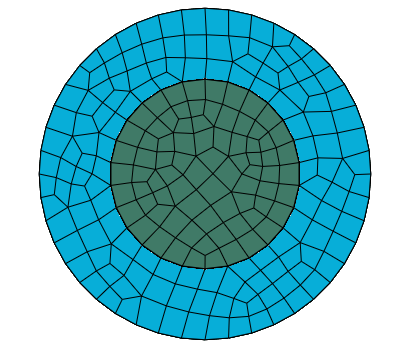
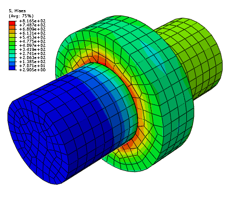

# 36.4.2 在 Abaqus/Explicit 中为通用接触分配表面属性


**产品：** Abaqus/Explicit  Abaqus/CAE  

##### **参考文献**

- ["在 Abaqus/Explicit 中定义通用接触相互作用，" 第 36.4.1 节](pt09ch36s04aus155.md)
- [*CONTACT](../key/key-link.md#usb-kws-hcontact)
- [*SURFACE PROPERTY ASSIGNMENT](../key/key-link.md#usb-kws-hsurfpropassign)
- ["为通用接触指定表面属性分配，" Abaqus/CAE 用户指南第 15.13.5 节](../usi/usi-link.md#usi-itn-help-general-surfprop)

### 概述

表面属性分配：
- 可用于更改基于结构单元的表面区域的接触厚度，或为基于实体单元的表面区域添加接触厚度；
- 可用于为基于壳、膜、刚体和表面单元的表面区域指定表面偏移；
- 可用于指定应包含在通用接触域中的模型边缘；
- 可用于为表面区域指定几何校正；
- 可选择性地应用于通用接触域内的特定区域；以及
- 不能应用于解析刚体表面。

### 分配表面属性

您可以为参与通用接触相互作用的表面分配非默认表面属性。这些属性仅在表面参与通用接触相互作用时才被考虑；当表面参与其他相互作用（如接触对）时，不考虑这些属性。通用接触算法不考虑作为表面定义一部分指定的表面属性。

表面属性分配在通用接触相互作用活跃的所有分析步骤中传播。

用于指定具有非默认表面属性的区域的表面名称不必与用于指定通用接触域的表面名称对应。在许多情况下，接触相互作用被定义为一个大域，而非默认表面属性被分配给该域的子集。任何落在通用接触域之外的区域表面属性分配将被忽略。如果指定的区域重叠，最后的分配优先。

| **输入文件用法：** | ``` [*SURFACE PROPERTY ASSIGNMENT](../key/key-link.md#usb-kws-hsurfpropassign), PROPERTY ``` |
| --- | --- |
|  | 此选项必须与 [*CONTACT](../key/key-link.md#usb-kws-hcontact) 选项一起使用。对于下面讨论的 PROPERTY 参数的每个值，它每个步骤最多可出现一次；数据行可以根据需要重复多次以将表面属性分配给不同区域。 |

| **Abaqus/CAE 用法：** | Interaction 模块： **Create Interaction**: **General contact (Explicit)**: **Surface Properties** |
| --- | --- |

### 表面厚度

节点表面厚度的默认计算（下面详细描述）适用于大多数分析；一个例外是板材成型分析，其中板材变薄显著影响接触。这种情况可以通过指定应使用递减的父单元厚度来建模。作为第三种选择，您可以指定表面厚度的值。可以为实体单元表面分配非零厚度，例如，用于模拟有限厚度表面涂层的影响。["基于单元的表面定义，" 第 2.3.2 节](pt01ch02s03aus17.md) 包含表面厚度空间变化的信息。

指定原始或递减厚度会导致基于节点的表面的零厚度；您可以为与通用接触算法一起使用的基于节点的表面指定非零厚度（接触对算法不会考虑此类表面的非零厚度）。

通用接触算法要求接触厚度不超过表面面片边缘长度或对角线长度的某个分数。此分数通常根据单元几何形状在 20% 到 60% 之间变化。通用接触算法将在必要时自动缩减接触厚度，而不影响底层单元的单元计算中使用的厚度。如果执行了此类缩减，状态（`.sta`）文件中会提供诊断信息。

要绕过此厚度限制，可以使用表面单元对接触表面进行建模（见 ["表面单元，" 第 32.7.1 节](pt06ch32s07alm52.md)）。表面单元必须使用基于表面的绑定约束连接到底层单元（见 ["网格绑定约束，" 第 35.3.1 节](pt08ch35s03aus132.md)），并且必须将物理上合理的质量与表面单元相关联。这需要将很大一部分质量从底层单元转移到表面单元，同时不会显著改变体质量属性。或者，可以使用接触控制设置来限制厚度缩减检查（见 ["在 Abaqus/Explicit 中通用接触的接触控制，" 第 36.4.5 节](pt09ch36s04aus159.md)。

使用通用接触算法可以避免接触对算法在壳周边发生的"牛鼻"效应（见 ["在 Abaqus/Explicit 中为接触对分配表面属性，" 第 36.5.2 节](pt09ch36s05aus161.md)）。壳单元边缘、节点和面片仅在法线方向反映壳厚度，不会延伸超过周边。接触控制设置可用于关闭牛鼻预防检查（见 ["在 Abaqus/Explicit 中通用接触的接触控制，" 第 36.4.5 节](pt09ch36s04aus159.md)。

#### 使用原始父单元厚度

默认情况下，基于壳、膜或刚体单元的表面的节点厚度等于周围单元的最小原始厚度（见 [图 36.4.2-1](pt09ch36s04aus156.md#agendefsurf-cont-thick1) 和 [表 36.4.2-1](pt09ch36s04aus156.md#table-agendefsurf-thick1)）。

**图 36.4.2-1** 表面厚度在面片边界上的连续变化。


**表 36.4.2-1** 对应于 [图 36.4.2-1](pt09ch36s04aus156.md#agendefsurf-cont-thick1) 的厚度。
| 节点 | 单元 | 指定的单元厚度 | 节点表面厚度（相邻单元厚度的最小值） |
| --- | --- | --- | --- |
| 1 |  |  | 0.5 |
|  | a | 0.5 |  |
| 2 |  |  | 0.5 |
|  | b | 0.5 |  |
| 3 |  |  | 0.5 |
|  | c | 0.9 |  |
| 4 |  |  | 0.9 |
|  | d | 0.9 |  |
| 5 |  |  | 0.9 |

面片内的表面厚度从节点值插值；插值表面厚度永远不会超过指定的单元或节点厚度，这可能对于初始过盈量很重要。基于实体单元的表面的区域默认节点表面厚度为零。如果为底层单元定义了空间变化的节点厚度（见 ["节点厚度，" 第 2.1.3 节](pt01ch02s01aus07.md)），则节点表面厚度可能与指定的节点厚度不完全对应（见 [图 36.4.2-2](pt09ch36s04aus156.md#agendefsurf-cont-thick2) 和 [表 36.4.2-2](pt09ch36s04aus156.md#table-agendefsurf-thick2) 中的节点 4）。

**图 36.4.2-2** 节点表面厚度与指定节点厚度之间的小差异。


**表 36.4.2-2** 对应于 [图 36.4.2-2](pt09ch36s04aus156.md#agendefsurf-cont-thick2) 的厚度。
| 节点 | 单元 | 指定的节点厚度 | 单元厚度（指定节点厚度的平均值） | 节点表面厚度（相邻单元厚度的最小值） |
| --- | --- | --- | --- | --- |
| 1 |  | 0.5 |  | 0.5 |
|  | a |  | 0.5 |  |
| 2 |  | 0.5 |  | 0.5 |
|  | b |  | 0.5 |  |
| 3 |  | 0.5 |  | 0.5 |
|  | c |  | 0.7 |  |
| 4 |  | 0.9 |  | 0.7 |
|  | d |  | 0.9 |  |
| 5 |  | 0.9 |  | 0.9 |
|  | e |  | 0.9 |  |
| 6 |  | 0.9 |  | 0.9 |

节点表面厚度分布将比指定的节点厚度分布更分散（因为指定的节点厚度被平均以计算单元厚度，而节点表面厚度是周围单元厚度的最小值）。

| **输入文件用法：** | ``` [*SURFACE PROPERTY ASSIGNMENT](../key/key-link.md#usb-kws-hsurfpropassign), PROPERTY=THICKNESS *surface*, ORIGINAL (default) ``` |
| --- | --- |
|  | 如果表面名称被省略，则假定默认的全包容通用接触域表面。 |

| **Abaqus/CAE 用法：** | Interaction 模块： **Create Interaction**: **General contact (Explicit)**: **Surface Properties**: **Shell/Membrane thickness assignments: Edit**：选择表面，点击箭头将表面转移到厚度分配列表，并在 **Thickness** 列中输入 ORIGINAL。 |
| --- | --- |

#### 使用递减父单元厚度

如果您指定应使用递减父单元厚度，则仅反映父单元厚度的减小；如果父单元厚度在分析过程中实际增加，接触厚度将保持不变。

| **输入文件用法：** | ``` [*SURFACE PROPERTY ASSIGNMENT](../key/key-link.md#usb-kws-hsurfpropassign), PROPERTY=THICKNESS *surface*, THINNING ``` |
| --- | --- |
|  | 如果表面名称被省略，则假定默认的全包容通用接触域表面。 |

| **Abaqus/CAE 用法：** | Interaction 模块： **Create Interaction**: **General contact (Explicit)**: **Surface Properties**: **Shell/Membrane thickness assignments: Edit**：选择表面，点击箭头将表面转移到厚度分配列表，并在 **Thickness** 列中输入 THINNING。 |
| --- | --- |

#### 指定表面厚度的值

您可以直接指定表面厚度值。

| **输入文件用法：** | ``` [*SURFACE PROPERTY ASSIGNMENT](../key/key-link.md#usb-kws-hsurfpropassign), PROPERTY=THICKNESS *surface*, *value* ``` |
| --- | --- |
|  | 如果表面名称被省略，则假定默认的全包容通用接触域表面。 |

| **Abaqus/CAE 用法：** | Interaction 模块： **Create Interaction**: **General contact (Explicit)**: **Surface Properties**: **Shell/Membrane thickness assignments: Edit**：选择表面，点击箭头将表面转移到厚度分配列表，并在 **Thickness** 列中输入表面厚度大小的值。 |
| --- | --- |

#### 对表面厚度应用比例因子

您可以对任何表面厚度值应用比例因子。例如，如果您指定 `surf1` 应使用递减父单元厚度并应用 0.5 的比例因子，则当 `surf1` 参与通用接触相互作用时，将使用递减父单元厚度的一半值（通用接触域中所有其他表面将使用默认原始父单元厚度）。以这种方式缩放表面厚度可以在某些情况下避免初始过盈量。Abaqus/Explicit 将自动调整表面位置以解决初始过盈量（见 ["在 Abaqus/Explicit 中控制通用接触的初始接触状态，" 第 36.4.4 节](pt09ch36s04aus158.md)）。但是，如果节点位置调整是不可取的（例如，如果它们会在原本平坦的零件中引入缺陷，导致不切实际的屈曲模式），您可能希望减小表面厚度并完全避免过盈量。

| **输入文件用法：** | ``` [*SURFACE PROPERTY ASSIGNMENT](../key/key-link.md#usb-kws-hsurfpropassign), PROPERTY=THICKNESS *surface*, *value or label*, *scale_factor* ``` |
| --- | --- |
|  | 如果表面名称被省略，则假定默认的全包容通用接触域表面。 |

| **Abaqus/CAE 用法：** | Interaction 模块： **Create Interaction**: **General contact (Explicit)**: **Surface Properties**: **Shell/Membrane thickness assignments: Edit**：选择表面，点击箭头将表面转移到厚度分配列表，并输入 **Scale Factor**。 |
| --- | --- |

### 表面偏移

表面偏移是薄体中面与其参考平面（由节点坐标和单元连通性定义）之间的距离。它是通过将偏移分数（指定为表面厚度的分数）乘以表面厚度和单元面片法向来计算的。这定义了中面的位置，从而定义了体相对于参考表面的位置；参考表面上节点的坐标未被修改。表面偏移只能为在壳和类似单元上定义的表面指定（即膜、刚体和表面单元）。为其他单元（例如实体或梁单元）指定的表面偏移将被忽略。默认情况下，单元截面定义中指定的表面偏移将在通用接触算法中使用。

每个节点的表面偏移是该节点所连接面的最大和最小偏移的平均值。面片内点的偏移从节点值插值。[图 36.4.2-3](pt09ch36s04aus156.md#surface-offsets) 显示了针对各种表面偏移组合将接触表面相对于参考表面定位的一些示例。通用接触算法中使用的表面偏移被限制在厚度的 0.5 和 0.5 之间。

您可以将表面偏移指定为表面厚度的分数。表面偏移分数可以设置为等于用于表面父单元的偏移分数或指定的值。 为通用接触指定的表面偏移不会改变单元积分。

**图 36.4.2-3** 为通用接触指定表面偏移。


| **输入文件用法：** | 使用以下选项使用来自表面父单元的表面偏移分数（默认）： |
| --- | --- |
|  | ``` [*SURFACE PROPERTY ASSIGNMENT](../key/key-link.md#usb-kws-hsurfpropassign), PROPERTY=OFFSET FRACTION *surface*, ORIGINAL ``` 使用以下选项指定表面偏移分数的值： ``` [*SURFACE PROPERTY ASSIGNMENT](../key/key-link.md#usb-kws-hsurfpropassign), PROPERTY=OFFSET FRACTION *surface*, *offset* ``` 偏移可以指定为值或标签（SPOS 或 SNEG）。指定 SPOS 等效于指定 0.5 的值；指定 SNEG 等效于指定 0.5 的值。 |

| **Abaqus/CAE 用法：** | Interaction 模块： **Create Interaction**: **General contact (Explicit)**: **Surface Properties**: **Shell/Membrane offset assignments: Edit**：选择表面，点击箭头将表面转移到偏移分配列表。在 **Offset Fraction** 列中，输入 ORIGINAL 以使用来自表面父单元的表面偏移分数，输入 SPOS 以使用 0.5 的表面偏移分数，输入 SNEG 以使用 0.5 的表面偏移分数，或输入表面偏移分数的值。 |
| --- | --- |

### 特征边缘

模型的几何边缘在梁和桁架单元以及实体和结构单元面的边缘（周边和其他）上定义。默认情况下，Abaqus/Explicit 通用接触算法中的边-边接触考虑周边边缘以及梁和桁架单元的"接触边缘"。

您可以通过指定特征边缘标准来控制应在通用接触域中激活哪些几何边缘。默认情况下，仅激活周边边缘。特征边缘标准对梁和桁架单元的"边缘"没有影响——它们通过包含在接触域中被激活。

#### 特征角

特征角是两个连接到边的面片的法线之间形成的角度。面片之间的角度基于初始配置。在面片凹会合处将产生负角度；因此，这些边永远不会包含在接触域中。[图 36.2.2-1](pt09ch36s04aus156.md#feature-angles) 显示了一些如何为不同边缘计算特征角的示例。

**图 36.4.2-4** 计算特征角。


边缘 A 的特征角是 90（ 和  之间的角度）；边缘 B 的特征角是 25（ 和  之间的角度）。边缘 C 与三个面片形成 T 型交叉（如图 36.2.2-2](pt09ch36s04aus156.md#t-intersection-angles) 中的二维所示）；其特征角为 0、90 和 90。

**图 36.4.2-5** T 型交叉的特征角（示例，边缘 C in [图 36.2.2-1](pt09ch36s04aus156.md#feature-angles)）。


周边边缘（例如，[图 36.2.2-1](pt09ch36s04aus156.md#feature-angles) 中的边缘 D）可以被视为特征边缘的一种特殊类型，其特征角为 180。

在确定是否应在通用接触域中激活几何特征边缘时，考虑特征角的符号。例如，如果指定了 20 的截止特征角，则边缘 A 将作为特征边缘激活在接触模型中（90 > 20）但边缘 B 和 C 不会被激活：25 < 20 和 0（边缘 C 的最大特征角）< 20。

[图 36.2.2-3](pt09ch36s04aus156.md#feature-edges) 进一步说明了如何使用特征角来确定应在通用接触域中激活哪些几何特征边缘。

**图 36.4.2-6** 对于截止特征角为 20 的情况，在通用接触域中激活的特征边缘。


图表右侧列出了模型中各个边缘的特征角值。连接到超过两个面片的边缘以及连接到两个壳面片的边缘具有多个对应的特征角。边缘上最大的特征角与指定的截止特征角进行比较。例如，如果指定了 20 的截止特征角，则边缘 A、D 和 E 将被视为特征边缘，而边缘 B、C 和 F 将被忽略用于边-边接触。

#### 指定仅应激活周边边缘

默认情况下，仅周边边缘包含在通用接触域中。周边缘出现在壳单元的"物理"周边上，以及当一组暴露的面片在体上被包含在通用接触域中时出现的"人工"边缘上。当结构单元与连续单元共享节点时，结构单元上的周边边缘将不会被激活，因为将它们指定为周边的标准不再满足。

| **输入文件用法：** | ``` [*SURFACE PROPERTY ASSIGNMENT](../key/key-link.md#usb-kws-hsurfpropassign), PROPERTY=FEATURE EDGE CRITERIA *surface*, PERIMETER EDGES (default) ``` |
| --- | --- |
|  | 如果表面名称被省略，则假定默认的全包容通用接触域表面。 |

| **Abaqus/CAE 用法：** | Interaction 模块： **Create Interaction**: **General contact (Explicit)**: **Surface Properties**: **Feature edge criteria assignments: Edit**：选择表面，点击箭头将表面转移到特征分配列表，并在 **Feature Edge Criteria** 列中输入 PERIMETER。 |
| --- | --- |

#### 指定要激活的特定特征边缘

您可以选择表面上特定的特征边缘在域中激活。基于单元、表面和刚体单元的边缘可以激活在接触中。使用包含单元标签和边缘标识符列表的表面来指定要激活的边缘（见 ["基于单元的表面定义"中的"定义基于边缘的表面，" 第 2.3.2 节](pt01ch02s03aus17.md)）。

| **输入文件用法：** | ``` [*SURFACE PROPERTY ASSIGNMENT](../key/key-link.md#usb-kws-hsurfpropassign), PROPERTY=FEATURE EDGE CRITERIA *surface*, PICKED EDGES ``` |
| --- | --- |

| **Abaqus/CAE 用法：** | Interaction 模块： **Create Interaction**: **General contact (Explicit)**: **Surface Properties**: **Feature edge criteria assignments: Edit**：选择表面，点击箭头将表面转移到特征分配列表，并在 **Feature Edge Criteria** 列中输入 PICKED。 |
| --- | --- |

#### 指定应激活所有特征边缘

您可以选择激活给定表面上通用接触域中的所有边缘。这将激活给定表面中每个面的所有边缘。

| **输入文件用法：** | ``` [*SURFACE PROPERTY ASSIGNMENT](../key/key-link.md#usb-kws-hsurfpropassign), PROPERTY=FEATURE EDGE CRITERIA *surface*, ALL EDGES ``` |
| --- | --- |

| **Abaqus/CAE 用法：** | Interaction 模块： **Create Interaction**: **General contact (Explicit)**: **Surface Properties**: **Feature edge criteria assignments: Edit**：选择表面，点击箭头将表面转移到特征分配列表，并在 **Feature Edge Criteria** 列中输入 ALL。 |
| --- | --- |

#### 指定应停用所有特征边缘

您可以选择在通用接触域中停用所有特征边缘（包括周边边缘）。此选项不停用与梁和桁架单元关联的"接触边缘"。

| **输入文件用法：** | ``` [*SURFACE PROPERTY ASSIGNMENT](../key/key-link.md#usb-kws-hsurfpropassign), PROPERTY=FEATURE EDGE CRITERIA *surface*, NO FEATURE EDGES ``` |
| --- | --- |
|  | 如果表面名称被省略，则假定默认的全包容通用接触域表面。 |

| **Abaqus/CAE 用法：** | Interaction 模块： **Create Interaction**: **General contact (Explicit)**: **Surface Properties**: **Feature edge criteria assignments: Edit**：选择表面，点击箭头将表面转移到特征分配列表，并在 **Feature Edge Criteria** 列中输入 NONE。 |
| --- | --- |

#### 指定截止特征角

如果您将截止特征角指定为特征边缘标准，则在通用接触域中激活周边缘和特征角度大于或等于指定角度的几何边缘。如前所述，您可以根据需要激活其他特征边缘。

| **输入文件用法：** | ``` [*SURFACE PROPERTY ASSIGNMENT](../key/key-link.md#usb-kws-hsurfpropassign), PROPERTY=FEATURE EDGE CRITERIA *surface*, *feature_angle_value* ``` |
| --- | --- |
|  | 如果表面名称被省略，则假定默认的全包容通用接触域表面。 |

| **Abaqus/CAE 用法：** | Interaction 模块： **Create Interaction**: **General contact (Explicit)**: **Surface Properties**: **Feature edge criteria assignments: Edit**：选择表面，点击箭头将表面转移到特征分配列表，并在 **Feature Edge Criteria** 列中输入截止特征角的值（度）。 |
| --- | --- |

#### 示例：为不同区域分配不同的特征边缘标准

您可以为通用接触域的不同区域分配不同的特征边缘标准。例如，下表中显示的输入可用于指定 `surf1` 的特征边缘都不考虑用于边-边接触，仅 `surf2` 的周边边缘，以及 `surf3` 上特征角大于 30 的周边边缘和特征边缘用于边-边接触：

| 输入文件语法 | Abaqus/CAE 语法 |
| --- | --- |
| `surf1, NO FEATURE EDGES` | Surface: `surf1`, Feature Edge Criteria: NONE |
| `surf2, PERIMETER EDGES` | Surface: `surf2`, Feature Edge Criteria: PERIMETER |
| `surf3, 30` | Surface: `surf3`, Feature Edge Criteria: 30 |

#### 主要和次要特征边缘

为了在某些情况下降低计算成本，可能需要在表面上确定有限数量的特征边缘（可能在表面法线有急剧变化的区域）作为"主要"特征边缘。可以使用更宽松的标准来将表面上某些其他边缘标记为"次要"特征边缘。如果除了主要特征边缘外还指定了次要特征边缘，Abaqus/Explicit 仅在主要特征边缘之间以及主要特征边缘和次要特征边缘之间强制执行边-边接触。不会在次要特征边缘之间强制执行边-边接触。这确保了在模型中有"真实"边缘的位置避免相互穿透，而无需在表面法线梯度仅适中的位置激活主要特征边缘。明智地选择主要和次要特征边缘的选择标准可以显著节省计算成本。

可以通过为表面指定次要特征边缘标准来选择次要特征边缘，除了用于选择该表面的主要特征边缘的标准之外。如果省略了次要特征边缘标准，则仅为该表面激活主要特征边缘。次要特征边缘的允许标准是：
- 未被选为主要特征边缘的所有剩余边缘；
- 未被选为主要特征边缘的所有选定边缘；
- 未被选为主要特征边缘的所有周边边缘；和
- 未被选为主要特征边缘的、特征角大于指定截止角度值的所有边缘。

次要特征边缘标准的允许值允许主要特征边缘和次要特征边缘标准的可能组合，如 [表 36.4.2-3](pt09ch36s04aus156.md#feat-edge-crit) 所示。

**表 36.4.2-3** 主要特征边缘和次要特征边缘标准的有效组合。
| 主要特征边缘标准 | 次要特征边缘标准 |
| --- | --- |
| 无特征边缘 | 所有剩余边缘、选定边缘、周边边缘、截止角度 |
| 所有边缘 | 将忽略为次要特征边缘指定的任何标准 |
| 选定边缘 | 所有剩余边缘、周边边缘、截止角度 |
| 周边边缘 | 所有剩余边缘、选定边缘、截止角度 |
| 截止角度 | 所有剩余边缘、选定边缘、周边边缘、截止角度 |

##### 指定所有剩余边缘作为次要特征边缘

您可以指定属于该表面但未被选为主要特征边缘的所有边缘成为次要特征边缘。

| **输入文件用法：** | ``` [*SURFACE PROPERTY ASSIGNMENT](../key/key-link.md#usb-kws-hsurfpropassign), PROPERTY=FEATURE EDGE CRITERIA *surface*, *primary feature edge criterion*, ALL REMAINING EDGES ``` |
| --- | --- |
|  | 如果表面名称被省略，则假定默认的全包容通用接触域表面。 |

| **Abaqus/CAE 用法：** | Abaqus/CAE 中不支持次要特征边缘。 |
| --- | --- |

##### 指定选定边缘作为次要特征边缘

您可以指定尚未被选为主要特征边缘的表面的所有选定边缘成为次要特征边缘。

| **输入文件用法：** | ``` [*SURFACE PROPERTY ASSIGNMENT](../key/key-link.md#usb-kws-hsurfpropassign), PROPERTY=FEATURE EDGE CRITERIA *surface*, *primary feature edge criterion*, PICKED EDGES ``` |
| --- | --- |
|  | 如果表面名称被省略，则假定默认的全包容通用接触域表面。 |

| **Abaqus/CAE 用法：** | Abaqus/CAE 中不支持次要特征边缘。 |
| --- | --- |

##### 指定周边边缘作为次要特征边缘

您可以指定尚未被选为主要特征边缘的表面的所有周边边缘成为次要特征边缘。

| **输入文件用法：** | ``` [*SURFACE PROPERTY ASSIGNMENT](../key/key-link.md#usb-kws-hsurfpropassign), PROPERTY=FEATURE EDGE CRITERIA *surface*, *primary feature edge criterion*, PERIMETER EDGES ``` |
| --- | --- |
|  | 如果表面名称被省略，则假定默认的全包容通用接触域表面。 |

| **Abaqus/CAE 用法：** | Abaqus/CAE 中不支持次要特征边缘。 |
| --- | --- |

##### 为次要特征边缘指定截止特征角

您可以指定表面上具有大于指定值的特征角且未被选为主要特征边缘的边缘成为次要特征边缘。如果为主要特征边缘也指定了角度值，则为次要特征边缘指定的角度值必须小于为主要边缘指定的值。

| **输入文件用法：** | ``` [*SURFACE PROPERTY ASSIGNMENT](../key/key-link.md#usb-kws-hsurfpropassign), PROPERTY=FEATURE EDGE CRITERIA *surface*, *primary feature edge criterion*, *feature_angle_value* ``` |
| --- | --- |
|  | 如果表面名称被省略，则假定默认的全包容通用接触域表面。 |

| **Abaqus/CAE 用法：** | Abaqus/CAE 中不支持次要特征边缘。 |
| --- | --- |

##### 指定边缘仅作为次要特征边缘激活

对于特定表面，您可能不想激活任何主要特征边缘；相反，您可能希望表面上所有或某些边缘作为次要特征边缘激活（以在与模型中另一个表面上的主要特征边缘之间强制执行接触）。在这种情况下，您可以指定不应激活任何特征边缘作为该表面的主要特征边缘，同时使用任何所需的标准作为次要特征边缘。

| **输入文件用法：** | ``` [*SURFACE PROPERTY ASSIGNMENT](../key/key-link.md#usb-kws-hsurfpropassign), PROPERTY=FEATURE EDGE CRITERIA *surface*, NO FEATURE EDGES, *secondary feature edge criterion* ``` |
| --- | --- |
|  | 如果表面名称被省略，则假定默认的全包容通用接触域表面。 |

| **Abaqus/CAE 用法：** | Abaqus/CAE 中不支持次要特征边缘。 |
| --- | --- |

### 表面几何校正

默认情况下，接触计算基于通用接触域中有限元表面的未平滑化、面片化表示。真实表面几何与面片化表面几何之间的差异可能导致解决方案中显著的噪声。可选的接触平滑技术在接触计算中模拟更现实化的曲面表示。这些技术允许具有不连续表面法线的离散化表面在分析过程中更接近地近似平滑表面的行为。表面校正对结果的改进包括更准确的接触应力和在接触表面相对滑动时更少的解决方案噪声。

可以为通用接触域中的表面使用表面属性分配指定接触平滑。单个表面属性分配指定要平滑的所有表面，以及每个表面的适当几何校正方法。可以采用三种几何校正方法：
- 圆周平滑方法适用于近似旋转曲面一部分的表面。
- 球面平滑方法适用于近似球面一部分的表面。
- 环形平滑方法适用于近似圆环面一部分的表面（即，绕轴旋转的圆弧）。

对于每个表面，您必须指定适当的几何校正方法以及近似旋转轴（对于圆周或环形平滑）或近似球面中心（对于球面平滑）。对于环形平滑，您还必须指定圆弧中心到旋转轴的距离，连接点 (Xa, Ya, Za) 和圆弧中心的线应垂直于旋转轴。

| **输入文件用法：** | 使用以下选项应用几何校正： |
| --- | --- |
|  | ``` [*SURFACE PROPERTY ASSIGNMENT](../key/key-link.md#usb-kws-hsurfpropassign), PROPERTY=GEOMETRIC CORRECTION *data lines to define smoothing regions (see below)* Use the following data line to apply circumferential smoothing to a surface with an axis of symmetry passing through points (Xa, Ya, Za) and (Xb, Yb, Zb): *surface*, CIRCUMFERENTIAL, *Xa*, *Ya*, *Za*, *Xb*, *Yb*, *Zb* Use the following data line to apply spherical smoothing to a surface with a spherical center at point (Xa, Ya, Za): *surface*, SPHERICAL, *Xa*, *Ya*, *Za* Use the following data line to apply toroidal smoothing to a surface with an axis of symmetry passing through points (Xa, Ya, Za) and (Xb, Yb, Zb) with the center of the revolved circular arc at a distance *R* from the axis of symmetry: *surface*, TOROIDAL, *Xa*, *Ya*, *Za*, *Xb*, *Yb*, *Zb*, *R* Repeat the data lines as many times as necessary to define the appropriate geometry corrections for all surfaces in the contact domain. ``` |

| **Abaqus/CAE 用法：** | 接触表面平滑只能应用于 Abaqus/CAE 中的原生几何模型。Abaqus/CAE 可以自动检测通用接触域中可以平滑的所有圆周、球面和环形表面并应用适当的平滑。 |
| --- | --- |
|  | 使用以下选项启用模型的自动表面平滑：Interaction 模块： **Create Interaction**: **General contact (Explicit)**: **Surface Properties**: **Surface smoothing assignments: Edit**：切换 **Automatically assign smoothing for geometric faces** 使用以下选项手动将平滑应用于表面：Interaction 模块： **Create Interaction**: **General contact (Explicit)**: **Surface Properties**: **Surface smoothing assignments: Edit**：选择表面，点击箭头将表面转移到平滑分配列表。在 **Smoothing Option** 列中，选择 **REVOLUTION** 以应用圆周平滑，选择 **SPHERICAL** 以应用球面平滑，选择 **TOROIDAL** 以应用环形平滑，或选择 **NONE** 以防止表面平滑。 |

#### 几何校正的考虑

接触平滑技术假设表面节点的初始位置位于真实初始表面几何上，C3D10M 单元的边缘中节点除外。即使 C3D10M 单元的边缘中节点不在真实初始几何上，此平滑技术仍然有效（使用 Abaqus/CAE 进行网格划分的模型始终将边缘中节点放置在真实初始几何上，但其他网格划分预处理器可能不是这种情况）。

接触平滑的效果往往对于涉及小变形的分析最显著，并且平滑技术在涉及表面之间大相对运动的情况中效果很好。对于大变形的分析，此平滑技术通常对解决方案的影响微不足道。然而，在某些情况下——尤其是底层单元可能失败的情况——平滑可能在变形后降低解决方案准确性。

#### 几何校正的效果

接触表面平滑的影响可以通过具有小间隙的同心圆柱体之间接触的简单模型来演示。使用如图 [图 36.4.2-7](pt09ch36s04aus156.md#usb-cni-smooth-cyl) 所示的匹配网格，没有初始过盈量；因此，没有初始无应变初始位移调整。然而，如果内圆柱旋转，圆柱会产生应力（见 [图 36.4.2-8](pt09ch36s04aus156.md#usb-cni-smooth-cylstress)），因为检测到接触是由于主表面的线性面片化表示。当圆周平滑技术应用于两个圆柱体的接触表面时，这种行为得到改善。

**图 36.4.2-7** 具有匹配网格的同心圆柱体。



**图 36.4.2-8** 圆柱体旋转时的应力。


