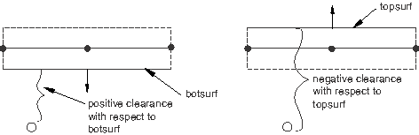
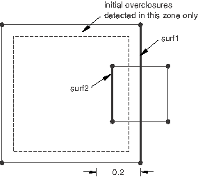
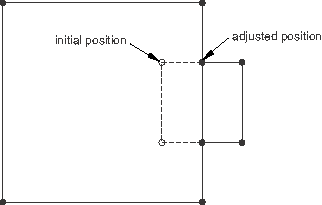
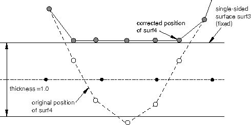
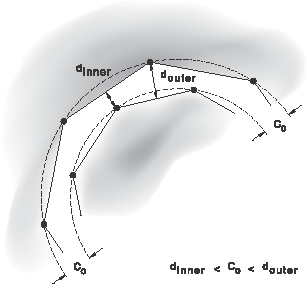

# 36.4.4 在 Abaqus/Explicit 中控制通用接触的初始接触状态


**产品：** Abaqus/Explicit  

##### **参考文献**

- ["在 Abaqus/Explicit 中定义通用接触相互作用，" 第 36.4.1 节](pt09ch36s04aus155.md)
- [*CONTACT](../key/key-link.md#usb-kws-hcontact)
- [*CONTACT CLEARANCE](../key/key-link.md#usb-kws-hcontactclearance)
- [*CONTACT CLEARANCE ASSIGNMENT](../key/key-link.md#usb-kws-hcontclearassign)
- ["生成变形形状图，" Abaqus/CAE 用户指南第 43.5 节](../usi/usi-link.md#usv-def-produce)

### 概述

通用接触域中包含的表面相互作用的初始间隙：
- 对于小的初始过盈量（例如，由于使用图形预处理器（如 Abaqus/CAE）导致的数值舍入引起的小穿透）自动设置为零；
- 可以指定以解决未被自动解决的大初始过盈量；
- 可以指定以分离纠缠的双侧表面；
- 可以指定以建模表面之间的初始间隙；
- 在不产生模型中任何应变或动量的情况下强制执行；和
- 不应指定用于纠正网格设计中的重大错误；和
- 可用于在裂纹扩展分析中识别初始粘合节点集。

### 模拟第一步中初始过盈量的默认调整

Abaqus/Explicit 自动调整表面位置以移除模拟第一步中存在于通用接触域中的小初始过盈量。调整是通过无应变初始位移进行的。这种自动表面位置调整旨在仅纠正与网格生成相关的小不匹配，即使相互作用是通过用户子程序 [`VUINTERACTION`](../sub/sub-link.md#sub-xsl-vuinteraction) 定义的，也会执行此操作。

来自单独接触、边界条件、绑定约束、耦合约束和刚体约束的冲突调整可能导致初始过盈量的不完全解决。例如，当从节点被夹在两个主面片之间时，可能会发生这种情况。未能通过重新定位节点解决的初始过盈量存储为临时接触偏移，以避免分析开始时产生大的接触力。惩罚接触力计算为 ；其中 *k* 是惩罚刚度， 是初始未解决的穿透距离， 是当前穿透距离。如果  曾经降到  以下， 被重置为 。

由于双侧面片缺乏唯一的向外方向，双侧表面的大初始穿透解决可能很困难。仅当从节点位于底层单元厚度内时，才会检测到初始穿透，并且初始穿透将通过把从节点移动到最近的自由表面来解决（见 [图 36.4.4-1](pt09ch36s04aus158.md#agendefsurf-bad-init-two-dual)）。

**图 36.4.4-1** 涉及两个双侧表面的接触的初始过盈量校正。


被困在双侧主表面相对两侧的从节点通常会导致严重问题，这些问题可能直到分析后期才会变得明显。表面交叉通常也表明单侧表面的建模问题，因为固体内部从节点的初始搜索仅限于面片尺寸约 15% 的距离内；比这更深穿透的从节点会被算法忽略以调整初始过盈量。

初始过盈量信息——包括节点调整数据、接触偏移、交叉表面、无法校正的节点以及任何警告——被写入状态（`.sta`）文件、消息（`.msg`）文件和输出数据库（`.odb`）文件。用于报告重大初始穿透的默认容差（可能表明模型定义有错误）取决于接触类型。节点-面接触使用接触面片的特征长度，边-边接触使用跟踪边缘的长度，典型单元尺寸用于节点-解析刚体表面接触。有关过盈量警告的更多信息，请参见 ["Abaqus/Explicit 分析中的接触诊断，" 第 39.2.1 节](pt09ch39s02aus185.md) 和 [Abaqus/CAE 用户指南第 41 章，"查看诊断输出"](../usi/usi-link.md#usv-output)。

### 模拟后续步骤中过盈表面的默认调整

初始穿透在以下情况下存储为临时接触偏移，不产生接触力：
- 如果通用接触域是在第一步以外的步骤中创建的（即，接触定义遵循未定义接触的步骤）；或
- 如果将 Abaqus/Standard 分析导入 Abaqus/Explicit 并且接触相互作用未使用用户子程序 [`VUINTERACTION`](../sub/sub-link.md#sub-xsl-vuinteraction) 定义。

但是，深穿透可能处理不正确；它们可能被忽略，或者在穿透穿过壳中面的情况下，可能使用错误的接触方向。可以请求初始过盈量和交叉表面诊断以诊断这些问题（见 ["Abaqus/Explicit 分析中的接触诊断，" 第 39.2.1 节](pt09ch39s02aus185.md)。

如果通用接触域在第一步之后被扩展，Abaqus/Explicit 不会采取任何特殊操作来逐步解决新引入相互作用的初始穿透：惩罚接触力将与穿透成比例地施加，或者穿透可能被忽略。此外，这些新相互作用的初始过盈量和交叉表面诊断不可用。

### 指定初始间隙和控制初始过盈量调整

在某些情况下，默认算法将无法正确解决初始过盈量，或者需要建模表面之间的精确初始间隙（即正间隙）。具体来说，深穿透可能被忽略，纠缠的双侧表面可能无法正确分离（见 [图 36.4.4-1](pt09ch36s04aus158.md#agendefsurf-bad-init-two-dual)），并且离散化模型中曲线表面之间的间隙可能与未离散化模型不一致。要解决这些问题，您可以定义接触间隙并将其分配给接触相互作用。下面给出示例。

#### 定义接触间隙

您必须为每个接触间隙定义分配一个名称，用于将间隙定义与接触相互作用关联。

| **输入文件用法：** | ``` [*CONTACT CLEARANCE](../key/key-link.md#usb-kws-hcontactclearance), NAME=*clearance_name* ``` |
| --- | --- |

##### 通过调整节点坐标或创建接触偏移来应用间隙

通过调整节点坐标或通过创建接触偏移将间隙应用于模型。默认情况下，接触间隙通过调整节点坐标来解决，而不在模型中产生应变或动量（此方法仅可在分析的第一步中使用）。或者，可以创建接触偏移用于间隙规范。这些偏移是永久性的（与默认初始过盈量解决过程中创建的临时偏移相反），不会随着表面分离而斜降到零。如果由于来自单独接触、边界条件、绑定约束、耦合约束或刚体约束的冲突调整而导致间隙违规无法解决，也将为通过节点调整指定的间隙创建接触偏移。间隙可以通过接触偏移应用于整个接触域新定义的步骤（即，前一步骤中未定义接触）和导入分析的第一步中的步骤。

| **输入文件用法：** | 使用以下选项通过调整节点坐标（默认）应用接触间隙： |
| --- | --- |
|  | ``` [*CONTACT CLEARANCE](../key/key-link.md#usb-kws-hcontactclearance), NAME=*clearance_name*, ADJUST=YES ``` 使用以下选项通过创建接触偏移应用接触间隙： ``` [*CONTACT CLEARANCE](../key/key-link.md#usb-kws-hcontactclearance), NAME=*clearance_name*, ADJUST=NO ``` |

##### 设置初始间隙的值

您可以将间隙定义为整个相互作用的单个值，或定义为节点分布以定义每个从节点的间隙（见 ["分布定义，" 第 2.8.1 节](pt01ch02s08aus26.md)）。如果定义了分布且从节点省略了间隙，则将从主节点的值为该从节点插值间隙值。如果从节点和最近主面所有节点都未指定间隙值，则该从节点将被忽略。

间隙值对于实体单元表面上的从节点必须为非负。如果未给出值或分布，默认值为 0.0。

| **输入文件用法：** | ``` [*CONTACT CLEARANCE](../key/key-link.md#usb-kws-hcontactclearance), NAME=*clearance_name*, CLEARANCE=*value* or *distribution_name* ``` |
| --- | --- |

##### 定义搜索区域

您可以指定搜索距离以定义表面上下方和下方的"区域"。位于这些区域内的从节点将通过拉近或推开，不管其初始位置如何（过盈量或大于定义的间隙的初始间隙），获得相对于其最近主面的指定间隙值。最近点是周边边缘的节点将被排除在间隙规范之外。

对于实体单元，每个搜索距离的默认值约为附加到从节点的单元尺寸的十分之一。对于结构单元（例如壳单元），每个搜索距离的默认值是与从节点关联的厚度。

| **输入文件用法：** | ``` [*CONTACT CLEARANCE](../key/key-link.md#usb-kws-hcontactclearance), NAME=*clearance_name*, SEARCH ABOVE=*value*, SEARCH BELOW=*value* ``` |
| --- | --- |

##### 定义搜索节点集

作为指定搜索距离的替代方法，您可以指定一个搜索节点集，包含已定义间隙的从节点。属于此节点集的从节点将获得相对于其最近主面的指定间隙值，而不管其初始位置如何（过盈量或大于定义的间隙的初始间隙）。如果指定了搜索节点集，则不会对不属于指定搜索节点集的从节点应用间隙。

当指定搜索节点集时，存在与关联的节点的最大单元尺寸（对于实体单元）或厚度（对于结构单元，例如壳单元）的默认搜索距离值。任何超出搜索距离的节点位置都不会被调整。

| **输入文件用法：** | ``` [*CONTACT CLEARANCE](../key/key-link.md#usb-kws-hcontactclearance), NAME=*clearance_name*, SEARCH NSET=*node set name* ``` |
| --- | --- |

#### 将接触间隙分配给接触相互作用

您可以将初始间隙定义分配给通用接触域中的节点-面相互作用（自接触相互作用除外）。初始间隙定义不能分配给节点-解析刚体表面相互作用。对于节点-面相互作用，在两个表面之间定义的间隙适用于每个表面中从节点与另一个整个表面之间的相互作用。当使用节点调整来解决间隙违规时，进行调整以在初始配置中满足关于每个从节点最近主面的间隙规范。接触偏移设置为初始配置中每个从节点与其最近主面之间的间隙违规值，然后在分析过程中从节点关于另一个整个表面偏移该值。

指定的表面必须是单侧的，不能包含复杂的边缘相交（即，边缘不能连接到超过两个面）或不连续的法线。在实体单元上定义的表面将自动满足这些要求。这些限制源于对双侧单元表面上间隙的定义：如果节点在表面法线定义的上方（下方），则它相对于表面具有正（负）间隙（见 [图 36.4.4-2](pt09ch36s04aus158.md#agencont-clear-conv)）。相对于双侧单元表面上的表面，节点为负间隙并不表示穿透状态，而是表示节点与底层单元另一侧有间隙。

**图 36.4.4-2** 双侧单元的接触间隙符号约定。



默认情况下，间隙被应用到接触域中存在的表面对的所有主-从视图。此外，如果在两个基于单元的表面之间指定的间隙通过节点调整解决，则可以将节点调整过程引导为表面对的一个主-从视图执行调整（这仅适用于节点调整过程，不适用于分析过程中表面之间使用的接触 formulation）。

| **输入文件用法：** | 使用以下选项为给定表面对的所有主-从视图指定间隙（默认）： |
| --- | --- |
|  | ``` [*CONTACT CLEARANCE ASSIGNMENT](../key/key-link.md#usb-kws-hcontclearassign) *surface_1*, *surface_2*, *clearance_name* ``` 使用以下选项指定第二表面节点与第一表面面之间的间隙（第一个表面被视为主表面）： ``` [*CONTACT CLEARANCE ASSIGNMENT](../key/key-link.md#usb-kws-hcontclearassign) *surface_1*, *surface_2*, *clearance_name*, MASTER ``` 使用以下选项指定第一表面节点与第二表面面之间的间隙（第一个表面被视为从表面）： ``` [*CONTACT CLEARANCE ASSIGNMENT](../key/key-link.md#usb-kws-hcontclearassign) *surface_1*, *surface_2*, *clearance_name*, SLAVE ``` |

#### 示例

解决初始过盈量的默认算法不会检测到大于从节点所连接面片尺寸约 15% 的实体单元表面的穿透。[图 36.4.4-3](pt09ch36s04aus158.md#agendeep-solid-penet) 显示了两个具有大初始穿透的实体单元，这些穿透在默认初始过盈量解决过程中不会被检测到。

**图 36.4.4-3** 实体单元未检测到的大穿透。



可以明确为零间隙以解决此模型过盈部分的初始过盈量。定义间隙定义如下：

```
[*CONTACT CLEARANCE](../key/key-link.md#usb-kws-hcontactclearance), NAME=c1, ADJUST=YES, SEARCH BELOW=0.2
SEARCH ABOVE=0.0
```
并将其分配给 `surf1` 和 `surf2` 之间的相互作用的间隙：
```
[*CONTACT](../key/key-link.md#usb-kws-hcontact)
[*CONTACT CLEARANCE ASSIGNMENT](../key/key-link.md#usb-kws-hcontclearassign)
surf1, surf2, c1
```

结果调整如图 [图 36.4.4-4](pt09ch36s04aus158.md#agendeep-solid-penet2) 所示。调整节点坐标可能会通过创建最初不存在的缺陷来降低网格几何质量，可能会减少单元尺寸并相应地减少稳定时间增量大小，或者可能导致单元反转并阻止分析继续。在这种情况下，最好绕过节点坐标调整并指定存储接触偏移。

**图 36.4.4-4** 实体单元大穿透的解决。



初始过盈量调整算法还必须被引导以分离纠缠的双侧表面。[图 36.4.4-1](pt09ch36s04aus158.md#agendefsurf-bad-init-two-dual) 显示了为纠缠壳表面做出的默认调整，假设 `surf3` 的节点具有固定边界条件。[图 36.4.4-5](pt09ch36s04aus158.md#agentangled-shell2) 显示了从以下间隙定义和分配做出的调整：

```
[*CONTACT CLEARANCE](../key/key-link.md#usb-kws-hcontactclearance), NAME=c2, ADJUST=YES, SEARCH BELOW=1.5,
SEARCH ABOVE=0.0
...
[*CONTACT](../key/key-link.md#usb-kws-hcontact)
[*CONTACT CLEARANCE ASSIGNMENT](../key/key-link.md#usb-kws-hcontclearassign)
surf3, surf4, c2
```

**图 36.4.4-5** 纠缠双侧表面的分离。



如果 `surf3` 的节点未固定，则可以将间隙相互作用设置为纯主-从（将 `surf3` 定义为主），以防止修改 `surf3` 的几何形状。

在网格几何很重要或节点调整冲突的情况下，应创建接触偏移。当通过节点调整为具有平衡主-从相互作用的曲线表面指定间隙时，节点调整冲突是常见问题。节点调整往往改变曲线表面的曲率，因为间隙"约束"只有在表面网格重合（且指定了零间隙）或表面平坦时才能满足（见 [图 36.4.4-6](pt09ch36s04aus158.md#agencurved-surf-gap))。

**图 36.4.4-6** 指定同心圆表面之间的均匀初始间隙。



### 识别潜在的部分粘合表面

您可以指定搜索节点集来识别哪些从节点将被标记为在 VCCT 裂纹扩展分析中初始粘合。请参见 ["裂纹扩展分析，" 第 11.4.3 节](pt04ch11s04aus69.md) 了解更多详细信息。

| **输入文件用法：** | 使用以下选项： |
| --- | --- |
|  | ``` [*CONTACT CLEARANCE](../key/key-link.md#usb-kws-hcontactclearance), NAME=*clearance_name*, SEARCH NSET=*node set name* [*CONTACT CLEARANCE ASSIGNMENT](../key/key-link.md#usb-kws-hcontclearassign) *surface_1*, *surface_2*, *clearance_name* ``` |
