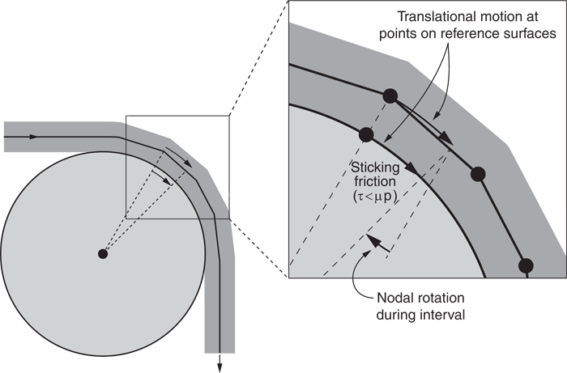
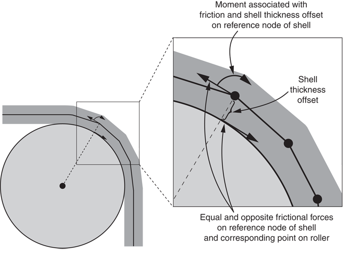

# 36.4.5 Abaqus/Explicit 中通用接触的接触控制


**产品：** Abaqus/Explicit  

##### **参考文献**

- ["在 Abaqus/Explicit 中定义通用接触相互作用，" 第 36.4.1 节](pt09ch36s04aus155.md)
- ["在 Abaqus/Explicit 中为接触对分配表面属性，" 第 36.5.2 节](pt09ch36s05aus161.md)
- [*CONTACT](../key/key-link.md#usb-kws-hcontact)
- [*CONTACT CONTROLS ASSIGNMENT](../key/key-link.md#usb-kws-hcontcntrlassign)

### 概述

通用接触算法的接触控制：
- 可用于选择性地缩放通用接触域内特定区域的默认惩罚刚度；
- 可用于控制一旦所有连接的面和边缘侵蚀后节点是否从通用接触域中移除；
- 可用于在通用接触域内特定区域激活节点-面接触的非默认跟踪算法；
- 可用于控制是否需要执行检查以防止通用接触表面在自身上反转折叠；
- 可用于修改通用接触域中一对或多对表面的默认初始过盈量解决方法；和
- 可用于修改默认接触厚度减少检查。

### 缩放默认惩罚刚度

通用接触算法使用惩罚方法来强制执行接触约束（有关更多信息，请参见 ["Abaqus/Explicit 中的接触约束强制方法，" 第 38.2.3 节](pt09ch38s02aus182.md)）。“弹簧”刚度将接触力与穿透距离关联，由 Abaqus/Explicit 自动选择，使得对时间增量的影响最小 yet 在大多数分析中允许的穿透不显著。如果存在以下任何因素，分析中可能会产生显著穿透：
- 位移控制的加载
- 接触界面上的材料是纯弹性或随变形硬化的
- 变形单元（尤其是膜和表面单元）只有相对较少的自身质量，并通过除边界条件以外的方法（如连接器）约束参与接触
- 刚体只有相对较少的自身质量或旋转惯性，并通过除边界条件以外的方法（如连接器）约束参与接触

请参见 ["Hertz 接触问题，" Abaqus Benchmarks Guide 第 1.1.11 节](../bmk/bmk-link.md#bmk-anl-hertzcontact)，了解这两个因素结合导致默认惩罚刚度的接触穿透显著的示例。

您可以指定一个比例因子来修改通用接触域内指定相互作用的惩罚刚度。此缩放可能会影响自动时间增量。由于维持数值稳定性（见 ["Abaqus/Explicit 中的接触约束强制方法，" 第 38.2.3 节](pt09ch38s02aus182.md) 中的进一步讨论）需要减少时间增量，使用大比例因子可能会增加分析所需的计算时间。

用户指定的可变质量缩放在计算质量必要增加时未考虑接触的影响。通常，由于默认惩罚刚度只会以非常小的量减少稳定时间增量，因此此效果不显著。但是，如果指定了高惩罚比例因子，尽管指定了质量缩放，稳定时间增量可能会显著减少。

用于指定应分配非默认惩罚刚度的区域的表面名称不必与用于指定通用接触域的表面名称对应。在许多情况下，接触相互作用被定义为一个大的域，而非默认惩罚刚度被分配给该域的子集。如果分配了非默认惩罚刚度的表面落在通用接触域之外，则控制分配将被忽略。如果指定的区域重叠，最后的分配优先。

| **输入文件用法：** | ``` [*CONTACT CONTROLS ASSIGNMENT](../key/key-link.md#usb-kws-hcontcntrlassign), TYPE=SCALE PENALTY *surface_1*, *surface_2*, *scale_factor* ``` |
| --- | --- |
|  | 此选项必须与 [*CONTACT](../key/key-link.md#usb-kws-hcontact) 选项一起使用。它每个步骤最多可出现一次；数据行可以根据需要重复多次以将惩罚刚度比例因子分配给不同区域。如果第一个表面名称被省略，则假定一个包含整个通用接触域的默认表面。如果第二个表面名称被省略或与第一个表面名称相同，则将指定的接触控制分配给第一个表面与自身之间的接触相互作用。请记住，表面可以定义为跨越多个未连接的体，因此自接触不限于单体检愈与自身的接触。 |

### 节点侵蚀控制

您可以控制周围所有面和边缘因单元失败侵蚀后接触节点是否保留在接触域中。默认情况下，这些节点保留在接触域中并充当自由浮动点质量，可以与仍属于接触域的面接触。您可以指定基于单元的表面的节点应在所有附加的接触面和接触边缘侵蚀后侵蚀（即从接触域中移除）。仅通过基于节点的表面包含在接触域中的节点永远不会从接触域中移除。

如果不指定节点侵蚀，由于自由飞行节点，计算成本可能会增加，尤其是对于并行进行的分析。增加的计算成本与自由飞行节点可能远离保持活跃的单元移动的可能性相关，这会拉伸接触域的体积，从而往往增加接触搜索成本以及并行分析中处理器之间通信的成本。然而，在某些情况下，涉及自由飞行节点的接触可能贡献显著的动量传递，如果指定了节点侵蚀，则不会考虑这一点。

| **输入文件用法：** | ``` [*CONTACT CONTROLS ASSIGNMENT](../key/key-link.md#usb-kws-hcontcntrlassign), NODAL EROSION=NO ``` |
| --- | --- |
|  | 此选项必须与 [*CONTACT](../key/key-link.md#usb-kws-hcontact) 选项一起使用。此参数设置适用于整个通用接触域。 |

### 激活节点-面接触的非默认跟踪算法

可以使用非默认接触跟踪算法，利用更局部的拓扑和几何信息来跟踪节点与面之间的接触。该算法在某些建模情况中可能导致更稳健的接触跟踪，例如在折叠安全气囊充气事件期间。

跟踪算法按表面逐个表面激活。您必须指定需要激活跟踪算法的表面名称。接触域中指定表面的节点与自身（自接触）或与任何其他表面的面接触的所有接触相互作用都将使用非默认节点-面跟踪方案跟踪。

用于指定应使用非默认跟踪算法的区域的表面名称不必与用于指定通用接触域的表面名称对应。在许多情况下，接触相互作用被定义为一个大的域，而非默认跟踪算法将被分配给该域的子集。如果需要激活非默认跟踪算法的表面落在通用接触域之外，则控制分配被忽略。

| **输入文件用法：** | ``` [*CONTACT CONTROLS ASSIGNMENT](../key/key-link.md#usb-kws-hcontcntrlassign), TYPE=FOLD TRACKING *surface_1* ``` |
| --- | --- |
|  | 此选项必须与 [*CONTACT](../key/key-link.md#usb-kws-hcontact) 选项一起使用。它每个步骤最多可出现一次；数据行可以根据需要重复多次以在接触域的不同区域激活非默认跟踪算法。如果表面名称被省略，则假定一个包含整个通用接触域的默认表面。 |

### 激活折叠反转检查

如果通用接触表面包含尖锐折叠，重大加载事件（例如，折叠安全气囊充气期间遇到的事件）可能导致一个或多个折叠反转。在形成折叠的面的边缘上未激活边-边接触的情况下，反转最可能发生。边-边约束的存在通常可以防止折叠反转。在没有边-边接触约束的情况下，折叠的反转可能导致节点-面接触跟踪算法出错，并可能导致正在被跟踪的在形成反转折叠的面上的节点被"卡住"在跟踪面的错误侧。为了避免这种情况，对于包含尖锐折叠的模型，激活折叠反转检查可能是理想的。折叠反转检查检测折叠即将反转的情况，并向形成折叠的面施加力场以防止折叠反转。

折叠反转检查按表面逐个表面激活。您必须指定需要激活折叠反转检查的表面名称。如果为特定表面激活，则折叠反转检查适用于该表面内的所有折叠。

用于指定应激活折叠反转检查的区域表面名称不必与用于指定通用接触域的表面名称对应。在许多情况下，接触相互作用被定义为一个大的域，而折叠反转检查在一个子域中被激活。如果需要激活折叠反转检查的表面落在通用接触域之外，则控制分配被忽略。

| **输入文件用法：** | ``` [*CONTACT CONTROLS ASSIGNMENT](../key/key-link.md#usb-kws-hcontcntrlassign), TYPE=FOLD INVERSION CHECK *surface_1* ``` |
| --- | --- |
|  | 此选项必须与 [*CONTACT](../key/key-link.md#usb-kws-hcontact) 选项一起使用。它每个步骤最多可出现一次；数据行可以根据需要重复多次以在接触域的不同区域激活折叠反转检查。如果表面名称被省略，则假定一个包含整个通用接触域的默认表面。 |

### 激活边-边接触的默认跟踪算法

默认接触跟踪算法在跟踪边缘之间的接触时利用比替代跟踪算法更多的局部信息。使用该算法可能会减少具有广泛边-边接触定义的分析所需的计算时间（例如，在折叠安全气囊充气模拟期间，可能需要激活安全气囊模表面上的所有特征边缘以在充气事件期间准确强制执行接触）。

如果未为跟踪算法指定接触控制，则默认情况下，所有边-边接触在接触域中将使用默认跟踪算法强制执行。

| **输入文件用法：** | ``` [*CONTACT CONTROLS ASSIGNMENT](../key/key-link.md#usb-kws-hcontcntrlassign), TYPE=ENHANCED EDGE TRACKING (default) ``` |
| --- | --- |
|  | 此选项必须与 [*CONTACT](../key/key-link.md#usb-kws-hcontact) 选项一起使用。此参数设置适用于整个通用接触域。 |

### 边-边接触的替代跟踪算法

有另一种接触跟踪算法可用，在跟踪边缘之间的接触时利用比默认跟踪算法更少的局部信息。该算法通常会增加所需的全局跟踪范围，因此在大多数分析中也会增加计算时间。当指定替代边缘跟踪算法时，接触域中的所有边-边接触将使用此算法强制执行。

| **输入文件用法：** | ``` [*CONTACT CONTROLS ASSIGNMENT](../key/key-link.md#usb-kws-hcontcntrlassign), TYPE=EDGE TRACKING ``` |
| --- | --- |
|  | 如果指定，此选项必须与 [*CONTACT](../key/key-link.md#usb-kws-hcontact) 选项一起使用。此参数设置适用于整个通用接触域。 |

### 初始过盈量解决的控制

默认情况下，Abaqus/Explicit 自动调整表面位置以移除模拟第一步中存在于通用接触域中的小初始过盈量。来自单独接触定义、边界条件、绑定约束和刚体约束的冲突调整可能导致初始过盈量的不完全解决。未能通过重新定位节点解决的初始过盈量存储为初始接触偏移，以避免分析开始时产生大的接触力。

或者，在某些情况下，可能需要完全避免表面对之间的节点调整，并将表面之间的所有初始过盈量视为临时接触偏移。然后，您可以指定应通过节点调整解决的初始过盈量不应通过节点调整解决的表面，而应存储为偏移。

| **输入文件用法：** | ``` [*CONTACT CONTROLS ASSIGNMENT](../key/key-link.md#usb-kws-hcontcntrlassign), AUTOMATIC OVERCLOSURE RESOLUTION *surface_1*, *surface_2*, *STORE OFFSETS* ``` |
| --- | --- |
|  | 此选项必须与 [*CONTACT](../key/key-link.md#usb-kws-hcontact) 选项一起使用。它每个步骤最多可出现一次；数据行可以根据需要重复多次以为不同区域分配非默认过盈量解决方法。如果第一个表面名称被省略，则假定一个包含整个通用接触域的默认表面。如果第二个表面名称被省略或与第一个表面名称相同，则将指定的接触控制分配给第一个表面与自身之间的接触相互作用。 |

#### 边-边相互作用的初始过盈量解决控制效果

接触偏移与单个节点-面片和边-边组合关联。在滑动时，Abaqus/Explicit 尝试将接触偏移适当地转移到不同的节点-面片或边-边配对。然而，在某些情况下，涉及单个节点或边缘或带角落的表面的多次接触，接触偏移可能在滑动时无法维持（即可能变为零）。可能导致增量中间隙值不连续的 limitations（与节点-表面接触相比，更可能发生在边-边接触中）可能局部降低解决方案质量，导致解决方案依赖于所使用的处理器数量，或导致分析中止。这些 limitations 可以通过预处理器的更仔细的表面节点定位来避免，或者在许多情况下，通过允许无应变调整发生来避免。

### 接触厚度减少检查的控制

默认情况下，通用接触算法要求接触厚度不超过表面面片边缘长度或对角线长度的某个分数。此分数通常根据单元几何形状和单元是否靠近壳周边而在 20% 到 60% 之间变化。通用接触算法将在必要时自动缩减接触厚度，而不影响底层单元的单元计算中使用的厚度。

要检查是否需要在模型中任何特定区域减少厚度，接触算法首先为每个接触节点分配完整厚度，表示为以节点为中心、直径等于厚度的球体。然后减少厚度，使球体不与任何未直接连接到节点的相邻面片重叠，防止产生虚假的自接触。然后，将壳周边上的节点在面片平面内最多移动面片尺寸的 50%，远离周边，以消除接触对算法发生的"牛鼻"效应（见 ["在 Abaqus/Explicit 中为接触对分配表面属性，" 第 36.5.2 节](pt09ch36s05aus161.md)）。如果壳周边节点的厚度大于最大周边偏移的两倍，则执行最终厚度减少以消除"牛鼻"的剩余部分。

如果默认厚度减少在模型的特定区域不可接受，您可以通过接触排除定义（见 ["在 Abaqus/Explicit 中定义通用接触相互作用，" 第 36.4.1 节](pt09ch36s04aus155.md)）排除这些区域的自接触，并激活接触厚度减少检查的控制。

| **输入文件用法：** | 使用以下选项消除模型中排除自接触的区域中的厚度减少，同时仍在壳周边减少厚度，因为周边偏移不足以避免"牛鼻"效应： |
| --- | --- |
|  | ``` [*CONTACT CONTROLS ASSIGNMENT](../key/key-link.md#usb-kws-hcontcntrlassign), CONTACT THICKNESS REDUCTION=SELF ``` 使用以下选项在模型中排除自接触的区域和所有壳周边消除厚度减少（如果壳周边节点的厚度大于最大周边偏移的两倍，则会在壳周边节点处形成"牛鼻"）： ``` [*CONTACT CONTROLS ASSIGNMENT](../key/key-link.md#usb-kws-hcontcntrlassign), CONTACT THICKNESS REDUCTION=NOPERIMSELF ``` |

### 考虑壳和梁厚度偏移的增量旋转以进行摩擦接触

默认情况下，摩擦的滑动增量计算不考虑壳和梁厚度偏移的增量旋转，并且摩擦约束不对因壳或梁厚度而偏离接触界面的节点施加力矩。在大多数情况下，忽略这些效应对结果的影响很小；然而，在某些应用中它可能很显著。

[图 36.4.5-1](pt09ch36s04aus159.md#contact-thickness-rotation) 显示了一个示例，其中表面厚度显著影响滑动增量计算（因此，正确强制执行粘附条件）。此示例涉及与辊道导轨摩擦接触的壳表面，在接触区域没有相对滑动。壳的参考表面（包含壳节点）在接触区域偏离辊道的参考表面半个壳厚度。如图所示，由于厚度偏移的旋转，两个参考表面之间应存在一些切向运动差异；粘附接触区域中的壳节点应具有比辊道上接触点略大的增量位移；然而，默认情况下，粘附在辊道上的壳节点的增量位移将与辊道上接触点的增量位移相同。为了在这种情况下提高准确性，您可以指定应考虑结构旋转项。

**图 36.4.5-1** 壳厚度对滑动增量的影响。



摩擦约束应向因壳或梁厚度而偏离接触界面的节点施加力矩，以对抗与摩擦力偶相关的净力矩。[图 36.4.5-2](pt09ch36s04aus159.md#contact-thickness-moment) 中所示的施加节点力矩抵消了相关摩擦力偶的力矩，使得与摩擦约束相关的净力和净力矩为零。然而，默认情况下，Abaqus/Explicit 忽略此力矩，并在节点因壳和梁厚度而偏离接触界面时产生净力矩。为了在这种情况下提高准确性，您可以指定应考虑结构旋转项。

**图 36.4.5-2** 与摩擦约束相关的节点力矩。



| **输入文件用法：** | 对于摩擦接触，使用以下选项考虑壳和梁厚度偏移在滑动增量计算中的增量旋转，并对因壳和梁厚度而偏离接触界面的节点施加力矩： |
| --- | --- |
|  | ``` [*CONTACT CONTROLS ASSIGNMENT](../key/key-link.md#usb-kws-hcontcntrlassign), ROTATIONAL TERMS=STRUCTURAL ``` 使用以下选项（默认）忽略摩擦接触的壳和梁厚度偏移的影响： ``` [*CONTACT CONTROLS ASSIGNMENT](../key/key-link.md#usb-kws-hcontcntrlassign), ROTATIONAL TERMS=NONE ``` |
