# 37.1.10 基于表面的内聚行为


**产品：** Abaqus/Standard Abaqus/Explicit Abaqus/CAE

##### **参考资料**

- ["渐进损伤与失效，" 第24.1.1节](pt05ch24s01abo21.md)
- ["使用牵引-分离描述定义内聚单元的本构响应，" 第32.5.6节](pt06ch32s05alm45.md)
- ["在Abaqus/Standard中定义接触对，" 第36.3.1节](pt09ch36s03aus145.md)
- ["在Abaqus/Explicit中定义一般接触相互作用，" 第36.4.1节](pt09ch36s04aus155.md)
- ["力学接触属性：概述，" 第37.1.1节](pt09ch37s01aus165.md)
- ["裂纹扩展分析，" 第11.4.3节](pt04ch11s04aus69.md)
- [*COHESIVE BEHAVIOR](../key/key-link.md#usb-kws-mcohesivebehavior)
- [*SURFACE INTERACTION](../key/key-link.md#usb-kws-hsurfaceinteraction)
- [*DAMAGE INITIATION](../key/key-link.md#usb-kws-mdamageinitiation)
- [*DAMAGE EVOLUTION](../key/key-link.md#usb-kws-mdamageevolution)
- [*DAMAGE STABILIZATION](../key/key-link.md#usb-kws-mdamagestabilization)
- [*FRACTURE CRITERION](../key/key-link.md#usb-kws-hfracturecriterion)
- ["在定义接触相互作用属性中为力学接触属性选项指定内聚行为属性" Abaqus/CAE用户指南第15.14.1节](../usi/usi-link.md#usi-itn-help-prop-contact-mech-cohesive)
- ["在定义接触相互作用属性中为力学接触属性选项指定内聚损伤属性" Abaqus/CAE用户指南第15.14.1节](../usi/usi-link.md#usi-itn-help-prop-contact-mech-damage)

### 概述

本节描述的功能允许为表面指定广义的牵引-分离行为。这种行为提供的功能与使用牵引-分离律定义的内聚单元非常相似（参见["使用牵引-分离描述定义内聚单元的本构响应，" 第32.5.6节](pt06ch32s05alm45.md)）。但是，基于表面的内聚行为通常更容易定义，并允许模拟更广泛范围的内聚相互作用，例如两个"粘性"表面在分析过程中接触。

基于表面的内聚行为主要用于界面厚度可忽略不计的情况。如果界面粘合剂层具有有限厚度，并且可以获得粘合剂材料的宏观属性（如刚度和强度），则使用常规内聚单元建模响应可能更合适（参见["使用连续体方法定义内聚单元的本构响应，" 第32.5.5节](pt06ch32s05alm44.md)）。

在Abaqus/Explicit中，基于表面的内聚行为框架也可用于通过线性弹性断裂力学原理（LEFM）模拟初始部分粘合表面中的裂纹扩展，如使用虚拟裂纹闭合技术（VCCT）实现的。

基于表面的内聚行为：
- 被定义为表面相互作用属性；
- 可用于直接用牵引与分离的术语模拟界面处的分层；
- 可用于模拟"粘性"接触（即，初始不接触的表面或表面的一部分可能在接触时粘合；随后粘合可能损伤并失效）；
- 可以限制为初始接触的表面区域，在Abaqus/Standard中，还可以限制为初始接触的表面区域的特定部分；
- 允许指定内聚数据，例如作为界面处法向与剪切位移比（模式混合）的函数的断裂能；
- 假定在损伤前为线性弹性牵引-分离律；
- 假定内聚粘合的失效以由损伤过程驱动的内聚刚度的渐进降解为特征（在Abaqus/Explicit中，也可以使用VCCT断裂准则模拟脆性断裂）；
- 允许指定失效后内聚行为，如果失效节点重新进入接触；
- 在Abaqus/Explicit中在通用接触算法框架内实现，在Abaqus/Standard中在接触对框架内实现；
- 可用于在Abaqus/Explicit中 enforcement "rough friction" 表面相互作用、"no separation" 接触关系或组合的"no separation and rough friction" 行为在通用接触框架内；
- 在Abaqus/Explicit中仅对节点-面接触相互作用 enforcement，不适用于边-边和节点-解析刚体表面接触相互作用；
- 不能在Abaqus/Explicit中的耦合欧拉-拉格朗日分析中使用；以及
- 可用于Abaqus/Standard的所有接触公式，除了有限滑动、面-面公式。

### 在Abaqus/Explicit中定义内聚行为

在Abaqus/Explicit中，内聚行为被定义为分配给适用表面的表面相互作用属性的一部分。必须为模型定义一般接触。

| **输入文件用法：** | 使用以下选项在一般接触定义中定义两个表面之间的内聚行为： |
| --- | --- |
|  | ``` [*SURFACE INTERACTION](../key/key-link.md#usb-kws-hsurfaceinteraction), NAME=*name* [*COHESIVE BEHAVIOR](../key/key-link.md#usb-kws-mcohesivebehavior) [*CONTACT](../key/key-link.md#usb-kws-hcontact) [*CONTACT PROPERTY ASSIGNMENT](../key/key-link.md#usb-kws-hcontpropassign) *surface1*, *surface2*, *name* ``` |

| **Abaqus/CAE用法：** | 使用以下选项在两个表面之间定义内聚行为： |
| --- | --- |
|  | Interaction模块：接触属性编辑器：****Mechanical****Cohesive Behavior**** 使用以下选项定义两个表面之间的接触：Interaction模块：相互作用编辑器：**General contact (Explicit)**：指定**Contact interaction property** |

#### 在Abaqus/Explicit中内聚行为的接触公式

在Abaqus/Explicit中，如果对平衡主-从公式 enforcement 内聚约束，则在某些情况下可能会出现过度约束。为防止这种情况发生，在Abaqus/Explicit中对具有内聚行为的表面 enforcement 纯主-从公式。如果在两个表面之间定义了内聚行为，则接触属性分配中定义的第一个表面被视为从表面，第二个表面为其对应的主表面。对于内聚表面与一般接触域其他部分之间的接触相互作用，除非定义了非默认的一般接触公式（参见["Abaqus/Explicit中一般接触的接触公式，" 第38.2.1节](pt09ch38s02aus180.md)），否则适用默认接触公式（平衡主-从）。基于表面的内聚行为仅适用于节点-面接触相互作用；不适用于边-边相互作用。因此，不可能在梁和桁架单元的边缘之间定义基于表面的内聚。此外，当定义基于表面的内聚行为时，与热相互作用相关的接触定义会被忽略。

当内聚行为与堆叠的传统壳单元一起使用时，应谨慎行事。根据载荷情况，专用接触公式可能导致近似的法向接触力，这反过来可能会在堆叠壳中引起影响堆栈弯曲行为的近似横向剪切行为。在这种建模场景中，应使用连续体壳代替传统壳。

#### 在Abaqus/Explicit中解析初始过闭合并间隙

在许多使用内聚表面的脱粘应用中，可能需要让分析从表面刚刚接触开始。这需要解析分析开始时表面之间的初始过闭合并间隙，以确保从节点精确接触主表面。在Abaqus/Explicit中，默认情况下，小初始过闭合并设置为零。要解析大的初始过闭合并或表面之间的初始间隙，可以定义适当的接触间隙规格，如["控制在Abaqus/Explicit中一般接触的初始接触状态，" 第36.4.4节](pt09ch36s04aus158.md)中所解释。由于对内聚表面 enforcement 纯主-从公式，只有从表面的节点将进行无应变校正以解析与其主面片的任何初始过闭合并间隙；主面片的节点将不会被移动。

### 在Abaqus/Standard中定义内聚行为

在Abaqus/Standard中，内聚行为被定义为分配给接触对的表面相互作用属性的一部分。不能将内聚行为分配给使用有限滑动、面-面公式的接触对（参见["Abaqus/Standard中的接触公式，" 第38.1.1节](pt09ch38s01aus177.md)）。

| **输入文件用法：** | 使用以下选项在接触对中定义表面之间的内聚行为： |
| --- | --- |
|  | ``` [*SURFACE INTERACTION](../key/key-link.md#usb-kws-hsurfaceinteraction), NAME=*name* [*COHESIVE BEHAVIOR](../key/key-link.md#usb-kws-mcohesivebehavior) [*CONTACT PAIR](../key/key-link.md#usb-kws-hcontactpair), INTERACTION=*name* *surface1*, *surface2* ``` ``` ``` ``` ``` |

| **Abaqus/CAE用法：** | 使用以下选项在两个表面之间定义内聚行为： |
| --- | --- |
|  | Interaction模块：接触属性编辑器：****Mechanical****Cohesive Behavior**** 使用以下选项在两个表面之间定义面-面接触：Interaction模块：相互作用编辑器：**Surface-to-surface contact (Standard)**：**Bonding**标签页：指定**Contact interaction property** |

#### 在Abaqus/Standard中解析初始过闭合并间隙

如上所述，在脱粘应用中，内聚表面通常需要从刚刚接触开始分析。Abaqus/Standard提供了一些工具来调整接触对中的从节点，使它们精确接触主表面，从而消除初始过闭合并间隙。如果不调整节点，即使是非常小的初始间隙也会导致接触约束被初始化为非活动状态，因此不会粘合。这些工具在["在Abaqus/Standard接触对中调整初始表面位置和指定初始间隙，" 第36.3.5节](pt09ch36s03aus149.md)中描述。

### 控制粘合节点的集合

默认情况下，内聚约束力可能作用在为内聚行为定义的表面所有节点上。初始接触主表面的从节点可以在分析开始时承受内聚力，初始未接触主表面的从节点如果在分析过程中接触主表面则可能承受内聚力。但是，在某些情况下，可能希望仅对分析开始时接触的表面部分 enforcement 内聚行为。

#### 将内聚行为限制为初始接触的节点

作为内聚行为定义的一部分，您可以指示只有那些在步骤开始时与主表面接触的节点应该承受内聚力。在步骤期间发生的新接触将不会承受内聚约束力；它们将仅被建模为压缩接触。

| **输入文件用法：** | ``` [*COHESIVE BEHAVIOR](../key/key-link.md#usb-kws-mcohesivebehavior), ELIGIBILITY=ORIGINAL CONTACTS ``` |
| --- | --- |

| **Abaqus/CAE用法：** | Interaction模块：接触属性编辑器：****Mechanical****Cohesive Behavior****：**Only slave nodes initially in contact** |
| --- | --- |

#### 将内聚行为限制为指定节点

在Abaqus/Standard中，您可以指定初始应承受内聚力的一部分从节点。对于初始未接触但指定在节点集中的节点，将进行无应变调整。该集合外的所有从节点（包括初始接触主表面的那些）在分析过程中将仅承受压缩接触力。此方法对于沿现有断层线模拟裂纹扩展特别有用。

| **输入文件用法：** | 同时使用以下两个选项： |
| --- | --- |
|  | ``` [*INITIAL CONDITIONS](../key/key-link.md#usb-kws-minitialcond), TYPE=CONTACT [*COHESIVE BEHAVIOR](../key/key-link.md#usb-kws-mcohesivebehavior), ELIGIBILITY=SPECIFIED CONTACTS ``` |

| **Abaqus/CAE用法：** | Interaction模块：接触属性编辑器：****Mechanical****Cohesive Behavior****：**在面-面（Standard）相互作用中指定粘合节点集** |
| --- | --- |
|  | Interaction模块：相互作用编辑器：**Bonding**标签页：**Limit bonding to slave nodes in sub-set** |

### 牵引-分离行为与压缩和摩擦行为的相互作用

在接触法向方向上， governing 表面之间压缩行为的压力-过闭合关系与内聚行为不相互作用，因为它们各自在不同的接触状态下描述表面之间的相互作用。压力-过闭合关系仅在从节点"闭合"（即与主表面接触）时 governing 行为；内聚行为仅在从节点"张开"（即未接触）时对接触法向应力有贡献。在"粘性"内聚行为的情况下——两个表面初始不接触——内聚效应在从节点状态从张开变为闭合的增量之后被激活。

在剪切方向上，如果内聚刚度未受损，假定内聚模型处于活动状态，摩擦模型处于休眠状态。任何切向滑移假定为纯弹性性质，并受到粘合强度的抵抗，从而产生剪切力。如果定义了损伤，内聚刚度对剪切应力的贡献开始随损伤演化而降解。一旦内聚刚度开始降解，摩擦模型激活并开始对剪切应力做出贡献。摩擦模型的弹性粘结刚度与弹性内聚刚度的降解成正比增加。在内聚粘合最终失效之前，且在内聚粘合降解演化开始之后，剪切应力是内聚贡献和摩擦模型贡献的组合。一旦达到最大降解，内聚对剪切应力的贡献为零，剪切应力的唯一贡献来自摩擦模型。

### 将内聚材料概念应用于基于表面的内聚行为

Governing 内聚表面行为的公式和定律与具有牵引-分离本构行为的内聚单元使用的非常相似（["使用牵引-分离描述定义内聚单元的本构响应，" 第32.5.6节](pt06ch32s05alm45.md)）。相似性延伸到线性弹性牵引-分离模型、损伤起始准则和损伤演化定律。

但是，重要的是要认识到，基于表面的内聚行为中的损伤是一种相互作用属性，而非材料属性。在内聚单元的行为模型公式中使用的应变和位移概念被重新解释为接触分离；接触分离是从表面上节点与其在主表面上对应投影点之间沿接触法向和剪切方向的相对位移。对于基于表面的内聚行为，应力定义为沿接触法向和剪切方向作用的内聚力除以每个接触点处的当前面积。

基于表面的内聚行为模型的细节在以下各节中讨论。

### 线性弹性牵引-分离行为

Abaqus中可用的牵引-分离模型假定初始线性弹性行为（参见["为内聚单元定义牵引和分离的弹性" 第22.2.1节"线性弹性行为"](pt05ch22s02abm02.md#usb-mat-clinearelastic-traction)），然后是损伤的起始和演化。弹性行为以弹性本构矩阵的形式编写，该矩阵将法向和剪切应力与界面上的法向和剪切分离联系起来。

名义牵引应力向量，，由三个分量组成（二维问题中为两个分量）：、和（在三维问题中），它们分别表示法向（在三维中沿局部3方向，在二维中沿局部2方向）和两个剪切牵引（在三维中沿局部1和2方向，在二维中沿局部1方向）。对应的分离表示为、和。弹性行为可以写成

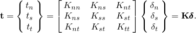

#### 非耦合牵引-分离行为

内聚行为的最简单规范会产生接触惩罚，在法向和切向方向都 enforcement 内聚约束。默认情况下，法向和切向刚度分量不会耦合：纯法向分离本身不会在剪切方向产生内聚力，而纯剪切滑移且无法向分离不会在法向产生任何内聚力。

对于非耦合牵引-分离行为，必须定义项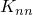、和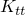，以及温度或场变量的任何依赖项。如果未定义这些项，Abaqus使用默认接触惩罚来建模牵引-分离行为。

| **输入文件用法：** | ``` [*COHESIVE BEHAVIOR](../key/key-link.md#usb-kws-mcohesivebehavior), TYPE=UNCOUPLED (default) ``` |
| --- | --- |

| **Abaqus/CAE用法：** | Interaction模块：接触属性编辑器：****Mechanical****Cohesive Behavior****：**Specify stiffness coefficients**：**Uncoupled** |
| --- | --- |

#### 耦合牵引-分离行为

在其完全通用性中，弹性矩阵在牵引向量和分离向量的所有分量之间提供完全耦合的行为，并且可以依赖于温度和/或场变量。对于耦合牵引-分离行为，必须定义矩阵中的所有项。

| **输入文件用法：** | ``` [*COHESIVE BEHAVIOR](../key/key-link.md#usb-kws-mcohesivebehavior), TYPE=COUPLED ``` |
| --- | --- |

| **Abaqus/CAE用法：** | Interaction模块：接触属性编辑器：****Mechanical****Cohesive Behavior****：**Specify stiffness coefficients**：**Coupled** |
| --- | --- |

#### 仅在法向或剪切方向的内聚行为

要将内聚约束限制为仅沿接触法向方向，请定义非耦合内聚行为并为剪切刚度分量和指定零值。或者，如果仅 enforcement 切向内聚约束，则可以将法向刚度项设置为零，在这种情况下，法向"分离"将不会被约束。法向压缩力按常规接触行为抵抗。

### 损伤建模

损伤建模允许您模拟两个内聚表面之间粘合的降解和最终失效。失效机制包括两个要素：损伤起始准则和损伤演化定律。初始响应假定为线性的，如上所述。然而，一旦满足损伤起始准则，损伤可以按照用户定义的损伤演化定律发生。图37.1.10-1显示了一个具有失效机制的典型牵引-分离响应。如果指定了损伤起始准则而没有相应的损伤演化模型，Abaqus仅为输出目的评估损伤起始准则；对内聚表面的响应没有影响（即不会发生损伤）。内聚表面在纯压缩下不会发生损伤。

**图37.1.10-1** 典型牵引-分离响应。

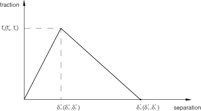

内聚表面的牵引-分离响应的损伤在与常规材料（参见["渐进损伤与失效，" 第24.1.1节](pt05ch24s01abo21.md)）使用的相同一般框架内定义，除了损伤行为被指定为表面相互作用属性的一部分。内聚表面不提供多种损伤响应机制：内聚表面只能有一个损伤起始准则和一个损伤演化定律。

| **输入文件用法：** | 使用以下选项为内聚表面定义损伤起始和损伤演化： |
| --- | --- |
|  | ``` [*SURFACE INTERACTION](../key/key-link.md#usb-kws-hsurfaceinteraction), NAME=*name* [*COHESIVE BEHAVIOR](../key/key-link.md#usb-kws-mcohesivebehavior) [*DAMAGE INITIATION](../key/key-link.md#usb-kws-mdamageinitiation) [*DAMAGE EVOLUTION](../key/key-link.md#usb-kws-mdamageevolution) ``` |

| **Abaqus/CAE用法：** | Interaction模块：接触属性编辑器：****Mechanical****Damage****：**Damage Initiation**和**Damage Evolution**标签页 |
| --- | --- |

### 损伤起始

损伤起始 refers to 损伤开始降解内聚响应的点。当接触应力和/或接触分离满足您指定的某些损伤起始准则时，降解过程开始。提供了几种损伤起始准则并在下面讨论。

每个损伤起始准则也有一个关联的输出变量来指示是否满足该准则。值为1或更高表示已满足起始准则。没有相应演化定律的损伤起始准则仅影响输出。因此，您可以使用这些准则来评估材料发生损伤的倾向，而无需实际建模损伤过程（即，实际指定损伤演化）。

在下面的讨论中，、和表示当分离分别为纯法向界面、纯在第一剪切方向或纯在第二剪切方向时的接触应力峰值。同样，、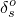和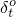表示当分离分别为纯沿接触法向、纯在第一或第二剪切方向时的接触分离峰值。下面讨论中使用的符号表示Macaulay括号，具有通常的解释。Macaulay括号用于表示纯压缩位移（即接触穿透）或纯压缩应力状态不会引起损伤。

#### 最大应力准则

当最大接触应力比（如下式定义）达到1时，假定损伤开始。该准则可以表示为


| **输入文件用法：** | ``` [*DAMAGE INITIATION](../key/key-link.md#usb-kws-mdamageinitiation), CRITERION=MAXS ``` |
| --- | --- |

| **Abaqus/CAE用法：** | Interaction模块：接触属性编辑器：****Mechanical****Damage****：**Initiation**标签页：**Criterion**：**Maximum nominal stress** |
| --- | --- |

#### 最大分离准则

当最大分离比（如下式定义）达到1时，假定损伤开始。该准则可以表示为


| **输入文件用法：** | ``` [*DAMAGE INITIATION](../key/key-link.md#usb-kws-mdamageinitiation), CRITERION=MAXU ``` |
| --- | --- |

| **Abaqus/CAE用法：** | Interaction模块：接触属性编辑器：****Mechanical****Damage****：**Initiation**标签页：**Criterion**：**Maximum separation** |
| --- | --- |

#### 二次应力准则

当涉及接触应力比的二次相互作用函数（如下式定义）达到1时，假定损伤开始。该准则可以表示为

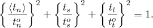

| **输入文件用法：** | ``` [*DAMAGE INITIATION](../key/key-link.md#usb-kws-mdamageinitiation), CRITERION=QUADS ``` |
| --- | --- |

| **Abaqus/CAE用法：** | Interaction模块：接触属性编辑器：****Mechanical****Damage****：**Initiation**标签页：**Criterion**：**Quadratic traction** |
| --- | --- |

#### 二次分离准则

当涉及分离比的二次相互作用函数（如下式定义）达到1时，假定损伤开始。该准则可以表示为

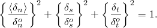

| **输入文件用法：** | ``` [*DAMAGE INITIATION](../key/key-link.md#usb-kws-mdamageinitiation), CRITERION=QUADU ``` |
| --- | --- |

| **Abaqus/CAE用法：** | Interaction模块：接触属性编辑器：****Mechanical****Damage****：**Initiation**标签页：**Criterion**：**Quadratic separation** |
| --- | --- |

### 损伤演化

损伤演化定律描述了一旦达到相应的起始准则，内聚刚度降解的速率。描述体积材料（与使用内聚表面建模的界面相对）损伤演化的通用框架在["损伤演化和延性金属的单元移除，" 第24.2.3节](pt05ch24s02abm43.md)中描述。概念上，类似的 ideas 适用于描述内聚表面的损伤演化。

标量损伤变量D表示接触点处的总体损伤。它最初值为0。如果建模损伤演化，则D在损伤起始后的进一步加载过程中单调地从0演化到1。接触应力分量受损伤影响如下

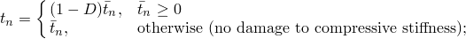

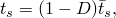


其中、和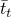是由当前无损伤分离的弹性牵引-分离行为预测的接触应力分量。

为了描述界面上面法向和剪切分离组合下的损伤演化，引入有效分离（Camanho和Davila，2002）是有用的，定义为


虽然这个公式最初被应用于内聚单元的损伤演化，但可以按照上面讨论的（参见["将内聚材料概念应用于基于表面的内聚行为](pt09ch37s01alm63.md#usb-cni-acohesivebehav-elements)"）重新解释为内聚表面行为的接触分离。

#### 混合模式定义

接触点处法向和剪切分离的相对比例定义了在该点的模式混合。Abaqus使用三种模式混合度量，两种基于能量，一种基于牵引。您可以在指定损伤演化过程的模式依赖性时选择其中之一。用、和表示牵引及其在法向、第一和第二剪切方向上的共轭分离所做的功，定义，基于能量的模式混合定义如下：


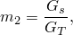

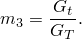

显然，上面定义的三个量中只有两个是独立的。定义量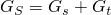来表示剪切牵引及相应分离分量所做的总功的一部分也很有用。如后所述，Abaqus要求您将损伤演化相关的材料属性指定为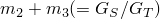（或等效地，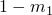）和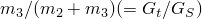的函数。

Abaqus根据积分点处变形的当前状态（非累积能量度量）或变形历史（累积能量度量）来计算上述能量量。前一种方法仅在Abaqus/Standard中可用，在混合模式模拟中很有用，其中主要能量耗散机制与内聚区失效产生的新表面创建相关。这类问题通常用线性弹性断裂力学的方法可以充分描述。后一种方法提供了定义模式混合的替代方法，在其他重要耗散机制也控制整体结构响应的情形中可能有用。

基于牵引分量给出了模式混合的相应定义


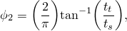

其中是有效剪切牵引的度量。上述定义中使用的角度度量（在其被归一化之前）如图37.1.10-2所示。

**图37.1.10-2** 基于牵引的模式混合度量。


| **输入文件用法：** | 使用以下选项使用基于非累积能量的模式混合定义（仅在Abaqus/Standard中可用）： |
| --- | --- |
|  | ``` [*DAMAGE EVOLUTION](../key/key-link.md#usb-kws-mdamageevolution), MODE MIX RATIO=ENERGY ``` 使用以下选项使用基于累积能量的模式混合定义： ``` [*DAMAGE EVOLUTION](../key/key-link.md#usb-kws-mdamageevolution), MODE MIX RATIO=ACCUMULATED ENERGY ``` 使用以下选项使用基于牵引的模式混合定义： ``` [*DAMAGE EVOLUTION](../key/key-link.md#usb-kws-mdamageevolution), MODE MIX RATIO=TRACTION ``` |

| **Abaqus/CAE用法：** | 在Abaqus/Standard中使用基于非累积能量的模式混合定义： |
| --- | --- |
|  | Interaction模块：接触属性编辑器：****Mechanical****Damage****：**Evolution**标签页：打开**Specify mixed-mode behavior**：**Mode mix ratio**：**Energy** 在Abaqus/Explicit中使用基于累积能量的模式混合定义：Interaction模块：接触属性编辑器：****Mechanical****Damage****：**Evolution**标签页：打开**Specify mixed-mode behavior**：**Mode mix ratio**：**Energy** 在Abaqus/CAE中不支持在Abaqus/Standard中使用基于累积能量的模式混合定义。使用以下选项使用基于牵引的模式混合定义：Interaction模块：接触属性编辑器：****Mechanical****Damage****：**Evolution**标签页：打开**Specify mixed-mode behavior**：**Mode mix ratio**：**Traction** |

##### 混合模式定义的比较

以能量和牵引定义的模式混合比通常可能完全不同。以下示例说明了这一点。从能量角度，纯法向分离是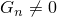和的情况，与法向和剪切牵引的值无关。特别地，对于耦合牵引-分离行为，纯法向分离时法向和剪切牵引都可能非零。对于这种情况，基于能量的模式混合定义将表示纯法向分离，而基于牵引的定义会暗示法向和剪切分离的混合。

当模式混合基于累积能量时，可能会在混合模式行为中引入人为的路径依赖，这与例如基于线性弹性断裂力学的预测不一致。因此，如果界面首先在纯法向变形模式下加载，卸载，然后在纯剪切变形模式下加载，则上述变形路径结束时基于累积能量的模式混合比计算为（假设剪切变形仅在局部1方向）和。另一方面，基于非累积能量的模式混合比在上述变形路径结束时计算为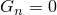和。

#### 损伤演化定义

损伤演化定义有两个组成部分。第一个组成部分涉及指定完全失效时的有效分离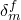，相对于损伤起始时的有效分离（参见图37.1.10-3）。损伤演化定义的第二个组成部分是指定损伤变量D在损伤起始和最终失效之间演化的性质。这可以通过定义线性或指数软化定律来完成，或者将D直接指定为有效分离相对于损伤起始时有效分离的表格函数。上述数据通常是模式混合、温度和/或场变量的函数。

**图37.1.10-3** 线性损伤演化。

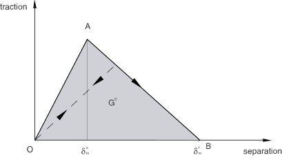

图37.1.10-4是内聚相互作用牵引-分离响应中损伤起始和演化对模式混合依赖性的示意图。该图将牵引绘制在垂直轴上，法向和剪切分离的大小绘制在两个水平轴上。两个垂直坐标平面中的未阴影三角形分别表示纯法向和纯剪切分离下的响应。所有中间垂直平面（包含垂直轴）表示具有不同模式混合的混合模式条件下的损伤响应。损伤演化数据对模式混合的依赖性可以以表格形式定义，或者在基于能量的定义的情况下，以解析形式定义。损伤演化数据作为模式混合函数的方式在本节后面讨论。

**图37.1.10-4** 内聚相互作用中混合模式响应的说明。

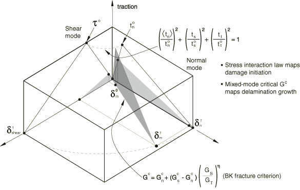

损伤起始后的卸载始终假定沿牵引-分离平面原点线性发生，如图37.1.10-3所示。卸载后的重新加载也沿相同的线性路径发生，直到达到软化包络线（线AB）。一旦达到软化包络线，进一步的重新加载沿该包络线进行，如图37.1.10-3中的箭头所示。

#### 基于有效分离的演化

您指定量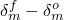（即完全失效时的有效分离，相对于损伤起始时的有效分离，如图37.1.10-3所示）作为模式混合、温度和/或场变量的表格函数。此外，您还可以选择线性或指数软化定律，定义损伤变量D在损伤起始后有效分离超过损伤起始时的详细演化。或者，除了使用线性或指数软化外，您可以将损伤变量D直接指定为损伤起始后有效分离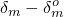、模式混合、温度和/或场变量的表格函数。

##### 线性损伤演化

对于线性软化（参见图37.1.10-3），Abaqus使用损伤变量D的演化，在损伤演化过程中模式混合、温度和场变量恒定的情况下，退化为以下表达式：


在前面的表达式和所有后续引用中，指的是加载历史期间达到的有效分离的最大值。在涉及单调损伤（或单调断裂）的问题中，假定在损伤起始和最终失效之间接触点的模式混合恒定是常规做法。

| **输入文件用法：** | 使用以下选项指定线性损伤演化： |
| --- | --- |
|  | ``` [*DAMAGE EVOLUTION](../key/key-link.md#usb-kws-mdamageevolution), TYPE=DISPLACEMENT, SOFTENING=LINEAR ``` |

| **Abaqus/CAE用法：** | Interaction模块：接触属性编辑器：****Mechanical****Damage****：**Evolution**标签页：**Type**：**Displacement**：**Softening**：**Linear** |
| --- | --- |

##### 指数损伤演化

对于指数软化（参见图37.1.10-5），Abaqus使用损伤变量D的演化，在损伤演化过程中模式混合、温度和场变量恒定的情况下，退化为


在上述表达式中，是一个定义损伤演化速率的无量纲参数，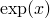是指数函数。

**图37.1.10-5** 指数损伤演化。

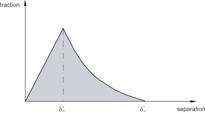

| **输入文件用法：** | 使用以下选项指定指数软化： |
| --- | --- |
|  | ``` [*DAMAGE EVOLUTION](../key/key-link.md#usb-kws-mdamageevolution), TYPE=DISPLACEMENT, SOFTENING=EXPONENTIAL ``` |

| **Abaqus/CAE用法：** | Interaction模块：接触属性编辑器：****Mechanical****Damage****：**Evolution**标签页：**Type**：**Displacement**：**Softening**：**Exponential** |
| --- | --- |

##### 表格损伤演化

对于表格软化，您直接在表格形式中定义D的演化。D必须指定为相对于起始时有效分离、模式混合、温度和/或场变量的函数。

| **输入文件用法：** | 使用以下选项以表格形式直接定义损伤变量： |
| --- | --- |
|  | ``` [*DAMAGE EVOLUTION](../key/key-link.md#usb-kws-mdamageevolution), TYPE=DISPLACEMENT, SOFTENING=TABULAR ``` |

| **Abaqus/CAE用法：** | Interaction模块：接触属性编辑器：****Mechanical****Damage****：**Evolution**标签页：**Type**：**Displacement**：**Softening**：**Tabular** |
| --- | --- |

#### 基于能量的演化

损伤演化可以基于损伤过程中消耗的能量来定义，也称为断裂能。断裂能等于牵引-分离曲线下的面积（参见图37.1.10-3）。您将断裂能指定为内聚相互作用的属性，并选择线性或指数软化行为。Abaqus确保线性或指数受损响应下的面积等于断裂能。

断裂能对模式混合的依赖性可以直接以表格形式指定，或者通过使用如下所述的解析形式指定。当使用解析形式时，模式混合比假定以能量定义。

##### 表格形式

定义断裂能对模式混合依赖性的最简单方法是直接以模式混合的函数形式以表格形式指定。

| **输入文件用法：** | 使用以下选项以表格形式指定断裂能作为模式混合的函数： |
| --- | --- |
|  | ``` [*DAMAGE EVOLUTION](../key/key-link.md#usb-kws-mdamageevolution), TYPE=ENERGY, MIXED MODE BEHAVIOR=TABULAR ``` |

| **Abaqus/CAE用法：** | Interaction模块：接触属性编辑器：**Contact**：****Mechanical****Damage****：**Evolution**标签页：**Type**：**Energy**：打开**Specify mixed mode behavior**：**Tabular** |
| --- | --- |

##### 幂律形式

断裂能对模式混合的依赖性可以基于幂律断裂准则定义。幂律准则表明，混合模式条件下的失效受使个别（法向和两个剪切）模式失效所需能量的幂律相互作用控制。它由下式给出


当满足上述条件时的混合模式断裂能。换句话说，


您指定量、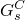和，它们分别表示在法向、第一和第二剪切方向引起失效所需的关键断裂能。

| **输入文件用法：** | 使用以下选项使用解析幂律断裂准则将断裂能定义为模式混合的函数： |
| --- | --- |
|  | ``` [*DAMAGE EVOLUTION](../key/key-link.md#usb-kws-mdamageevolution), TYPE=ENERGY, MIXED MODE BEHAVIOR=POWER LAW, POWER= ``` |

| **Abaqus/CAE用法：** | Interaction模块：接触属性编辑器：****Mechanical****Damage****：**Evolution**标签页：**Type**：**Energy**：打开**Specify mixed mode behavior**：**Power law**： |
| --- | --- |

##### Benzeggagh-Kenane (BK) 形式

Benzeggagh-Kenane断裂准则（Benzeggagh和Kenane，1996）当纯剪切方向分离时的临界断裂能相同时特别有用；即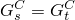。它由下式给出


其中、和是内聚属性参数。您指定、和。

| **输入文件用法：** | 使用以下选项使用解析BK断裂准则将断裂能定义为模式混合的函数： |
| --- | --- |
|  | ``` [*DAMAGE EVOLUTION](../key/key-link.md#usb-kws-mdamageevolution), TYPE=ENERGY, MIXED MODE BEHAVIOR=BK, POWER= ``` |

| **Abaqus/CAE用法：** | Interaction模块：接触属性编辑器：****Mechanical****Damage****：**Evolution**标签页：**Type**：**Energy**：打开**Specify mixed mode behavior**：**Benzeggagh-Kenane**： |
| --- | --- |

##### 线性损伤演化

对于线性软化（参见图37.1.10-3），Abaqus使用损伤变量D的演化，退化为

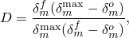

其中，是损伤起始时的有效牵引。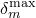指的是加载历史期间达到的有效分离的最大值。

| **输入文件用法：** | 使用以下选项指定线性损伤演化： |
| --- | --- |
|  | ``` [*DAMAGE EVOLUTION](../key/key-link.md#usb-kws-mdamageevolution), TYPE=ENERGY, SOFTENING=LINEAR ``` |

| **Abaqus/CAE用法：** | Interaction模块：接触属性编辑器：****Mechanical****Damage****：**Evolution**标签页：**Type**：**Energy**：**Softening**：**Linear** |
| --- | --- |

##### 指数损伤演化

对于指数软化，Abaqus使用损伤变量D的演化，退化为


在上述表达式中，和分别是有效牵引和分离。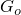是损伤起始时的弹性能。在这种情况下，牵引在损伤起始后可能不会立即下降，这与图37.1.10-5中看到的不同。

| **输入文件用法：** | 使用以下选项指定指数软化： |
| --- | --- |
|  | ``` [*DAMAGE EVOLUTION](../key/key-link.md#usb-kws-mdamageevolution), TYPE=ENERGY, SOFTENING=EXPONENTIAL ``` |

| **Abaqus/CAE用法：** | Interaction模块：接触属性编辑器：****Mechanical****Damage****：**Evolution**标签页：**Type**：**Energy**：**Softening**：**Exponential** |
| --- | --- |

#### 将损伤演化数据定义为模式混合的表格函数

如前所述，内聚界面处损伤演化的数据可以是模式混合的表格函数。在Abaqus中必须定义这种依赖性的方式在下面针对分别基于能量和牵引的模式混合定义进行概述。在下面的讨论中，假定演化以能量定义。对于基于有效分离的演化定义，也可以做出类似的观察。

##### 基于能量的模式混合

对于基于能量的模式混合定义，在具有各向异性剪切行为的三维分离状态的最一般情况下，断裂能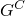必须定义为和的函数。量是剪切分离分数的度量，而是第二剪切方向分离占总剪切分离分数的度量。图37.1.10-6显示了断裂能与模式混合行为的示意图。

**图37.1.10-6** 断裂能作为模式混合的函数。

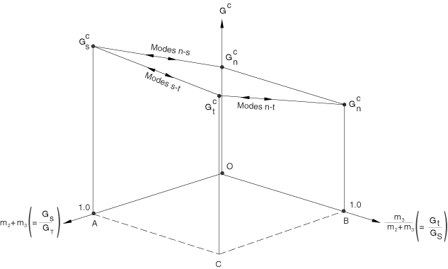

纯法向和第一剪切方向纯剪切以及第二剪切方向纯剪切的极限情况在图37.1.10-6中分别用、和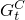表示。标记为"Modes n-s"、"Modes n-t"和"Modes s-t"的线分别显示从纯法向到第一方向纯剪切、纯法向到第二方向纯剪切以及第一和第二方向纯剪切之间的行为转换。通常，必须在各种固定的值下定义为的函数。在下面的讨论中，我们将与固定对应的对的数据集称为"数据块"。以下指南在将断裂能定义为模式混合的函数时很有用：
- 对于二维问题，仅需要定义作为（在这种情况下为）的函数。对应于的数据列必须留空。因此，基本上只需要一个"数据块"。
- 对于具有各向同性剪切响应的三维问题，剪切行为由和定义，而不是由和的单个值定义。因此，在这种情况下，单个"数据块"（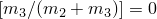的"数据块"）也足以定义断裂能作为模式混合的函数。
- 在具有各向异性剪切行为的三维问题的最一般情况下，需要几个"数据块"。如前所述，每个"数据块"将包含在固定值下对。在每个"数据块"中，可以在0到1.0之间变化。情况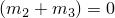（任何"数据块"中的第一个数据点）对应于纯法向模式，当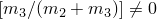时（即图37.1.10-6中线OB上唯一有效的点是O，对应于纯法向分离）永远无法实现。然而，在将断裂能定义为模式混合函数的表格定义中，这个点简单地用于设置一个极限，确保当从各种法向和剪切分离组合接近纯法向状态时，断裂能发生连续变化。因此，每个"数据块"中第一个数据点的断裂能必须始终设置为纯法向分离时的断裂能（）。作为各向异性剪切情况的示例，假设您要输入三个"数据块"，对应于固定的值分别为0.、0.2和1.0。对于三个"数据块"中的每一个，根据上面讨论的原因，第一个数据点必须是。每个"数据块"中的其余数据点定义了断裂能随剪切分离比例增加的变化。

##### 基于牵引的模式混合

断裂能需要以对和的表格形式指定。因此，需要在各种固定的值下定义为的函数。在这种情况下，"数据块"对应于在固定值下对的数据集。在每个"数据块"中，可以从0（纯法向分离）到1（纯剪切分离）。一个重要限制是，每个数据块必须为指定相同的断裂能值。这个限制确保了当牵引向量接近法向方向时，失效所需的能量不依赖于牵引向量在剪切平面上的投影方向（参见图37.1.10-2）。

### Abaqus/Standard中的粘性正则化

表现出各种软化行为和刚度降解形式的模型通常在Abaqus/Standard中导致严重的收敛困难。可以使用定义基于表面内聚行为的本构方程的粘性正则化来克服一些这些收敛困难。此技术也适用于内聚单元、紧固件损伤和Abaqus/Standard中的混凝土材料模型。粘性正则化阻尼导致定义接触应力的切线刚度矩阵对于足够小的时间增量为正。

整个模型与粘性正则化相关联的近似能量可使用输出变量ALLVD获得。

| **输入文件用法：** | ``` [*DAMAGE STABILIZATION](../key/key-link.md#usb-kws-mdamagestabilization) ``` |
| --- | --- |

| **Abaqus/CAE用法：** | Interaction模块：接触属性编辑器：****Mechanical****Damage****：**Stabilization**标签页：**Viscosity coefficient** |
| --- | --- |

### 失效后行为

可以指定两种类型的失效后行为来定义在从节点处达到最大降解值后该节点处的内聚行为。

默认情况下，一旦完全降解，将在节点处 enforcement 法向接触行为，不再 enforcement 内聚约束。如果从节点重新进入接触，渗透将产生压缩接触应力，如果有任何规定的摩擦模型，剪切方向将施加摩擦应力。分离可以发生而不会产生任何内聚应力。

在某些情况下，即使在达到最大降解后，也可能希望重新 enforcement 内聚行为。对于允许重复接触的内聚行为，当失效的从节点重新进入接触时，总体损伤变量将重新初始化为0。随后，法向分离可能产生拉伸内聚应力，剪切分离可能根据定义的内聚行为类型产生切向内聚应力。进一步加载可能再次导致内聚应力经历渐进损伤、降解和失效。

| **输入文件用法：** | 使用以下选项在最大降解后 enforcement 内聚行为： |
| --- | --- |
|  | ``` [*COHESIVE BEHAVIOR](../key/key-link.md#usb-kws-mcohesivebehavior), REPEATED CONTACTS ``` |

| **Abaqus/CAE用法：** | Interaction模块：接触属性编辑器：****Mechanical****Cohesive Behavior****：**Allow cohesive behavior during repeated post-failure contacts** |
| --- | --- |

### Abaqus/Explicit中的虚拟裂纹闭合技术

在Abaqus/Explicit中，基于表面的内聚行为框架可用于基于线性弹性断裂力学原理模拟脆性裂纹扩展问题。虚拟裂纹闭合技术（VCCT）断裂准则可用于模拟初始部分粘合表面中的裂纹扩展。有关此主题的详细讨论，请参见["裂纹扩展分析，" 第11.4.3节](pt04ch11s04aus69.md)。

VCCT断裂准则不能与牵引-分离响应的基于损伤的表面行为结合使用。但是，您可以将基于表面的VCCT断裂准则与内聚单元结合使用。VCCT可以模拟脆性失效/裂纹扩展，而内聚单元可以模拟粘合界面的其他方面，如缝合。

| **输入文件用法：** | 使用以下选项在最大降解后 enforcement 内聚行为： |
| --- | --- |
|  | ``` [*COHESIVE BEHAVIOR](../key/key-link.md#usb-kws-mcohesivebehavior) [*FRACTURE CRITERION](../key/key-link.md#usb-kws-hfracturecriterion), TYPE= VCCT ``` |

### 内聚表面与内聚单元

如上所述，基于表面的内聚行为的公式与具有牵引-分离响应的内聚单元的公式非常相似。但是，存在某些差异。

界面厚度效应永远不会考虑用于内聚表面；对于具有牵引-分离响应的内聚单元，可以通过指定界面非零厚度或要求从内聚单元的节点坐标确定初始本构厚度来纳入厚度效应。由于内聚表面不考虑厚度效应，用于描述具有厚度效应的牵引-分离内聚单元本构响应的材料属性可能无法直接重用于内聚表面。

对于内聚表面，内聚约束在每个从节点处 enforcement；在内聚单元中，内聚约束在材料点处计算（关于内聚单元中材料点的位置，请参见["二维内聚单元库，" 第32.5.8节](pt06ch32s05ael30.md)，和["三维内聚单元库，" 第32.5.9节](pt06ch32s05ael31.md)）。因此对于内聚表面，与主表面相比细化从表面可能会改善约束满足性和更准确的结果。

### 输出

除了Abaqus中可用的标准输出标识符（["Abaqus/Standard输出变量标识符，" 第4.2.1节](pt02ch04s02abv01.md)，和["Abaqus/Explicit输出变量标识符，" 第4.2.2节](pt02ch04s02xbv01.md)），以下变量对具有牵引-分离行为的内聚表面有特殊含义：

| CSDMG | 标量损伤变量D的总体值。 |
| --- | --- |

| CSMAXSCRT | 此变量指示最大接触应力损伤起始准则是否在接触点处满足。它计算为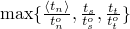。 |
| --- | --- |

| CSMAXUCRT | 此变量指示最大分离损伤起始准则是否在接触点处满足。它计算为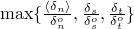。 |
| --- | --- |

| CSQUADSCRT | 此变量指示二次接触应力损伤起始准则是否在接触点处满足。它计算为。 |
| --- | --- |

| CSQUADUCRT | 此变量指示二次分离损伤起始准则是否在接触点处满足。它计算为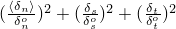。 |
| --- | --- |

对于上述指示是否满足某个损伤起始准则的变量，值小于1.0表示该准则未满足，而值为1.0表示该准则已满足。如果为此准则指定了损伤演化，此变量的最大值不超过1.0。

#### 额外参考

- Benzeggagh, M. L., and M. Kenane, "Measurement of Mixed-Mode Delamination Fracture Toughness of Unidirectional Glass/Epoxy Composites with Mixed-Mode Bending Apparatus," Composites Science and Technology, vol. 56, pp. 439--449, 1996.
- Camanho, P. P., and C. G. Davila, "Mixed-Mode Decohesion Finite Elements for the Simulation of Delamination in Composite Materials," NASA/TM-2002--211737, pp. 1--37, 2002.


