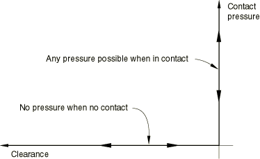
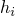
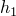
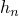
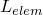
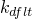
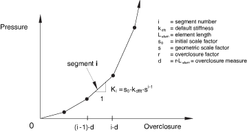
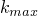
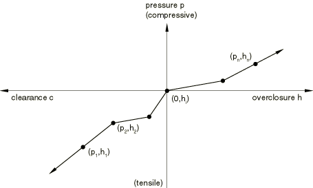

# 37.1.2 接触压力-过闭合关系


**产品：** Abaqus/Standard Abaqus/Explicit Abaqus/CAE

##### **参考资料**

- ["力学接触属性：概述，" 第37.1.1节](pt09ch37s01aus165.md)
- [*CONTACT CONTROLS](../key/key-link.md#usb-kws-hcontactcontrols)
- [*SURFACE BEHAVIOR](../key/key-link.md#usb-kws-hsurfacebehavior)
- ["创建相互作用属性，" Abaqus/CAE用户指南第15.12.2节](../usi/usi-link.md#usi-itn-helptopic-createprop)
- ["自定义接触控制，" Abaqus/CAE用户指南第15.12.3节](../usi/usi-link.md#usi-itn-helptopic-controls)

### 概述

在Abaqus中，可以使用以下接触压力-过闭合关系来定义接触模型：
- "硬"接触关系，使从表面在约束位置对主表面的穿透最小化，不允许界面传递拉应力；
- "软化"接触关系，其中接触压力是表面之间间隙的线性函数；
- "软化"接触关系，其中接触压力是表面之间间隙的指数函数（在Abaqus/Explicit中，此关系仅适用于接触对算法）；
- "软化"接触关系，其中通过逐步缩放默认罚刚度构建表格压力-过闭合曲线（仅在Abaqus/Explicit的一般接触中可用）；
- "软化"接触关系，其中接触压力是表面之间间隙的分段线性（表格）函数；以及
- 一种关系，其中表面一旦接触就不会分离。

此外，可以定义影响压力-过闭合关系的粘性阻尼关系；有关更多信息，请参见["接触阻尼，" 第37.1.3节](pt09ch37s01aus167.md)。在Abaqus/Standard中，可以施加压力渗透载荷来模拟两个接触体之间表面之间流体的渗透；请参见["压力渗透载荷，" 第37.1.7节](pt09ch37s01aus171.md)。

### 在接触属性定义中包含接触压力-过闭合关系

默认情况下，"硬"接触压力-过闭合关系用于基于表面的接触和基于单元的接触。您可以在特定接触属性定义中包含非默认的接触压力-过闭合关系。

| **输入文件用法：** | 对基于表面的接触同时使用以下两个选项： |
| --- | --- |
|  | ``` [*SURFACE INTERACTION](../key/key-link.md#usb-kws-hsurfaceinteraction), NAME=*interaction_property_name* [*SURFACE BEHAVIOR](../key/key-link.md#usb-kws-hsurfacebehavior) ``` 对Abaqus/Standard中基于单元的接触同时使用以下两个选项： ``` [*INTERFACE](../key/key-link.md#usb-kws-minterface) or [*GAP](../key/key-link.md#usb-kws-mgap), ELSET=*name* [*SURFACE BEHAVIOR](../key/key-link.md#usb-kws-hsurfacebehavior) ``` |

| **Abaqus/CAE用法：** | Interaction模块：接触属性编辑器：****Mechanical****Normal Behavior****：**Constraint enforcement method: Default** |
| --- | --- |
|  | Abaqus/CAE不支持基于单元的接触。 |

### 使用"硬"接触关系

最常见的接触压力-过闭合关系如图37.1.2-1所示，尽管零穿透条件可能严格 enforcement 或近似 enforcement，取决于所使用的约束 enforcement 方法（约束 enforcement 方法在["Abaqus/Standard中的接触约束 enforcement 方法，" 第38.1.2节](pt09ch38s01aus178.md)和["Abaqus/Explicit中的接触约束 enforcement 方法，" 第38.2.3节](pt09ch38s02aus182.md)中讨论）。当表面接触时，它们之间可以传递任何接触压力。当接触压力减小到零时，表面分离。当表面之间的间隙减小到零时，分离的表面进入接触。

| **输入文件用法：** | ``` [*SURFACE BEHAVIOR](../key/key-link.md#usb-kws-hsurfacebehavior) (省略 PRESSURE-OVERCLOSURE 参数以获得默认的"硬"压力-过闭合关系) ``` |
| --- | --- |

| **Abaqus/CAE用法：** | Interaction模块：接触属性编辑器：****Mechanical****Normal Behavior****：**Constraint enforcement method: Default**：**Pressure-Overclosure: "Hard" Contact** |
| --- | --- |

**图37.1.2-1** 默认压力-过闭合关系。



### 使用"软化"接触关系

Abaqus中提供了三种类型的"软化"接触关系。压力-过闭合关系可以通过线性定律、表格分段线性定律或指数定律来规定（在Abaqus/Explicit中，仅与接触对算法一起可用）。

对于涉及基于单元的表面和基于单元的接触（仅在Abaqus/Standard中可用），"软化"接触关系以过闭合（或间隙）与接触压力的形式指定。对于涉及基于节点的表面或节点接触单元（如GAP和ITT单元）的情况，其中未定义面积或长度尺寸，软化接触以过闭合（或间隙）与接触力的形式指定。对于Abaqus/Standard中梁类型单元上的从表面和Abaqus/Explicit中的接触对算法，将压力指定为每单位长度的力。如果Abaqus/Explicit中使用一般接触算法对于梁类型单元上的从表面，将压力指定为每单位面积的力。

当在Abaqus/Explicit中使用在零过闭合时具有非零压力的软化接触关系（不适用于一般接触算法）时，您应该知道分析中可能存在初始非平衡接触压力（参见["调整Abaqus/Explicit中接触对的初始表面位置和指定初始间隙，" 第36.5.4节](pt09ch36s05aus163.md)）。

#### "软化"接触与"硬"接触

"软化"接触压力-过闭合关系可用于在一个或两个表面上建模柔软的薄层。在Abaqus/Standard中，它们有时对于数值原因也有用，因为它们可以更容易地解析接触条件。

#### 在隐式动态模拟中使用"软化"接触

在隐式动态冲击模拟中谨慎使用软化接触关系。如果在这种模拟中使用此关系，Abaqus/Standard将不使用冲击算法（在冲击发生时破坏表面节点动能的算法），而是假定为完全弹性碰撞。这种改变的结果是从节点在撞击主表面后立即弹回；因此，可能会产生大量的"抖动"，导致收敛问题和小时间增量。

但是，软化接触可能在隐式动态计算中表现良好，其中冲击效应不重要；例如，如果接触变化主要由沿着曲面的滑动运动引起，如低速金属成形应用中可能发生的那样。

#### 在显式动态模拟中使用"软化"接触

在Abaqus/Explicit中，软化接触可以使用运动或罚约束 enforcement 方法来 enforcement（详细信息请参见["Abaqus/Explicit中的接触约束 enforcement 方法，" 第38.2.3节](pt09ch38s02aus182.md)）。对于罚 enforcement，接触碰撞是弹性的，除了接触阻尼的影响，而对于软化运动接触，由于算法特性，一些能量将被吸收：吸收的能量趋向于随接触刚度增加而增加。另一个考虑是对时间增量的影响：对于运动 enforcement，稳定时间增量与接触刚度无关，但对于罚接触，时间增量随接触刚度增加而减小。

#### 定义为线性函数的"软化"接触

在线性压力-过闭合关系中，当表面之间的过闭合（沿接触（法向）方向测量）大于零时，表面传递接触压力。线性压力-过闭合关系与两个数据点的表格关系相同，第一个点位于原点。

您指定压力-过闭合关系的斜率k。

| **输入文件用法：** | ``` [*SURFACE BEHAVIOR](../key/key-link.md#usb-kws-hsurfacebehavior), PRESSURE-OVERCLOSURE=LINEAR *k* ``` |
| --- | --- |

| **Abaqus/CAE用法：** | Interaction模块：接触属性编辑器：****Mechanical****Normal Behavior****：**Constraint enforcement method: Default**：**Pressure-Overclosure: Linear**，**Contact stiffness:** *k* |
| --- | --- |

#### 以表格形式定义的"软化"接触

要以表格形式定义分段线性压力-过闭合关系（如图37.1.2-2所示），您指定压力与过闭合的数据对（, ）（其中过闭合对应于负间隙）。您必须将数据指定为压力和过闭合的递增函数。在此关系中，当表面之间的过闭合（沿接触（法向）方向测量）大于时，表面传递接触压力，其中是零压力处的过闭合。对于Abaqus/Explicit中的通用接触算法，必须为零。对于大于的过闭合，压力-过闭合关系基于从用户指定数据计算的最后一个斜率进行外推（参见图37.1.2-2）。

**图37.1.2-2** 以表格形式定义的"软化"压力-过闭合关系。


| **输入文件用法：** | ``` [*SURFACE BEHAVIOR](../key/key-link.md#usb-kws-hsurfacebehavior), PRESSURE-OVERCLOSURE=TABULAR ``` |
| --- | --- |

| **Abaqus/CAE用法：** | Interaction模块：接触属性编辑器：****Mechanical****Normal Behavior****：**Constraint enforcement method: Default**：**Pressure-Overclosure: Tabular** |
| --- | --- |

#### 通过几何缩放默认接触刚度定义的"软化"接触

可以通过几何缩放默认接触刚度来构建替代分段线性表格压力-过闭合关系。此模型提供了一个简单的界面，可在超过临界穿透时增加默认接触刚度。穿透度量可以直接定义，也可以定义为接触区域中最小单元长度的分数，。每次当前穿透超过此穿透度量的倍数时，接触刚度按因子缩放（参见图37.1.2-3）。初始刚度设置为默认接触刚度乘以因子。

**图37.1.2-3** "软化"缩放因子压力-过闭合关系。



此选项仅在Abaqus/Explicit的通用接触算法中可用。

| **输入文件用法：** | ``` [*SURFACE BEHAVIOR](../key/key-link.md#usb-kws-hsurfacebehavior), PRESSURE-OVERCLOSURE=SCALE FACTOR ``` |
| --- | --- |

| **Abaqus/CAE用法：** | Interaction模块：接触属性编辑器：****Mechanical****Normal Behavior****：**Constraint enforcement method: Default**：**Pressure-Overclosure: Scale Factor (General Contact)** |
| --- | --- |

#### 用指数定律定义的"软化"接触

在指数（软）接触压力-过闭合关系中，一旦表面之间的间隙（沿接触（法向）方向测量）减小到，表面开始传递接触压力。随着间隙继续减小，表面之间传递的接触压力呈指数增加。图37.1.2-4在Abaqus/Standard中说明了此行为。在Abaqus/Explicit中，此行为仅适用于接触对算法。

**图37.1.2-4** Abaqus/Standard中的指数"软化"压力-过闭合关系。


在Abaqus/Explicit中，您可以指定模型可达到的接触刚度的可选上限（参见图37.1.2-5）；此限制对罚接触很有用，以减轻大刚度对减少稳定时间增量的影响。

**图37.1.2-5** Abaqus/Explicit中的指数"软化"压力-过闭合关系。


默认情况下，将设置为运动接触的无穷大和罚接触的默认罚刚度。

您指定；零间隙时的接触压力；以及在Abaqus/Explicit中可选的。

| **输入文件用法：** | ``` [*SURFACE BEHAVIOR](../key/key-link.md#usb-kws-hsurfacebehavior), PRESSURE-OVERCLOSURE=EXPONENTIAL , ,  ``` |
| --- | --- |

| **Abaqus/CAE用法：** | Interaction模块：接触属性编辑器：****Mechanical****Normal Behavior****：**Constraint enforcement method: Default**：**Pressure-Overclosure: Exponential**，**Pressure** ，**Clearance** ，**Specify：**  |
| --- | --- |

### 使用不分离关系

您可以指示Abaqus使用防止表面一旦接触就分离的接触压力-过闭合关系。在Abaqus/Explicit中，此关系可以为一般接触指定，但仅适用于纯主-从接触对，不能与自适应网格划分一起使用。

不分离关系通常与粗糙摩擦模型结合使用（参见["摩擦行为，" 第37.1.5节](pt09ch37s01aus169.md)）来建模非间歇性粗糙摩擦接触。使用这种表面相互作用模型组合会导致表面一旦接触就保持完全粘合（无分离和无切向滑动），即使它们之间的接触压力是拉伸的。

| **输入文件用法：** | ``` [*SURFACE BEHAVIOR](../key/key-link.md#usb-kws-hsurfacebehavior), NO SEPARATION ``` |
| --- | --- |

| **Abaqus/CAE用法：** | Interaction模块：接触属性编辑器：****Mechanical****Normal Behavior****：**Constraint enforcement method: Default**：**Pressure-Overclosure: Hard**，关闭**Allow separation after contact** |
| --- | --- |

#### Abaqus/Explicit中具有不分离关系的"软化"接触

在Abaqus/Explicit中，如果将软化接触关系与不分离关系一起指定，压力-过闭合关系将包括拉伸行为。指数关系不能与不分离行为一起使用。对于表格关系，必须在零压力轴上指定一个点，斜率将遵循与前两个数据点相同的斜率进入拉伸状态（参见图37.1.2-6）。线性关系将具有与压缩行为使用的斜率相同的线性拉伸压力-过闭合关系。

**图37.1.2-6** Abaqus/Explicit中具有拉伸行为的分段线性"软化"压力-过闭合关系。



### 与接触压力-过闭合相关的表面相互作用输出变量

Abaqus/Standard将间隙COPEN和接触压力CPRESS都输出到数据、结果和输出数据库文件。向这些文件的输出请求如["输出到数据和结果文件，" 第4.1.2节](pt02ch04s01aus39.md)和["输出到输出数据库，" 第4.1.3节](pt02ch04s01aus40.md)中所述进行。

Abaqus/Explicit将接触压力CPRESS输出到输出数据库文件（详细信息请参见["输出到输出数据库，" 第4.1.3节](pt02ch04s01aus40.md)）。

在数据、结果和输出数据库文件中，输出变量CPRESS对于开放从节点给出粘性阻尼压力。对于闭合从节点，此变量也给出接触压力。在打印输出中，"VD"状态表示力是粘性阻尼力。

可以在Abaqus/CAE中绘制从表面上的接触压力等值线。


