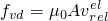
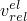
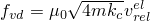
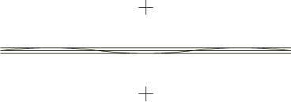
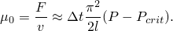

# 37.1.3 接触阻尼


**产品：** Abaqus/Standard Abaqus/Explicit Abaqus/CAE

##### **参考资料**

- ["力学接触属性：概述，" 第37.1.1节](pt09ch37s01aus165.md)
- [*CONTACT DAMPING](../key/key-link.md#usb-kws-hcontactdamping)
- ["创建相互作用属性，" Abaqus/CAE用户指南第15.12.2节](../usi/usi-link.md#usi-itn-helptopic-createprop)

### 概述

接触阻尼：
- 可以定义为反对相互作用表面之间的相对运动（除了在["接触压力-过闭合关系，" 第37.1.2节](pt09ch37s01aus166.md)中讨论的接触压力-过闭合关系，以及在["摩擦行为，" 第37.1.5节](pt09ch37s01aus169.md)中讨论的摩擦模型）；
- 可以影响表面法向和切向的运动；
- 在法向方向与表面之间的相对速度成正比；
- 在切向方向，在Abaqus/Standard中与相对切向速度成正比，在Abaqus/Explicit中与与摩擦相关的"弹性滑移率"成正比（关于弹性滑移的讨论请参见["摩擦行为，" 第37.1.5节](pt09ch37s01aus169.md)）——因此，在Abaqus/Explicit中，它不抵抗大部分切向滑动；
- 不适用于线性扰动过程；
- 在Abaqus/Standard中，它有助于力和刚度定义，通常应仅在根本无法获得解的情况下使用——在Abaqus/Standard中允许粘性压力和剪切应力在接触表面之间传递以减少由于接触约束突然违反而导致的收敛困难（在某些涉及接触的 snap-through 和屈曲问题中很常见）的最佳方法是按步骤使用接触控制指定阻尼，如["在Abaqus/Standard中调整接触控制"中"刚体运动的自动稳定"第36.3.6节](pt09ch36s03aus150.md#usb-cni-acontacttrouble-stabilize)中所讨论；以及
- 在Abaqus/Explicit中有助于减少解噪声——默认情况下，小量粘性接触阻尼用于Abaqus/Explicit中的软化接触和罚接触，如下所述。

### 为表面相对运动定义粘性接触阻尼

在Abaqus/Standard中，阻尼系数是表面间隙的函数，如图37.1.3-1所示。阻尼系数定义为与速度成比例的常数的单位为压力除以速度。

**图37.1.3-1** Abaqus/Standard中粘性阻尼的阻尼系数-间隙关系。


在Abaqus/Explicit中，阻尼系数将在表面接触时保持指定常数值，否则为零。阻尼系数可以定义为压力除以速度的比例常数，也可以定义为临界阻尼的无量纲分数。

要定义粘性阻尼，必须将其包含在接触属性定义中。

| **输入文件用法：** | 对基于表面的接触同时使用以下两个选项： |
| --- | --- |
|  | ``` [*SURFACE INTERACTION](../key/key-link.md#usb-kws-hsurfaceinteraction), NAME=*interaction_property_name* [*CONTACT DAMPING](../key/key-link.md#usb-kws-hcontactdamping) ``` 对Abaqus/Standard中基于单元的接触同时使用以下两个选项： ``` [*INTERFACE](../key/key-link.md#usb-kws-minterface) or [*GAP](../key/key-link.md#usb-kws-mgap), ELSET=*name* [*CONTACT DAMPING](../key/key-link.md#usb-kws-hcontactdamping) ``` |

| **Abaqus/CAE用法：** | Interaction模块：接触属性编辑器：****Mechanical****Damping**** |
| --- | --- |
|  | Abaqus/CAE不支持基于单元的接触。 |

#### 阻尼和压力-过闭合关系

在Abaqus/Standard中，粘性阻尼关系可用于任何接触关系（参见["接触压力-过闭合关系，" 第37.1.2节](pt09ch37s01aus166.md)）。

在Abaqus/Explicit中，接触阻尼不适用于硬运动接触。软化运动接触和所有罚接触具有形式为临界阻尼分数 = 0.03的默认阻尼。

#### 指定阻尼系数，使阻尼力直接与表面之间相对运动速率成正比

您可以直接以阻尼系数的形式指定阻尼，单位为压力除以速度，阻尼力将用计算，其中A是节点面积，是两个表面之间相对运动的速率。

对于涉及基于单元的表面和基于单元的接触（仅在Abaqus/Standard中可用），阻尼系数以接触压力的形式指定。对于涉及基于节点的表面或节点接触单元（如GAP单元和ITT单元）的情况，这些单元未定义面积或长度尺寸，必须指定为力除以速度。对于梁类型单元上的从表面，将指定为每单位长度每速度的力。

| **输入文件用法：** | 在Abaqus/Standard中使用以下语法： |
| --- | --- |
|  | ``` [*CONTACT DAMPING](../key/key-link.md#usb-kws-hcontactdamping), DEFINITION=DAMPING COEFFICIENT , ,  ``` 在Abaqus/Explicit中使用以下语法： ``` [*CONTACT DAMPING](../key/key-link.md#usb-kws-hcontactdamping), DEFINITION=DAMPING COEFFICIENT  ``` |

| **Abaqus/CAE用法：** | 在Abaqus/Standard中使用以下语法： |
| --- | --- |
|  | Interaction模块：接触属性编辑器：****Mechanical****Damping****：**Definition: Damping coefficient**，**Linear**或**Bilinear**，**Damping Coeff.** ，**Clearance** *c*和（对于**Linear**为=0，对于**Bilinear**为 在Abaqus/Explicit中使用以下语法：Interaction模块：接触属性编辑器：****Mechanical****Damping****：**Definition: Damping coefficient**，**Step**，**Damping Coeff.**  |

#### 在Abaqus/Explicit中将阻尼系数指定为临界阻尼的分数

在Abaqus/Explicit中，您可以以与接触刚度相关的临界阻尼分数的形式指定无量纲阻尼系数；此方法在Abaqus/Standard中不可用。阻尼力将用计算，其中m是节点质量，是节点接触刚度（单位为），, DEFINITION=CRITICAL DAMPING FRACTION *critical damping fraction* ``` |
| --- | --- |

| **Abaqus/CAE用法：** | Interaction模块：接触属性编辑器：****Mechanical****Damping****：**Definition: Critical damping fraction**，**Crit. Damping Fraction** *critical damping fraction* |
| --- | --- |

#### 指定切向阻尼系数

您可以指定切向阻尼系数与法向阻尼系数的比率，也称为切向分数。

切向阻尼使用与法向阻尼相同形式的阻尼。切向阻尼只能与法向阻尼一起指定。如果在Abaqus/Standard中激活切向阻尼，阻尼应力与相对切向速度成正比。在Abaqus/Explicit中，如果切向方向使用硬运动接触或未定义摩擦，则切向阻尼将被忽略。如前所述，在Abaqus/Explicit中，切向方向的阻尼与弹性滑移率（参见["摩擦行为，" 第37.1.5节](pt09ch37s01aus169.md)）成正比，而不是与相对滑动的总速率成正比。

对于Abaqus/Standard，切向分数的默认值为0.0；因此，默认情况下，切向方向的阻尼系数为零。对于Abaqus/Explicit，切向分数的默认值为1.0；因此，默认情况下，切向方向的阻尼系数等于法向方向的阻尼系数。此外，在Abaqus/Explicit中，软化接触和硬罚接触具有0.03的默认临界阻尼分数。

| **输入文件用法：** | ``` [*CONTACT DAMPING](../key/key-link.md#usb-kws-hcontactdamping), TANGENT FRACTION=*value* ``` |
| --- | --- |

| **Abaqus/CAE用法：** | Interaction模块：接触属性编辑器：****Mechanical****Damping****：**Tangent fraction：****Specify value：** *value* |
| --- | --- |

### 在Abaqus/Standard中选择粘性阻尼的适当系数

在Abaqus/Standard中，局部接触阻尼因子的适当大小是问题相关的。在某些情况下，可以使用简单计算来确定大小；在其他情况下，必须通过试错法确定的合理值。合理的值是对模型中不稳定行为之前的结果影响最小的值。可以通过在添加阻尼之前查看模型中的接触压力和速度来找到初步值，如下所述。

如果难以在不稳定行为之前确定节点速度（如果输出请求不频繁），则可以使用消息（`.msg`）文件中的信息来估计峰值节点速度。默认情况下，Abaqus/Standard在此文件中每个收敛增量提供峰值节点位移增量。此位移增量可与时间增量一起使用，以计算模型的峰值节点速度。虽然此速度可能不太接近表面的实际相对速度，但它应该在数量级内，是计算初始粘性阻尼系数的合理值。

还需要估计表面之间的最大接触压力。然后应将粘性阻尼系数设置为估算最大接触压力与计算节点速度之比小几个数量级的值。

如果无法按照上述讨论获得压力和速度，则应首先使用高阻尼值，并使用越来越小的值重复分析。的适当值足够大以使分析通过任何不稳定响应，但不会大到显著影响早期或后期结果。["圆拱的 snap-through 屈曲分析，" Abaqus例题指南第1.2.1节](../exa/exa-link.md#exa-sta-snapbuckling)演示了如何使用上述方法确定阻尼系数的大小。

以下示例概述了典型情况下如何选择值。考虑对二维Euler柱屈曲问题进行简单修改：在柱两侧添加平行刚性表面，以便在屈曲时梁将接触表面。随着轴向载荷超过屈曲载荷，柱将压平在表面上。然后，接触中点将离开表面，梁将屈曲成更高模式。图37.1.3-2显示了此形状。

**图37.1.3-2** 用于粘性阻尼的约束Euler屈曲示例。



当柱首次屈曲时，柱施加在一个刚性表面上的接触力F可以近似为


其中h是刚性表面之间的分离距离，l是梁长度，P是施加的载荷，是屈曲载荷。

接触力的近似包含这样的假设：单个点接触，并且屈曲柱的形状不变。的单位是每速度的接触力，假定在此模型中使用基于节点的表面。柱在接触点的速度v可以近似为


其中是时间增量。这些对接触力和柱速度的估计给出了阻尼系数的值：



此值可用作起始值，但应测试不同的值。


