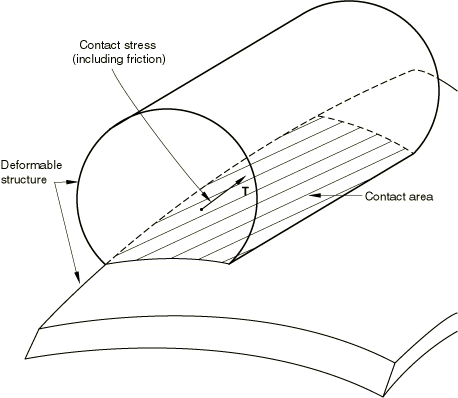
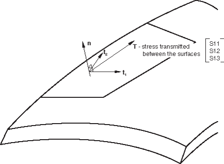
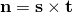
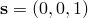

# 40.4.1 滑动线接触单元


**产品：** Abaqus/Standard

**参考资料**

- ["轴对称滑动线单元库，" 第40.4.2节](pt09ch40s04ael51.md)
- [*INTERFACE](../key/key-link.md#usb-kws-minterface)
- [*SLIDE LINE](../key/key-link.md#usb-kws-mslideline)

### 概述

滑动线单元：
- 当滑动沿一条位于特定平面内的线（"滑动线"）发生时，可以模拟两个变形体之间的有限滑动相互作用；
- 假设垂直于滑动线的切向运动为零或很小（Abaqus/Standard将此类运动视为无限小）；
- 可与轴对称应力/位移单元一起使用；
- 推荐用于特定应用，例如当接触面是子结构的表面时，或当CAXA或SAXA单元参与接触时；
- 可用于一阶和二阶单元；以及
- 使用与基于表面的接触中相同的"主-从"概念来施加接触约束。

关于接触建模的一般讨论，请参见[第36章，"定义接触相互作用"](pt09ch36.md)。

### 使用滑动线模拟变形体之间的接触

确定接触区域和接触结构之间的表面牵引力是Abaqus模拟的常见目标（参见[图40.4.1-1](pt09ch40s04alm66.md#eslideline-def)）。滑动线和滑动线接触单元可以为两个结构都是变形的且结构沿明确规定的线发生有限滑动的模拟提供这些信息。

**图40.4.1-1** 变形结构之间的相互作用。



### 接触应力和物体相对运动的局部基系统

Abaqus/Standard以附着在滑动线表面的局部基系统报告结构之间的接触应力和相对运动。局部基系统由滑动线的法向定义，，和两个正交的局部切向方向，和（参见[图40.4.1-2](pt09ch40s04alm66.md#eslideline-local-sys)）。

**图40.4.1-2** 界面接触法向和剪切牵引力的局部系统。



#### 定义局部基系统

形成滑动线的节点序列定义了切向，。由滑动线法向，，和形成的平面称为接触平面。Abaqus/Standard将滑动线法向定义为（参见[图40.4.1-3](pt09ch40s04alm66.md#eslideline-local-basis)），其中是垂直于接触平面的向量。

如图[图40.4.1-3](pt09ch40s04alm66.md#eslideline-local-basis)所示，滑动线使用节点*i*、*j*、*k*、...、*p*创建，按该顺序指定，从而识别滑动线切向。节点*I*、*J*、*K*、...、*N*是与此滑动线关联的滑动线单元的节点。滑动线法向通过指定

滑动线的切向与局部基系统的第一个局部切向方向，，方向与。滑动线可以由线性段或抛物线段组成，这取决于模型是由一阶单元还是二阶单元组成。在任何一种情况下，通过平滑滑动线都可以改善收敛。

#### 定义线性滑动线

当物体的表面用一阶单元meshed时，定义由线性单元段组成的滑动线。如[图40.4.1-4](pt09ch40s04alm66.md#eslideline-1st-order)所示，节点*i*、*j*、*k*、...、*p*按该顺序指定，从而识别从*i*通过*p*的滑动线。节点*I*、*J*、*K*、...、*N*是与此滑动线关联的ISL型单元的节点。

| **输入文件用法：** | ``` [*SLIDE LINE](../key/key-link.md#usb-kws-mslideline), ELSET=*element_set_name*, TYPE=LINEAR *第一个节点编号，第二个节点编号，等等* ``` |
| --- | --- |

**图40.4.1-4** 一阶（线性）滑动线示例。


#### 定义抛物线滑动线

当物体的表面用二阶单元meshed时，定义由二阶单元段组成的滑动线。在这种情况下，滑动线应由奇数个节点组成。如[图40.4.1-5](pt09ch40s04alm66.md#eslideline-2nd-order)所示，节点*i*、*j*、*k*、...、*u*按该顺序指定，从而识别从*i*通过*u*的滑动线。节点*I*、*J*、*K*、...、*O*是与此滑动线关联的ISL型单元的节点。

**图40.4.1-5** 二阶（抛物线）滑动线示例。


| **输入文件用法：** | ``` [*SLIDE LINE](../key/key-link.md#usb-kws-mslideline), ELSET=*element_set_name*, TYPE=PARABOLIC *第一个节点编号，第二个节点编号，等等* ``` |
| --- | --- |

#### 生成滑动线节点

或者，您可以指示应生成滑动线节点，仅指定第一个节点编号、最后一个节点编号和节点编号之间的增量。

| **输入文件用法：** | ``` [*SLIDE LINE](../key/key-link.md#usb-kws-mslideline), ELSET=*element_set_name*, GENERATE *第一个节点编号，最后一个节点编号，节点编号之间的增量* ``` |
| --- | --- |

#### 平滑滑动线

通过平滑滑动线段之间表面切向的不连续性，通常可以改善收敛，从而提供沿滑动线平滑变化的切向。有关平滑滑动线的详细信息，请参见["Abaqus/Standard中的接触公式，" 第38.1.1节](pt09ch38s01aus177.md)。

### 定义滑动线单元（从表面）

许多有限滑动接触模拟可以使用表面接触方法（参见[第36章，"定义接触相互作用"](pt09ch36.md)）来定义模型。轴对称应力/位移和耦合温度-位移滑动线单元仅推荐用于特定应用，例如当接触表面是子结构的表面时，或当CAXA或SAXA单元参与接触时（参见["如果存在非对称-轴对称单元时的接触建模，" 第36.3.10节](pt09ch36s03aus154.md)）。

滑动线接触单元定义从表面。与从表面上每个节点关联的接触面积是使用滑动线接触单元的当前长度和分配给单元的恒定"宽度"计算的，这取决于底层有限单元。

### 将滑动线单元与滑动线关联

您必须将滑动线与一组滑动线接触单元关联。有关定义滑动线的详细信息，请参见下文。

| **输入文件用法：** | ``` [*SLIDE LINE](../key/key-link.md#usb-kws-mslideline), ELSET=*element_set_name* ``` |
| --- | --- |

### 定义滑动线单元的截面属性

您必须将截面属性与一组滑动线单元关联。

轴对称滑动线单元没有截面数据。

| **输入文件用法：** | ``` [*INTERFACE](../key/key-link.md#usb-kws-minterface), ELSET=*element_set_name* ``` |
| --- | --- |

### 使用滑动线单元定义非默认机械表面相互作用

默认情况下，Abaqus/Standard对滑动线单元使用"硬"、无摩擦接触。您可以分配可选的机械表面相互作用模型。以下机械表面相互作用模型可用：
- 摩擦。详细信息请参见["摩擦行为，" 第37.1.5节](pt09ch37s01aus169.md)。
- 改进的"硬"接触、软化接触和粘性阻尼。详细信息请参见["接触压力-闭合关系，" 第37.1.2节](pt09ch37s01aus166.md)，和["接触阻尼，" 第37.1.3节](pt09ch37s01aus167.md)。

### 获取可跨轴对称滑动线传输的"最大扭矩"

当使用轴对称单元（CAX和CGAX型单元）通过滑动线建模接触时，Abaqus/Standard可以计算可跨轴对称滑动线传输的最大扭矩。此功能在建模螺纹连接器时通常很有用。最大扭矩*T*定义为


其中*p*是跨界面传输的压力，*r*是到界面上某点的半径，*s*是沿*r*–*z*平面中介面的当前距离。这种"扭矩"定义有效地假设摩擦系数为1。

您可以请求将此扭矩输出写入数据（`.dat`）文件。数据针对模型中的每个滑动线提供。您可以指定输出频率以限制Abaqus/Standard写入此输出到数据文件的频率。默认输出频率为1。

对于使用轴对称单元的基于表面的接触，输出变量CTRQ提供与此扭矩输出请求类似的功能（参见["在Abaqus/Standard中定义接触对，" 第36.3.1节](pt09ch36s03aus145.md)）。

| **输入文件用法：** | ``` [*TORQUE PRINT](../key/key-link.md#usb-kws-htorqueprint), FREQUENCY=*n* ``` |
| --- | --- |

