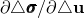

# 37.1.6 用户定义的界面本构行为


**产品：** Abaqus/Standard  Abaqus/Explicit  

##### **参考文献**

- ["UINTER," Abaqus User Subroutines Reference Guide 第1.1.39节](../sub/sub-link.md#sub-rtn-uuinter)
- ["VUINTER," Abaqus User Subroutines Reference Guide 第1.2.18节](../sub/sub-link.md#sub-rtn-uexpinter)
- ["VUINTERACTION," Abaqus User Subroutines Reference Guide 第1.2.19节](../sub/sub-link.md#sub-rtn-uexpuinteraction)
- [*SURFACE INTERACTION](../key/key-link.md#usb-kws-hsurfaceinteraction)

### 概述

用户定义的界面本构行为：
- 提供，以便任何跨界面的本构行为都可以添加到现有模型库中，如软化接触和库仑摩擦；
- 需要在用户子程序[`UINTER`](../sub/sub-link.md#sub-xsl-uinter)中为界面编程本构模型（或模型库）Abaqus/Standard；
- 需要在用户子程序[`VUINTER`](../sub/sub-link.md#sub-xsl-vuinter)中为界面编程本构模型（或模型库）Abaqus/Explicit使用接触对算法时；
- 需要在用户子程序[`VUINTERACTION`](../sub/sub-link.md#sub-xsl-vuinteraction)中为界面编程本构模型（或模型库）Abaqus/Explicit使用通用接触算法时；
- 仅适用于涉及应力/位移、耦合温度-位移、耦合热-电-结构或热传递分析的基于表面的接触定义；并且
- 需要相当大的努力和专业知识：该功能非常通用和强大，但面向高级用户。

### 用户子程序[`UINTER`](../sub/sub-link.md#sub-xsl-uinter)、[`VUINTER`](../sub/sub-link.md#sub-xsl-vuinter)和[`VUINTERACTION`](../sub/sub-link.md#sub-xsl-vuinteraction)的用途

用户子程序[`UINTER`](../sub/sub-link.md#sub-xsl-uinter)、[`VUINTER`](../sub/sub-link.md#sub-xsl-vuinter)和[`VUINTERACTION`](../sub/sub-link.md#sub-xsl-vuinteraction)为您提供了非常通用的界面来定义两个表面之间界面的本构行为。这些子程序替换所有内置的界面本构行为模型；因此，不能与它们一起指定其他接触属性定义（如摩擦、热传导等）。

在应力/位移分析中，您必须定义当前时间点上从属节点（或从属表面上的点）上的法向和切向应力。在耦合温度-位移分析和耦合热-电-结构分析中，您还必须定义跨界面的热通量。本构计算涉及基于从属节点相对于主表面的相对位置增量（在这些上下文中充当应变）、表面温度和预定义场变量来计算应力和热通量。计算通常涉及解相关的状态变量，这些变量可以在这些例程中更新。如果要在界面本构模型中包含接触阻尼，则必须在应力定义中包含阻尼贡献。

当使用用户子程序定义界面本构行为时，关于从属节点接触状态的所有决定必须基于提供的信息在子程序内部进行。您可以根据从属表面上点相对于主表面的相对位置的值和适当定义解相关的状态变量做出此类决定。因此，此功能的使用不仅涉及开发界面的本构行为，还涉及开发在从属表面上给定点的接触处于活动状态的条件。界面始终被视为无质量的。

用户子程序[`UINTER`](../sub/sub-link.md#sub-xsl-uinter)将在Abaqus/Standard分析的每次迭代中为每个受影响的接触对的每个接触约束位置调用。此用户子程序的输入包括从属表面上特定约束点相对于主表面对应最近点的当前相对位置，以及这两个点之间的增量相对运动。约束点在从属表面上的温度和场变量的值以及主表面对应最近点上的温度和场变量的值，以及其他几个变量，也作为输入提供。此外，除了定义接触应力或热通量外，还必须定义适当的Jacobian项，以确保Abaqus/Standard的适当收敛特性。

用户子程序[`VUINTER`](../sub/sub-link.md#sub-xsl-vuinter)将在Abaqus/Explicit分析的每个时间增量中多次调用受影响的接触对。在每次调用[`VUINTER`](../sub/sub-link.md#sub-xsl-vuinter)时处理所有从属节点，而每次调用[`UINTER`](../sub/sub-link.md#sub-xsl-uinter)时仅处理单个约束。向[`VUINTER`](../sub/sub-link.md#sub-xsl-vuinter)提供的输入与[`UINTER`](../sub/sub-link.md#sub-xsl-uinter)类似。

用户子程序[`VUINTERACTION`](../sub/sub-link.md#sub-xsl-vuinteraction)将在Abaqus/Explicit分析的每个时间增量中为每个相互作用的表面多次调用。在对[`VUINTERACTION`](../sub/sub-link.md#sub-xsl-vuinteraction)的调用中，以块的形式处理给定相互作用的潜在接触点。向[`VUINTERACTION`](../sub/sub-link.md#sub-xsl-vuinteraction)提供的输入与[`VUINTER`](../sub/sub-link.md#sub-xsl-vuinter)类似。

### 界面常数

您必须指定用户子程序[`UINTER`](../sub/sub-link.md#sub-xsl-uinter)、[`VUINTER`](../sub/sub-link.md#sub-xsl-vuinter)或[`VUINTERACTION`](../sub/sub-link.md#sub-xsl-vuinteraction)中所需的界面常数数量；并且您必须为所有这些常量提供值。所有表面本构行为计算和关于从属节点（或所考虑的从属表面上的点）接触状态的所有决定都必须在用户子程序中编程。分析中包含的任何其他接触属性定义都将报告为错误。

| **输入文件用法：** | 对于通过用户子程序[`UINTER`](../sub/sub-link.md#sub-xsl-uinter)或[`VUINTER`](../sub/sub-link.md#sub-xsl-vuinter)定义的接触相互作用： |
| --- | --- |
|  | ``` [*SURFACE INTERACTION](../key/key-link.md#usb-kws-hsurfaceinteraction), USER, PROPERTIES=*number_of_material_constants* ``` 对于通过用户子程序[`VUINTERACTION`](../sub/sub-link.md#sub-xsl-vuinteraction)定义的接触相互作用： ``` [*SURFACE INTERACTION](../key/key-link.md#usb-kws-hsurfaceinteraction), USER=INTERACTION, PROPERTIES=*number_of_material_constants* ``` |

### 使用[`VUINTER`](../sub/sub-link.md#sub-xsl-vuinter)或[`VUINTERACTION`](../sub/sub-link.md#sub-xsl-vuinteraction)时的跟踪厚度

如果可以轻松确定从属节点与主表面的距离超过称为跟踪厚度的阈值距离，则避免计算到主表面的精确距离。如果内置接触属性模型生效，跟踪厚度非常小，以帮助减少计算时间。但是，如果用户子程序[`VUINTER`](../sub/sub-link.md#sub-xsl-vuinter)或用户子程序[`VUINTERACTION`](../sub/sub-link.md#sub-xsl-vuinteraction)生效，默认跟踪厚度是无限的，以便所有从属节点都作为具有潜在相互作用的节点提供给用户子程序。或者，您可以结合用户定义的表面相互作用模型指定跟踪厚度。在这种情况下，接近其主表面的距离在此厚度内的从属节点可用于用户定义的交互。用户指定的跟踪厚度仅适用于节点-表面接触，不适用于边-边接触。

| **输入文件用法：** | ``` [*SURFACE INTERACTION](../key/key-link.md#usb-kws-hsurfaceinteraction), USER=INTERACTION, TRACKING THICKNESS=*tracking_thickness* ``` |
| --- | --- |

### 界面状态

用于定义界面行为的本构模型可能需要存储解相关的状态变量。您必须通过指示变量数量来为这些变量分配存储空间。与用户定义的界面本构行为关联的状态变量数量没有限制。

用户子程序[`UINTER`](../sub/sub-link.md#sub-xsl-uinter)在每个增量的每次迭代中为从属表面上的点调用。用户子程序[`VUINTER`](../sub/sub-link.md#sub-xsl-vuinter)在每个时间增量中为它影响的每个接触对的主-从视图调用，如前所述。用户子程序[`VUINTERACTION`](../sub/sub-link.md#sub-xsl-vuinteraction)在每个时间增量中为每个主动相互作用的表面对调用，如前所述。每个子程序提供增量开始时从属节点或潜在接触点的状态（状态包括应力、热通量、解相关状态变量、温度和任何预定义的场变量）以及温度、预定义状态变量、相对位置和时间的增量。

| **输入文件用法：** | 使用以下选项为解相关状态变量分配存储空间： |
| --- | --- |
|  | ``` [*SURFACE INTERACTION](../key/key-link.md#usb-kws-hsurfaceinteraction), DEPVAR=*number_of_state_variables* ``` |

### 在Abaqus/Standard中使用非对称方程求解器

如果本构Jacobian矩阵，，不是对称的，您应该在Abaqus/Standard中调用非对称方程求解能力（参见["定义分析，" 第6.1.2节](pt03ch06s01abo05.md)）。

| **输入文件用法：** | ``` [*SURFACE INTERACTION](../key/key-link.md#usb-kws-hsurfaceinteraction), USER, UNSYMM ``` |
| --- | --- |

### 在Abaqus/Standard中定义接触状态

除了定义本构行为外，在Abaqus/Standard中您还可以更新标志`LOPENCLOSE`、`LSTATE`和`LSDI`。标志`LOPENCLOSE`在[`UINTER`](../sub/sub-link.md#sub-xsl-uinter)用于模拟两个表面之间的标准接触（类似于Abaqus中的默认硬接触）时很有用。它应设置为0表示开放状态，设置为1表示闭合状态。在分析开始时，在调用[`UINTER`](../sub/sub-link.md#sub-xsl-uinter)之前设置为1。此标志从一次迭代到下一次迭代的变化将产生两个后果。如果详细接触输出已请求到消息文件，它将产生与接触状态变化相关的输出（参见["Abaqus/Standard消息文件" in "输出，" 第4.1.1节](pt02ch04s01aus38.md#usb-out-ooutput-message-std)），并且它还将触发严重不连续迭代。标志`LSTATE`可用于在简单开放/闭合状态不适当的非标准情况下存储从属表面点的当前接触状态。这种情况的一个例子是脱粘，其中可以定义三种不同的状态——完全粘合、部分粘合或脱粘、以及完全脱粘。您可以为每个状态分配一个整数并相应地设置`LSTATE`。在分析开始时，在调用[`UINTER`](../sub/sub-link.md#sub-xsl-uinter)之前，`LSTATE`设置为1。使用此标志时，如果它从一次迭代到下一次迭代发生变化，您可以直接从用户子程序[`UINTER`](../sub/sub-link.md#sub-xsl-uinter)向消息文件（单元7）输出与状态变化相关的消息。提供标志`LPRINT`是为了允许您仅在请求将详细接触输出到消息文件时才输出与接触状态变化相关的消息。在这种情况下，可以将`LSDI`标志设置为1以触发严重不连续迭代（此问题将在后面详细讨论）。

可以同时使用标志`LOPENCLOSE`和`LSTATE`的情况之一是模拟两个表面之间的脱粘。当表面处于从粘合到脱粘的过渡状态时，可以使用`LSTATE`标志，而`LOPENCLOSE`标志可以保持其原始值1。但是，一旦完全脱粘发生，两个表面之间的接触可以使用标准硬接触来建模。在这种情况下，可以将`LSTATE`标志设置为1，并使用`LOPENCLOSE`标志。每当这两个标志之一设置为1时，Abaqus/Standard假定它不被使用。这些标志从其他值变为1不会产生与接触状态相关的输出或严重不连续迭代。类似地，这些标志从1变为其他值也不会产生与接触状态相关的输出或严重不连续迭代。

如果不使用这些标志，除非您决定直接从[`UINTER`](../sub/sub-link.md#sub-xsl-uinter)输出不直接基于这些标志的消息，否则不会输出与接触状态变化相关的内容。

### Abaqus/Standard中的严重不连续迭代

Abaqus/Standard将迭代中迭代结束时接触状态与为该迭代假设的状态不同的情况分类为严重不连续迭代。Abaqus/Standard处理严重不连续迭代的方式在["定义分析，" 第6.1.2节](pt03ch06s01abo05.md#usb-anl-aover-sdiconvert)中讨论。当您通过用户子程序[`UINTER`](../sub/sub-link.md#sub-xsl-uinter)定义界面本构行为且不使用`LOPENCLOSE`标志时，您有责任向Abaqus/Standard提供关于如何处理迭代的输入。标志`LSDI`在用户子程序[`UINTER`](../sub/sub-link.md#sub-xsl-uinter)中提供此目的。在每次调用[`UINTER`](../sub/sub-link.md#sub-xsl-uinter)之前它被设置为0；您应该将其设置为1以将当前迭代视为严重不连续迭代。如果使用`LOPENCLOSE`标志，则该标志的值单独决定是否需要严重不连续迭代，并忽略`LSDI`标志。

### 与Abaqus/Explicit中的接触一起使用

惩罚接触算法必须与用户子程序[`VUINTER`](../sub/sub-link.md#sub-xsl-vuinter)和[`VUINTERACTION`](../sub/sub-link.md#sub-xsl-vuinteraction)一起使用；参见["Abaqus/Explicit中的接触约束 enforcement方法，" 第38.2.3节](pt09ch38s02aus182.md#usb-cni-aexpcontactpairform-constraint-penalty)。

当使用[`VUINTER`](../sub/sub-link.md#sub-xsl-vuinter)并指定平衡主-从接触（即，接触对权重因子不等于0.0或1.0）时，[`VUINTER`](../sub/sub-link.md#sub-xsl-vuinter)将为接触对中可作为从属表面的每个表面调用。在应用之前，在[`VUINTER`](../sub/sub-link.md#sub-xsl-vuinter)中定义的力和通量将乘以主-从视图的权重值。

### 对Abaqus/Explicit中求解时间的影响

Abaqus/Explicit在稳定时间增量计算中考虑接触刚度和热传导。在用户子程序中指定对应于大接触刚度（如接触压力与渗透关系的大斜率）和大接触传导的应力和通量将导致稳定时间增量显著下降，因此增加求解时间。Abaqus/Explicit使用有限差分法确定切线刚度和热传导。用户子程序[`VUINTER`](../sub/sub-link.md#sub-xsl-vuinter)在每个二维接触对的每个主-从视图的每次增量中调用三次，在每个三维接触对的每次增量中调用四次。用户子程序[`VUINTERACTION`](../sub/sub-link.md#sub-xsl-vuinteraction)在每个引用它的活动表面相互作用的每次增量中调用四次。用户子程序首先使用实际配置调用一次，然后在法向方向上基于位移扰动分别调用一次，以及在三维情况下的切向方向和切向方向（参见["VUINTER，" Abaqus User Subroutines Reference Guide 第1.2.18节](../sub/sub-link.md#sub-rtn-uexpinter)，和["VUINTERACTION，" Abaqus User Subroutines Reference Guide 第1.2.19节](../sub/sub-link.md#sub-rtn-uexpuinteraction)，了解和方向如何定义的说明）。例如，每个接触刚度分量计算为接触应力差除以相对位置差。您无法访问计算的接触刚度和热传导值，但您可以控制模型的本构行为。向用户子程序提供估计的默认惩罚刚度（和热传导）值用于比较。超过默认惩罚值的接触刚度或热传导可以显著减小时间增量大小。默认惩罚刚度和热传导基于所有从属节点都处于接触状态的假设。在[`VUINTER`](../sub/sub-link.md#sub-xsl-vuinter)的情况下，如果只有一小部分从属节点处于接触状态，在某些情况下，较高的惩罚比[`VUINTER`](../sub/sub-link.md#sub-xsl-vuinter)中报告的会被分配。

对状态变量的任何更改都会被扰动调用忽略。

在[`VUINTER`](../sub/sub-link.md#sub-xsl-vuinter)的情况下，与接触跟踪相关的额外CPU费用可能很大。由于在进入[`VUINTER`](../sub/sub-link.md#sub-xsl-vuinter)时接触状态未知，所有从属表面上的节点必须在每个增量中进行跟踪。与Abaqus/Explicit中的接触模型相比，如果大部分从属节点不参与接触，这可以显著增加分析成本。

在[`VUINTERACTION`](../sub/sub-link.md#sub-xsl-vuinteraction)的情况下，只有当跟踪厚度相对于接触表面上的单元面大小较大时，与接触跟踪相关的额外CPU费用才可能很大。

### 与其他子程序一起使用

任何不处理跨界面本构行为的其他用户子程序都可以与[`UINTER`](../sub/sub-link.md#sub-xsl-uinter)、[`VUINTER`](../sub/sub-link.md#sub-xsl-vuinter)或[`VUINTERACTION`](../sub/sub-link.md#sub-xsl-vuinteraction)结合使用。

例如，用户子程序[`UMAT`](../sub/sub-link.md#sub-xsl-umat)和[`UMATHT`](../sub/sub-link.md#sub-xsl-umatht)可与[`UINTER`](../sub/sub-link.md#sub-xsl-uinter)结合使用，以定义接触表面底层材料的机械和热本构行为。用户子程序[`VUMAT`](../sub/sub-link.md#sub-xsl-vumat)可与[`VUINTER`](../sub/sub-link.md#sub-xsl-vuinter)结合使用，以定义接触表面底层材料的机械本构行为。但是，用户子程序[`FRIC`](../sub/sub-link.md#sub-xsl-fric)、[`GAPCON`](../sub/sub-link.md#sub-xsl-gapcon)和[`GAPELECTR`](../sub/sub-link.md#sub-xsl-gapelectr)——在Abaqus/Standard中可用于定义表面之间的机械、热和电相互作用——仅当它们在单独的表面相互作用上被引用时才能与[`UINTER`](../sub/sub-link.md#sub-xsl-uinter)结合使用。相同的限制适用于与[`VUINTER`](../sub/sub-link.md#sub-xsl-vuinter)结合使用的用户子程序[`VFRIC`](../sub/sub-link.md#sub-xsl-vfric)，以及与[`VUINTERACTION`](../sub/sub-link.md#sub-xsl-vuinteraction)结合使用的用户子程序[`VFRICTION`](../sub/sub-link.md#sub-xsl-vfriction)或[`VFRIC_COEF`](../sub/sub-link.md#sub-xsl-vfric_coef)。

### 与接触控制一起使用

在Abaqus/Standard中，当用于其本构行为通过用户子程序[`UINTER`](../sub/sub-link.md#sub-xsl-uinter)定义的界面时，接触控制将不起任何作用。

在Abaqus/Explicit中，可以为引用用户定义表面相互作用的接触对指定接触控制。对于用户子程序[`VUINTERACTION`](../sub/sub-link.md#sub-xsl-vuinteraction)，默认惩罚刚度参数包括任何指定的缩放因子；而对于用户子程序[`VUINTER`](../sub/sub-link.md#sub-xsl-vuinter)，缩放因子被忽略。

### 输出

涉及接触的分析中通常可用的大多数标准输出变量都可以使用此功能。

#### 用于[`UINTER`](../sub/sub-link.md#sub-xsl-uinter)的输出

变量COPEN和CSLIP分别表示垂直于界面和平行于界面的相对位置。基于表面的热相互作用变量SFDR包含由于总能量耗散引起的热通量，而不是其中的一部分。这与在Abaqus/Standard中使用内置功能不同，在内置功能中，SFDR可能只包含总摩擦耗散中的一部分热通量，具体取决于指定转换为热量的耗散能量分数。此外，基于表面的热相互作用变量WEIGHT（表示热通量（由摩擦滑动产生）在表面之间分布的权重因子）不随此功能提供。

可以使用解相关状态变量（SDV）为[`UINTER`](../sub/sub-link.md#sub-xsl-uinter)定义其他用户定义的输出变量。

#### 用于[`VUINTER`](../sub/sub-link.md#sub-xsl-vuinter)和[`VUINTERACTION`](../sub/sub-link.md#sub-xsl-vuinteraction)的输出

Abaqus/Explicit中的所有接触输出变量都将可用，点焊输出除外（BONDSTAT和BONDLOAD）。

以下用户子程序变量将贡献给相关的总能变量：变量`sed`将贡献给能量输出变量ALLSE；`sfd`将贡献给ALLFD；`scd`将贡献给ALLCD；`spd`将贡献给ALLPD；`svd`将贡献给ALLVD。

如果请求SFDR，`sfd`、`scd`、`spd`和`svd也将用于计算在界面产生的热量（仅用于输出目的；产生的热量不会应用于模型）。默认使用机械能转换为热量的分数（1.0）和在两个表面之间热量分布的权重因子（0.5）。

与用户子程序关联的用户定义的解相关状态变量不能输出到输出数据库（`.odb`）文件或结果（`.fil`）文件。


