# 37.1.9 可断裂粘结


**产品：** Abaqus/Explicit  

##### **参考文献**

- ["Abaqus/Explicit中接触对的接触公式，" 第38.2.2节](pt09ch38s02aus181.md)
- [*BOND](../key/key-link.md#usb-kws-hbond)
- [*SURFACE INTERACTION](../key/key-link.md#usb-kws-hsurfaceinteraction)
- [*CONTACT PAIR](../key/key-link.md#usb-kws-hcontactpair)

### 概述

表面之间的可断裂粘结（如点焊）：
- 只能在对接触对的纯主-从接触的从属表面节点上定义；
- 只能在对模拟的第一步中定义；
- 将从属节点约束到主表面，直到粘结的失效准则满足；
- 旨在提供在相对单调应变下点焊失效的简单模拟，如车辆结构碰撞期间发生的应变；
- 不约束节点处的旋转自由度；
- 使用失效时间模型或损伤失效模型来模拟粘结的失效后响应；
- 一旦粘结断裂，使用默认接触属性模型（["机械接触属性：概述，" 第37.1.1节](pt09ch37s01aus165.md)）；并且
- 只能与运动接触对算法一起用于两个变形表面之间。

### 为接触对指定点焊

包含点焊的接触对必须是纯主-从接触对；因此，点焊不能与单表面接触一起使用。如果接触对由两个变形表面组成，Abaqus/Explicit通常会使用平衡主-从接触对。在这种情况下，您必须指定权重因子（参见["Abaqus/Explicit中接触对的接触公式，" 第38.2.2节](pt09ch38s02aus181.md)）来定义纯主-从接触对。包含点焊的接触对必须在模拟的第一步中定义。点焊位于接触对的从属表面节点上。

点焊也可以使用紧固件而不是可断裂粘结更准确地建模。紧固件的优点是它们的定义与网格无关，并且便于在两个或多个表面之间定义点对点连接，具有模拟塑性、损伤和失效行为的能力。但是，紧固件旨在用于三维；因此，紧固件方法不能用于在二维情况下指定接触对的点焊。如果要建模不可断裂粘结（刚性点焊），建议您使用网格无关的点焊功能（["网格无关的紧固件，" 第35.3.4节](pt08ch35s03aus135.md)）。

所有与主表面粘合的从属节点可以分组到一个节点集中。

| **输入文件用法：** | 使用所有以下选项： |
| --- | --- |
|  | ``` [*CONTACT PAIR](../key/key-link.md#usb-kws-hcontactpair), MECHANICAL CONSTRAINT=KINEMATIC, INTERACTION=*interaction_property_name* [*SURFACE INTERACTION](../key/key-link.md#usb-kws-hsurfaceinteraction), NAME=*interaction_property_name* [*BOND](../key/key-link.md#usb-kws-hbond) *node_set_name*, … ``` |

### 调整粘合节点的初始位置

与点焊粘合到主表面的节点应定义，以便它们在模型的初始配置中接触表面。如果粘合节点最初未接触，Abaqus/Explicit将通过为这些节点规定应变自由位移来强制执行粘合约束。节点将开始在恰好接触主表面的位置进行模拟。如果点焊定义不正确，节点的这种自动调整可能导致与分析立即结束，因为连接到粘合节点的单元的过度初始扭曲。

### 点焊承受的力

Abaqus假设点焊承受垂直于焊接表面的法向力，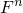，以及两个与表面相切的正交剪切力，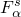，。合成剪切力的大小，，定义为。法向力在拉伸时为正。

点焊被认为非常小，不承受力矩或扭矩。因此，点焊不对旋转自由度施加任何约束。

### 定义点焊的失效准则

点焊的失效准则定义为 

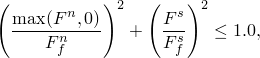

其中


是导致拉伸失效（I型加载）所需的力，

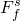

是导致纯剪切失效（II型加载）所需的力，并且

和

如上定义。

点焊的典型屈服面如图37.1.9-1所示。 

**图37.1.9-1** 点焊的典型屈服面。


通过为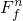或指定非常大的值，可以使点焊的屈服准则独立于剪切力或法向力，如图37.1.9-2所示。 

**图37.1.9-2** 点焊的退化屈服面。

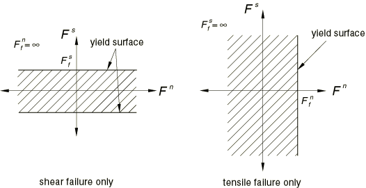

| **输入文件用法：** | ``` [*BOND](../key/key-link.md#usb-kws-hbond) *node_set_name*, ,  ``` |
| --- | --- |

点焊力有时表现出显著的噪声，这可能导致点焊在其力的过滤解仍在点焊强度范围内时达到其失效准则。这以BONDSTAT变量的嘈杂时间历史为特征，可能对应于点焊失效的不切实际的早期发作。下面讨论点焊失效发作后点焊劣化的两种模型：失效时间模型和失效后损伤模型。对于失效时间模型，约束力历史中刚好超过点焊强度的单个、虚假尖峰将导致点焊完全失效。失效后损伤模型可以减轻点焊力中噪声的影响。

### 定义点焊的失效后行为

一旦点焊上的约束力超过失效准则，点焊就会失效并劣化，直到焊点完全断裂。在劣化过程中，点焊的行为可以使用损伤失效模型模拟，或者在指定的时间段内线性减少约束力到零。使用任一模型，来自点焊的施加约束力受到屈服面大小（由失效准则定义）的限制。点焊的劣化通过将屈服面收缩到零来建模，同时保持其原始形状。

如果预测的约束力超过屈服面，使用径向流动规则计算力以返回屈服面。

完全失效后，节点的行为与接触对中的其他从属节点一样。节点可能会重新接触主表面，但焊点不再起作用。

#### 定义失效时间模型

您可以指定失效时间，，这是点焊在初始失效准则超过后完全失效所需的时间。一旦检测到失效，焊点约束在时间内线性松弛。Abaqus/Explicit在时间周期内将屈服面收缩到零： 


其中*t*是自Abaqus/Explicit检测到焊点初始失效以来的时间。

| **输入文件用法：** | ``` [*BOND](../key/link.md#usb-kws-hbond) *node_set_name*, , , ,  ``` |
| --- | --- |

#### 定义失效后损伤模型

如上所述，如果预测的约束力超过失效准则，则使用径向流动规则计算点焊承受的力以返回屈服面。由于在这种情况下焊点中的力小于约束焊接节点在主表面上所需的约束力，焊接节点将相对于主表面移动。相对运动期间消耗的功用于确定屈服面如何退化。

在失效期间，焊点的行为被假定为使得法向方向的任何拉伸或焊点的任何剪切都会耗散能量。Abaqus/Explicit假定失效后为线性力-位移关系，因此在焊点承受纯I型或纯II型加载时产生如图37.1.9-3所示的行为。 

**图37.1.9-3** 纯拉伸/压缩（I型）和纯剪切（II型）中的典型失效后行为。

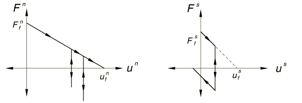

更一般的加载会产生这些响应的组合。

您可以通过指定在纯I型和纯II型加载下法向和剪切方向中的断裂位移，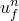和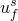，来定义焊点在I型和II型中可以耗散的能量。

使用这些线性力-位移关系，损伤失效模型的失效准则为 


其中

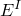

是I型中消耗的能量；

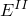

是II型中消耗的能量；


是I型中的断裂能量，计算为；并且


是II型中的断裂能量，计算为。

| **输入文件用法：** | ``` [*BOND](../key/key-link.md#usb-kws-hbond) *node_set_name*, , , , , ,  ``` |
| --- | --- |

#### 点焊中的屈服后表面相互作用

在点焊处定义的任何摩擦、接触阻尼或软化不会影响分析，直到点焊完全断裂；即，直到失效面已收缩到零。

### 点焊的焊点尺寸

点焊的初始焊点尺寸，，通过在渗透计算期间将点焊关联的从属表面节点相对于主表面偏移等于焊点尺寸的量来考虑。基于壳或膜单元的主表面或从表面本身从单元的中平面偏移了壳或膜的半厚度。

如果选择损伤失效模型来表征失效后行为，点焊的焊点尺寸可能由于点焊的拉伸屈服而增长。点焊的尺寸等于和点焊失效后累积的之和。焊点断裂后，考虑断裂时的焊点尺寸用于焊点节点与主表面之间的后续接触。

### 点焊的可用输出

您可以通过生成表面反作用力的矢量图（Cforce输出变量）在Abaqus/CAE中检查点焊承受的力。两个与点焊特别相关的输出变量，粘结状态和粘结载荷，可用于Abaqus/CAE。这些变量可以作为历史输出写入输出数据库（`.odb`）文件。它们可用于Abaqus/CAE中的*X-Y*绘图。

#### 粘结状态的定义

粘结状态（输出变量BONDSTAT）衡量点焊距离完全失效的程度。粘结状态在0.0和1.0之间变化，定义为 


如果选择了失效时间模型，或者 


如果选择了损伤失效模型。对于任一模型，粘结状态在点焊失效前等于1.0。

#### 粘结载荷的定义

粘结载荷（输出变量BONDLOAD）衡量点焊当前约束力距离其失效面的程度。粘结载荷的值也在0.0和1.0之间变化，定义为 


如果选择了损伤失效模型。对于失效时间模型，粘结载荷定义为 


在失效之前。然后，从首次屈服到完全失效，粘结载荷为1.0，此时粘结载荷变为0.0。

#### 示例：点焊和输出请求

节点集`WELDS`中的点焊节点是表面A上节点的子集，表面A是对接触对的从属表面。

```
[*NSET](../key/key-link.md#usb-kws-mnset), NSET=WELDS
*node set definition*
[*CONTACT PAIR](../key/key-link.md#usb-kws-hcontactpair), MECHANICAL CONSTRAINT=KINEMATIC, 
INTERACTION=A TO B, WEIGHT=0.
*slave surface A, master surface B*
[*SURFACE INTERACTION](../key/key-link.md#usb-kws-hsurfaceinteraction), NAME=A TO B
[*BOND](../key/key-link.md#usb-kws-hbond)
WELDS, , , , , , 
[*OUTPUT](../key/key-link.md#usb-kws-houtput), HISTORY, TIME INTERVAL=0.001
[*CONTACT OUTPUT](../key/key-link.md#usb-kws-hcontactoutput), NSET=WELDS
BONDSTAT, BONDLOAD
```
如果使用失效时间模型，则必须指定，如果选择损伤失效模型，则必须指定和。


